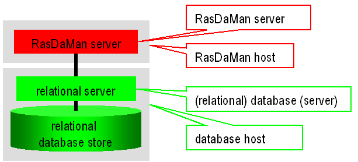
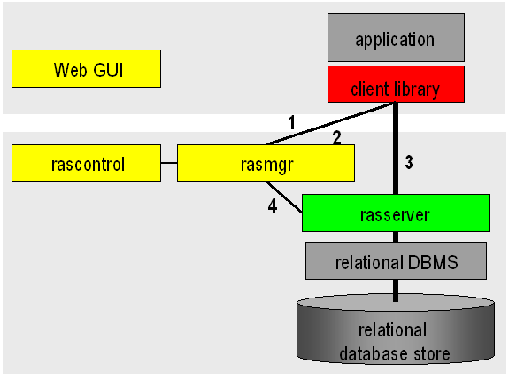
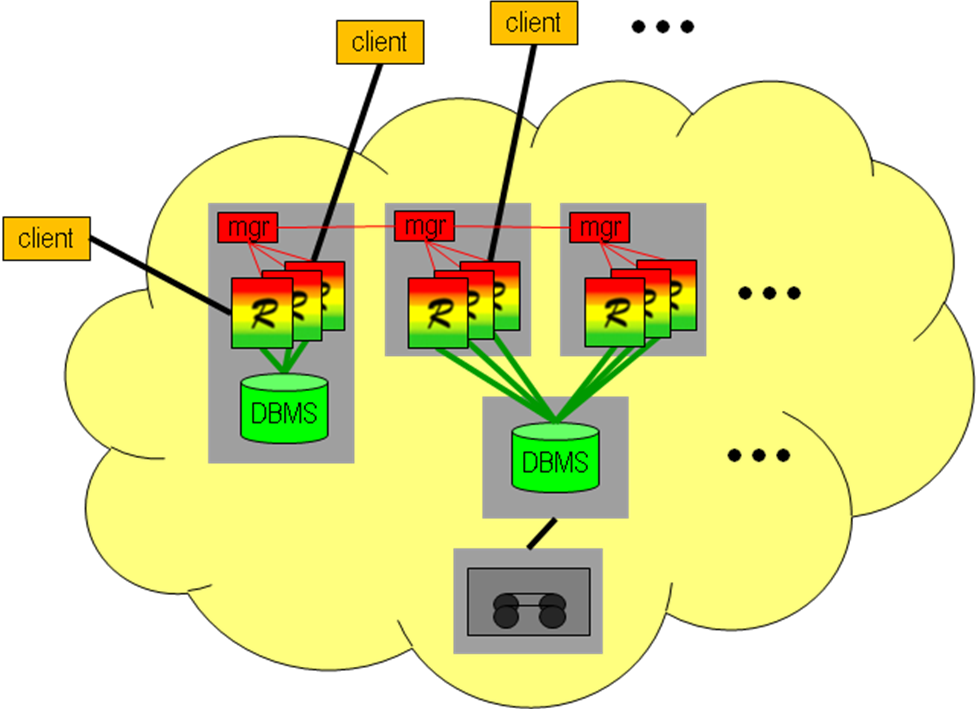

.. highlight:: bash

.. _inst-guide:

#####################################
Installation and Administration Guide
#####################################

*******
Preface
*******

Overview
========

This guide provides information about how to use the rasdaman
array database system, in particular: installation and system
administration.

For storage of multi-dimensional array data, rasdaman can be configured to use
some conventional database system (such as PostgreSQL) or use its own
storage manager. For the purpose of this documentation, we will call the
conventional database system to which rasdaman is interfaced the *base
DBMS*, understanding that this base DBMS is in charge of all
alphanumeric data maintained as relational tables or object-oriented
semantic nets.

This guide is specific for *rasdaman community*; for *rasdaman
enterprise* (`what's the difference? <https://rasdaman.org/wiki/Features>`_)
contact `rasdaman GmbH <https://rasdaman.com>`_.

Audience
========

The information in this manual is intended primarily for database and
system administrators.

Rasdaman Documentation Set
==========================

This manual should be read in conjunction with the complete rasdaman
documentation set which this guide is part of. The documentation set in
its completeness covers all important information needed to work with
the rasdaman system, such as programming and query access to databases,
guidance to utilities such as *raswct*, release notes, and additional
information on the rasdaman wiki.

.. _sec-download-and-install:

***************
Getting Started
***************

There are several ways to ride rasdaman - installing from source, installing
prefabricated RPM/DEB packages, or downloading a preconfectioned Virtual
Machine. Make your choice below!

**Hardware & Software Requirements**

It is recommended to have at least 8 GB main memory. Disk space depends on the
size of the databases, as well as the requirements of the base DBMS of rasdaman
chosen. The footprint of the rasdaman installation itself is around 400 MB.

In order to download, build, and run rasdaman, various tools and libraries are
required. This varies depending on the mode of installation
(:ref:`sec-system-install-packages` or :ref:`sec-system-install`). Some
packages, such as HDF4, are optional. This means that the feature (e.g. support
for the HDF4 data format) is not available unless its use is specified during
configuration. See :ref:`sec-download-install` for more information on the cmake
configure parameters.

Rasdaman is continuously tested on the platforms listed below. The rasdaman code
has been developed on SUN/Solaris and HP-UX originally, and has been ported to
IBM AIX, SGI IRIX, and DEC Unix - but that was way back in the last millennium.

- Ubuntu 18.04, 20.04
- CentOS 7

In general, compiling rasdaman should work on distributions with gcc 4.8 or
later and Java 8 or later.

**Alternative 1: Packages**

Get preconfectioned packages for installing :ref:`sec-system-install-pkgs-rpm`
on CentOS or :ref:`sec-system-install-pkgs-deb` on Debian / Ubuntu; this is the
recommended way - among others because the package manager will be able
to manage your installation.

**Alternative 2: Guided Build**

Download and compile rasdaman with the help of an :ref:`automated installer
<sec-system-install-installer>`. On supported operating systems this option
works automatically out of the box, but also allows to easily adjust the build
and install procedures by editing a configuration file. As such it is mainly
aimed  at non-developers who would like to customize their rasdaman installation
to something different than the official packages.

**Alternative 3: Source Code**

:ref:`Download and compile rasdaman <sec-system-install>`; this is the most
flexible alternative; however, it requires some experience in manual compilation
and is generally done by developers who plan to contribute code to the rasdaman
repository.

**Alternative 4: Virtual Machine**

By :ref:`downloading a Virtual Machine <sec-download-vm>` you get a fully configured
system with rasdaman installed and ready to run. This alternative does not
require any system administration skills other than starting the VM and working
with the rasdaman services, e.g., via the OGC standards based geo service
interface.

**Support**

Installation information, FAQs, and troubleshooting information is
available on `www.rasdaman.org <http://www.rasdaman.org>`__.

For support in installing rasdaman and any other question you may
contact rasdaman GmbH at `www.rasdaman.com <http://www.rasdaman.com>`__.

.. _sec-system-install-packages:

Official Packages
=================

This page describes installation of rasdaman RPM or Debian packages.

During generation of these packages, some configuration decisions have been made
(which can be chosen freely when :ref:`compiling from source
<sec-system-install>`). Most importantly, the rasdaman
engine in the packages uses embedded SQLite for managing its array metadata.
Notice, though, that the geo service component, petascope, currently still
relies on a PostgreSQL database; this is planned to be changed in the near
future.

.. _sec-system-install-pkgs-deb:

Debian-based systems
--------------------

Currently the following Debian-based distributions are supported:

- Ubuntu 18.04 / 20.04

Installation
^^^^^^^^^^^^

1. Import the rasdaman repository public key to the apt keychain: ::

    $ wget -O - https://download.rasdaman.org/packages/rasdaman.gpg | sudo apt-key add -

   .. note::
        You may need to update the ca-certificates package to allow SSL-based applications 
        (e.g. ``apt-get update`` or ``wget/curl``) to check for the authenticity
        of SSL connections: ::

         $ sudo apt-get install ca-certificates

2. Add the rasdaman repository to apt. There are three types of packages:

    - **stable:** these packages are only updated on stable releases of rasdaman,
      and hence recommended for operational production installations.

      .. hidden-code-block:: bash

        # For ubuntu 16.04
        $ echo "deb [arch=amd64] https://download.rasdaman.org/packages/deb xenial stable" \
        | sudo tee /etc/apt/sources.list.d/rasdaman.list

        # For ubuntu 18.04
        $ echo "deb [arch=amd64] https://download.rasdaman.org/packages/deb bionic stable" \
        | sudo tee /etc/apt/sources.list.d/rasdaman.list

    - **testing:** updated more frequently with beta releases, so aimed for
      feature testing in non-critical installations.

      .. hidden-code-block:: bash

        # For ubuntu 18.04
        $ echo "deb [arch=amd64] https://download.rasdaman.org/packages/deb bionic testing" \
        | sudo tee /etc/apt/sources.list.d/rasdaman.list

        # For ubuntu 20.04
        $ echo "deb [arch=amd64] https://download.rasdaman.org/packages/deb focal testing" \
        | sudo tee /etc/apt/sources.list.d/rasdaman.list

    - **nightly:** updated nightly, so that they have the latest patches.
      It is not recommended to use these packages in a production installation as things
      could sometimes break.

      .. hidden-code-block:: bash

        # For ubuntu 18.04
        $ echo "deb [arch=amd64] https://download.rasdaman.org/packages/deb bionic nightly" \
        | sudo tee /etc/apt/sources.list.d/rasdaman.list

        # For ubuntu 20.04
        $ echo "deb [arch=amd64] https://download.rasdaman.org/packages/deb focal nightly" \
        | sudo tee /etc/apt/sources.list.d/rasdaman.list

3. rasdaman can be installed now: ::

    $ sudo apt-get update
    $ sudo apt-get install rasdaman

   If during the install you get a prompt like the below, type **N** (default 
   option):

   .. code-block:: text

      Configuration file `/etc/opt/rasdaman/petascope.properties'
       ==> Modified (by you or by a script) since installation.
       ==> Package distributor has shipped an updated version.
         What would you like to do about it ?  Your options are:
          Y or I  : install the package maintainer's version
          N or O  : keep your currently-installed version
            D     : show the differences between the versions
            Z     : start a shell to examine the situation
       The default action is to keep your current version.
      *** petascope.properties (Y/I/N/O/D/Z) [default=N] ?

   If you are automating the installation (in a script for example), you can
   bypass this prompt with an apt-get option as follows: ::

    $ apt-get -o Dpkg::Options::="--force-confdef" install -y rasdaman

   You will find the rasdaman installation under ``/opt/rasdaman/``.
   Finally, to make rasql available on the PATH for your system user: ::

    $ source /etc/profile.d/rasdaman.sh

5. Check that the rasdaman server can answer queries: ::

    $ rasql -q 'select c from RAS_COLLECTIONNAMES as c' --out string

   Typical output: ::

    rasql: rasdaman query tool v1.0, rasdaman v10.0.0 -- generated on 26.02.2020 08:44:56.
    opening database RASBASE at localhost:7001...ok
    Executing retrieval query...ok
    Query result collection has 0 element(s):
    rasql done.

6. Check that petascope is initialized properly, typically at this URL: ::

    http://localhost:8080/rasdaman/ows

7. If SELinux is running then possibly some extra configuration is needed to
   get petascope run properly. See :ref:`here <selinux-configuration>` for more
   details.

.. _sec-system-update-pkgs-deb:

Updating
^^^^^^^^

The packages are updated whenever a new rasdaman version is released. To update
your installation: ::

    $ sudo apt-get update
    $ sudo service rasdaman stop
    $ sudo apt-get install rasdaman

.. note::
    You may need to update the ca-certificates package to allow SSL-based applications 
    (e.g. ``yum update`` or ``wget/curl``) to check for the authenticity
    of SSL connections: ::

     $ sudo apt-get install ca-certificates

.. _sec-system-install-pkgs-rpm:

RPM-based systems
-----------------

Currently the following RPM-based distributions are supported:

- CentOS 7

Installation
^^^^^^^^^^^^

1. Add the rasdaman repository to yum. There are three types of packages:

    - **stable:** these packages are only updated on stable releases of rasdaman,
      and hence recommended for operational production installations.

      .. hidden-code-block:: bash

        $ sudo curl "https://download.rasdaman.org/packages/rpm/stable/CentOS/7/x86_64/rasdaman.repo" \
                  -o /etc/yum.repos.d/rasdaman.repo

    - **testing:** updated more frequently with beta releases, so aimed for
      feature testing in non-critical installations.

      .. hidden-code-block:: bash

        $ sudo curl "https://download.rasdaman.org/packages/rpm/testing/CentOS/7/x86_64/rasdaman.repo" \
                  -o /etc/yum.repos.d/rasdaman.repo

    - **nightly:** updated nightly, so that they have the latest patches.
      It is not recommended to use these packages in a production installation
      as things could sometimes break.

      .. hidden-code-block:: bash

        $ sudo curl "https://download.rasdaman.org/packages/rpm/nightly/CentOS/7/x86_64/rasdaman.repo" \
                  -o /etc/yum.repos.d/rasdaman.repo

   .. note::
        You may need to update the ca-certificates package to allow SSL-based applications 
        (e.g. ``yum update`` or ``wget/curl``) to check for the authenticity
        of SSL connections: ::

         $ sudo yum install -y ca-certificates

2. The rasdaman packages should be available now via yum: ::

    $ sudo yum clean all
    $ sudo yum update
    $ sudo yum search rasdaman

   Output: ::

    rasdaman.x86_64 : Rasdaman extends standard relational database systems with the ability
                      to store and retrieve multi-dimensional raster data

3. Add the EPEL repository to yum
   (`official page <https://fedoraproject.org/wiki/EPEL>`__), needed for several
   dependencies of the rasdaman package: ::

    $ sudo yum install epel-release

4. Install the rasdaman package: ::

    $ sudo yum install rasdaman

   You will find the rasdaman installation under ``/opt/rasdaman/``.
   To make rasql available on the PATH for your system user: ::

    $ source /etc/profile.d/rasdaman.sh

   .. note::
        If petascope has *problems* connecting to rasdaman, check this
        `FAQ entry <https://rasdaman.org/wiki/FAQ#PetascopecannotconnecttorasdamaninCentos7>`__
        for some advice.

5. Check that the rasdaman server can answer queries: ::

    $ rasql -q 'select c from RAS_COLLECTIONNAMES as c' --out string

   Typical output: ::

    rasql: rasdaman query tool v1.0, rasdaman v10.0.0 -- generated on 26.02.2020 08:44:56.
    opening database RASBASE at localhost:7001...ok
    Executing retrieval query...ok
    Query result collection has 0 element(s):
    rasql done.

6. Check that petascope is initialized properly, typically at this URL: ::

    http://localhost:8080/rasdaman/ows

7. If SELinux is running then likely some extra configuration is needed to
   get petascope run properly. See :ref:`here <selinux-configuration>` for more
   details.

.. _sec-system-update-pkgs-rpm:

Updating
^^^^^^^^

The packages are updated whenever a new version of rasdaman is released. To download
an update perform these steps: ::

    $ sudo yum clean all
    $ sudo service rasdaman stop
    $ sudo yum update rasdaman

.. note::
    You may need to update the ca-certificates package to allow SSL-based applications 
    (e.g. ``yum update`` or ``wget/curl``) to check for the authenticity
    of SSL connections: ::

     $ sudo yum install -y ca-certificates

Customizing the package installation
------------------------------------

When installing or updating rasdaman from the official packages, the process can
be optionally customized with an installation profile (see example `installer
configuration <sec-system-install-installer-config>`__).

- To customize when installing rasdaman for the first time, it is necessary to
  first download the package install profile from `here
  <https://download.rasdaman.org/installer/rasdaman-installer/profiles/package/install.toml>`__.

- When updating an existing rasdaman installation, you can find the default
  package install profile in your installation at
  ``/opt/rasdaman/share/rasdaman/installer/profiles/package/install.toml``.

Download / copy the ``install.toml`` file to some place, e.g. 
``$HOME/rasdaman_install.toml``, and make any desired changes to it before
installing or updating rasdaman. Make sure that the ``RAS_INSTALL_PATH``
environment variable is set to point to the custom profile, e.g.

.. code-block:: shell

  export RAS_INSTALL_PATH="$HOME/rasdaman_install.toml"

When you install or update rasdaman afterwards, the configuration process will
take the custom profile into account instead of the default one.

.. _sec-system-install-administration:

Running rasdaman
----------------

A ``rasdaman`` service script allows to start/stop rasdaman, e.g. ::

    $ service rasdaman start
    $ service rasdaman stop
    $ service rasdaman status

It can be similarly referenced with ``systemctl``, e.g. ::

    $ systemctl start rasdaman
    $ systemctl stop rasdaman
    $ systemctl status rasdaman

The service script can be customized by updating environment variables in
``/etc/default/rasdaman`` (create the file if it does not exist). The default
settings can be seen below.

.. hidden-code-block:: shell

  # rasdaman installation directory
  RMANHOME=/opt/rasdaman
  # local user running the rasdaman server
  RMANUSER=rasdaman
  # runuser, or sudo for older OS
  RUNUSER=runuser
  # login credentials for non-interactive rasdaman start/stop
  RASLOGIN=rasadmin:d293a15562d3e70b6fdc5ee452eaed40
  # port on which clients connect to rasdaman
  RASMGR_PORT=7001
  # options to be passed on to start_rasdaman.sh
  START_RASDAMAN_OPTS="-p $RASMGR_PORT"
  # options to be passed on to stop_rasdaman.sh
  STOP_RASDAMAN_OPTS="-p $RASMGR_PORT"
  # Java options to be passed on to embedded petascope
  JAVA_OPTS="-Xmx4000m"

See also the dedicated pages on :ref:`configuration and log files
<sec-system-install-conf>` and :ref:`administration <sec-server-administration>`.

Check :ref:`this section <petascope-startup-shutdown>` on how to start / stop
the petascope component of rasdaman.

.. _sec-system-install-installer:

Build From Source Guided
========================

The *rasdaman installer* tool allows users to install rasdaman on a machine
through a single script which wraps and hides all the
:ref:`details of manual compilation <sec-system-install>` - it can't be
easier than that! And it is safe: you can inspect the script and see
what's happening. Plus, you retain full control over your configuration
by simply editing a JSON file.

Currently, the following distributions are supported:

-  Debian (9, 10)
-  Ubuntu (16.04, 18.04, 20.04)
-  CentOS (7)

First-Time Installation
-----------------------

Download the installer and execute it: ::

    $ wget https://download.rasdaman.org/installer/install.sh
    $ bash install.sh

This creates a vanilla installation in ``/opt/rasdaman`` using
reasonable default configurations from ``/tmp/rasdaman-installer/profiles/installer/default.toml``
(see the :ref:`installer configuration page <sec-system-install-installer-config>` for more details).

Note that the script needs sudo rights for installing rasdaman into its
proper system directory (``/opt/rasdaman``) and for installing package
dependencies.

If SELinux is running then likely some extra configuration is needed to
get petascope run properly after the installer has finished. Continue
:ref:`here <selinux-configuration>` for more details on this.

Updating an Existing Installation
---------------------------------

Updating a rasdaman installation (if established with the installer) is
just as easy: ::

    $ update_rasdaman.sh

That is all, follow the instructions on the screen and you should be done.

.. note:: The updating feature of the installer has been introduced more 
          recently. If you have an older installer on your system, please follow
          the steps for first-time installation after manually stopping rasdaman.

Creating Your Own Profile
-------------------------

The installer makes use of a configuration file, ``installer_profile.toml``,
created during first-time rasdaman installation and reused during updates. While
reasonable defaults are built in, settings can be tweaked by editing the TOML
file.

After establishing this file in e.g.
``/opt/rasdaman/share/rasdaman/installer/install_profile.toml``, apply it
through ::

    $ ./install.sh -j /opt/rasdaman/share/rasdaman/installer/install_profile.toml

.. _sec-system-install-installer-config:

Installer configuration
-----------------------

Default Installer configuration:

.. hidden-code-block:: ini

    [general]
    # The user running rasdaman
    user = "rasdaman"
    # Run the installation automatically without requiring any user input
    auto = true
    # Build and install rasdaman? Updating an existing installation is supported
    install = true
    # Set to true to uninstall rasdaman; if install is enabled as well then
    # any existing rasdaman installation is removed first.
    # Important: review the [uninstall] section for customization of the uninstall process.
    uninstall = false

    #
    # Configure actions before rasdaman building and installation starts
    #
    [pre_install]
    # Install third party dependencies needed to compile / run rasdaman with
    # apt-get/yum for packages available in the standard package manager, or with
    # pip for python packages.
    # If this is set to false, the installer will just print the package list and
    # probably fail compilation or some further step if a package is missing.
    install_dependencies = true

    #
    # Configure how to install rasdaman
    #
    [install]
    # Install rasdaman from: "source" or "package"
    from = "source"
    # Target installation directory ($RMANHOME)
    install_path = "/opt/rasdaman/"
    # Database backend to use for storing RASBASE: sqlite or (deprecated) postgresql
    database = "sqlite"
    # Rasmgr port: best to stick to the default value of 7001, as otherwise it has
    # to be explicitly specified in clients that connect to rasdaman.
    rasmgr_port = 7001

    [install.source]
    # Rasdaman sources will be fetched from this repo
    repository = "git://rasdaman.org/rasdaman.git"
    # Rasdaman version to compile, e.g. master, v9.5.0, etc.
    version = "master"
    # Generate debug-ready binaries (slower performance)
    debug = false
    # Build in strict mode (compiler warnings terminate compilation)
    strict = false
    # Apply a particular patch before building; can be a URL or a path
    patch = "https://rasdaman.org/patchmanager?patchop=Download+Selected-{patch_id}"
    # Whether to generate documentation
    generate_docs = false

    # Common servlet container settings for an externally deployed petascope/SECORE.
    [install.webapps]
    # Install Java web applications (petascope, SECORE)
    enable = true
    # Deployment type: "external" (e.g. in Tomcat), or "standalone"
    deployment = "external"
    # The options below are only taken into account for "external" deployment;
    # If these settings are not specified the installer will try to guess them: for
    # supported distributions/versions this works well.
    # Directory where Java web apps are deployed
    webapps_path = "/var/lib/tomcat7/webapps/"
    # Directory where the servlet container stores logs
    webapps_logs = "/var/log/tomcat7/"

    [install.webapps.petascope]
    # petascope will use this port when deployment is "standalone"
    standalone_port = 9009
    # JDBC connection URL
    petascopedb_url = "jdbc:postgresql://localhost:5432/petascopedb"
    # Database username
    petascopedb_username = "petauser"
    # Database password; a random password will be generated if it is empty
    petascopedb_password = ""

    [install.webapps.secore]
    # SECORE will use this port when deployment is "standalone"
    standalone_port = 9010

    #
    # Configure what to do after rasdaman is installed and running
    #
    [post_install]
    # Import demo collections (with rasdaman_insertdemo.sh) and demo coverages
    # (with petascope_insertdemo.sh)
    insert_demo = true
    # Run the systemtest
    systemtest = false
    # Generate a Linux package; if this is enabled then rasdaman will not be
    # configured to run but just compiled (dependencies needed to run rasdaman
    # will not be installed either)
    generate_package = false

    [post_install.package]
    # Profile to be used after the package is installed to configure rasdaman
    profile_path = "profiles/package/deb/default.toml"
    # Generated package details
    name = "rasdaman"
    description = """\
    Rasdaman is the leading Array Database for flexible, scalable analytics of massive \
    multi-dimensional array (raster) data, such as spatio-temporal datacubes."""
    version = "9.5.0"
    # Each new package of the same version should have a progressively higher
    # iteration number (starting from 1); the resulting package version will
    # typically be <version>-<iteration>
    iteration = "{iteration}"
    vendor = "rasdaman"
    licence = "GPLv3"
    category = "devel"
    maintainer = "Dimitar Misev <misev@rasdaman.com>"
    url = "https://rasdaman.org"

    #
    # Configure rasdaman uninstall; these settings are only valid if uninstall
    # is set to true in the [general] section.
    #
    [uninstall]
    # Remove RASBASE and petascopedb?
    remove_data = true
    # Remove configuration files?
    remove_configs = true

.. _sec-system-install:

Build From Source Manually
==========================

This section outlines the procedure for downloading and installing rasdaman from
scratch.

.. _sec-system-install-prep:

Preparation
-----------

Create Dedicated User
^^^^^^^^^^^^^^^^^^^^^

While rasdaman can be installed and run under any operating system user,
for security reasons it is strongly recommended to create a dedicated
user to shield rasdaman activity (e.g., log files) from the rest of the
system.

This user can be named ``rasdaman``, but any other (pre-existing or newly
established) user will do as well; in this case, adjust the commands
listed in the sequel where necessary. In the sequel it will be assumed
that a user account named ``rasdaman`` has been created, e.g. with ::

    $ sudo adduser rasdaman

and that you are logged in as user ``rasdaman``, e.g. with this command: ::

    $ sudo -u rasdaman -i

.. warning::
    The dollar sign ("$") symbolizes the command line prompt and
    is not to be typed in.

.. note::
    As user ``rasdaman`` probably does not have sudo rights,
    make sure to execute the commands that require sudo with a user that has 
    sudo rights.

Create Installation Directory
^^^^^^^^^^^^^^^^^^^^^^^^^^^^^

``$RMANHOME`` is the target directory where rasdaman will be installed; by
default this directory is ``/opt/rasdaman``. Make sure it exists and the
rasdaman user has write access to it: ::

    $ export RMANHOME=/opt/rasdaman
    $ mkdir -p $RMANHOME
    $ chown rasdaman: $RMANHOME

Install Required Packages
^^^^^^^^^^^^^^^^^^^^^^^^^

**build tools:**

* *git* -- needed to clone the rasdaman git repository
* *cmake* -- for generating the makefiles needed to compile rasdaman
* *make*, *libtool*, *pkg-config* -- general tools needed to configure and compile rasdaman
* *flex*, *bison*, *g++*, *libstdc++* -- required for compilation of the C++ codebase
* *unzip*, *curl* -- for compiling 3rd party dependencies of rasnet (grpc and protobuf)
* *maven2*, *OpenJDK 7+* -- required for compilation of the Java code (Java
  client API, petascope OGC frontend, SECORE)

**general libraries:**

* *libssl-dev*, *libedit-dev*, *libreadline-dev*, *libboost-dev* (v1.48+), 
  *libffi-dev* -- required for various system tasks
* *libgdal-dev* -- required for data format support (TIFF, JPEG, PNG, `etc.
  <https://gdal.org/drivers/raster/index.html>`_)

**database stuff:** Pick one option below for rasdaman storage:

* *libsqlite*, *libsqlite-dev*, *sqlite3* -- required for storing arrays in a
  filesystem directory and the rasdaman technical metadata in SQLite; see 
  :ref:`details <sec-filesystem-backend>`;
  note that petascope currently requires PostgreSQL independently from the
  PostgreSQL / file system array decision - in other words: even if for the
  array engine you chose to not use PostgreSQL you currently still need to
  install it for storing the geo metadata making an array an OGC coverage)
* *libecpg-dev*, *postgresql* -- required for 
  `PostgreSQL <http://www.postgresql.org>`_ to hold rasdaman arrays and/or 
  petascope geo metadata

**optional packages:**

* *libnetcdf-dev*, *python-netcdf4* -- required for NetCDF support
* *libeccodes-dev*, *libgrib2c-dev* -- for GRIB data support
* *libhdf4-dev* -- required for HDF4 support
* *libtiff-dev*, *libjpeg-dev*, *ligpng-dev* - internal encoder/decoder 
  implementations for TIFF, JPEG, or PNG formants.
* *libdw-dev* / *elfutils-devel* -- for segfault stacktraces, useful in development
* *sphinx*, *sphinx_rtd_theme*, *latexmk*, *texlive* -- main HTML / PDF documentation
* *doxygen* -- generate C++ API documentation
* *r-base*, *r-base-dev* -- required for :ref:`sec-rrasdaman-install`, an R package
  providing database interface for rasdaman
* *performance boosters and additional service components* offered by
  `rasdaman GmbH <https://www.rasdaman.com>`__

**geo data support** (optional):

* `Tomcat <http://tomcat.apache.org/>`_ (or another suitable servlet
  container) -- required for running the petascope and SECORE Java web
  applications, unless they are configured to start in standalone mode
* *python3* -- Python 3.6+ to run `wcst_import <data-import>`, a tool for  
  importing geo-referenced data into rasdaman / petascope
* *python3-pip*, *python3-setuptools*, *python3-wheel* -- required to install 
  Python dependencies for wcst_import
* *python-dateutil*, *lxml*, *numpy*, *netCDF4*, *GDAL*, *pygrib*, *jsonschema*
  -- Python 3 dependencies for wcst_import, best installed with pip3

Installation commands for the packages is depending on the platform
used, here is a guidance for some of the most frequently used.

.. note::
  When installing the GDAL Python bindings with ``pip3 install --user GDAL==...``,
  it is possible to come across an error similar to 
  ``cpl_port.h: No such file or directory``. To fix it, search for cpl_port.h
  on your system, e.g. ``find / -name cpl_port.h``; normally it will be in 
  ``/usr/include/gdal``. Then retry the same pip3 command installing *only* GDAL,
  with additional ``--global-option`` arguments: ::
  
    $ pip3 install --user --global-option=build_ext \
                          --global-option="-I/usr/include/gdal" GDAL==...

CentOS 7
~~~~~~~~

.. hidden-code-block:: bash

    # To build rasdaman
    $ sudo yum install \
      make libtool autoconf bison flex flex-devel git curl gcc gcc-c++ unzip \
      boost-devel libstdc++-static boost-static libtiff-devel zlib-devel \
      libedit-devel readline-devel libpng-devel netcdf-devel postgresql-devel \
      eccodes-devel hdf-devel sqlite-devel openssl-devel libxml2-devel elfutils-devel
    # To build Java components
    $ sudo yum install java-1.8.0-openjdk-devel maven ant

    # CMake needs to be manually downloaded and installed as the system 
    # provided version is too outdated.

    # To generate HTML documentation
    $ sudo pip install sphinx sphinx_rtd_theme
    # To generate PDF documentation (in addition to above)
    $ sudo yum install python-pip texlive-cm texlive-ec texlive-ucs \
      texlive-metafont-bin texlive-fncychap texlive-pdftex-def texlive-fancyhdr \
      texlive-titlesec texlive-framed texlive-wrapfig texlive-parskip \
      texlive-upquote texlive-ifluatex texlive-cmap texlive-makeindex-bin \
      texlive-times texlive-courier texlive-dvips texlive-helvetic latexmk
    # To generate C++ API documentation
    $ sudo yum install doxygen

    # To run rasdaman
    $ sudo yum install \
      postgresql-server postgresql-contrib sqlite zlib elfutils netcdf libtiff \
      libedit readline openssl libxml2 which python3-devel python3-pip \
      python3-setuptools python3-wheel eccodes hdf sysvinit-tools
    # To run Java components
    $ sudo yum install java-1.8.0-openjdk tomcat

    # To run wcst_import.sh
    $ sudo pip3 install jsonschema python-dateutil lxml \
      pyproj pygrib numpy netCDF4==1.2.7 pygrib

    # To run rasdapy
    $ pip3 install --user grpcio==1.9.0 protobuf==3.6.1

    # To run systemtest
    $ sudo apt-get install bc vim-common valgrind netcdf-bin libpython3-dev

Debian 9 / Ubuntu 16.04
~~~~~~~~~~~~~~~~~~~~~~~

.. hidden-code-block:: bash

    # To build rasdaman
    $ sudo apt-get install --no-install-recommends \
      make libtool gawk autoconf automake bison flex git g++ \
      unzip libpng-dev libjpeg-dev libboost-filesystem-dev libboost-thread-dev \
      libboost-system-dev libtiff-dev libgdal-dev zlib1g-dev libffi-dev \
      libboost-dev libnetcdf-dev libedit-dev libreadline-dev libdw-dev \
      libsqlite3-dev libgrib2c-dev curl libssl-dev libgrib-api-dev
    # To build Java components
    $ sudo apt-get install default-jdk-headless maven ant libgdal-java

    # CMake needs to be manually downloaded and installed as the system 
    # provided version is too outdated.

    # To generate HTML documentation
    $ sudo pip install sphinx sphinx_rtd_theme
    # To generate PDF documentation (in addition to above)
    $ sudo apt-get install --no-install-recommends latexmk texlive-latex-base \
      texlive-fonts-recommended texlive-latex-extra 
    # To generate C++ API documentation
    $ sudo apt-get install --no-install-recommends doxygen

    # To run rasdaman
    $ sudo apt-get install \
      postgresql postgresql-contrib sqlite3 zlib1g libdw1 gdal-bin debianutils \
      libedit-dev libnetcdf-dev python3-pip python3-setuptools python3-wheel \
      libreadline-dev libssl1.0.0 libgrib-api-dev libpython3-dev
    # To run Java components
    $ sudo apt-get install default-jre-headless libgdal-java tomcat8

    # To run wcst_import.sh; it is recommended to install Python 3.6
    $ sudo pip3 install jsonschema python-dateutil lxml \
      pyproj numpy netCDF4==1.2.7 GDAL==1.11.2 pygrib==1.9.9
    # To run rasdapy
    $ pip3 install --user grpcio==1.9.0 protobuf==3.6.1

    # To run systemtest
    $ sudo apt-get install bc vim-common valgrind netcdf-bin libpython3-dev

Debian 10 / Ubuntu 18.04 / Ubuntu 20.04
~~~~~~~~~~~~~~~~~~~~~~~~~~~~~~~~~~~~~~~

.. hidden-code-block:: bash

    # To build rasdaman
    $ sudo apt-get install --no-install-recommends \
      make libtool gawk autoconf automake bison flex git g++ unzip libpng-dev \
      libjpeg-dev libboost-filesystem-dev libboost-thread-dev libboost-system-dev \
      libtiff-dev libgdal-dev zlib1g-dev libffi-dev libboost-dev libnetcdf-dev \
      libedit-dev libreadline-dev libdw-dev libsqlite3-dev libgrib2c-dev curl \
      libssl-dev libeccodes-dev cmake ccache
    # To build Java components
    $ sudo apt-get install default-jdk-headless maven ant libgdal-java

    # To generate HTML documentation
    $ pip3 install --user sphinx sphinx_rtd_theme
    # To generate PDF documentation (in addition to above)
    $ sudo apt-get install --no-install-recommends latexmk texlive-latex-base \
      texlive-fonts-recommended texlive-latex-extra 
    # To generate C++ API documentation
    $ sudo apt-get install --no-install-recommends doxygen

    # To run rasdaman
    $ sudo apt-get install \
      postgresql postgresql-contrib sqlite3 zlib1g libdw1 gdal-bin debianutils \
      libedit-dev libnetcdf-dev python3-pip python3-setuptools python3-wheel \
      libreadline-dev libssl1.1 libeccodes0
    # To run Java components
    $ sudo apt-get install default-jre-headless libgdal-java tomcat9

    # To run wcst_import.sh; it is recommended to install Python 3.6
    $ pip3 install --user jsonschema python-dateutil lxml \
      pyproj pygrib numpy netCDF4==1.2.7 GDAL==2.2.3
    # To run rasdapy
    $ pip3 install --user grpcio==1.9.0 protobuf==3.6.1

    # To run systemtest
    $ sudo apt-get install bc vim-common valgrind netcdf-bin libpython3-dev

.. _sec-download-install:

Download and Install rasdaman
-----------------------------

Download
^^^^^^^^

You can get a complete *rasdaman Community* distribution from
`www.rasdaman.org <https://www.rasdaman.org>`__ by executing the
following command: ::

    $ git clone git://rasdaman.org/rasdaman.git

This will create a sub-directory rasdaman in your current working
directory.

Configure
^^^^^^^^^

Change into the newly cloned directory: ::

    $ cd rasdaman

Optionally, select a tagged stable release. To activate a `particular
tagged version <https://rasdaman.org/wiki/Versions>`_ use its name
prefixed with a "v", e.g: ::

    $ git checkout v9.8.1

.. note::
    You can list all tags with ``git tag``.

The following commands will prepare for building on your system. First create a
build directory: ::

    $ mkdir -p build
    $ cd build

In the build directory we next execute ``cmake`` to configure how rasdaman
is compiled. A typical configuration looks like this: ::

    $ cmake .. -DCMAKE_INSTALL_PREFIX=$RMANHOME

Any missing components will be reported; if this is the
case, then install the missing packages and retry configuration. The ``..``
indicates the path to the rasdaman source tree, which is now the parent
directory of the ``build`` directory in which the ``cmake`` command is executed.

The general *format* of invoking ``cmake`` on the command-line is as follows: ::

    $ cmake /path/to/rasdaman/sources [ -D<option>... ]

.. note::
    Alternatively, *ccmake* or *cmake-gui* can be used as graphical interfaces
    for this configuration step. 

Configuration can be customized, :numref:`table-cmake` summarizes the options
that can be specified with ``-D<option>``, along with the default settings.

.. note::
    To get a current list of all the custom options that can be passed to
    ``cmake`` on the command line, try ``cmake -LH``.

.. tabularcolumns:: |p{5.2cm}|p{3.5cm}|p{6cm}|
.. _table-cmake:
.. table:: CMake options for configuring the installation

    +---------------------------------+-------------------+--------------------------------------------------------------------------+
    | Option                          | Alternatives      | Description                                                              |
    +=================================+===================+==========================================================================+
    | ``CMAKE_INSTALL_PREFIX``        | <path> (default   |                                                                          |
    |                                 | /opt/rasdaman)    | Installation directory.                                                  |
    +---------------------------------+-------------------+--------------------------------------------------------------------------+
    | ``CMAKE_BUILD_TYPE``            | **Release** /     |                                                                          |
    |                                 | Debug             | Specify build type, Release for production, Debug for development        |
    +---------------------------------+-------------------+--------------------------------------------------------------------------+
    | ``CMAKE_VERBOSE_OUTPUT``        | ON / **OFF**      | Enable this if you need detailed output from the make process.           |
    +---------------------------------+-------------------+--------------------------------------------------------------------------+
    | ``CMAKE_CXX_FLAGS``             | <flags>           | Specify additional compiler options, e.g. -DCMAKE_CXX_FLAGS="-g3"        |
    +---------------------------------+-------------------+--------------------------------------------------------------------------+
    | ``DEFAULT_BASEDB``              | **sqlite** /      |                                                                          |
    |                                 | postgresql        | Specify the DBMS that rasdaman uses for storing RASBASE.                 |
    +---------------------------------+-------------------+--------------------------------------------------------------------------+
    | ``ENABLE_BENCHMARK``            | ON / **OFF**      | Generate binaries that contain extra code for benchmark output.          |
    +---------------------------------+-------------------+--------------------------------------------------------------------------+
    | ``ENABLE_PROFILING``            | ON / **OFF**      | Enable profiling of queries with google-perftools.                       |
    +---------------------------------+-------------------+--------------------------------------------------------------------------+
    | ``ENABLE_DEBUG``                | ON / **OFF**      | Generate (slower) binaries that can be debugged / produce debug logs.    |
    +---------------------------------+-------------------+--------------------------------------------------------------------------+
    | ``ENABLE_ASAN``                 | ON / **OFF**      | Compile with AddressSanitizer enabled (-fsanitize=address)               |
    +---------------------------------+-------------------+--------------------------------------------------------------------------+
    | ``ENABLE_STRICT``               | ON / **OFF**      | Enable compilation in strict mode (warnings terminate compilation).      |
    +---------------------------------+-------------------+--------------------------------------------------------------------------+
    | ``ENABLE_R``                    | ON / **OFF**      | Enable compilation of R support.                                         |
    +---------------------------------+-------------------+--------------------------------------------------------------------------+
    | ``GENERATE_DOCS``               | **ON** / OFF      | Generate and install documentation (manuals, doxygen, javadoc).          |
    +---------------------------------+-------------------+--------------------------------------------------------------------------+
    | ``GENERATE_PIC``                | **ON** / OFF      | Generate position independent code (PIC).                                |
    +---------------------------------+-------------------+--------------------------------------------------------------------------+
    | ``ENABLE_JAVA``                 | **ON** / OFF      | Generate and install of Java-based components (rasj, petascope, secore). |
    +---------------------------------+-------------------+--------------------------------------------------------------------------+
    | ``JAVA_SERVER``                 | **embedded** /    |                                                                          |
    |                                 | external          | Set the Java application deployment mode.                                |
    +---------------------------------+-------------------+--------------------------------------------------------------------------+
    | ``ENABLE_STANDALONE_SECORE``    | ON / **OFF**      | Build SECORE as a standalone web application *.war*.                     |
    +---------------------------------+-------------------+--------------------------------------------------------------------------+
    | ``USE_GDAL``                    | **ON** / OFF      | Enable inclusion of GDAL library during installation. Further variables  |
    |                                 |                   | can be set to control the GDAL paths: ``-DGDAL_INCLUDE_DIR``,            |
    |                                 |                   | ``-DGDAL_LIBRARY``, ``-DGDAL_JAVA_JAR_PATH``                             | 
    +---------------------------------+-------------------+--------------------------------------------------------------------------+
    | ``USE_GRIB``                    | ON / **OFF**      | Enable inclusion of GRIB library during installation. Further variables  |
    |                                 |                   | allow controlling the GRIB library paths: ``-DGRIB_LIBRARIES`` and       |
    |                                 |                   | ``-DGRIB_INCLUDE_DIR``                                                   |
    +---------------------------------+-------------------+--------------------------------------------------------------------------+
    | ``USE_HDF4``                    | ON / **OFF**      | Enable inclusion of HDF4 library during installation. Further variables  |
    |                                 |                   | allow controlling the HDF4 library paths: ``-DHDF4_LIBRARIES`` and       |
    |                                 |                   | ``-DHDF4_INCLUDE_DIR``                                                   |
    +---------------------------------+-------------------+--------------------------------------------------------------------------+
    | ``USE_NETCDF``                  | ON / **OFF**      | Enable inclusion of netCDF library during installation. Further variables|
    |                                 |                   | allow controlling the netCDF library paths: ``-DNetCDF_LIBRARIES`` and   |
    |                                 |                   | ``-DNetCDF_INCLUDE_DIRS``                                                |
    +---------------------------------+-------------------+--------------------------------------------------------------------------+
    | ``USE_TIFF``                    | ON / **OFF**      | Enable compilation of internal TIFF encoder/decoder. Further variables   |
    |                                 |                   | allow controlling the TIFF library paths: ``-DTIFF_LIBRARY`` and         |
    |                                 |                   | ``-DTIFF_INCLUDE_DIR``                                                   |
    +---------------------------------+-------------------+--------------------------------------------------------------------------+
    | ``USE_PNG``                     | ON / **OFF**      | Enable compilation of internal PNG encoder/decoder. Further variables    |
    |                                 |                   | allow controlling the PNG library paths: ``-DPNG_LIBRARY`` and           |
    |                                 |                   | ``-DPNG_PNG_INCLUDE_DIR``                                                |
    +---------------------------------+-------------------+--------------------------------------------------------------------------+
    | ``USE_JPEG``                    | ON / **OFF**      | Enable compilation of internal JPEG encoder/decoder. Further variables   |
    |                                 |                   | allow controlling the JPEG library paths: ``-DJPEG_LIBRARY`` and         |
    |                                 |                   | ``-DJPEG_INCLUDE_DIR``                                                   |
    +---------------------------------+-------------------+--------------------------------------------------------------------------+
    | ``FILE_DATA_DIR``               | <path> (default   |                                                                          |
    |                                 | $RMANHOME/data)   | The path where the server stores array tiles as files.                   |
    +---------------------------------+-------------------+--------------------------------------------------------------------------+
    | ``WAR_DIR``                     | <path> (default   |                                                                          |
    |                                 | $RMANHOME/share/  |                                                                          |
    |                                 | rasdaman/war)     | The path where Java war files will be installed.                         |
    +---------------------------------+-------------------+--------------------------------------------------------------------------+

.. _sec-download-install-build:

Build
^^^^^

Next, execute ``make`` to compile and link rasdaman: ::

    $ make -j2

.. note::
    Compiling rasdaman can take awhile. ``-j2`` sets make to compile in parallel
    with 2 threads; it's recommended to increase this number to match the number
    of cores on your system (check with the ``nproc`` command).

    To further improve the compilation speed, especially if you're recompiling
    rasdaman often, it can be helpful to install *ccache*.

.. _sec-download-install-install:

Install
^^^^^^^

Install rasdaman to the directory specified before with
``-DCMAKE_INSTALL_PREFIX``: ::

    $ make install

.. note::
    The user executing this command must have write access to the
    target directory specified. If ``-DWAR_DIR`` was specified, then it also
    needs to have write access to this directory. Information on enabling
    this without using sudo can be found in the :ref:`sec-system-install-prep`
    Section.

As described in the previous section, the installation directory is chosen at
compile time. Inside this installation directory we find the binary executable
programs, development libraries, documentation, etc. (covered in more detail in
Section :ref:`sec-system-install-conf`). For your convenience you can add the
executable path location to the ``$PATH`` definition, e.g: ::

    $ export RMANHOME=/opt/rasdaman
    $ export PATH=$RMANHOME/bin:$PATH

This allows to invoke ``rasql`` without specifying the full path
``/opt/rasdaman/bin/rasql``.

.. note::
    This only takes effect in the current terminal. To preserve them accross
    shell sessions, these settings can be appended to the ``~/.bashrc`` file.

.. note::
    All paths *inside* rasdaman scripts and binaries are adjusted
    automatically during generation, so you do not need to edit any script.

Update rasdaman
^^^^^^^^^^^^^^^

In order to be able to update your working installation in future, it is
best to keep the cloned rasdaman repository along with the build directory.
Otherwise updating would require following the same steps from the
:ref:`beginning <sec-download-install>`.

*Skip* to the :ref:`next section <sec-system-initialize-rasdaman>` if this is
the first time your installing rasdaman. This section is only applicable if you
already have a running, functional instance of rasdaman on your system.

To update, first change to the rasdaman source tree which was cloned in the 
first step, and run the following command: ::

    $ git pull

If you haven't changed any source files, the command should execute successfully
and download the latest changes in the rasdaman repository since the last time
you cloned or updated the repository.

Next, the :ref:`build <sec-download-install-build>` and 
:ref:`install <sec-download-install-install>` steps need to be repeated.
However, rasdaman should be stopped before, and started afterwards, so that the
updated installation is fully reflected in the running system. In addition,
the database schema of rasdaman may need to be updated with the ``update_db.sh``
command. In summary: ::

    $ make -j2

    $ stop_rasdaman.sh

    $ make install
    $ update_db.sh

    $ start_rasdaman.sh

.. _sec-system-initialize-rasdaman:

Initialize rasdaman
-------------------

Create Relational Database
^^^^^^^^^^^^^^^^^^^^^^^^^^

For the default SQLite based backend of rasdaman it is just necessary to
make sure that the rasdaman user has read/write/executable access to the
data directory specified with -DFILE_DATA_DIR or the environment
variable ``$RASDATA``.

For PostgreSQL it is necessary to make sure that rasdaman can login and is able
to create databases and tables. Currently **ident-based authentication** is
supported. A PostgreSQL user named as the operating system user under which
rasdaman will be operated (e.g. ``rasdaman`` as recommended above) needs to be
created, e.g: ::

    $ sudo -u postgres createuser -s rasdaman

Database Initialization
^^^^^^^^^^^^^^^^^^^^^^^

The ``create_db.sh`` script creates and initializes a rasdaman database named
``RASBASE`` by instantiating a set of standard types in rasdaman. It has no
parameters and is invoked as: ::

    $ create_db.sh

.. note::
    The rasdaman server should be stopped when running this command.

Server Configuration (Optional)
^^^^^^^^^^^^^^^^^^^^^^^^^^^^^^^

Rasdaman is a multi-server multi-user system. The server processes
available must be configured initially, which is done in file
``$RMANHOME/etc/rasmgr.conf``. For distribution, this configuration contains ten
server processes going by a name like, for example, ``N1``. If this is fine
then you can just leave it as it is. If you want to change this by
modifying server startup parameters or increasing the number of server
processes available then see :ref:`sec-rascontrol-invocation` for details on how
to do this.

Server Start/Stop
^^^^^^^^^^^^^^^^^

Make sure that the ports rasdaman uses are not blocked in your system.
These are 7001 for the scheduler (rasmrg) and 7002, 7003, etc. for each
worker process. Ports used can be reconfigured, cf. :ref:`sec-server-mgr-server`.

Start rasdaman by invoking ::

    $ start_rasdaman.sh

.. note::
   Messages printed by ``start_rasdaman.sh`` will not always show the
   detailed system state. If, for example, the rasdaman servers fail
   to con­tact the base DBMS then nevertheless a message "Server
   started" may appear.

   Workaround: use this to get the actual server state, as user ``rasdaman``: ::

        $ rascontrol -e -x "list srv -all"

Correspondingly, rasdaman can be stopped by invoking ::

    $ stop_rasdaman.sh

Demo Database
^^^^^^^^^^^^^

The rasdaman distribution contains a demo database which serves as a
first test of successful installation.

Inserting demo data into the fresh database is done through ::

    $ rasdaman_insertdemo.sh localhost 7001 \
      $RMANHOME/share/rasdaman/examples/images rasadmin rasadmin

Note that repeated invocations are not harmful - each of the sample
collection will simply receive additional objects made of the same
images.

After successful completion, you can check whether the three rasdaman
collections containing the example images have been created through: ::

    $ rasql -q "select r from RAS_COLLECTIONNAMES as r" \
            --out string

This command shows a list of all collections existing in the database.
There should be ``mr``, ``mr2``, and ``rgb``.

Congratulations! At this point, if everything completed successfully,
ras­da­man is up and running and prepared for data definition, data
import and retrieval, and any other suitable task.

.. _sec-initialize-geo-services:

Initialize geo service support
------------------------------

petascope
^^^^^^^^^

*Petascope* is the geo Web service frontend of rasdaman. It adds geo
semantics on top of arrays, thereby enabling regular and irregular grids
based on the `OGC coverage standards
<http://external.opengeospatial.org/twiki_public/CoveragesDWG/WebHome>`__.

Petascope gets installed automatically as ``rasdaman.war`` unless a
``-DENABLE_JAVA=OFF`` (cf. :numref:`table-cmake`) is
specified. The deployment directory of all war files can be set during
the ``configure`` step with the ``-DWAR_DIR=<DIR>`` cmake option;
by default this is ``$RMANHOME/share/rasdaman/war``.

To implement the geo semantics, petascope uses a relational database for
the geo-related metadata. Currently, PostgreSQL and H2 / HSQLDB are supported.
When installing from packages, the 
package post-install script will automatically set up PostgreSQL for use 
by petascope. The steps approximately performed by the script are listed below.

**PostgreSQL**

PostgreSQL is automatically configured when rasdaman is installed, so doing the
below is not usually necessary; we list the steps as documentation of how is
PostgreSQL configured by default:

1. If postgres has not been initialized yet: ::

    $ sudo service postgresql initdb

   If the output is 'Data directory is not empty!' then this step is skipped.

2. Trust-based access in PostgreSQL is enabled by adding the below configuration
   before the ident lines to ``/etc/postgresql/9.4/main/pg_hba.conf``
   on Debian 8, or ``/var/lib/pgsql/data/pg_hba.conf`` on CentOS 7: ::

    host    all   petauser   localhost       md5
    host    all   petauser   127.0.0.1/32    md5
    host    all   petauser   ::1/128         md5

3. Reload PostgreSQL so that the new configuration will take effect: ::

    $ sudo service postgresql reload

4. Add a petascope user, for example ``petauser``, to PostgreSQL: ::

    $ sudo -u postgres createuser -s petauser -P
    > enter password

   In ``$RMANHOME/etc/petascope.properties`` set the
   ``spring.datasource.username``/``spring.datasource.password``
   and ``metadata_user``/``metadata_pass`` options accordingly to this user /
   password. The password is randomly generated.

5. Copy ``/opt/rasdaman/share/rasdaman/war/rasdaman.war`` to the Tomcat webapps
   directory (``/var/lib/tomcat/webapps`` on CentOS 7) and restart Tomcat.

   Following successful deployment, petascope accepts OGC W*S requests at
   URL ``http://localhost:8080/rasdaman/ows``.

**H2 / HSQLDB**

To alternatively set up H2 / HSQLDB for use by petascope instead of PostgreSQL:

1. Create a directory that will host petascopedb and the H2 driver: ::

   $ mkdir /opt/rasdaman/geodb

2. Make sure the user running the webserver serving petascope
   can read/write to the folder above. For example, Tomcat webserver
   which uses `tomcat` user ::

    $ sudo chown -R tomcat: /opt/rasdaman/geodb

   However, if embedded deployment is enabled in petascope.properties, then the
   owner should be the ``rasdaman`` user which runs rasdaman ::

    $ sudo chown -R rasdaman: /opt/rasdaman/geodb

3. Download the driver and place it in the created directory. 
   For example, download a H2 driver ::

   $ cd /opt/rasdaman/geodb
   $ wget https://repo1.maven.org/maven2/com/h2database/h2/1.4.200/h2-1.4.200.jar

4. Configure database settings in petascope.properties file, 
   see :ref:`details <petascope-database-connection>`.

5. Restart the webserver running petascope (or rasdaman if embedded tomcat).

.. _selinux-configuration:

**SELinux configuration**

If ``SELinux`` is enabled (result of ``getenforce`` is ``enforcing``) then
permissions for the ``tomcat`` user which is running petascope need to be
configured properly if petascope is running in an external servlet container
(as opposed to :ref:`embedded <start-stop-embedded-applications>`):

- Allow to load the ``gdal-java`` native library (via JNI)
- Read / write files in ``/tmp/rasdaman_*``
- Make HTTP requests to rasdaman and get back results on ports ``7001-7010``
  (these are default, specified in ``$RMANHOME/etc/rasmgr.conf``).

Before proceeding, a SELinux utility package needs to be installed on CentOS 7: ::

    $ sudo yum install policycoreutils-python

There are two ways to configure SELinux in order to enable petascope:

1. Change from ``enforcing`` to ``permissive`` for Tomcat: ::

    $ semanage permissive -a tomcat_t

2. Create specific rules for the ``tomcat`` user and register with ``SELinux``.

  - Create a rule config file ``tomcat_config.te`` with this contents:

    .. hidden-code-block:: text

        module tomcat_config 1.0;

        require {
            type tomcat_t;
            type tomcat_var_lib_t;
            type usr_t;
            type tomcat_exec_t;
            type unconfined_service_t;
            type afs_pt_port_t;
            type tomcat_tmp_t;
            type tmpfs_t;
            type afs3_callback_port_t;
            class tcp_socket name_connect;
            class file {
                append create execute read relabelfrom rename write };
            class shm {
                associate getattr read unix_read unix_write write };
        }

        # ============= tomcat_t ==============
        allow tomcat_t afs3_callback_port_t:tcp_socket name_connect;
        allow tomcat_t tmpfs_t:file { read write };
        allow tomcat_t tomcat_tmp_t:file { execute relabelfrom };
        allow tomcat_t tomcat_var_lib_t:file execute;
        allow tomcat_t unconfined_service_t:shm {
            associate getattr read unix_read unix_write write  };

  - Create a shell script ``deployse.sh`` to generate a binary package from this
    config file: ::

    .. hidden-code-block:: bash

        #!/bin/bash
        set -e
        MODULE=${1}
        # this will create a .mod file
        checkmodule -M -m -o ${MODULE}.mod ${MODULE}.te
        # this will create a compiled semodule
        semodule_package -m ${MODULE}.mod -o ${MODULE}.pp
        # this will install the module
        semodule -i ${MODULE}.pp

  - Run the script to load the binary package module to ``SELinux``: ::

        $ sudo ./deployse.sh tomcat_config

Restart Tomcat with ``sudo service tomcat restart``; now rasdaman should be able
to import data to petascope via WCSTImport and get data from rasdaman via
WCS / WMS / WCPS.

SSL/TLS Configuration
^^^^^^^^^^^^^^^^^^^^^

Transport Layer Security (``TLS``) and its predecessor, Secure Sockets Layer
(``SSL``), are technologies which allow web browsers and web servers to
communicate over a secured connection. To configure it for ``petascope`` and
``secore web`` applications for ``Tomcat``, check the `official guide
<https://tomcat.apache.org/tomcat-8.0-doc/ssl-howto.html>`__.

.. _sec-rrasdaman-install:

Initialize R support
--------------------

``RRasdaman`` is an ``R`` package providing database interface for
rasdaman. This manual describes the installation process of the package.

.. note::
    This package is still in beta. We are seeking contributors to finalize
    it and submit it to CRAN.

1. Install ``R``: ::

    $ sudo apt-get install r-base r-base-dev

2. Install needed ``R`` packages; from the ``R`` prompt: ::

    $ R --quiet
    > install.packages(c("rJava", "testthat"))

   In case an error ``"/usr/bin/ld: cannot find -lpcre (-llzma, -lbz2)"`` appears,
   install the following system packages needed for ``rJava``: ::

    $ sudo apt-get install liblzma-dev libbz2-dev libpcre3-dev

3. Make sure that rasdaman was configured with ``-DENABLE_R=ON`` before proceeding.

4. Build and install the ``R`` package, in the rasdaman build directory: ::

    $ cd applications/RRasdaman
    $ make
    $ make install

5. Start rasdaman, then check from within an ``R`` session that everything works: ::

    $ R
    > library(RRasdaman)
    > conn <- dbConnect(Rasdaman())
    > dbListCollections(conn)
     [1] "mr"                         "rgb"
     [3] "mean_summer_airtemp"        "eobstest"
    > dbDisconnect(conn)

6. Optionally, run the package tests. This also requires the rasdaman up and running: ::

    $ cd applications/RRasdaman
    $ make check

.. _sec-download-vm:

Preconfigured Virtual Machines
==============================

This is the easiest way of obtaining rasdaman. The preconfectioned VM has a
running rasdaman system on Xubuntu 18.04 with a database already containing
sample data for experimentation.

rasdaman VM image
-----------------

A recent rasdaman VM disk image can be downloaded from
`here <http://download.rasdaman.org/vms/Rasdaman.vmdk.xz>`__. Unzip the
archive and then follow instructions on how to use it with:

* `VMWare Player <http://smallbusiness.chron.com/play-vmdk-file-44318.html>`__
* `VMWare Workstation <http://blogs.vmware.com/kb/2012/08/creating-a-workstation-virtual-machine-using-existing-vmdk-virtual-disks.html>`__
* `VirtualBox <https://susestudio.com/help/use/virtualbox.html>`__

**VM Requirements**

* Minimum disk space: ~20G
* Minimum RAM: 4GB
* Architecture: x86_64 (i.e. 64bit)

**Login credentials**

- username: rasdaman
- password: rasdaman

**Once started**

On start the VM will launch a browser with tabs giving you access to

-  a Web client accessing the VM-local rasdaman database with some
   sample n-D geo data, using Web requests adhering to the OGC W\*S standards
-  the rasdaman documentation starting point

**Updating rasdaman**

In the VM rasdaman is installed as a Debian package. To make sure that the
latest rasdaman version is running, make sure to 
`update the package <sec-system-update-pkgs-deb>`__

rasdaman @ `OSGeo Live <http://live.osgeo.org/>`__
--------------------------------------------------

A complete VM with all `OSGeo <http://www.osgeo.org>`__ certified tools,
including rasdaman, is available for download at
`live.osgeo.org <http://live.osgeo.org/en/download.html>`__. Be aware
that this installation relies on the OSGeo release cycle and, therefore,
will usually not reflect the latest software state.

.. _sec-rasdaman-vagrant:

rasdaman vagrant boxes
----------------------

The following vagrant boxes can be used to quickly setup a rasdaman test
environment with `vagrant <https://www.vagrantup.com/>`__:

.. code-block:: text

    rasdaman/ubuntu1604
    rasdaman/ubuntu1804
    rasdaman/centos7e
    rasdaman/centos7e_gdal2

rasdaman is not installed, but all packages needed for building are preinstalled and
the rasdaman sources can be found in ``/opt/rasdaman/source`` (make sure
to ``git pull`` to get the latest version). In
``/opt/rasdaman/third_party`` there is a cmake that can be used to
configure and build rasdaman. To build and install rasdaman, you can use
the `rasdaman installer <sec-system-install-installer>`_ or
`do it from scratch <sec-system-install>`_.

Here is a sample ``Vagrantfile`` for the Ubuntu 18.04 box:

.. hidden-code-block:: ruby

    Vagrant.configure(2) do |config|
       config.vm.box = "rasdaman/ubuntu1804"
       config.vm.box_check_update = false
       config.vm.synced_folder ".", "/vagrant", type: "rsync"
       config.vm.provider "virtualbox" do |vb|
         # allow 6GB RAM
         vb.memory = "6000"
         # vb.cpus = 2
       end
       config.vm.provision "shell", inline: <<-SHELL
         # set the default locale
         echo 'LANGUAGE="en_US.UTF-8"' >> /etc/default/locale
         echo 'LC_ALL="en_US.UTF-8"' >> /etc/default/locale
       SHELL
    end

To quickly get started:

.. code-block:: text

    $ sudo apt-get install vagrant
    $ cd /location/of/Vagrantfile
    $ vagrant up
    $ vagrant ssh

Check the `vagrant docs <https://www.vagrantup.com/docs/getting-started/>`__ for
further information.

.. _sec-system-install-conf:

************************
Installed Files and Data
************************

Top-level directories
=====================

As common with rasdaman, we refer to the installation location as ``$RMANHOME``
below; the default is ``/opt/rasdaman``. The table below lists the top-level
directories found in ``$RMANHOME`` after a fresh installation.

+---------------------+-------------------------------------------------------------+
|**Directory**        |**Description**                                              |
+=====================+=============================================================+
|``bin``              |rasdaman executables, e.g. rasql, start_rasdaman.sh, ...     |
+---------------------+-------------------------------------------------------------+
|``data``             |Path where the server stores array tiles as files; this      |
|                     |directory can get big, it is recommended to make             |
|                     |it a link to a sufficiently large disk partition.            |
+---------------------+-------------------------------------------------------------+
|``etc``              |Configuration files, e.g. rasmgr.conf                        |
+---------------------+-------------------------------------------------------------+
|``include``          |C++ API development headers.                                 |
+---------------------+-------------------------------------------------------------+
|``lib``              |C++ and Java API libraries.                                  |
+---------------------+-------------------------------------------------------------+
|``log``              |``rasmgr`` and ``rasserver`` log files.                      |
+---------------------+-------------------------------------------------------------+
|``share``            |Various artefacts like documentation, python/javascript      |
|                     |clients, example data, migration scripts, etc.               |
+---------------------+-------------------------------------------------------------+

Executables
===========

Rasdaman executables are found in ``$RMANHOME/bin``; the table below
lists the various binaries and scripts. More detailed information on these
components is provided in the :ref:`sec-rasdaman-architecture` Section.

+------------------------------+----------------------------------------------------------------+
|**Executables**               |**Description**                                                 |
+==============================+================================================================+
|``rasserver``                 |Client queries are evaluated by a ``rasserver`` worker process. |
+------------------------------+----------------------------------------------------------------+
|``rasmgr``                    |A manager process that controls ``rasserver`` processes and     |
|                              |client/server pairing.                                          |
+------------------------------+----------------------------------------------------------------+
|``rascontrol``                |A command-line frontend for ``rasmgr``.                         |
+------------------------------+----------------------------------------------------------------+
|``directql``                  |A rasserver that can execute queries directly, bypassing the    |
|                              |client/server protocol; useful for debugging.                   |
+------------------------------+----------------------------------------------------------------+
|``rasql``                     |A command-line client for sending queries to a ``rasserver``    |
|                              |(as assigned by the ``rasmgr``).                                |
+------------------------------+----------------------------------------------------------------+
|``start_rasdaman.sh``         |Start ``rasmgr`` and the worker ``rasservers`` as               |
|                              |configured in ``$RMANHOME/etc/rasmgr.conf``. More details       |
|                              |:ref:`here <executables-start-rasdaman>`.                       |
+------------------------------+----------------------------------------------------------------+
|``stop_rasdaman.sh``          |Shutdown rasdaman, embedded petascope and embedded secore       |
|                              |if enabled. More details                                        |
|                              |:ref:`here <executables-stop-rasdaman>`.                        |
+------------------------------+----------------------------------------------------------------+
|``create_db.sh``              |Initialize the rasdaman metadata database (RASBASE).            |
+------------------------------+----------------------------------------------------------------+
|``update_dh.sh``              |Applies migration scripts to RASBASE.                           |
+------------------------------+----------------------------------------------------------------+
|``rasdaman_insertdemo.sh``    |Insert three demo collections into rasdaman (used in the        |
|                              |rasdaman Query Language Guide).                                 |
+------------------------------+----------------------------------------------------------------+
|``petascope_insertdemo.sh``   |Insert geo-referenced demo coverage in petascope.               |
+------------------------------+----------------------------------------------------------------+
|``migrate_petascopedb.sh``    |Applies database migrations on petascopedb. More details        |
|                              |:ref:`here <executables-migrate-petascopedb>`.                  |
+------------------------------+----------------------------------------------------------------+
|``wcst_import.sh``            |Tool for convenient and flexible import of                      |
|                              |geo-referenced data into petascope. More details                |
|                              |:ref:`here <data-import>`.                                      |
+------------------------------+----------------------------------------------------------------+
|``prepare_issue_report.sh``   |Helps preparing a report for an issue encountered while         |
|                              |operating rasdaman. More details                                |
|                              |:ref:`here <executables-prepare-issue-report>`.                 |
+------------------------------+----------------------------------------------------------------+

.. _executables-start-rasdaman:

start_rasdaman.sh
-----------------

This script starts rasdaman. Normally rasdaman is installed from packages, and
instead of executing this script directly one would execute ``service rasdaman
start``. Any options to be passed on to ``start_rasdaman.sh`` can be set in
``/etc/default/rasdaman`` in this case; see :ref:`more details
<sec-system-install-administration>`.

To start a specific service (rasdaman and :ref:`embedded petascope 
<start-stop-embedded-applications>`) the 
``--service (core | petascope)`` option can be used(``core`` refers to 
``rasmgr`` + ``rasserver`` only).

Since v10.0 the rasmgr port can be specified with ``-p, --port``. Additionally,
for security and usability reasons, ``start_rasdaman.sh`` will refuse running
if executed with root user; this can  be overriden if needed with the
``--allow-root`` option.

The script will use various environment variables, if they are set before it is
executed:

- ``RASMGR_PORT`` - the port on which rasmgr will listen when started, and to
  which client applications will connect in order to send queries to rasdaman.
  This variable will be overrided by the value of option ``--port``, if 
  specified. By default if none are specified, the port is set to 7001.

- ``RASLOGIN`` - rasdaman admin credentials which will be used for 
  starting rasmgr non-interactively. See more details on the format and how is
  this setting used :ref:`here <sec-rascontrol-script-use>`. If not set, the
  script defaults to using rasadmin/rasadmin credentials; see
  :ref:`here <sec-security-reset-passwords>` on how to change these defaults.

- ``JAVA_OPTS`` - options passed on to the ``java`` command when used to start
  the OGC frontend of rasdaman (petascope) if it is configured for
  :ref:`embedded deployment <start-stop-embedded-applications>`. If not set,
  it defaults to ``-Xmx4000m``

Check ``-h, --help`` for all details.

.. _executables-stop-rasdaman:

stop_rasdaman.sh
----------------

This script stops rasdaman. Normally rasdaman is installed from packages, and
instead of executing this script directly one would execute ``service rasdaman
stop``. Any options to be passed on to ``stop_rasdaman.sh`` can be set in
``/etc/default/rasdaman`` in this case; see :ref:`more details
<sec-system-install-administration>`.

The script stops rasmgr, rasservers, rasfed, and petascope (if configured for
embedded deployment) in the correct order with a regular TERM signal to each
process; this ensures that the services exit properly. In some cases, a process
may be hanging instead of exiting on the TERM signal; since rasdaman v10.0,
``stop_rasdaman.sh`` will detect and report such cases. It is prudent to then
check the relevant process logs, and if it appears that there is no reason for
the process hanging one can force-stop it with ``stop_rasdaman.sh --force``, or
manually do it by sending it a KILL signal (e.g. ``kill -KILL <pid>``).

To stop a specific service the ``--service (core | petascope )`` option
can be used. Since v10.0 the rasmgr port can be specified with ``-p, --port``.

The script will use various environment variables, if they are set before it is
executed:

- ``RASMGR_PORT`` - the port on which rasmgr was set to listen when it was 
  started. This variable will be overrided by the value of option ``--port``, if 
  specified. By default if none are specified, the port is set to 7001.

- ``RASLOGIN`` - rasdaman admin credentials which will be used for 
  stopping rasmgr non-interactively. See more details on the format and how is
  this setting used :ref:`here <sec-rascontrol-script-use>`. If not set, the
  script defaults to using rasadmin/rasadmin credentials; see
  :ref:`here <sec-security-reset-passwords>` on how to change these defaults.

Check ``-h, --help`` for all details.

.. _executables-migrate-petascopedb:

migrate_petascopedb.sh
----------------------

This script is used to migrate coverages imported by wcst_import, OWS Service 
metadata and WMS 1.3 layers. For more details see 
:ref:`petascope-database-connection` and :ref:`sec-initialize-geo-services`.

There are 2 types of migration:

1. Migrate petascopedb v9.4 or older to a newer rasdaman version. After the 
   migration, the old petascopedb is backed up at petascope_94_backup.

2. Migrate petascopedb v9.5 or newer to a different database name or 
   different database (e.g. PostgreSQL to HSQLDB).

.. note::
  The petascope Web application must not be running (e.g in Tomcat) while 
  migrating to a different database (type 2 above) to protect the existing 
  data integrity.

Configuration files
===================

Configurations are automatically loaded upon rasdaman start. After any
modification a restarthas to be performed for the change to take effect.

Server rasdaman configuration files can be found in ``$RMANHOME/etc``:

+------------------------------+------------------------------------------------+
|``rasmgr.conf``               |allows fine-tunning the rasdaman servers, e.g.  |
|                              |number of servers, names, database connection   |
+------------------------------+------------------------------------------------+
|``petascope.properties``      |set petascope properties, e.g. backend/rasdaman |
|                              |connection details, CRS resolver URLs, features |
+------------------------------+------------------------------------------------+
|``secore.properties``         |secore configuration                            |
+------------------------------+------------------------------------------------+

Logging output of petascope and secore is configured in their respective config
files, while logging output of rasdaman is controlled via the below 
configuration files:

+---------------------+--------------------------------------------------+
|``log-rasmgr.conf``  | log output of rasmgr                             |
+---------------------+--------------------------------------------------+
|``log-server.conf``  | log output of rasserver worker processes         |
+---------------------+--------------------------------------------------+
|``log-client.conf``  | log output of client applications, e.g., rasql   |
+---------------------+--------------------------------------------------+

rasdaman uses the `Easylogging++ <https://github.com/easylogging/easyloggingpp/>`__
library for logging in its C++ components. Log properties can be
configured as documented on the `EasyLogging GitHub page 
<https://github.com/muflihun/easyloggingpp/tree/v9.96.2#using-configuration-file>`__.

External potentially relevant configuration files are:

+------------+---------------------------------------------------------+
| postgresql |``/var/lib/pgsql/data/{postgresql.conf,pg_hba.conf}`` or |
|            | ``/etc/postgresql/9.X/{postgresql.conf,pg_hba.conf}``   |
+------------+---------------------------------------------------------+
| tomcat     |``/etc/tomcat/``, ``/etc/default/tomcat``                |
+------------+---------------------------------------------------------+

.. _sec-log-files:

Log files
=========

**rasdaman**

*rasdaman* server logs are placed in ``$RMANHOME/log/``. The server components
feed the following files where ``uid`` represents a unique identifier of the
process, and ``pid`` is a Linux process identifier:

``rasserver.<uid>.<pid>.log``
    ``rasserver`` worker logs: at any time there are several rasservers running
    (depending on the settings in ``rasmgr.conf``) and each has a unique log file.

``rasmgr.<pid>.log``
    ``rasmgr`` log: there is only one ``rasmgr`` process running at any time.

.. note::
    ``ls -ltr`` is a useful command to see the most recently modified log
    files at the bottom when debugging recently executed queries.

**petascope & secore**

It is highly recommended to set a specific log file however in the log4j
configuration section in ``petascope.properties`` (e.g.
``log4j.appender.rollingFile.File=/var/log/tomcatN/petascope.log``). Be
careful that this location needs to be write accessible by the Tomcat
user. The same can be set for SECORE in ``secore.properties``.

.. _sec-temporary-files:

Temporary files
===============

Rasdaman stores various data temporarily in ``/tmp/rasdaman\_*`` directories,
in particular:

- ``/tmp/rasdaman\_conversion/`` - format-encoded data, such as TIFF, NetCDF, etc., 
  is in some cases temporarily stored here before decoding into rasdaman. This 
  also happens always when encoding query processing results into some
  format for export. The intermediate data is quickly removed as soon as the
  encoding or decoding process is finished.

  Temporarily, however, this directory can get rather large: if you export array
  result that encodes into a 1GB TIFF  file, then the directory will contain 1GB
  of data for some time; if 10 such queries run concurrently, then it may
  contain up to 10GB of data. For this reason we recommend to check the size of
  ``/tmp`` during installation, and make sure it is large enough. It is always
  recommended to make ``/tmp`` a separate partition, so as to prevent 
  system-wide problems in case the filesystem is filled up with data.

- ``/tmp/rasdaman\_petascope/`` - contains small temporary files generated
  during data import with the wcst\_import tool.

- ``/tmp/rasdaman\_transaction\_locks/`` - during query read/write transaction,
  rasdaman generates various empty lock files in this directory. As the files 
  are empty, the size of this directory is minimal.

  While rasdaman is running this directory must not be removed, otherwise it
  may lead to data corruption.

Demo data & programs
====================

Example database
----------------

A demonstration database is provided as part of the delivery package which
contains the collections and images described in the :ref:`ql-guide`. To
populate this database, first install the system as described here, and then
invoke: ::

    $ rasdaman_insertdemo.sh

The demo database occupies marginal disk space, and is a straightforward way to
show that the rasdaman installation has been successfull.

Example programs
----------------

Several example programs are provided in the ``c++`` and ``java`` subdirectories
of ``$RMANHOME/share/rasdaman/examples``. Each directory contains a Makefile
plus ``.cc`` and ``.java`` sources, resp.

Makefile
--------

The ``Makefile`` helps to compile and link the sample C++ / Java sources files
delivered. It is a good source for hints on the how-tos of compiler and linker
flags.

.. note::
    All programs, once compiled and linked, print a usage synopsis when
    invoked without parameter.

``query.cc``
------------

Sends a hardwired query to a running rasdaman system:

.. code-block: rasql

    select a[0:4,0:4]
    from mr as a
    where some_cells( a[8:9,8:9] >= 0 )

In addition, it demonstrates how to work with the result set returned from
rasdaman. The query can easily be changed, or made a parameter to the program.

``Query.java``
--------------

Sends the following hardwired query if one is not provided as a parameter:

.. code-block: rasql

    select avg_cells( a )
    from mr

``AvgCell.java``
----------------

This program computes the average cell value from all images of a given
collection on client side. Note that it requires grayscale images. A good
candidate collection is ``mr`` from the demo database.

*****************
Access Interfaces
*****************

Rasdaman services can be invoked in several ways: through command line,
Web requests, and custom programs connecting via the C++ and Java APIs.

Command Line Tools
==================

Queries can be submitted to the command line tool ``rasql``. Complete
control over the server is provided through several utilities, in
particular ``rasmgr``; see :ref:`sec-rascontrol-invocation` for details. All
tools can communicate with local and remote rasdaman servers.

.. _web-services:

Web Services
============

Several Web services are available with rasdaman. They are implemented as
servlets, hence independent from the array engine and only available if started
in a servlet container such as Tomcat or jetty. They can be accessed under the
common context path ``/rasdaman``.

*  ``/rasdaman/ows`` exposes geo Web Services based on the interface standards
   of the Open Geospatial Consortium (OGC Web Services, OWS). Supported OGC
   standards are:

   -  Web Coverage Service (WCS)
   -  Web Coverage Processing Service (WCPS)
   -  Web Map Service (WMS) suites

*  ``/rasdaman/def`` provides access to a Coordinate Reference System
   (CRS) Resolver Service, SECORE. It is identical to the one deployed by OGC,
   where http://www.opengis.net/def/crs is the branch for CRS served by
   SECORE.

*  ``/rasdaman/rasql`` provides support for submitting rasql queries and
   receiving results with standard HTTP requests. Requests must specify three
   mandatory parameters:

   +--------------+------------------------------------------------------------+
   | ``username`` | rasdaman login name under which the query will be executed |
   +--------------+------------------------------------------------------------+
   | ``password`` | password corresponding to the login                        |
   +--------------+------------------------------------------------------------+
   | ``query``    | rasql query string, properly encoded for URI embedding     |
   +--------------+------------------------------------------------------------+

   Example: ::

    http://localhost:8080/rasdaman/rasql
        ?username=rasguest
        &password=rasguest
        &query=select%20encode%28mr2%2C%22png%22%29%20from%20mr

  .. NOTE::

     rasql servlet also supports rasdaman user credentials in basic authentication header.
     In this case, ``password`` and ``query`` parameters are not required as the credentials
     are extracted from the header.

The diagram below illustrates the OGC service architecture of rasdaman:

.. hidden-code-block:: text

    clients              read:                       read:
    +-----------------+
    |                 |  GetCapabilities             select ...
    |  +-----------+  |  DescribeCoverage
    |  |3rd party  |  |
    |  +-----------+  |  GetCoverage
    |                 |  ProcessCoverage
    |  +-----------+  |  GetMap
    |  |wcs_client |  |                 +------------+            +---------+
    |  +-----------+  | +-------------> |rasdaman-geo| +--------> |rasserver|
    |                 |                 +------------+            +---------+
    |  +-----------+  |  write:                      write:
    |  |wcst_import|  |
    |  +-----------+  |  InsertCoverage              create type/coll
    |                 |  UpdateCoverage              insert,update,delete
    +-----------------+  DeleteCoverage              drop type/coll

APIs
====

Programmatic access is available through self-programmed code using the
C++ and Java interfaces; see the C++ and Java Guide for details.

.. _sec-rasdaman-architecture:

*******************
Server Architecture
*******************

The parallel server architecture of rasdaman offers a scalable,
distributed environment to efficiently process even very large numbers
of concurrent client requests. Yet, server administration is easy to
accomplish, with only few things to do to have a smoothly running,
highly performant installation. Moreover, the system is implemented in a
special high availability technique where most server management
operations can be done with the server up and running, limiting the
need for a server shutdown to the absolute minimum.

In this Section the general rasdaman server architecture is outlined. It
is recommended to study this section so as to understand server
administration terminology used in the next Section.

Executables Overview
====================

The following executables are provided in the ``bin/`` directory, among
others:

*  ``rasmgr`` is the central rasdaman request dispatcher;

*  ``rasserver`` is the rasdaman server engine, it should not be generally 
   invoked in a standalone manner;

*  ``rascontrol`` allows to interactively control the rasdaman server by
   communicating with ``rasmgr``;

*  ``rasql`` is the command-line based query tool, explained in detail in 
   the *rasdaman Query Language Guide*.

.. _sec-server-mgr-server:

Server Manager and Server
=========================

Overview and Terminology
------------------------

The rasdaman server configuration consists of one dispatcher process per
computer, ``rasmgr`` (we will refer to it as *manager* in the sequel), and
server processes, ``rasserver`` (referred to as *servers*), of which at a
given time none, one, or several ones can be running. All server
processes are under control of the manager. Server manager and rasdaman
server(s) all run on the same physical hardware, the *rasdaman host*.

The servers resolve requests, thereby generating calls to the relational
database system which in turn accesses its database files. For the
purpose of this manual, the relational server together with the
database it maintains are collectively called the *database*. The
machine the relational database server runs on is referred to as
*database host* (:numref:`figure2`).

.. _figure2:

    Overall server hierarchy, introducing the terminology for rasdaman hardware
    and software environment

Server Structure in General
---------------------------

The manager accepts client requests and assigns server instances to
them, taking them from the pool of server processes it maintains. In
distributed installations, it keeps contact to the managers on other
machines to further dispatch client requests across all the rasdaman
servers available. Whenever needed, the administrator can launch further
server instances, or shut them down again.

Upon system configuration definition (see :ref:`sec-rascontrol-invocation`),
a unique name is assigned to each server identifying it to the manager.

Each rasdaman server is assigned to a relational database server, laid
down in the manager configuration file. Databases can be registered and
associated to particular rasdaman servers at any time.

rasdaman hosts and database hosts are identified by their resp. host
name in common domain address form, e.g., ``martini.rasdaman.com`` or
``199.198.197.50``.

``Rascontrol`` is the interactive front-end to ``rasmgr`` and, as such, the main
utility for user and system management. It provides the necessary
functions to manage the whole system configuration, to add and remove
user, to change their rights, and to obtain information about system
activity.

The rasdaman server, i.e., ``rasserver``, is controlled by the manager which
starts and stops server instances. Hence, the ``rasserver`` executable
should not (and actually cannot) be invoked directly.

Dynamic Server Assignment
-------------------------

The process of client/server communication and server scheduling is done
as follows (see numbers in :numref:`figure-internal-server-mgmt`).

1. The client starts every ``OPENDB`` and ``BEGIN TRANSACTION`` request with an
   HTTP call to the manager, providing the required service type
   (RPC, HTTP, etc.) and the database name, together with user name
   and password.

2. The manager's answer is the server ID of a free server, or an error
   message in case no server is available or access is denied for
   the given login.

3. Client-Server communication to perform the database requests.

4. Upon ``CLOSEDB`` and ``ABORT/COMMIT TRANSACTION`` the server informs the
   manager that it is available again. This is also done upon a
   client timeout.

These negotiation steps are performed between client library and server,
hence transparent to the application.

The rasdaman server system is started by invoking the server manager
``rasmgr`` (see :ref:`sec-running-manager`). If it finds a configuration file, them
autopmatically all servers indicated will be started; alternatively,
server configuration can be done directly through ``rascontrol`` (see
:ref:`sec-rascontrol-invocation`).

.. _figure-internal-server-mgmt:

    Internal server management

System Start-up
---------------

Invocation of the ``rasmgr`` executable must be done under the operating system
login under which the rasdaman installation has been done, usually (and
recommended) ``rasdaman``. The service script ``/etc/init.d/rasdaman`` (when
rasdaman is installed from the packages) automatically takes care of this.

Server Federation
-----------------

rasdaman servers running on different computers can be coupled so as to
form one single server network. To this end, the dispatcher processes,
``rasmgr``, running on each node exploits knowledge about other nodes in the
network. This is accomplished via ``inpeer`` and ``outpeer`` directives, best
written into ``rasmgr.conf``.

Whenever a local dispatcher finds that a new session cannot be served as
there is no more free server process available currently it will attempt
to acquire a free server from a peer ``rasmgr``. Upon success, this server
is transparently communicated to the client.

Any server in the network can forward requests this way (depending on
the administrator controlled security policy on each node). Hence, there
is **no single point of failure** in such a rasdaman peer network.

All peers in a rasdaman federation are assumed to access the same
underlying database, or a database with identical contents.

Authentication
--------------

On every machine hosting rasdaman servers a separate manager has to run.
The manager maintains an authorization file, ``$RMANHOME/etc/rasmgr.auth``.
It should not be changed by the administrator, as they are
generated, maintained, and overwritten by the manager.

.. _figure4:

    rasdaman federation

rasdaman Manager Defaults
-------------------------

The manager's default name is the ``hostname`` (the one reported by the UNIX
command hostname), but it can be changed (see the ``change`` command). By
default, it listens to port 7001 for incoming requests and uses port
7001 for outgoing requests:

Port Number Recommendations
---------------------------

To keep overview of the ports used, it is recommended to use the
following schema (there is, however, no restriction preventing from
choosing another schema - just keep an overview\...):

-  use port number 7001 for the server manager;

-  use port numbers 7002 to 7999 for rasdaman servers.

.. _sec-storage-backend:

Storage backend
===============

rasdaman can store array data in two different ways:

1. Arrays in a file system directory, array metadata in SQLite; this is default.
2. Everything in PostgreSQL: arrays in BLOBs, array metadata in tables.

.. note::
    rasdaman enterprise additionally supports access to pre-existing
    archives of any structure.

The array storage variant can be chosen during the cmake configuration step (cf.
:numref:`table-cmake`) by setting ``-DDEFAULT_BASEDB=sqlite|postgresql`` when
installing from source; it is fixed in the packages to ``sqlite``, i.e. the
default recommended option.

.. _sec-filesystem-backend:

Storing arrays in a file system directory
-----------------------------------------

In this storage variant, a particular directory gets designated to hold
rasdaman arrays (maintained by rasdaman) and their metadata (maintained
by an SQLite instance embedded in rasdaman).

The recommended directory location is ``$RMANHOME/data/``; administrators may
configure this to be a symbolic link to some other location, possibly another
filesystem than where ``$RMANHOME`` resides (so as to keep programs and data
separate). Alternatively, the path can be changed in the ``-connect`` option in
``rasmgr.conf``.

The data directory will contain the named database. Currently only one
database is supported, but this may change in future. Default database
name, assumed by all tools, is ``RASBASE``. While it can be changed this
is not recommended as all tools will need to receive an extra parameter
indicating the changed name.

The database name needs to be communicated to rasdaman in the
``$RMANHOME/etc/rasmgr.conf`` configuration file. Specifically, the
connect string should be an absolute path to the ``RASBASE`` database (note
that variables are not recognized in the script, therefore
``$RMANHOME`` has to be spelt out). Assuming the default values described
above and a rasdaman installation directory of
``$RMANHOME=/opt/rasdaman``, the corresponding configuration line might
look like this: ::

    define dbh rasdaman_host -connect /opt/rasdaman/data/RASBASE

.. caution::
    For a customized data directory location it is recommended to use
    a symbolic link, rather than modify installation defaults.

Storing arrays in PostgreSQL BLOBs (deprecated)
-----------------------------------------------

In this storage variant, rasdaman arrays and their metadata are stored
in a PostgreSQL database.

First, install and :ref:`configure PostgreSQL for use with rasdaman <sec-system-initialize-rasdaman>`.
To deploy rasdaman for using PostgreSQL make sure to configure with
``-DDEFAULT_BASEDB=postgresql``.

In ``$RMANHOME/etc/rasmgr.conf`` the connect string should be the name
of the ``RASBASE`` database, e.g: ::

    define dbh rasdaman_host -connect RASBASE

The ``create_db.sh`` script sets this automatically. It is recommended
to keep this value because otherwise this name has to be changed in many
places across multiple clients and scripts.

.. _sec-server-administration:

*********************
Server Administration
*********************

This Section explains on how to manage a rasdaman service on a *lower level*:
start up and shut down individual server workers, as well as how to monitor and
influence server state.

It is recommended to first study the previous section so as to
understand server administration terminology used here.

General Procedure
=================

``rasmgr`` vs. ``rascontrol``
-----------------------------

It is important to distinguish between the manager, ``rasmgr``, and its
control front-end, ``rascontrol``. The manager runs as a background process,
supervising activity of local (and possibly remote) rasdaman servers.
Interaction between user (i.e., administrator) and the manager takes
place through the interactive control front end.

In the sequel, it is first described how to launch the manager ``rasmgr``,
then ``rascontrol`` commands are detailed.

Important Security Note
-----------------------

To remain compatible with older rasdaman versions, clients use login
"rasguest" / password "rasguest" by default (i.e., when no user and
password are explicitly set by the application). In the distribution
configuration, this user is defined to have read-only access to the
databases, so that users can access but not manipulate databases without
authentication.

Therefore, the administrator is strongly urged to adapt authentication
settings to the local security policy before switching databases online.

See :ref:`sec-users-rights` to learn more about user management mechanisms.

.. _sec-running-manager:

Running the Manager
===================

Manager Startup
---------------

Starting up the rasdaman system is done by invoking the rasdaman
manager, ``rasmgr``, from a shell under the ``rasdaman`` operating system login.
Usually the manager will be sent to the background: ::

    $ rasmgr &

Starting ``rasmgr`` is the only direct action to be done on it. Any further
administration is performed using ``rascontrol``.

Note that, unless a server configuration has been defined already, no
rasdaman server is available just by starting the manager.

Invocation Synopsis
-------------------

Manager invocation synopsis: ::

    $ rasmgr [--help] [--hostname h] [--port p]

where

--help            print this help

--hostname h    host on which the manager process is running is
                accessible under name / IP address *h*
                (default: output of Unix command hostname)

--port p        manager will listen to port number *p*
                (default: 7001)

Examples
--------

To start a manager which will listen at port 7001: ::

    $ rasmgr --port 7001

.. _sec-rascontrol-invocation:

``rascontrol`` Invocation
=========================

The manager front end, rascontrol, is a command-line interface used for
rasdaman administration. It allows to define the whole rasdaman system
configuration, including start up and shut down of server instances and
user logins and rights.

To secure access to the server administration facilities, rascontrol
performs a login process requesting login name and password similar to
the Unix rlogin command. User name must be one of the users defined in
the rasdaman authentication list (see :ref:`sec-users-rights`).

``rascontrol`` Synopsis
-----------------------

::

    $ rascontrol [-h|--help] [--host *h*] [--port *n*] [--prompt *n*]
                 [--quiet]
                 [--login|--interactive|--execute *cmd*|--testlogin]

where

--host h            name of the host where the manager runs
                    (default: localhost)

-h, --help          this help

--port n            port number at which the manager listens to requests
                    (default: 7001)

--prompt n          change rascontrol prompt as follows:

                    - ``0`` - prompt '``>``'
                    - ``1`` - prompt '``rasc>``'
                    - ``2`` - prompt '``user:host>``'

                    (default: 2)

--quiet             quiet, don't print header
                    (default for ``--login`` and ``--testlogin``)

--login             print login and password, obtained from
                    interactive input, to ``stdout``, then exit
                    (see *Script Use* below)

--interactive       read login and password from environment variable
                    ``RASLOGIN`` instead of requesting it interactively

--execute cmd       execute single ``*cmd*`` and exit (batch mode);
                    all text following ``-x`` until end of line is passed as
                    ``command``; this option implicitly assumes ``-e``

--testlogin         just do a login and nothing else to check whether
                    the login/password combination provided in the
                    ``RASLOGIN`` variable is valid

Interactive Use
---------------

In interactive use, ``rascontrol`` will be invoked with the host parameter
only. Following successful authentication, ``rascontrol`` accepts command
line input from ``stdin``.

Here is an example session (``mypasswd`` will not be echoed on screen):

.. hidden-code-block:: bash

    $ rascontrol
    Login name: *mylogin*
    Password: *mypasswd*
    mylogin:localhost> define dbh h1 -connect /
    mylogin:localhost> define db d1 -dbh h1
    mylogin:localhost> define srv s1 -host localhost
    -type h -dbh h1
    mylogin:localhost> up srv s1
    mylogin:localhost> save
    mylogin:localhost> exit
    $

Script Use
----------

Alternatively to interactive login, user and password information can be
taken from the environment variable ``RASLOGIN``. This variant is suitable
for batch scripting in conjunction with the ``-x`` option.

The following example shows how first the ``RASLOGIN`` is set appropriately: ::

    $ export RASLOGIN=`rascontrol --login`

\...and then a sample Unix shell script which starts all rasdaman servers
defined in the system configuration, performing implicit login from the
environment variable contents which has been obtained from the previous
command and pasted into the shell script: ::

    #!/bin/bash
    export RASLOGIN=rasadmin:mytotallyencryptedpassword
    rascontrol -x up srv -all

Comments in Scripts
-------------------

To enhance legibility of scripts, ``rascontrol`` accepts comments in the
usual shell syntax: Lines beginning with a hash sign '#' will be
ignored, whatever they may contain. An example is usage in shell *here
documents* (type ``man sh`` in your favourite shell for further information
on this feature): ::

    $ rascontrol <<EOF
    # this is the command submitted to rascontrol:
    list srv -all
    # now terminate rascontrol:
    exit
    # the following line terminates rascontrol input:
    EOF
    $

rascontrol Command List
=======================

Command Synopsis
----------------

+------------+-----------------------------------------------------------+
| ``help``   | display information (general or about specific command)   |
|            |                                                           |
| ``exit``   | exit ``rascontrol``                                       |
|            |                                                           |
| ``list``   | list info about the current status of the system          |
|            |                                                           |
| ``up``     | start server(s)                                           |
|            |                                                           |
| ``down``   | stop rasdaman server(s) or server manager(s)              |
|            |                                                           |
| ``define`` | define a new object                                       |
|            |                                                           |
| ``remove`` | remove an object                                          |
|            |                                                           |
| ``change`` | change parameters of objects                              |
|            |                                                           |
| ``save``   | make configuration changes permanent                      |
+------------+-----------------------------------------------------------+

In the remainder of this section, commands are explained in detail,
sorted by the targets they affect.

Server Hosts
============

Define Server Hosts
-------------------

::

    define host h -net n -port p

``h``
    symbolic host name

``-net n``
    set network host name to *n*

``-port p``
    port on which the rasdaman manager will listen

Change Server Host Settings
---------------------------

::

    change host h [-name n] [-net x] [-port p]
                [-uselocalhost [on|off] ]

``h``
    host name whose entry is to be updated

``-name n``
    change host name to *n*

``-net x``
    change network name to *x*

``-port p``
    change port number to *p*

``-uselocalhost [on|off]``
    use domain name localhost (IP address 127.0.0.1)
    instead of regular network host name; usually this
    speeds up communication a little
    (default: ``on``)

Note that it is not possible to change network name or port for a host
while this server is running.

*uselocalhost* works only for the master manager and is on by default.
This means that the servers running on manager master host should

Remove Server Host Definitions
------------------------------

::

    remove host h

``h``
    host name whose entry is to be deleted

Remove host ``h`` from the definition table.

It is not possible to remove a host definition while the corresponding
host has active servers.

Status Information
------------------

``list host``

List all hosts currently defined.

.. _sec-rasdaman-servers:

rasdaman Servers
================

Define rasdaman Servers
-----------------------

::

    define srv s -host h -type t -port p -dbh d
        [-autorestart [on|off] [-countdown c]
        [-xp options]

``s``
    a unique, not yet used name for the server

``-host h``
    name of the host where the server will run

``-type t``
    communication type: ``t`` is ``r`` for RPC, ``h`` for http

``-port p``
    the RPC *program number* for RPC servers
    (recommended: 0x2999001 - 0x2999999), TCP/IP
    port for http servers (recommended: 7002 - 7999)

``-dbh d``
    database host where the relational database server
    to which the rasdaman server connects will run

``-autorestart a``
    for *a*\ =``on``: automatically restart rasdaman server
    after unanticipated termination
    for *a*\ =``off``: don't restart
    (default: *a*\ =``on``)

``-countdown *c``
    for *c*>``0``: restart rasdaman server after c requests
    for *c*\ =``0``: run rasdaman server indefinitely
    (default: *c*\ =``1000``)

``-xp options``
    pass option string *options* to server upon start
    (default: no options, i.e., empty string)

Option ``-xp`` must be the last option. Everything following "-xp" until end
of line is considered to be "\ *options*\ " and will be passed, at
startup time, to the server.

.. TODO: invalid reference
.. ; see :ref:`sec-server-control-options` below for the list of options available.

Change Server Settings
----------------------

::

    change srv s [-name n] -type t [-port p] [-dbh d]
            [-autorestart [on|off] [-countdown c]
            [-xp options]

``s``
    change settings for server *s*

``-name n``
    change server name to *n*

``-port p``
    change port number to *p*

``-dbh d``
    new database host where the relational database
    server runs to which the rasdaman server connects

``-autorestart a``
    for *a*\ =on: automatically restart rasdaman server
    after unanticipated termination
    for *a*\ =off: don't restart

``-countdown c``
    for *c*>0: restart rasdaman server after c requests
    for *c*\ =0: run rasdaman server indefinitely

``-xp options``
    pass option string *options* to server upon start

Option ``-xp`` must be the last option. Everything following "-xp" until end
of line is considered to be "\ *options*\ " and will be passed, at
startup time, to the server.

.. TODO: invalid reference
.. see Section :ref:`sec-server-control-options` below for the list of options available.

Restrictions:

-  The server host cannot be changed.
-  The server name cannot be changed while the server is up.
-  The new settings will be used only next time the server starts.

Remove rasdaman Server Definitions
----------------------------------

::

    remove srv s

``s``
    server name whose entry is to be deleted

Remove server *s* from the definition table.

It is not possible to remove a server definition while the corresponding
server is up and running

Status Information
------------------

``list srv [ s | -host h | -all ] [-p]``

``s``
    give information about server *s*

``-host h``
    give information about all servers running on host *h*
    information is requested

``-all``
    list information about all servers on all hosts
    (default)

``-p``
    additionally list configuration information

The first is variant prints status information of the currently defined
server(s); if *s* is provided, then only server s is listed.

Database Hosts
==============

Define Database Hosts
---------------------

::

    define dbh h [-connect c]

``h``
    a unique symbolic database host name,
    usually the host machine name

``-connect c``
    the connection string used to connect ``rasserver`` to
    the database server

``-user u``
    the user name (optional) used to connect ``rasserver``
    to the base DBMS server; for PostrgreSQL, using this
    parameter automatically implies trust authentication.

``-passwd p``
    the password (optional) used to connect ``rasserver`` to
    the base DBMS server; for PostrgreSQL, using this
    parameter automatically implies trust authentication.

Change Database Host Settings
-----------------------------

::

    change dbh h [-name n] [-connect c]

``h``
    database host whose entry is to be changed

``-name n``
    change symbolic database host name to *n*

``-connect c``
    change connect string to *c*

``-user u``
    the user name used to connect ``rasserver`` to the
    base DBMS server; using this optional parameter
    automatically implies ident-based authentication.

``-passwd p``
    the password used to connect ``rasserver`` to the
    base DBMS server; using this optional parameter
    automatically implies ident-based authentication.

The connection parameters can be changed at any time, however the
servers will get the information only when they are restarted.

Remove Database Host Definitions
--------------------------------

``remove dbh h``

``h``
    database host name whose entry is to be deleted

Remove database host *h* from the definition table.

It is not possible to remove a database host definition while this
database host has active servers connected to it.

Status Information
------------------

``list dbh``
    List all relational database hosts currently defined.

Databases
=========

Databases represent the physical database itself, together with the
relational database server accessing them. It is possible to have
multiple database definitions in the rasdaman server environment which
are distinguished by the database host; the interpretation, then, is
that the same contents (be it the same physical database or a mirrored
copy) is available through relational servers running on the different
hosts mentioned. In other words, when a client opens a database, the
server manager can freely choose any of the database hosts on which the
database indicated is defined.

The pair (database,database host) must be unique.

Define Databases
----------------

``define db d -dbh db``

``d``
    define database with name *d*

``-dbh db``
    set database host name to *db*

Change Database Settings
------------------------

``change db d -name n``

``d``
    database whose name is to be changed

``-name n``
    change to new database name *n*

Remove Database Definitions
---------------------------

``remove db d -dbh db``

``d``
    name of database to be removed

``-dbh db``
    host name of database to be removed

Remove definition of database *d* from the definition table. The
database itself remains unchanged, it is not physically deleted.

It is not possible to remove a database definition while the
corresponding database has open transactions.

Status Information
------------------

``list db [ d | -dbh h | -all ]``

``d``
    give information about servers connected to
    database *d*

``-dbh h``
    give information about all servers connected to
    database *d* via database host *h*

``-all``
    list information about all servers connected to any
    known database (default)

List relational database(s) defined.

Server Start-up and Shutdown
============================

**Server Start**

``up srv [ s | -host h | -all ]``

``s``
    start only server *s*

``-host s``
    start all servers on host *h*; this requires that a
    manager has been started on this host previously.

``-all``
    start all servers defined; note that only those
    servers can be started on whose host a manager is
    currently running.

Look up the named server(s) in the definition list, and start the
specified one(s) using the previously defined individual startup
parameters.

At least one of the options *s*, -host *s*, and -all must be present.

**Server Shutdown**

``down srv [ s | -host h | -all ] [-force] [-kill]``

``s``
    name of the server to be stopped

``-host s``
    terminate all servers on host *h*

``-all``
    terminate all servers

``-force``
    *send SIGTERM* immediately, don't wait for
    transaction end

``-kill``
    *send SIGKILL* immediately, don't wait for
    transaction end

This command shuts down the indicated server(s). At least one of the
options *s*, -host *s*, and -all must be present.

Without ``-force`` and ``-kill``, the server is marked for shut down and will
actually be terminated by sending ``SIGTERM`` after completing the current
transaction. With ``-force`` and ``-kill``, the server is terminated
instantaneously; this should be handled with extreme caution, as
experience shows that relational database systems react differently on
such a situation: usually a running transaction is aborted (which is the
desired behavior), but sometimes the running transaction is committed
(most likely leaving the database in an inconsistent state). See a Unix
manual for the difference between ``SIGTERM`` and ``SIGKILL`` signals.

The manager on host *h* is not terminated.

.. _sec-users-rights:

Users and Their Rights
======================

Similarly to operating systems, rasdaman knows named users with access
rights associated to them. Each rasdaman client must log in to the
system under a specific login name using its specific password; this
holds for database clients as well as for database administration. With
each login name, a set of rights is associated which determines the set
of actions admitted to the user under this login.

To this end, the rasdaman administrator manages user login names (user
names) equipped with a password and rights to access the databases.

Attention: There is no way to retrieve a lost password!

The set of known logins as well as the associated rights all are under
administrator control; the ``define`` and ``remove`` commands serve to add or
delete user logins, the ``change user`` command allows to individually
assign rights to a login.

In the rasdaman system's initial state after installation, user ``rasadmin``
is defined owning all possible rights (see below). A further user
``rasguest`` is defined which owns read-only access ("R") rights.

For both users, the password initially is identical with the user name.
It is highly recommended to change this immediately
(See :ref:`sec-change-user-attributes`).

Define New User
---------------

``define user u [-passwd p] [-rights r]``

``u``
    login name, must be unique (i.e., not yet existing)

``-passwd p``
    set login password to pass

``-rights r``
    rights associated with this login

The user's password can be changed at any time
(see :ref:`sec-change-user-attributes`).

Remove User
-----------

``remove user u``

``u``
    login name to be removed

The user is removed from the login list and henceforth cannot login to
the rasdaman system any more.

User Rights
-----------

User rights are indicated by upper case letters. They are divided into
two categories: *system rights* and *data­base rights*. System rights
apply to the whole system configuration of a server machine, whereas
data­base rights can be specified individually for a database.

The following system rights are defined:

  ``C``
    user may change the system configuration

  ``A``
    access control: the user may perform user management

  ``S``
    start/stop right: the user may start and stop the system,
    in particular: rasdaman servers

  ``I``
    info retrieval: the user may retrieve server status
    information

The following database rights are defined:

  ``R``
    user is allowed read data (select\...from\...where) from
    rasdaman databases

  ``W``
    user is granted write access (update, insert, delete)
    to rasdaman databases

Notation of Rights
------------------

In the ``change user`` command used for user rights admin­istr­at­ion, a
user's rights set is described by a *rights string*. It is built from
letters denoting the rights to be granted.

To revoke a right, leave out the corresponding character. To grant no
rights at all, use - (minus sign).

No blanks or other characters are allowed in a rights string.

Examples of valid rights strings are:

- grant all rights: ``CASIRW``
- grant read access only: ``R``
- grant no rights at all: ``-``

These are examples for *invalid* rights strings:

- Blanks between rights: ``CA SIR W``
- Invalid characters I: ``AXYZS``
- Invalid characters II: ``A_+S``

.. _sec-change-user-attributes:

Change User Attributes
----------------------

``change user u [-name n | -passwd p | -rights r]``

Options:

``u``
    user login to be updated

``-name n``
    change user name to *n*

``-passwd p``
    change password to *p*

``-rights r``
    change rights of user *u* according to rights string *r*

Change name of user, login password, or user rights.

Status Information
------------------

``list user [-rights]``

``-rights``
    additionally list rights assigned to each user

List all user names currently defined, optionally with their rights.

.. _sec-server-control-options:

Server Control Options
======================

The following options can be passed to the server when it is started by
the server manager using the ``up srv`` command. Option settings are defined
for a particular server using the ``rascontrol`` command ``change srv -xp``
which passes the rest of the line after ``-xp`` on to the server upon
starting it (see :ref:`sec-rasdaman-servers`).

--log logfile           print log to *logfile.*
                        If *logfile* is stdout, then log output will be printed to
                        standard output.
                        (default: ``$RMANHOME/log/rasserver``.\ *serverid.serverpid*.log)

--timeout t             client time out in seconds for sign-of-life signal.
                        If no t indicated: 300 sec; if set to 0, no sign-of-life
                        check is done.

--transbuffer b         set maximum size of transfer buffer to *b* bytes
                        (default: 10 MB = 10000000 bytes)

--cachelimit c          specifies upper limit in bytes on using memory for caching
                        (default: 0)

--enable-tilelocking    perform tile-level locking on insert / update / delete
                        (default: whole database is locked)

Distributed Query Processing
============================

Rasdaman can form a federation network for query answering. In such a
setup, ``rasmgrs`` facing congestion (i.e., all ``rasserver`` worker processes
busy) will try to acquire a free server from some other ``rasmgr``'s holding
in the federation.

Session-based server assignment
-------------------------------

As always in rasdaman, acquisition and release of server processes is
done on session level: when a client opens a new connection, it gets a
server assigned; when it closes the connection, this server is released
and put back into the pool of available processes. Hence, for optimal
load balance clients should strive to have short-running sessions and
not keep open connections unduly for a long time.

Federation network
------------------

The federation network is defined in a decentralized way: each ``rasmgr``
knows peers from which it accepts requests, and to which it can send
requests. To this end, each ``rasmgr`` maintains an ``inpeer`` and ``outpeer``
list:

-  The ``inpeer`` list contains those hosts from which this node's ``rasmgr``
   will accept requests.

-  The ``outpeer`` list contains those hosts which this node's ``rasmgr`` will
   ask for server processes on local session overflow.

By manipulating these two lists administrators can exercise fine-grain
security policy in a rasdaman federation network.

Note that the federation connectivity graph is not necessarily
symmetric: a ``rasmgr`` may send requests to some other ``rasmgr``, but not
accept requests, and vice versa, depending on the individual
configuration.

Each host individually respects these statements, there is no global
rasdaman federation configuration.

Federation node addressing
--------------------------

Addressing is based on hostnames, where a hostname in the sequel is one
of

-  a domain name, resolvable by this ``rasmgr``'s host

-  an IP address

All ``inpeer`` and ``outpeer`` statements accumulate so that host identifiers
can be added and removed incrementally.

Security
--------

A ``rasmgr`` request for a server process on another host is treated by the
incoming host in the same way as any such incoming client request. The
requesting ``rasmgr`` authenticates via the login and password which the
originating client used for authenticating against rasdaman in the first
place.

This implies that a client approaching such a federation must be known
in all federation nodes. See :ref:`sec-users-rights` for details on users and the
various permissions they can have on a database.

If neither any ``inpeer`` nor any ``outpeer`` is defined (either interactively
through ``rascontrol`` or by way of settings in ``rasmgr.conf``) then this
rasdaman instance will act completely standalone and will neither send
nor accept peer requests.

Define peers
------------

::

    define inpeer hostname

``hostname``
    host from which requests for rasdaman server
    process assignment will be accepted by this rasmgr

::

    define outpeer hostname [-port portnumber]

``hostname``
    host from which this rasmgr may request a rasdaman server process

``portnumber``
    port number at which the rasmgr on that host is listening (default: 7001)

List peers
----------

::

    list inpeer

    list outpeer

These commands list all currently defined inpeers and outpeers,
respectively.

Remove peers
------------

::

    remove inpeer hostname

    remove outpeer hostname

These commands remove hostname *hostname* listed from the list of peers.

Examples
--------

::

    define inpeer www.acme.com

    define inpeer 192.168.28.10

Caveat: fluctuating IPs
-----------------------

In cloud environments, IP addresses are maintained dynamically and can
change for a given host between reboots. Hence, when growing a rasdaman
federation by launching new VMs care must be taken that the in- and
outpeers received the proper current IP address.

Restrictions
------------

In the current version, the queries are distributed only if the
receiving rasmgr has no locally assigned rasservers. This limitation
will be removed in the next release.

Miscellaneous
=============

Help
----

::

    help

Display top level help page

::

    help [command]
    command help

Display information specific to *command*

(both syntax variants are equivalent)

Version Information
-------------------

::

    list version

``version``
    display rasdaman server version.

Save Changes to Disk
--------------------

::

    save

The ``save`` operation writes the current configuration and authorization
values to disk. All changes done during the session thus become
permanent.

``rascontrol`` Termination
--------------------------

::

    exit

terminates ``rascontrol``.

********
Security
********

There are several security measures available, which should be considered
seriously. Among them are the access right mechanisms found in Tomcat,
rasdaman, and PostgreSQL. We highly recommend to make use of these.

For Tomcat and PostgreSQL please refer to the pertaining documentation. The
servlet is safe against SQL injection attacks - we are not aware of any means
for the user to send custom queries to the PostgreSQL server or the rasdaman
server. XSRF and XSS represent no danger to the service because there is no
user generated content available.

For rasdaman, we recommend to change the default user passwords in rasdaman
(rasguest/rasguest for read-only access, rasadmin/rasadmin for read-write and
administrator access) to not run into the Oracle "Scott/tiger" trap. Even
better, use additional separate, private users. The rasdaman service doesn't
use cookies.

******
Backup
******

Both software and hardware can fail, therefore it is prudent to establish
regular backup procedures. For rasdaman in particular a couple of things should
be considered for inclusion in a backup:

1. The rasdaman database, which normally can be found in ``/opt/rasdaman/data``.
   The SQL database itself in this directory, ``RASBASE``, is fairly small; the
   ``TILES`` subdirectory may be large as it contains all the array data, but if 
   backup disk space is not scarce then it is definitely recommended to backup
   as well. Incremental backups of the ``TILES`` with rsync for example should
   work well without unnecessary duplicated data copying, unless existing data
   areas are often updated. Example with rsync:

   .. code-block:: shell

      # backup small RASBASE to /backup/rasdamandb
      rsync -avz /opt/rasdaman/data/RASBASE /backup/rasdamandb/

      # backup potentially large TILES dir to /backup/rasdamandb
      rsync -avz /opt/rasdaman/data/TILES /backup/rasdamandb/

2. The petascopedb geo metadata database is usually small and worth backing up.
   By default it is stored in PostgreSQL and can be extracted into a small 
   compressed archive as follows:

   .. code-block:: shell

      # create backup in a gzip archive petascopedb.sql.gz
      sudo -u postgres pg_dump petascopedb | gzip > /backup/petascopedb.sql.gz

   If necessary, it can be restored with

   .. code-block:: shell

      # create petascopedb in case it does not exist
      sudo -u postgres createdb petascopedb

      # restore backup petascopedb.sql.gz (use cat if it's not a gzip archive)
      zcat petascopedb.sql.gz | sudo -u postgres psql -d petascopedb --quiet

3. The rasdaman configuration files in ``/opt/rasdaman/etc``, but also consider
   the ``bin`` and ``share`` directories which may be useful in case of package 
   update problems, as well as maybe log files in the  ``log`` directory.

   .. code-block:: shell

      # backup everything except the data dir, which is handled in step 1. above
      rsync -avz --exclude='data/' /opt/rasdaman /backup/

**************
Uninstallation
**************

When uninstalling rasdaman, you can execute the following commands to ensure
that all installed files and services are fully removed from the system.

.. note::
    These instructions are only applicable if rasdaman was installed
    from package or with the rasdaman installer.

.. hidden-code-block:: bash

    # Stop rasdaman, disable service, and clear from failed list
    $ sudo systemctl stop rasdaman
    $ sudo systemctl disable rasdaman
    $ sudo systemctl reset-failed

    # Removes everything related to rasdaman (except dependencies)
    # on Ubuntu/Debian systems; for CentOS use `yum erase rasdaman`
    $ sudo apt-get purge rasdaman

    # Remove the rasdaman installation directory
    # WARNING: This removes all rasdaman data and configuration files!
    $ sudo rm -r /opt/rasdaman

    # Remove systemd service, init script, profile script
    $ sudo rm /etc/systemd/system/rasdaman.service
    $ sudo rm /etc/init.d/rasdaman
    $ sudo rm /etc/profile.d/rasdaman.sh

    # Remove rasdaman apt repository on Ubuntu/Debian
    $ sudo rm /etc/apt/sources.list.d/rasdaman.list

    # Remove dependencies of the rasdaman package which are no longer
    # needed by other packages; it will remove postgres if no other 
    # package depends on it (Debian / Ubuntu)
    $ sudo apt-get autoremove

***************
Troubleshooting
***************

General
=======

The first step in troubleshooting problems should be to look into the
:ref:`server logs <sec-log-files>`.

Start with checking the ``rasmgr`` and ``rasserver`` logs for any errors. If
this does not provide any clues, check the ``petascope.log`` or ``catalina.out``.

Next, investigate the status of rasdaman and external Tomcat if applicable
with ``systemctl rasdaman status`` (and similar for Tomcat). Inspect the
output of ``ps aux | grep ras`` to list details about the rasdaman processes,
or ``top`` for CPU and memory usage.

It can be useful to double check the system memory usage with ``free -m``,
and disk space usage with ``df -h``.

Manually stop rasdaman
======================

If stopping rasdaman fails, it may be necessary to manually stop it:

.. hidden-code-block:: bash

    # check the rasdaman processes still running on the system
    $ ps aux | grep ras

    # force kill any rasmgr process; <pid> is the number in the 2nd column
    # of the output from the previous command
    $ kill -9 <pid>

    # then try to kill any remaining rasserver processes
    $ pkill -f rasserver

    # if this fails (check with ps aux), force kill rasservers
    $ pkill -9 -f rasserver

Checking the server logs could provide further information on why stopping
rasdaman failed in the first place.
