.. default-domain:: rasql

.. _ql-guide:

####################
Query Language Guide
####################

*******
Preface
*******

Overview
========

This guide provides information about how to use the rasdaman database
management system (in short: rasdaman). The document explains usage
of the rasdaman Query Language.

Follow the instructions in this guide as you develop your application
which makes use of rasdaman services. Explanations detail how to create
type definitions and instances; how to retrieve information from
databases; how to insert, manipulate, and delete instances within
databases.

Audience
========

The information in this manual is intended primarily for application
developers; additionally, it can be useful for advanced users of
rasdaman applications and for database administrators.

Rasdaman Documentation Set
==========================

This manual should be read in conjunction with the complete rasdaman
documentation set which this guide is part of. The documentation set in
its completeness covers all important information needed to work with
the rasdaman system, such as programming and query access to databases,
guidance to utilities such as raswct, release notes, and additional
information on the rasdaman wiki.

.. _introduction:

************
Introduction
************

Multidimensional Data
=====================

In principle, any natural phenomenon becomes spatio-temporal array data
of some specific dimensionality once it is sampled and quantised for
storage and manipulation in a computer system; additionally, a variety
of artificial sources such as simulators, image renderers, and data
warehouse population tools generate array data. The common
characteristic they all share is that a large set of large
multidimensional arrays has to be maintained. We call such arrays
multidimensional discrete data (or short: MDD) expressing the
variety of dimensions and separating them from the conceptually
different multidimensional vectorial data appearing in geo databases.

rasdaman is a domain-independent database management system (DBMS) which
supports multidimensional arrays of any size and dimension and over
freely definable cell types. Versatile interfaces allow rapid
application deployment while a set of cutting-edge intelligent
optimization techniques in the rasdaman server ensures fast, efficient
access to large data sets, particularly in networked environments.

rasdaman Overall Architecture
=============================

The rasdaman client/server DBMS has been designed using internationally
approved standards wherever possible. The system follows a two-tier
client/server architecture with query processing completely done in the
server. Internally and invisible to the application, arrays are
decomposed into smaller units which are maintained in a conventional
DBMS, for our purposes called the *base DBMS*.

On the other hand, the base DBMS usually will hold alphanumeric data
(such as metadata) besides the array data. rasdaman offers means to
establish references between arrays and alphanumeric data in both
directions.

Hence, all multidimensional data go into the same physical database as
the alphanumeric data, thereby considerably easing database maintenance
(consistency, backup, etc.).

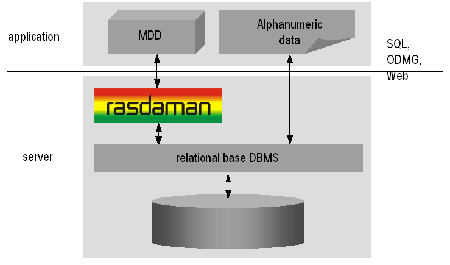

   Embedding of rasdaman in IT infrastructure

Further information on application program interfacing, administration,
and related topics is available in the other components of the rasdaman
documentation set.

Interfaces
==========

The syntactical elements explained in this document comprise the rasql
language interface to rasdaman. There are several ways to actually enter
such statements into the rasdaman system:

-  By using the rasql command-line tool to send queries to rasdaman and
   get back the results.

-  By developing an application program which uses the raslib/rasj function
   ``oql_execute()`` to forward query strings to the rasdaman server and get
   back the results.

RasLib are not the subject of this document. Please refer to
the *C++ Developer's Guide* or *Java Developer's Guide* of the rasdaman
documentation set for further information.

rasql and Standard SQL
======================

The declarative interface to the rasdaman system consists of the
*rasdaman Query Language,* rasql, which supports retrieval,
manipulation, and data definition (replacing former *rasdl*).

Moreover, the rasdaman query language, rasql, is very similar - and in
fact embeds into - standard SQL. Hence, if you are familiar with SQL,
you will quickly be able to use rasql. Otherwise you may want to consult
the introductory literature referenced at the end of this chapter.

The rasql language is, with only slight adaptations, being standardized
by ISO as 9075 SQL Part 15: MDA (Multi-Dimensional Arrays).

Notational Conventions
======================

The following notational conventions are used in this manual:

Program text (under this we also subsume queries in the document on
hand) is printed in a ``monotype font``. Such text is further
differentiated into keywords and syntactic variables. Keywords like
struct are printed in boldface; they have to be typed in as is.

An optional clause is enclosed in brackets; an arbitrary
repetition is indicated through brackets and an ellipsis. Grammar alternatives
can be grouped in parentheses separated by a ``|`` symbol.

**Example**

.. parsed-literal::

    select :token:`resultList`
    from :token:`namedCollection` [ [ as ] :token:`collIterator` ]
         [ , :token:`namedCollection` [ [ as ] :token:`collIterator` ] ]...
    [ where :token:`booleanExp` ]

It is important not to mix the regular brackets ``[`` and ``]`` denoting
array access, trimming, etc., with the grammar brackets ``[`` and ``]``
denoting optional clauses and repetition; in grammar excerpts the first case
is in double quotes. The same applies to parentheses.

Italics are used in the text to draw attention to the first
instance of a defined term in the text. In this case, the font is the
same as in the running text, not Courier as in code pieces.

.. _terminology:

***********
Terminology
***********

An Intuitive Definition
=======================

An array is a set of elements which are ordered in space. The space
considered here is discretized, i.e., only integer coordinates are
admitted. The number of integers needed to identify a particular
position in this space is called the *dimension* (sometimes also
referred to as *dimensionality*). Each array element, which is referred
to as *cell*, is positioned in space through its *coordinates*.

A cell can contain a single value (such as an intensity value in case of
grayscale images) or a composite value (such as integer triples for the
red, green, and blue component of a color image). All cells share the
same structure which is referred to as the *array cell type* or *array
base type*.

Implicitly a neighborhood is defined among cells through their
coordinates: incrementing or decrementing any component of a coordinate
will lead to another point in space. However, not all points of this
(infinite) space will actually house a cell. For each dimension, there
is a *lower* and *upper bound*, and only within these limits array cells
are allowed; we call this area the *spatial domain* of an array. In the
end, arrays look like multidimensional rectangles with limits parallel
to the coordinate axes. The database developer defines both spatial
domain and cell type in the *array type definition*. Not all bounds have
to be fixed during type definition time, though: It is possible to leave
bounds open so that the array can dynamically grow and shrink over its
lifetime.

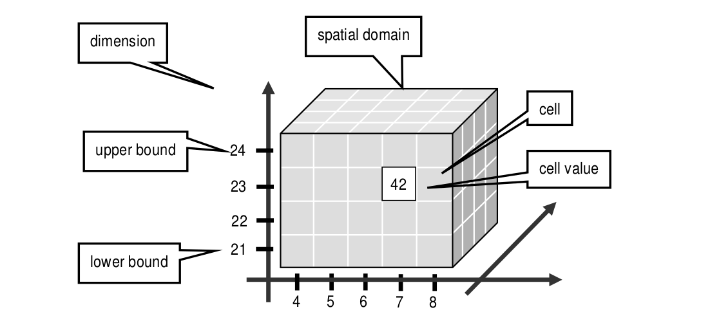

   Constituents of an array

Synonyms for the term array are *multidimensional arrays*,
*multi­dimen­sional data*, *MDD*. They are used interchangeably in the
rasdaman documentation.

In rasdaman databases, arrays are grouped into collections. All elements
of a collection share the same array type definition (for the remaining
degrees of freedom see :ref:`sec-array-typedef`). Collections form the basis for
array handling, just as tables do in relational database technology.

A Technical Definition
======================

Programmers who are familiar with the concept of arrays in programming
languages maybe prefer this more technical definition:

An array is a mapping from integer coordinates, the spatial domain, to
some data type, the cell type. An array's spatial domain, which is
always finite, is described by a pair of lower bounds and upper bounds
for each dimension, resp. Arrays, therefore, always cover a finite,
axis-parallel subset of Euclidean space.

Cell types can be any of the base types and composite types defined in
the ODMG standard and known, for example from C/C++. In fact, every
admissible C/C++ type is admissible in the rasdaman type system, too.

In rasdaman, arrays are strictly typed wrt. spatial domain and cell
type. Type checking is done at query evaluation time. Type checking can
be disabled selectively for an arbitrary number of lower and upper
bounds of an array, thereby allowing for arrays whose spatial domains
vary over the array lifetime.

***************
Sample Database
***************

Collection mr
=============

This section introduces sample collections used later in this manual.
The sample database which is shipped together with the system contains
the schema and the instances outlined in the sequel.

Collection ``mr`` consists of three images (see :numref:`figure3`\ ) taken from the
same patient using magnetic resonance tomography. Images are 8 bit
grayscale with pixel values between 0 and 255 and a size of 256x211.

.. _figure3:

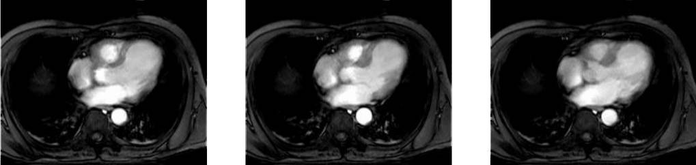

   Sample collection ``mr``

Collection mr2
==============

Collection ``mr2`` consists of only one image, namely the first image of
collection ``mr`` (:numref:`fig-mr2`). Hence, it is also 8 bit grayscale with
size 256x211.

.. _fig-mr2:

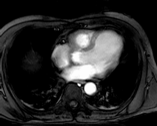

   Sample collection ``mr2``

Collection rgb
==============

The last example collection, ``rgb``, contains one item, a picture of the
anthur flower  (:numref:`fig-rgb`). It is an RGB image of size 400x344 where
each pixel is composed of three 8 bit integer components for the red, green, and
blue component, resp.

.. _fig-rgb:

   The collection ``rgb``

.. _sec-typedefrasdl:

***************************
Type Definition Using rasdl
***************************

.. _overview-1:

Overview
========

Every instance within a database is described by its data type (i.e.,
there is exactly one data type to which an instance belongs; conversely,
one data type can serve to describe an arbitrary number of instances).
Each database contains a self-contained set of such type definitions; no
other type information, external to a database, is needed for database
access.

A rasdaman schema contains three categories of data types:

-  Cell type definitions; these can be base types (such as float) or
   composite ("struct") types such as red/green/blue color pixels.

-  MDD type definitions; these define arrays over some base type and
   with some spatial domain.

-  Collection type definitions; they describe sets over some MDD type;
   collections of a given type can only contain MDD instances of the MDD
   type used in the definition.

Types are identified by their name which must be unique within a
database; upper and lower case are distinguished. The same names are
used in the C++ header files generated by the rasdl processor.

Type handling is done using the rasdl processor which allows adding
types to a database schema, deleting types, displaying schema
information, and generating C++ header files from database types.
Therefore, rasdl is the tool for maintaining database schemata.

**Dynamic Type Definition**

New types can be defined dynamically while the rasdaman server is
running. This means that new types introduced via rasdl are immediately
available to all other applications after rasdl's transaction commit.

**Examples**

In :ref:`sec-rasdl-examples` examples are given for the most common rasdl tasks.

.. important::
    Extreme care must be exercised on database and type maintenance. For
    example, deleting a database cannot be undone, and deleting a type still
    used in the database (i.e., which is needed to describe existing MDD
    objects) may make it impossible to access these database objects any
    more.

    In general, database administration should be reserved to few persons,
    all of which should have high familiarity with the operating system, the
    relational database system, and the rasdaman system.

**Alternative Type Definition**

Creation of types is possible through rasql, too;
see :ref:`sec-rasql-typedef`. For the future it is planned to phase out
rasdl and perform all type management completely through rasql.

Application Development Workflow
================================

The usual proceeding of setting up a database and an application
operating this database consists of three major steps.

-  First, a rasdl definition is established (best through a file, but
   also possible via typing in commands interactively) which is fed into
   the rasdl processor. The output generated from this source consists
   of C++ header and source files; in parallel, the type information is
   fed into the target database.

-  In the second step, the program source code written by the
   application developer is compiled using the respective C++ compiler
   of the target platform. To this end, the header file generated in the
   first step as well as the RasLib header files are read by the
   compiler. The output is relocatable object code.

-  In the third step, the so created rasdaman application executable can
   operate on a database with a structure as defined in the rasdl source
   used.

:numref:`figure6` shows this application development workflow, including all the
preprocess, compile and link steps necessary to generate an executable
application.

.. _figure6:

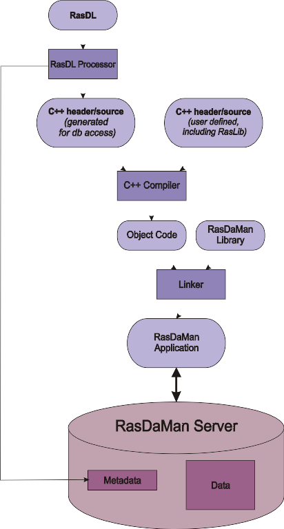

   Application development workflow

Type Definition
===============

rasdl syntax closely follows C/C++ data type definition syntax [1]_. In
fact, there is only one syntactic extension to ODMG/C++ which allows to
conveniently specify spatial domains. The complete syntax specification
of rasdl can be found in the appendix.

Base Types
----------

The set of standard data types, which is generated during creation of a
database, materializes the base types defined in the ODMG standard
(cf. :numref:`table1`).

.. _table1:

.. table:: rasdaman base types

    +--------------------+------------+------------------------------------------+
    | **rasdl name**     | **size**   | **description**                          |
    +====================+============+==========================================+
    | ``octet``          | 8 bit      | signed integer                           |
    +--------------------+------------+------------------------------------------+
    | ``char``           | 8 bit      | unsigned integer                         |
    +--------------------+------------+------------------------------------------+
    | ``short``          | 16 bit     | signed integer                           |
    +--------------------+------------+------------------------------------------+
    | ``unsigned short`` | 16 bit     | unsigned integer                         |
    | / ``ushort``       |            |                                          |
    +--------------------+------------+------------------------------------------+
    | ``long``           | 32 bit     | signed integer                           |
    +--------------------+------------+------------------------------------------+
    | ``unsigned long``  | 32 bit     | unsigned integer                         |
    | / ``ulong``        |            |                                          |
    +--------------------+------------+------------------------------------------+
    | ``float``          | 32 bit     | single precision floating point          |
    +--------------------+------------+------------------------------------------+
    | ``double``         | 64 bit     | double precision floating point          |
    +--------------------+------------+------------------------------------------+
    | ``CInt16``         | 32 bit     | complex of 16 bit signed integers        |
    +--------------------+------------+------------------------------------------+
    | ``CInt32``         | 64 bit     | complex of 32 bit signed integers        |
    +--------------------+------------+------------------------------------------+
    | ``CFloat32``       | 64 bit     | single precision floating point complex  |
    +--------------------+------------+------------------------------------------+
    | ``CFloat32``       | 128 bit    | double precision floating point complex  |
    +--------------------+------------+------------------------------------------+
    | ``boolean``        | 1 bit [2]_ | true (nonzero value), false (zero value) |
    +--------------------+------------+------------------------------------------+

Further cell types can be defined arbitrarily in rasdaman, based on the
system-defined base types or other user-defined types. In particular,
composite user-defined base types corresponding to ``struct`` s in
C/C++ are supported. As a rule, every C/C++ type is admissible as array
base type in rasdl with the exception of pointers (these are handled
through OIDs, see :ref:`sec-linking-mdd`), nested arrays, and classes.

The keyword ``struct`` allows to define complex pixel types, ``typedef``
is used for the definition of MDD and set types in the same way as in
C++. The *typeName* indicating the cell type of the array must be
defined within the database schema using it.

**Syntax**

::

   struct structName {
     attrType_1 attrName_1;
     ...
     attrType_n attrName_n;
   };

.. _sec-array-typedef:

Array Type Definition
---------------------

A spatial domain can be defined with variable degree of freedom. The
most concise way is to explicitly specify a lower and upper bound for
each dimension. Such bounds are integer numbers whereby, in each
dimension, the lower bound must be less or equal to the upper bound.
Negative numbers are allowed, and the lower bound does not have to be 0.

Array ranges defined this way are checked by the server during every
access. An attempt to access a cell outside the specified spatial domain
will lead to a runtime error.

**Syntax**

::

    typedef marray <typeName, [ lo_1 : hi_1, ..., lo_n : hi_n ]> marrayName;

**Example**

The following definition establishes a 5x5 integer array sitting in the
center of the coordinate system. Such matrices can be used, for example,
to hold convolution kernels. ::

    typedef marray <int, [-2:2, -2:2]> kernel5;

Note that the symmetry in the boundaries grounds in the way kernels are
defined; there is no constraint on the bounds in rasdl.

A higher degree of freedom in the array boundaries can be specified by
indicating an asterisk "\*" instead of a lower or upper bound at any
position. In this case, range checking is disabled for that particular
bound, and dynamic extending and shrinking is possible in that
dimension.

**Examples**

A fax has a fixed width, but an arbitrary length. Modelling this
requires to leave open the upper bound of the second dimension: ::

    typedef marray <char, [ 1:1728, 1:* ]> G3Fax;

An array can have an arbitrary number of variable bounds: ::

    typedef marray <char, [ *:*, *:* ]> GreyImage;

This extreme case - that all bounds are free - can be abbreviated by
indicating, instead of the spatial domain in brackets, only the number
of dimensions:

**Syntax**

::

    typedef marray <typeName, dimension> marrayName;

**Example**

::

    typedef marray <char, 2> GreyImage;

To leave open even the dimensionality of an array, even the dimension
number can be omitted:

**Syntax**

::

    typedef marray <typeName> marrayName;

**Example**

::

    typedef set <GreyImage> GreySet;

It is recommended to use unbounded arrays with extreme care - all range
checking is disabled, and structures may be created in the database
which your (or your colleagues') applications don't expect.

Collection Type Definition
--------------------------

An array collection type is defined with the array type as parameter. A
collection of such a type can contain an arbitrary number of arrays
whereby each of these must conform with the array type indicated.

**Syntax**

::

    typedef set <marrayName> setName;

Comments in Type Definitions
----------------------------

Comments are texts which are not evaluated by rasdaman in any way.
However, they are useful - and should be used freely - for documentation
purposes so that the defined type's meaning will be clear to later
readers.

**Syntax**

::

    // any text, delimited by end of line

**Example**

::

    struct RGBPixel // 3 x 8bit color pixels
    {
      char red,     // red channel of color image
           green,   // green channel of color image
           blue;    // blue channel of color image
    };

Sample Database Type Definitions
================================

The following definitions describe the three sample collections
introduced earlier.

Collections ``mr`` and ``mr2`` share the same structure definition, namely
256x211 8-bit grayscale images. As we don't want to restrict ourselves
to a particular image size, we just define the image type as being
2-dimensional. The following fragment accomplishes this. ::

    typedef marray <char, 2> GreyImage;
    typedef set <GreyImage> GreySet;

Equivalently, but more verbosely, we could have specified the image type
as ::

    typedef marray <char,[ *:*, *:* ]> GreyImage;

The last example defines sets of RGB images. The first line defines the
cell type as a **struct** containing three single-byte components. The
next line defines an RGBImage as a 2-dimensional array of size 800x600
over base type RGBPixel. The last line defines a set of RGB images. ::

    struct RGBPixel { char red, green, blue; };
    typedef marray <RGBPixel, [0:799, 0:599]> RGBImage;
    typedef set <RGBImage> RGBSet;

Deleting Types and Databases
============================

For deleting a type or a whole database the ``rasdl --delX`` command family
is provided where ``X`` is one of ``database``, ``basetype``, ``mddtype``,
or ``settype``:

--deldatabase db        delete database db [3]_
--delbasetype type      delete base type type from database
--delmddtype type       delete MDD type type from database
--delsettype type       delete set (collection) type type

.. important::
    Extreme care must be exercised on database and type maintenance.
    Deleting a database cannot be undone, and deleting a type still used in
    the database (i.e., which is needed to describe existing MDD objects)
    may make it impossible to access these database objects any more.

    In general, database administration should be reserved to few persons,
    all of which should have high familiarity with the operating system, the
    relational database system, and the rasdaman system.

**Example**

The following Unix command line will delete the definition of set type
``MyCollectionType`` from database ``RASBASE``; it is the responsibility of the
``rasdl`` user (i.e., the database administrator) to ensure that no
instances of this set definition exist in the database.

.. code-block:: shell

    rasdl --database RASBASE --delsettype MyCollectionType

rasdl Invocation
================

As outlined, the rasdl processor reads the specified rasdl source file,
imports the schema information into the database, and generates a
corresponding C++ header file. A rasdl source file has to be
self-contained, i.e., only types which are defined in the same file are
allowed to be used for definitions. Types must be defined before use.

Usage:

.. code-block:: shell

    rasdl [options]

Options:

--database db       name of database
                    (default: RASBASE)

--connect connectstr
                    connect string for base DBMS connection
                    (e.g. test/test@julep)
                    default: /
                    Note: the connect parameter is ignored is when
                    rasdaman configure for using file-based storage

-c, --createdatabase dbname
                    create database with name dbname and
                    initialize it with the standard schema

--deldatabase db
                    delete database db

--delbasetype type
                    delete base type type from database

--delmddtype type
                    delete MDD type type from database

--delsettype type
                    delete set (collection) type type from database

-h, --help          help: display invocation syntax

-p, --print db      print all data type definitions in database db

-r, --read file
                    read rasdl commands from file file

-i, --insert        insert types into database (-r required)

--hh file           generate C++ header file file (-r required)

.. note::
    Right now, ``rasdl`` is a server-based utility, which means it must be
    invoced on the machine where the rasdaman server runs.

.. note::
    The ``-c`` option for database creation is dependent on the base DBMS used --
    some systems do, a very few don't allow database creation through ``rasdl``.

.. _sec-rasdl-examples:

Examples
========

Default database name is ``RASBASE``. It depends upon the base DBMS whether
upper and lower case are distinguished (usually they are not).

**Create Database**

A new database is created through

.. code-block:: shell

    rasdl -c

An error message is issued and the operation is aborted if the database
exists already.

**Delete Database**

An existing database is deleted through

.. code-block:: shell

    rasdl --deldatabase

All contents will be lost irretrievably. All space in the base DBMS is
released, all tables (including rasdaman system tables) are removed.

**Read Type Definition File**

A type definition file named ``myfile`` is read into the database through

.. code-block:: shell

    rasdl -r myfile -i

In particular, the standard types must be read in as part of the
database creation process:

.. code-block:: shell

    rasdl -r ~rasdaman/examples/rasdl/basictypes.dl -i

**Print All Types**

An overview on all rasdaman types defined is printed through

.. code-block:: shell

    rasdl -p

.. _sec-rasql-typedef:

***************************
Type Definition Using rasql
***************************

Starting with rasdaman version 9, DDL commands have been added to rasql
which can take over most of the tasks *rasdl* (see :ref:`sec-typedefrasdl`)
accomplishes.

Types in rasdaman establish a 3-level hierarchy:

-  Struct types allow defining composite cell types, in addition to the
   predefined atomic cell types.

-  Array types allow defining array structures, given by a cell type
   (using an atomic or struct type) and a domain extent.

-  Set types allow defining collections (sets) over arrays of some
   particular array type.

Both variants can be used in parallel (and manipulate the same data
dictionary in the server). In future, it is planned to phase out rasdl
completely as it has been crafted along the (meantime obsolete) ODMG
standard whereas rasdaman is aiming at a tight integration with SQL, in
particular at implementing the forthcoming SQL/MDA standard.

.. _sec-cell-types:

Cell types
==========

**Base types**

The base types supported are listed in :numref:`table1`.

**Composite types**

Definition of composite types adheres to the following syntax: ::

    create type typeName
    as (
      attrName_1 attrType_1 ,
      attrName_1 attrType_1 ,
      ...
      attrName_n attrType_n
    )

Attribute names must be unique within a composite type, otherwise an
exception is thrown.

**Example**

An RGB pixel type can be defined as ::

    create type RGBPixel
    as (
      red char,
      green char,
      blue char
    )

.. _sec-array-types:

Array types
===========

An **marray** ("multi-dimensional array") type defines an array type
through its cell type (see :ref:`sec-cell-types`) and its dimensionality.

**Array type syntax**

The syntax for creating an **marray** type is as below. There are two
variants, corresponding to the dimensionality specification alternatives
described above: ::

    create type typeName
    as baseTypeName mdarray domainSpec

where ``baseTypeName`` is the name of a defined cell type and ``domainSpec``
is a multi-dimensional interval specification as described below.

Alternatively, a cell type structure can be indicated directly: ::

    create type typeName as
    (
      attrName_1 attrType_1,
      ...,
      attrName_n attrType_n
    ) mdarray domainSpec

No type (of any kind) with name ``typeName`` may pre-exist already,
otherwise an exception is thrown.

Attribute names must be unique within a composite type, otherwise an
exception is thrown.

**Array dimensionality**

Dimensions and their extents are specified by providing an axis name for
each dimension and, optionally, a lower and upper bound: ::

    [ a_1 ( lo_1 : hi_1 ), ... , a_d ( lo_d : hi_d ) ]
    [ a_1 , ... , a_d ]

where d is a positive integer number, a_i are identifiers,
and lo_1 and hi_1 are integers with lo_1
\le hi_1. Both lo_1 and hi_1 can be an
asterisk (\*) instead of a number, in which case there is no limit
in the particular direction of the axis. If the bounds lo_1
and hi_1 on a particular axis are not specified, they are
assumed to be equivalent to \*.

Axis names must be unique within a domain specification, otherwise an
exception is thrown.

Currently (rasdaman 9) axis names are ignored and cannot be used in
queries yet.

**Examples**

The following statement defines a 2-D XGA RGB image, based on the
definition of RGBPixel as shown above: ::

    create type RGBImage
    as RGBPixel mdarray [ x ( 0:1023 ), y ( 0:767 ) ]

An 2-D image without any extent limitation can be defined through: ::

    create type UnboundedImage
    as RGBPixel mdarray [ x, y ]

Selectively we can also limit only the bounds on the x axis for example: ::

    create type PartiallyBoundedImage
    as RGBPixel mdarray [ x ( 0 : 1023 ), y ]

.. note::
    The reader may notice that the syntax in rasql is changed over the
    original rasdl syntax. For example, the keyword **marray** is changed to
    **mdarray** in the rasql type definition. This has been done in
    pre­paration of the rasql syntax for the forthcoming ISO SQL/MDA
    ("Multidimensional Arrays") standard.

.. _sec-set-types:

Set types
=========

A **set** type defines a collection of arrays sharing the same
**marray** type. Additionally, a collection can also have null values
which are used in order to characterise sparse arrays. A sparse array is
an array where most of the elements have a null value.

**Set type syntax**

::

    create type typeName
    as set ( marrayTypeName [ nullValues ] )

where *marrayTypeName* is the name of a defined marray type and
*null­Values* is an optional specification of a set of values to be
treated as nulls (cf. :ref:`sec-nullvalues`).

No object with name *typeName* may pre-exist already.

**Null Values**

The optional *nullValues* clause in a set type definition (which is
identical to the specification given in :ref:`sec-nullvalues`) adheres to the
following syntax: ::

    null values [ ( double | [ double : double ] )
              ( , ( double | [ double : double ] ) )* ]

**Example**

For example, the following statement defines a set type of 2-D XGA RGB
images, based on the definition of ``RGBImage``: ::

    create type RGBSet
    as set ( RGBImage )

If values 0, 253, 254, and 255 are to be considered null values, this
can be specified as follows: ::

    create type RGBSet
    as set ( RGBImage null values [ 0, 253 : 255 ] )

Note that these null values will apply equally to every band. It is not possible
to separate null values per band.

.. _sec-drop-types:

Drop type
=========

A type definition can be dropped (i.e., deleted from the database) if it
is not in use. This is the case if both of the following conditions
hold:

-  The type is not used in any other type definition.

-  There are no array instances existing which are based, directly or
   indirectly, on the type on hand.

Further, base types (such as char) cannot be deleted.

**Drop type syntax**

::

    drop type typeName

.. _sec-list-types:

List available types
====================

A list of all types defined in the database can be obtained in textual
form, adhering to the rasql type definition syntax. This is done by
querying virtual collections (similar to the virtual collection
``RAS_COLLECT­ION_­NAMES``).

Technically, the output of such a query is a list of 1-D ``char`` arrays,
each one containing one type definition.

**List type syntax**

::

    select typeColl from typeColl

where *typeColl* is one of

- ``RAS_STRUCT_TYPES`` for struct types

- ``RAS_MARRAY_TYPES`` for array types

- ``RAS_SET_TYPES``    for set types

**Usage notes**

Collection aliases can be used, such as: ::

    select t from RAS_STRUCT_TYPES as t

No operations can be performed on the output array.

**Example output**

A struct types result may look like this when printed: ::

    create type RGBPixel
    as ( red char, green char, blue char )

    create type TestPixel
    as ( band1 char, band2 char, band3 char )

    create type GeostatPredictionPixel
    as ( prediction float, variance float )

An marray types result may look like this when printed: ::

    create type GreyImage
    as char mdarray [ x, y ]

    create type RGBCube
    as RGBPixel mdarray [ x, y, z ]

    create type XGAImage
    as RGBPixel mdarray [ x ( 0 : 1023 ), y ( 0 : 767 ) ]

A set types result may look like this when printed: ::

    create type GreySet
    as set ( GreyImage )

    create type NullValueTestSet
    as set ( NullValueArrayTest null values [5:7] )

Changing types
==============

The type of an existing collection can be changed to another type through
the ``alter`` statement.

The new collection type must be compatible with the old one, which means:

- same cell type
- same dimensionality
- no domain shrinking

Changes are allowed, for example, in the null values.

**Alter type syntax**

::

    alter collection collName set type collType

where

- *collName* is the name of an existing collection
- *collType* is the name of an existing collection type

**Usage notes**

The collection does not need to be empty, i.e. it may contain array
objects.

Currently, only set (i.e., collection) types can be modified.

**Example**

A struct types result may look like this when printed: ::

    alter collection Bathymetry
    set type BathymetryWithNullValues

**************************
Query Execution with rasql
**************************

The rasdaman toolkit offers essentially three ways to communicate with a
database through queries:

-  By writing a C++ or Java application that uses the rasdaman APIs,
   raslib or rasj, resp. (see the rasdaman API guides).

-  By writing queries using the GUI-based rview tool which allows to
   visualize results in a large variety of display modes (see the
   rasdaman rview Guide).

-  By submitting queries via command line using rasql; this tool is
   covered in this section.

The rasql tool accepts a query string (which can be parametrised as
explained in the API guides), sends it to the server for evaluation, and
receives the result set. Results can be displayed in alphanumeric mode,
or they can be stored in files.

.. _examples-1:

Examples
========

For the user who is familiar with command line tools in general and the
rasql query language, we give a brief introduction by way of examples.
They outline the basic principles through common tasks.

-  Create a collection ``test`` of type ``GreySet`` (note the explicit setting
   of user ``rasadmin``; rasql's default user ``rasguest`` by default cannot
   write):

    .. code-block:: bash

        rasql -q "create collection test GreySet" \
              --user rasadmin --passwd rasadmin

- Print the names of all existing collections:

    .. code-block:: bash

        rasql -q "select r from RAS_COLLECTIONNAMES as r" \
              --out string

-  Export demo collection ``mr`` into TIFF files rasql_1.tif, rasql_2.tif,
   rasql_3.tif (note the escaped double-quotes as required by shell):

    .. code-block:: bash

        rasql -q "select encode(m, \"tiff\") from mr as m"
              --out file

-  Import TIFF file *myfile* into collection ``mr`` as new image (note the
   different query string delimiters to preserve the ``$`` character!):

    .. code-block:: bash

        rasql -q 'insert into mr values decode($1)' \
              -f myfile --user rasadmin --passwd rasadmin

-  Put a grey square into every mr image:

    .. code-block:: bash

        rasql -q "update mr as m set m[0:10,0:10] \
                  assign marray x in [0:10,0:10] values 127c" \
              --user rasadmin --passwd rasadmin

-  Verify result of update query by displaying pixel values as hex
   numbers:

    .. code-block:: bash

        rasql -q "select m[0:10,0:10] from mr as m" --out hex

Invocation syntax
=================

Rasql is invoked as a command with the query string as parameter.
Additional parameters guide detailed behavior, such as authentication
and result display.

Any errors or other diagnostic output encountered are printed;
transactions are aborted upon errors.

Usage:

.. code-block:: text

    rasql [--query q|-q q] [options]

Options:

-h, --help          show command line switches
-q, --query q       query string to be sent to the rasdaman server
                    for execution

-f, --file f        file name for upload through $i parameters within
                    queries; each $i needs its own file parameter, in proper
                    sequence [4]_. Requires --mdddomain and --mddtype

--content           display result, if any (see also --out and --type for
                    output formatting)

--out t             use display method  t  for cell values of result MDDs
                    where t is one of

                    - none: do not display result item contents

                    - file: write each result MDD into a separate file

                    - string: print result MDD contents as char string (only for 1D arrays of type char)

                    - hex: print result MDD cells as a sequence of space-separated hex values

                    - formatted: reserved, not yet supported

                    Option --out implies --content; default: none

--outfile of        file name template for storing result images (ignored
                    for scalar results). Use '%d' to indicate auto numbering position,
                    like with printf(1). For well-known file types, a proper suffix is
                    appended to the resulting file name. Implies --out file. (default:
                    rasql_%d)

--mdddomain d       MDD domain, format: '[x0:x1,y0:y1]'; required
                    only if --file specified and file is in data format r_Array; if
                    input file format is some standard data exchange format and the
                    query uses a convertor, such as encode($1,"tiff"), then domain
                    information can be obtained from the file header.

--mddtype t         input MDD type (must be a type defined in the
                    database); required only if --file specified and file is in data
                    format r_Array; if input file format is some standard data
                    exchange format and the query uses a convertor, such as
                    decode($1,"tiff"), then type information can be obtained from the
                    file header.

--type              display type information for results

-s, --server h      rasdaman server name or address (default: localhost)

-p, --port p        rasdaman port number (default: 7001)

-d, --database db
                    name of database (default: RASBASE)

--user u            name of user (default: rasguest)

--passwd p          password of user (default: rasguest)

******************************
Overview: General Query Format
******************************

Basic Query Mechanism
=====================

rasql provides declarative query functionality on collections (i.e.,
sets) of MDD stored in a rasdaman database. The query language is based
on the SQL-92 standard and extends the language with high-level
multidimensional operators.

The general query structure is best explained by means of an example.
Consider the following query: ::

    select mr[100:150,40:80] / 2
    from mr
    where some_cells( mr[120:160, 55:75] > 250 )

In the **from** clause, mr is specified as the working collection on
which all evaluation will take place. This name, which serves as an
"iterator variable" over this collection, can be used in other parts of
the query for referencing the particular collection element under
inspection.

Optionally, an alias name can be given to the collection (see syntax
below) - however, in most cases this is not necessary.

In the **where** clause, a condition is phrased. Each collection element
in turn is probed, and upon fulfillment of the condition the item is
added to the query result set. In the example query, part of the image
is tested against a threshold value.

Elements in the query result set, finally, can be "post-processed" in
the **select** clause by applying further operations. In the case on
hand, a spatial extraction is done combined with an intensity reduction
on the extracted image part.

In summary, a rasql query returns a set fulfilling some search condition
just as is the case with conventional SQL and OQL. The difference lies
in the operations which are available in the **select** and **where**
clause: SQL does not support expressions containing multi­dimen­sional
operators, whereas rasql does.

**Syntax**

::

    select resultList
    from collName [ as collIterator ]
    [ , collName [ as collIterator ] ] ...
    [ where booleanExp ]

The complete rasql query syntax can be found in the Appendix.

.. _sec-select-clause-result-prep:

Select Clause: Result Preparation
=================================

Type and format of the query result are specified in the **select** part
of the query. The query result type can be multidimensional, a struct,
or atomic (i.e., scalar). The select clause can reference the collection
iteration variable defined in the from clause; each array in the
collection will be assigned to this iteration variable successively.

**Example**

Images from collection mr, with pixel intensity reduced by a factor 2: ::

    select mr / 2
    from mr

.. _sec-from-clause-coll-spec:

From Clause: Collection Specification
=====================================

In the **from** clause, the list of collections to be inspected is
specified, optionally together with a variable name which is associated
to each collection. For query evaluation the cross product between all
participating collections is built which means that every possible
combination of elements from all collections is evaluated. For instance
in case of two collections, each MDD of the first collection is combined
with each MDD of the second collection. Hence, combining a collection
with n elements with a collection containing m elements results in n*m
combinations. This is important for estimating query response time.

**Example**

The following example subtracts each MDD of collection mr2 from each MDD
of collection mr (the binary induced operation used in this example is
explained in :ref:`sec-binary-induction`). ::

    select mr - mr2
    from mr, mr2

Using alias variables a and b bound to collections mr and mr2, resp.,
the same query looks as follows: ::

    select a - b
    from mr as a, mr2 as b

**Cross products**

As in SQL, multiple collections in a from clause such as ::

    from c1, c2, ..., ck

are evaluated to a *cross product*. This means that the select clause is
evaluated for a virtual collection that has n1 \* n2 \* ... \* nk elements
if c1 contains n1 elements, c2 contains n2 elements, and so forth.

Warning: This holds regardless of the select expression - even if you mention
only say c1 in the select clause, the number of result elements will
be the product of *all* collection sizes!

Where Clause: Conditions
========================

In the **where** clause, conditions are specified which members of the
query result set must fulfil. Like in SQL, predicates are built as
boolean expressions using comparison, parenthesis, functions, etc.
Unlike SQL, however, rasql offers mechanisms to express selection
criteria on multidimensional items.

**Example**

We want to restrict the previous result to those images where at least
one difference pixel value is greater than 50 (see :ref:`sec-binary-induction`): ::

    select mr - mr2
    from mr, mr2
    where some_cells( mr - mr2 > 50 )

Comments in Queries
===================

Comments are texts which are not evaluated by the rasdaman server in any
way. However, they are useful - and should be used freely - for
documentation purposes; in particular for stored queries it is important
that its meaning will be clear to later readers.

**Syntax**

::

    -- any text, delimited by end of line

**Example**

::

    select mr -- this comment text is ignored by rasdaman
    from mr   -- for comments spanning several lines,
              -- every line needs a separate '--' starter

.. _sec-constants:

*********
Constants
*********

.. _sec-atomic-constants:

Atomic Constants
================

Atomic constants are written in standard C/C++ style. If necessary
con­stants are augmented with a one or two letter postfix to
un­ambiguously determine its data type (:numref:`table2`).

The default for integer constants is '``L``', for floats it is '``F``'.
Specifiers are case insensitive.

**Example**

::

    25c
    -1700L
    .4e-5D

.. note::
    Boolean constants true and false are unique, so they do not need a
    length specifier.

.. _table2:

.. table:: Data type specifiers

    +--------------+----------------+
    | postfix      | type           |
    +==============+================+
    | c            | char           |
    +--------------+----------------+
    | o            | octet          |
    +--------------+----------------+
    | s            | short          |
    +--------------+----------------+
    | us           | unsigned short |
    +--------------+----------------+
    | l            | long           |
    +--------------+----------------+
    | ul           | unsigned long  |
    +--------------+----------------+
    | f            | float          |
    +--------------+----------------+
    | d            | double         |
    +--------------+----------------+

Additionally, the following special floating-point constants are supported as 
well:

.. _table-float-constants:

.. table:: Special floating-point constants corresponding to IEEE 754 NaN and Inf.

    +--------------+-----------+
    | **Constant** | **Type**  |
    +==============+===========+
    | NaN          | double    |
    +--------------+-----------+
    | NaNf         | float     |
    +--------------+-----------+
    | Inf          | double    |
    +--------------+-----------+
    | Inff         | float     |
    +--------------+-----------+

.. _sec-composite-constants:

Composite Constants
===================

Composite constants resemble records ("structs") over atomic con­stants
or other records. Notation is as follows.

**Syntax**

::

    struct { const_0, ..., const_n }

where *const_i* can be atomic or a **struct** again.

**Example**

::

    struct{ struct{ 1l, 2l, 3l }, true }

**Complex numbers**

Special built-in structs are ``CFloat32`` and ``CFloat64`` for single and double
precision complex numbers, resp, as well as ``CInt16`` and ``CInt32`` for 
signed integer complex numbers. The constructor is defined by

**Syntax**

::

    complex( re, im )

where *re* and *im* are integer or floating point expressions. The resulting
complex constant is of type 

- ``CFloat64`` if at least one of the constituent expressions is double 
  precision floating point, otherwise
- ``CFloat32`` if at least one of the constituent expressions is single 
  precision floating point, otherwise
- ``CInt32`` if at least one of the constituent expressions is 32 bit signed
  integer (long), otherwise
- ``CInt16`` if at least one of the constituent expressions is 16 bit signed
  integer (short).

**Example**

::

    complex( .35, 16.0d )   -- CFloat64
    complex( .35f, 16.0f )  -- CFloat32
    complex( 5s, 16s )      -- CInt16
    complex( 5, 16 )        -- CInt32

**Component access**

See :ref:`sec-struct-component-sel` for details on how to extract the constituents from a
composite value.

.. _sec-arrayconstant:

Array Constants
===============

Small array constants can be indicated literally. An array constant consists of
the spatial domain specification (see :ref:`sec-spatial-domain`) followed by the
cell values whereby value sequencing is as follow. The array is linearized in
a way that the lowest dimension [5]_ is the "outermost" dimension and
the highest dimension [6]_ is the "innermost" one. Within each
dimension, elements are listed sequentially, starting with the lower
bound and proceeding until the upper bound. List elements for the
innermost dimension are separated by comma ",", all others by semicolon ";".

The exact number of values as specified in the leading spatial domain
expression must be provided. All constants must have the same type; this
will be the result array's base type.

**Syntax**

::

    < mintervalExp
      scalarList_0 ; ... ; scalarList_n ; >

where *scalarList* is defined as a comma separated list of literals:

::

    scalar_0, scalar_1, ... scalar_n ;

**Example**

::

    < [-1:1,-2:2] 0, 1, 2, 3, 4;
                  1, 2, 3, 4, 5;
                  2, 3, 4, 5, 6 >

This constant expression defines the following matrix:

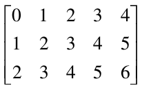

.. _sec-oid-constants:

Object identifier (OID) Constants
=================================

OIDs serve to uniquely identify arrays (see :ref:`sec-linking-mdd`). Within a
database, the OID of an array is an integer number. To use an OID
outside the context of a particular database, it must be fully qualified
with the system name where the database resides, the name of the
database containing the array, and the local array OID.

The worldwide unique array identifiers, i.e., OIDs, consist of three
components:

-  A string containing the system where the database resides (system
   name),

-  A string containing the database ("base name"), and

-  A number containing the local object id within the database.

The full OID is enclosed in '``<``' and '``>``' characters, the three name
com­ponents are separated by a vertical bar '``|``'.

System and database names obey the naming rules of the underlying
operating system and base DBMS, i.e., usually they are made up of lower
and upper case characters, underscores, and digits, with digits not as
first character. Any additional white space (space, tab, or newline
characters) inbetween is assumed to be part of the name, so this should
be avoided.

The local OID is an integer number.

**Syntax**

::

    < systemName | baseName | objectID >
    objectID

where *systemName* and *baseName* are string literals and *objectID* is
an *integerExp*.

**Example**

::

    < acme.com | RASBASE | 42 >
    42

.. _sec-string-constants:

String constants
================

A sequence of characters delimited by double quotes is a string.

**Syntax**

::

    "..."

**Example**

::

    SELECT encode(coll, "png") FROM coll

Collection Names
================

Collections are named containers for sets of MDD objects (see
:ref:`sec-linking-mdd`). A collection name is made up of lower and upper
case characters, underscores, and digits. Depending on the underlying base DBMS,
names may be limited in length, and some systems (rare though) may not
distinguish upper and lower case letters. Please refer to the *rasdaman
External Products Integration Guide* for details on your par­ticular
platform.

Operations available on name constants are string equality "``=``" and
inequality "``!=``".

.. _sec-sdom-ops:

*************************
Spatial Domain Operations
*************************

One-Dimensional Intervals
=========================

One-dimensional (1D) intervals describe non-empty, consecutive sets of
integer numbers, described by integer-valued lower and upper bound,
resp.; negative values are admissible for both bounds. Intervals are
specified by indicating lower and upper bound through integer-valued
expressions according to the following syntax:

The lower and upper bounds of an interval can be extracted using the
functions .lo and .hi.

**Syntax**

::

    integerExp_1 : integerExp_2
    intervalExp.lo
    intervalExp.hi

A one-dimensional interval with *integerExp_1* as lower bound and
*integerExp_2* as upper bound is constructed. The lower bound must be
less or equal to the upper bound. Lower and upper bound extrac­tors
return the integer-valued bounds.

**Examples**

An interval ranging from -17 up to 245 is written as::

    -17 : 245

Conversely, the following expression evaluates to 245; note the
parenthesis to enforce the desired evaluation sequence: ::

    (-17 : 245).hi

.. _sec-mintervals:

Multidimensional Intervals
==========================

Multidimensional intervals (*m-intervals*) describe areas in space, or
better said: point sets. These point sets form rectangular and
axis-parallel "cubes" of some dimension. An m-interval's dimension is
given by the number of 1D intervals it needs to be described; the bounds
of the "cube" are indicated by the lower and upper bound of the
respective 1D interval in each dimension.

From an m-interval, the intervals describing a particular dimension can
be extracted by indexing the m-interval with the number of the desired
dimension using the operator ``[]``.

**Dimension counting in an m-interval expression runs from left to
right, starting with lowest dimension number 0.**

**Syntax**

::

    [ intervalExp_0 , ... , intervalExp_n ]
    [ intervalExp_0 , ... , intervalExp_n ] [integerExp ]

An (n+1)-dimensional m-interval with the specified *intervalExp_i* is
built where the first dimension is described by *intervalExp_0*, etc.,
until the last dimension described by *intervalExp_n*.

**Example**

A 2-dimensional m-interval ranging from -17 to 245 in dimension 1 and
from 42 to 227 in dimension 2 can be denoted as

::

    [ -17 : 245, 42 : 227 ]

The expression below evaluates to [42:227].

::

    [ -17 : 245, 42 : 227 ] [1]

\...whereas here the result is 42:

::

    [ -17 : 245, 42 : 227 ] [1].lo

****************
Array Operations
****************

As we have seen in the last Section, *intervals* and *m-intervals*
describe n-dimensional regions in space.

Next, we are going to place information into the regular grid
estab­lished by the m-intervals so that, at the position of every
integer-valued coordinate, a value can be stored. Each such value
container addressed by an n-dimensional coordinate will be referred to
as a *cell*. The set of all the cells described by a particular
m-interval and with cells over a particular base type, then, forms the
*array*.

As before with intervals, we introduce means to describe arrays through
expressions, i.e., to derive new arrays from existing ones. Such
operations can change an arrays shape and dimension (some­times called
geometric operations), or the cell values (referred to as value-changing
operations), or both. In extreme cases, both array dimension, size, and
base type can change completely, for example in the case of a histogram
computation.

First, we describe the means to query and manipulate an array's spatial
domain (so-called geometric operations), then we introduce the means to
query and manipulate an array's cell values (value-changing operations).

Note that some operations are restricted in the operand domains they
accept, as is common in arithmetics in programming languages; division
by zero is a common example. :ref:`sec-errors` contains information about
possible error conditions, how to deal with them, and how to prevent
them.

.. _sec-spatial-domain:

Spatial Domain
==============

The m-interval covered by an array is called the array's *spatial domain*.
Function sdom() allows to retrieve an array's current spatial
domain. The *current domain* of an array is the minimal axis-parallel
bounding box containing all currently defined cells.

As arrays can have variable bounds according to their type definition
(see :ref:`sec-array-typedef`), their spatial domain cannot always be determined
from the schema information, but must be recorded individually by the
database system. In case of a fixed-size array, this will coincide with
the schema information, in case of a variable-size array it delivers the
spatial domain to which the array has been set. The operators presented
below and in :ref:`sec-update` allow to change an array's spatial domain.
Notably, a collection defined over variable-size arrays can hold arrays
which, at a given moment in time, may differ in the lower and/or upper
bounds of their variable dimensions.

**Syntax**

::

    sdom( mddExp )

Function sdom() evaluates to the current spatial domain of *mddExp*.

**Examples**

Consider an image a of collection mr. Elements from this collection are
defined as having free bounds, but in practice our collection elements
all have spatial domain [0 : 255, 0 : 210]. Then, the
following equi­valences hold:

::

    sdom(a)       = [0 : 255, 0 : 210]
    sdom(a)[0]    = [0 : 255]
    sdom(a)[0].lo = 0
    sdom(a)[0].hi = 255

Geometric Operations
====================

.. _sec-trimming:

Trimming
--------

Reducing the spatial domain of an array while leaving the cell values
unchanged is called *trimming*. Array dimension remains unchanged.

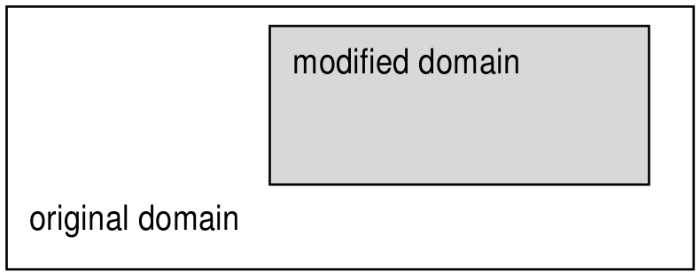

   Spatial domain modification through trimming (2-D example)

The *generalized trim operator* allows restriction, extension, and a
combination of both operations in a shorthand syntax. This operator does
not check for proper subsetting or supersetting of the domain modifier.

**Syntax**

::

    mddExp [ mintervalExp ]

**Examples**

The following query returns cutouts from the area [120: 160 , 55 : 75]
of all images in collection ``mr`` (see :numref:`figure8`).

::

    select mr[ 120:160, 55:75 ]
    from mr

.. _figure8:

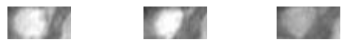

   Trimming result

.. _sec-section:

Section
-------

A *section* allows to extract lower-dimen­sional layers ("slices") from
an array.

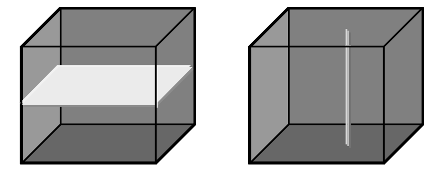

   Single and double section through 3-D array, yielding 2-D and 1-D sections.

A section is accomplished through a trim expression by indicating the
slicing position rather than a selection interval. A section can be made
in any dimension within a trim expression. Each section reduces the
dimension by one.

**Syntax**

::

    mddExp [ integerExp_0 , ... , integerExp_n ]

This makes sections through *mddExp* at positions *integerExp_i* for
each dimension *i*.

**Example**

The following query produces a 2-D section in the 2\ :sup:`nd` dimension
of a 3-D cube: ::

    select Images3D[ 0:256, 10, 0:256 ]
    from Images3D

.. note::
    If a section is done in *every* dimension of an array, the result is one
    single cell. This special case resembles array element access in
    programming languages, e.g., C/C++. However, in rasql the result still
    is an array, namely one with zero dimensions and exactly one element.

**Example**

The following query delivers a set of 0-D arrays containing single
pixels, namely the ones with coordinate [100,150]: ::

    select mr[ 100, 150 ]
    from mr

.. _sec-wildcard:

The Array Bound Wildcard Operator "*"
-------------------------------------

An asterisk "*" can be used as a shorthand for an sdom() invocation in a
trim expression; the following phrases all are equivalent:

::

    a [ *:*, *:* ] = a [ sdom(a)[0] , sdom(a)[1] ]
                   = a [ sdom(a)[0].lo : sdom(a)[0].hi ,
                         sdom(a)[1].lo : sdom(a)[1].hi ]

An asterisk "*" can appear at any lower or upper bound position within a
trim expression denoting the current spatial domain boundary. A trim
expression can contain an arbitrary number of such wildcards. Note,
however, that an asterisk cannot be used for specifying a section.

**Example**

The following are valid applications of the asterisk operator: ::

    select mr[ 50:*, *:200 ]
    from mr

    select mr[ *:*, 10:150 ]
    from mr

The next is illegal because it attempts to use an asterisk in a section: ::

    select mr[ *, 100:200 ] -- illegal "*" usage in dimension 0
    from mr

**Note**

It is well possible (and often recommended) to use an array's spatial
domain or part of it for query formulation; this makes the query more
general and, hence, allows to establish query libraries. The following
query cuts away the rightmost pixel line from the images:

::

    select mr[ *:*, *:sdom(mr)[1].hi - 1 ]   -- good, portable
    from mr

In the next example, conversely, trim bounds are written explicitly;
this query's trim expression, therefore, cannot be used with any other
array type.

::

    select mr[ 0:767, 0:1023 ]               -- bad, not portable
    from mr

One might get the idea that the last query evaluates faster. This,
however, is not the case; the server's intelligent query engine makes
the first version execute at just the same speed.

.. _sec-shift:

Shifting a Spatial Domain
-------------------------

Built-in function shift() transposes an array: its spatial domain
remains unchanged in shape, but all cell contents simultaneously are
moved to another location in n-dimensional space. Cell values themselves
remain un­changed.

**Syntax**

::

    shift( mddExp , pointExp )

The function accepts an *mddExp* and a *pointExp* and returns an array
whose spatial domain is shifted by vector *pointExp*.

**Example**

The following expression evaluates to an array with spatial domain
``[3:13, 4:24]``. Containing the same values as the original array a. ::

    shift( a[ 0:10, 0:20 ], [ 3, 4 ] )

.. _sec-extend:

Extending a Spatial Domain
--------------------------

Function extend() enlarges a given MDD with the domain specified. The
domain for extending must, for every boundary element, be at least as
large as the MDD's domain boundary. The new MDD contains 0 values in
the extended part of its domain and the MDD's original cell values within 
the MDD's domain.

**Syntax**

::

    extend( mddExp , mintervalExp )

The function accepts an *mddExp* and a *mintervalExp* and returns an
array whose spatial domain is extended to the new domain specified by
*mintervalExp*. The result MDD has the same cell type as the input MDD.

Precondition: ::

    sdom( mddExp ) contained in mintervalExp

**Example**

Assuming that MDD ``a`` has a spatial domain of ``[0:50, 0:25]``, the following
expression evaluates to an array with spatial domain ``[-100:100, -50:50]``,
``a``\ 's values in the subdomain ``[0:50, 0:25]``, and 0 values at the
remaining cell positions. ::

    extend( a, [-100:100, -50:50] )

.. _sec-geo-projection:

Geographic projection
---------------------

Overview
^^^^^^^^

"A map projection is any method of representing the surface of a sphere
or other three-dimensional body on a plane. Map projections are
necessary for creating maps. All map projections distort the surface in
some fashion. Depending on the purpose of the map, some distortions are
acceptable and others are not; therefore different map projections exist in
order to preserve some properties of the sphere-like body at the expense
of other properties." (Wikipedia)

Each coordinate tieing a geographic object, map, or pixel to some position
on earth (or some other celestial object, for that matter) is valid only in
conjunction with the Coordinate Reference System (CRS) in which it is
expressed. For 2-D Earth CRSs, a set of CRSs and their identifiers is
normatively defined by the OGP Geomatics Committee, formed in 2005 by
the absorption into OGP of the now-defunct European Petroleum Survey
Group (EPSG). By way of tradition, however, this set of CRS definitions
still is known as "EPSG", and the CRS identifiers as "EPSG codes". For
example, EPSG:4326 references the well-known WGS84 CRS.

The ``project()`` function
^^^^^^^^^^^^^^^^^^^^^^^^^^

Assume an MDD object ``M`` and two CRS identifiers ``C1`` and ``C2`` such as
"EPSG:4326". The ``project()`` function establishes an output MDD, with same
dimension as ``M``, whose contents is given by projecting ``M`` from CRS ``C1``
into CRS ``C2``.

The ``project()`` function comes in several variants based on the provided 
input arguments ::

    (1) project( mddExpr, boundsIn, crsIn, crsOut )

    (2) project( mddExpr, boundsIn, crsIn, crsOut, resampleAlg )

    (3) project( mddExpr, boundsIn, crsIn, boundsOut, crsOut, 
                          widthOut, heightOut )

    (4) project( mddExpr, boundsIn, crsIn, boundsOut, crsOut, 
                          widthOut, heightOut, resampleAlg, errThreshold )

where

- ``mddExpr`` - MDD object to be reprojected.

- ``boundsIn`` - geographic bounding box given as a string of comma-separated
  floating-point values of the format: ``"xmin, ymin, xmax, ymax"``.

- ``crsIn`` - geographic CRS as a string. Internally, the ``project()`` function 
  is mapped to GDAL; hence, it accepts the same CRS formats as GDAL:

    -  Well Known Text (as per GDAL)

    -  "EPSG:n"

    -  "EPSGA:n"

    -  "AUTO:proj_id,unit_id,lon0,lat0" indicating OGC WMS auto projections

    -  "``urn:ogc:def:crs:EPSG::n``" indicating OGC URNs (deprecated by OGC)

    -  PROJ.4 definitions

    -  well known names, such as NAD27, NAD83, WGS84 or WGS72.

    -  WKT in ESRI format, prefixed with "ESRI::"

    -  "IGNF:xxx" and "+init=IGNF:xxx", etc.

    - Since recently (v1.10), GDAL also supports OGC CRS URLs, OGC's preferred
      way of identifying CRSs.

- ``boundsOut`` - geographic bounding box of the projected output, given in the 
  same format as ``boundsIn``. This can be "smaller" than the input bounding box,
  in which case the input will be cropped.

- ``crsOut`` - geographic CRS of the result, in same format as ``crsIn``.

- ``widthOut``, ``heightOut`` - integer grid extents of the result; the result
  will be accordingly scaled to fit in these extents.

- ``resampleAlg`` - resampling algorithm to use, equivalent to the ones in GDAL:

   near
       Nearest neighbour (default, fastest algorithm, worst interpolation quality).

   bilinear
       Bilinear resampling (2x2 kernel).

   cubic
       Cubic convolution approximation (4x4 kernel).

   cubicspline
       Cubic B-spline approximation (4x4 kernel).

   lanczos
       Lanczos windowed sinc (6x6 kernel).

   average
       Average of all non-NODATA contributing pixels. (GDAL >= 1.10.0)

   mode
       Selects the value which appears most often of all the sampled points. 
       (GDAL >= 1.10.0)

   max
       Selects the maximum value from all non-NODATA contributing pixels. 
       (GDAL >= 2.0.0)

   min
       Selects the minimum value from all non-NODATA contributing pixels. 
       (GDAL >= 2.0.0)

   med
       Selects the median value of all non-NODATA contributing pixels. 
       (GDAL >= 2.0.0)

   q1
       Selects the first quartile value of all non-NODATA contributing pixels. 
       (GDAL >= 2.0.0)

   q3
       Selects the third quartile value of all non-NODATA contributing pixels. 
       (GDAL >= 2.0.0)

- ``errThreshold`` - error threshold for transformation approximation 
  (in pixel units - defaults to 0.125).

**Example**

The following expression projects the MDD ``worldMap`` with bounding box 
"-180, -90, 180, 90" in CRS EPSG 4326, into EPSG 54030: ::

    project( worldMap, "-180, -90, 180, 90", "EPSG:4326", "EPSG:54030" )

The next example reprojects a subset of MDD ``Formosat`` with geographic 
bbox "265725, 2544015, 341595, 2617695" in EPSG 32651, to bbox
"120.630936455 23.5842129067 120.77553782 23.721772322" in EPSG 4326 fit into
a 256 x 256 pixels area. The resampling algorithm is set to bicubic, and the
pixel error threshold is 0.1. ::

    project( Formosat[ 0:2528, 0:2456 ],
      "265725, 2544015, 341595, 2617695", "EPSG:32651",
      "120.630936455 23.5842129067 120.77553782 23.721772322", "EPSG:4326",
      256, 256, cubic, 0.1 )

**Limitations**

Only 2-D arrays are supported. For multiband arrays, all bands must be of the
same cell type.

Notes
^^^^^

Reprojection implies resampling of the cell values into a new grid, hence
usually they will change.

As for the resampling process typically a larger area is required than the
reprojected data area itself, it is advisable to project an area smaller than
the total domain of the MDD.

Per se, rasdaman is a domain-agnostic Array DBMS and, hence, does not
know about CRSs; specific geo semantics is added by rasdaman's petascope
layer. However, for the sake of performance, the
reprojection capability -- which in geo service practice is immensely important
-- is pushed down into rasdaman, rather than doing reprojection in
petascope's Java code. To this end, the ``project()`` function provides rasdaman
with enough information to perform a reprojection, however, without
"knowing" anything in particular about geographic coordinates and CRSs.
One consequence is that there is no check whether this lat/long project is
applied to the proper axis of an array; it is up to the application (usually:
petascope) to handle axis semantics.

One consequence is that there is no check whether this lat/long project is
applied to the proper axis of an array; it is up to the application (usually:
petascope) to handle axis semantics.

.. _ql-guide-clipping:

Clipping Operations
===================

*Clipping* is a general operation covering polygon clipping, linestring
selection, polytope clipping, curtain queries, and corridor queries. Presently,
all operations are available in rasdaman via the ``clip`` function.

Further examples of clipping can be found in the `systemtest for clipping
<http://rasdaman.org/browser/systemtest/testcases_mandatory/test_clipping>`_.

.. _sec-clipping-polygons:

Polygons
--------

Syntax
^^^^^^

::

    select clip( c, polygon(( list of WKT points )) )
    from coll as c

The input consists of an MDD expression and a list of WKT points, which
determines the set of vertices of the polygon. Polygons are assumed to be closed
with positive area, so the first vertex need not be repeated at the end, but
there is no problem if it is. The algorithms used support polygons with
self-intersection and vertex re-visitation.

Polygons may have interiors defined, such as ::

    polygon( ( 0 0, 9 0, 9 9, 0 9, 0 0),
             ( 3 3, 7 3, 7 7, 3 7, 3 3 ) )

which would describe the annular region of the box ``[0:9,0:9]`` with the
interior box ``[3:7,3:7]`` removed. In this case, the interior polygons (there
may be many, as it forms a list) must not intersect the exterior polygon.

Return type
^^^^^^^^^^^

The output of a polygon query is a new array with dimensions corresponding to
the bounding box of the polygon vertices, and further restricted to the
collection's spatial domain. The data in the array consists of null values where
cells lie outside the polygon (or 0 values if no null values are associated with
the array) and otherwise consists of the data in the
collection where the corresponding cells lie inside the polygon. This could
change the null values stored outside the polygon from one null value to another
null value, in case a range of null values is used. By default, the first
available null value will be utilized for the complement of the polygon.

An illustrative example of a polygon clipping is the right triangle with
vertices located at ``(0,0,0)``, ``(0,10,0)`` and ``(0,10,10)``, which can be
selected via the following query: ::

    select clip( c, polygon((0 0 0, 0 10 0, 0 10 10)) )
    from coll as c

Oblique polygons with subspacing
^^^^^^^^^^^^^^^^^^^^^^^^^^^^^^^^

In case all the points in a polygon are coplanar, in some MDD object ``d`` of
higher dimension than 2, users can first perform a subspace operation on ``d``
which selects the 2-D oblique subspace of ``d`` containing the polygon. For
example, if the polygon is the triangle ``polygon((0 0 0, 1 1 1, 0 1 1, 0 0 0))``,
this triangle can be selected via the following query: ::

    select clip( subspace(d, (0 0 0, 1 1 1, 0 1 1) ),
                 polygon(( 0 0, 1 1 , 0 1 , 0 0)) )
    from coll as d

where the result of ``subspace(d)`` is used as the domain of the polygon. For
more information look in :ref:`sec-clipping-subspace`.

.. _sec-clipping-linestrings:

Linestrings
-----------

Syntax
^^^^^^

::

    select clip( c, linestring( list of WKT points ) ) [ with coordinates ]
    from coll as c

The input parameter ``c`` refers to an MDD expression of dimension equal to the
dimension of the points in the list of WKT points. The list of WKT points
consists of parameters such as ``linestring(0 0, 19 -3, 19 -21)``, which would
describe the 3 endpoints of 2 line segments sharing an endpoint at ``19 -3``, in
this case.

Return type
^^^^^^^^^^^

The output consists of a 1-D MDD object consisting of the points selected along
the path drawn out by the linestring. The points are selected using a Bresenham
Line Drawing algorithm which passes through the spatial domain in the MDD
expression ``c``, and selects values from the stored object. In case the
linestring spends some time outside the spatial domain of ``c``, the first
null value will be used to fill the result of the linestring, just as in polygon
clipping.

When ``with coordinates`` is specified, in addition to the original cell values
the coordinate values are also added to the result MDD. The result cell type for
clipped MDD of dimension N will be composite of the following form:

1. If the original cell type ``elemtype`` is non-composite: ::

    { long d1, ..., long dN, elemtype value }

2. Otherwise, if the original cell type is composite of ``M`` bands: ::

    { long d1, ..., long dN, elemtype1 elemname1, ..., elemetypeM elemnameM }

Example
^^^^^^^

Select a Linestring from rgb data ``with coordinates``. First two values of each
cell in the result are the x/y coordinates, with following values (three in this
case for RGB data) are the cell values of the clip operation to which
``with coordinates`` is applied. ::

    select encode(
        clip( c, linestring(0 19, 19 24, 12 17) ) with coordinates, "json")
    from rgb as c

Result::

    ["0 19 119 208 248","1 19 119 208 248","2 20 119 208 248", ...]

The same query without specifying ``with coordinates``: ::

    select encode(
        clip( c, linestring(0 19, 19 24, 12 17) ), "json")
    from rgb as c

results in ::

    ["119 208 248","119 208 248","119 208 248", ...]

.. _sec-clipping-curtains:

Curtains
--------

Syntax
^^^^^^

::

    select clip( c, curtain( projection(dimension pair),
                             polygon(( ... )) ) )
    from coll as c

and ::

    select clip( c, curtain( projection(dimension list),
                             linestring( ... ) ) )
    from coll as c

The input in both variants consists of a dimension list corresponding to the
dimensions in which the geometric object, either the polygon or the linestring,
is defined. The geometry object is defined as per the above descriptions;
however, the following caveat applies: the spatial domain of the mdd expression
is projected along the projection dimensions in the ``projection(dimension
list)``. For a polygon clipping, which is 2-D, the dimension list is a pair of
values such as ``projection(0, 2)`` which would define a polygon in the axial
dimensions of 0 and 2 of the MDD expression ``c``. For instance, if the spatial
domain of ``c`` is ``[0:99,0:199,0:255]``, then this would mean the domain upon
which the polygon is defined would be ``[0:99,0:255]``.

Return type
^^^^^^^^^^^

The output consists of a polygon clipping at every slice of the spatial domain
of ``c``. For instance, if the projection dimensions of ``(0, 2)`` are used for
the same spatial domain of ``c`` above, then a polygon clipping is performed at
every slice of ``c`` of the form ``[0:99,x,0:255]`` and appended to the result
MDD object, where there is a slice for each value of x in ``[0:199]``.

.. _sec-clipping-corridors:

Corridors
---------

Syntax
^^^^^^

::

    select clip( c, corridor( projection(dimension pair),
                              linestring( ... ),
                              polygon(( ... )) ) )
    from coll as c

and ::

    select clip( c, corridor( projection(dimension pair),
                              linestring( ... ),
                              polygon(( ... )),
                              discrete ) )
    from coll as c

The input consists of a dimension list corresponding to the dimensions in which
the geometric object, in this case a polygon, is defined. The linestring
specifies the path along which this geometric object is integrated. One slice is
sampled at every point, and at least the first point of the linestring should be
contained within the polygon to ensure a meaningful result (an error is thrown
in case it is not). There is an optional *discrete* flag which modifies the
output by skipping the extrapolation of the linestring data to interior points.

Return type
^^^^^^^^^^^
The output consists of a polygon clipping at every slice of the spatial domain
of ``c`` translated along the points in the linestring, where the first axis of
the result is indexed by the linestring points and the latter axes are indexed
by the mask dimensions (in this case, the convex hull of the polygon). The
projection dimensions are otherwise handled as in curtains; it is the spatial
offsets given by the linestring coordinates which impact the changes in the
result. In the case where the *discrete* parameter was utilized, the output is
indexed by the number of points in the linestring description in the query and
not by the extrapolated linestring, which uses a Bresenham algorithm to find
the grid points in between.

.. _sec-clipping-subspace:

Subspace Queries
----------------

Here we cover the details of subspace queries in rasdaman. Much like slicing via
a query such as ::

    select c[0:9,1,0:9] from collection as c

the subspace query parameter allows users to extract a lower-dimensional dataset
from an existing collection. It is capable of everything that a slicing query is
capable of, and more. The limitation of slicing is that the selected data must
lie either parallel or perpendicular to existing axes; however, with subspacing,
users can arbitrarily rotate the axes of interest to select data in an oblique
fashion. This control is exercised by defining an affine subspace from a list of
vertices lying in the datacube. Rasdaman takes these points and finds the unique
lowest-dimensional affine subspace containing them, and outputs the data closest
to this slice, contained in the bounding box of the given points, into the
resulting array.

Structure of the query: ::

    select clip( c, subspace(list of WKT points) )
    from coll as c

We can illustrate the usage with an example of two queries which are identical
in output: ::

    select clip( c, subspace(0 0 0, 1 0 0, 0 0 1) ) from coll as c

    select c[0:1,0,0:1] from coll as c

This example will result in 1D array of sdom ``[0:99]``: ::

    select clip( c, subspace(19 0, 0 99) ) from test_rgb as c

This example will result in a a 2D array of sdom ``[0:7,0:19]``: ::

    select clip( c, subspace(0 0 0, 0 19 0, 7 0 7) )
    from test_grey3d as c

and it will consist of the best integer lattice points reachable by the vectors
``(1,0,1)`` and ``(0,1,0)`` within the bounding box domain of ``[0:7,0:19,0:7]``
in ``test_grey3d``.

Generally speaking, rasdaman uses the 1st point as a basepoint for an affine
subspace containing all given points, constructs a system of equations to
determine whether or not a point is in that subspace or not, and then searches
the bounding box of the given points for solutions to the projection operator
which maps ``[0:7,0:19,0:7]`` to ``[0:7,0:19]``. The result dimensions are
chosen such that each search yields a unique real solution, and then rasdaman
rounds to the nearest integer cell before adding the value stored in that cell
to the result object.

**Some mathematical edge cases:**

Because of arithmetic on affine subspaces, the following two queries are
fundamentally identical to rasdaman: ::

    select clip( c, subspace(0 0 0, 1 1 0, 0 1 0) )
    from test_grey3d as c

    select clip( c, subspace(0 0 0, 1 0 0, 0 1 0) )
    from test_grey3d as c

Rasdaman's convention is to use the first point as the translation point, and
constructs the vectors generating the subspace from the differences. There is no
particular reason not to use another point in the WKT list; however, knowing
this, users should be aware that affine subspaces differ slightly from vector
subspaces in that the following two queries differ: ::

    select clip( c, subspace(10 10 10, 0 0 10, 10 0 10) )
    from test_grey3d as c

    select clip( c, subspace(0 0 0, 10 10 0, 0 10 0) )
    from test_grey3d as c

The two queries have the same result domains of ``[0:10,0:10]``, and the projection
for both lie on the first 2 coordinate axes since the 3rd coordinate remains
constant; however, the data selections differ because the subspaces generated by
these differ, even though the generating vectors of ``(1 1 0)`` and ``(0 1 0)``
are the same.

Even though the bounding box where one searches for solutions is the same
between these two queries, there is no way to reach the origin with the vectors
``(1 1 0)`` and ``(0 1 0)`` starting at the base point of ``(10 10 10)`` because
neither vector can impact the 3rd coordinate value of 10; similarly, starting at
``(0 0 0)`` must leave the third coordinate fixed at 0. There is nothing special
about choosing the first coordinate as our base point -- the numbers might
change, but the resulting data selections in both queries would remain constant.

The following two queries generate the same subspace, but the latter has a
larger output domain: ::

    select clip( c, subspace(0 0 0, 1 1 0, 0 1 0) )
    from test_grey3d as c

    select clip( c, subspace(0 0 0, 1 1 0, 0 1 0, 0 0 0, 1 2 0) )
    from test_grey3d as c

As much redundancy as possible is annihilated during a preprocessing stage which
uses a Gram-Schmidt procedure to excise extraneous data ingested during query
time, and with this algorithm, rasdaman is able to determine the correct
dimension of the output domain.

**Some algorithmic caveats:**

The complexity of searching for a solution for each result cell is related to
the codimension of the affine subspace, and not the dimension of the affine
subspace itself. In fact, if ``k`` is the difference between the dimension of the
collection array and the dimension of the result array, then each cell is
determined in O(k^2) time. Preprocessing happens once for the entire query,
and occurs in O(k^3) time. There is one exception to the codimensionality
considerations: a 1-D affine subspace (also known as a line segment) is selected
using a multidimensional generalization of the Bresenham Line Algorithm, and so
the results are determined in O(n) time, where n is the dimension of the
collection.

Tip: If you want a slice which is parallel to axes, then you are better off
using the classic slicing style of: ::

    select c[0:19,0:7,0] from collection as c

as the memory offset computations are performed much more efficiently.

Induced Operations
==================

Induced operations allow to simultaneously apply a function originally
working on a single cell value to all cells of an MDD. The result MDD
has the same spatial domain, but can change its base type.

**Examples**

::

    img.green + 5 c

This expression selects component named "green" from an RGB image and
adds 5 (of type char, i.e., 8 bit) to every pixel. ::

    img1 + img2

This performs pixelwise addition of two images (which must be of equal
spatial domain).

**Induction and structs**

Whenever induced operations are applied to a composite cell structure
("structs" in C/C++), then the induced operation is executed on every
structure component. If some cell structure component turns out to be of
an incompatible type, then the operation as a whole aborts with an
error.

For example, a constant can be added simultaneously to all components of
an RGB image: ::

    select rgb + 5
    from rgb

**Induction and complex**

Complex numbers, which actually form a composite type supported as a
base type, can be accessed with the record component names re and im for
the real and the imaginary part, resp.

**Example**

The first expression below extracts the real component, the second one
the imaginary part from a complex number c: ::

    c.re
    c.im

Unary Induction
---------------

Unary induction means that only one array operand is involved in the
expression. Two situations can occur: Either the operation is unary by
nature (such as boolean not); then, this operation is applied to each
array cell. Or the induce operation combines a single value (scalar)
with the array; then, the contents of each cell is combined with the
scalar value.

A special case, syntactically, is the struct component selection (see
next subsection).

In any case, sequence of iteration through the array for cell inspection
is chosen by the database server (which heavily uses reordering for
query optimisation) and not known to the user.

**Syntax**

::

    mddExp binaryOp scalarExp
    scalarExp binaryOp mddExp
    unaryOp mddExp

**Example**

The red images of collection rgb with all pixel values multiplied by 2: ::

    select rgb.red * 2c
    from rgb

Note that the constant is marked as being of type char so that the
result of the two char types again will yield a char result (8 bit per
pixel). Omitting the "``c``" would lead to an addition of long integer and
char, the result being long integer with 32 bit per pixel. Although
pixel values obviously are the same in both cases, the second
alternative requires four times the memory space.

.. _sec-struct-component-sel:

Struct Component Selection
--------------------------

Component selection from a composite value is done with the dot operator
well-known from programming languages. The argument can either be a
number (starting with 0) or the struct element name. Both statements of
the following example would select the green plane of the sample RGB
image.

This is a special case of a unary induced operator.

**Syntax**

::

    mddExp.attrName
    mddExp.intExp

**Examples**

::

    select rgb.green
    from rgb

    select rgb.1
    from rgb

   RGB image and green component

**Note**

Aside of operations involving base types such as integer and boolean,
combination of complex base types (structs) with scalar values are
supported. In this case, the operation is applied to each element of the
structure in turn. Both operands then have to be of exactly the same
type, which further must be the same for all components of the struct.

**Examples**

The following expression reduces contrast of a color image in its red,
green, and blue channel simultaneously: ::

    select rgb / 2c
    from rgb

An advanced example is to use image properties for masking areas in this
image. In the query below, this is done by searching pixels which are
"sufficiently green" by imposing a lower bound on the green intensity
and upper bounds on the red and blue intensity. The resulting boolean
matrix is multiplied with the original image (i.e., componentwise with
the red, green, and blue pixel component); the final image, then, shows
the original pixel value where green prevails and is {0,0,0} (i.e.,
black) otherwise (\ :numref:`figure11`\ ) ::

    select rgb * ( (rgb.green > 130c) and
                   (rgb.red   < 110c) and
                   (rgb.blue  < 140c) )
    from rgb

.. _figure11:

   Suppressing "non-green" areas

.. note::
    This mixing of boolean and integer is possible because the usual C/C++
    interpretation of true as 1 and false as 0 is supported by rasql.

.. _sec-binary-induction:

Binary Induction
----------------

Binary induction means that two arrays are combined.

**Syntax**

::

    mddExp binaryOp mddExp

**Example**

The difference between the images in the ``mr`` collection and the image in
the ``mr2`` collection: ::

    select mr - mr2
    from mr, mr2

**Note**

As in the previous section, two cases have to be distinguished:

-  Both left hand array expression and right hand array expression
   operate on the same array, for example: ::

    select rgb.red - rgb.green
    from rgb

   In this case, the expression is evaluated by combining, for each
   coordinate position, the respective cell values from the left hand and
   right hand side.

-  Left hand array expression and right hand array expression operate on
   different arrays, for example: ::

    select mr - mr2
    from mr, mr2

   This situation specifies a cross product between the two collections
   involved. During evaluation, each array from the first collection is
   combined with each member of the second collection. Every such pair of
   arrays then is processed as described above.

Obviously the second case can become computationally very expensive,
depending on the size of the collections involved - if the two
collections contain n and m members, resp., then n*m combinations have
to be evaluated.

Case statement
--------------

The rasdaman **case** statement serves to model n-fold case distinctions
based on the SQL92 CASE statement which essentially represents a list of
IF-THEN statements evaluated sequentially until either a condition fires
and delivers the corresponding result or the (mandatory) ELSE
alternative is returned.

In the simplest form, the **case** statement looks at a variable and
compares it to different alternatives for finding out what to deliver.
The more involved version allows general predicates in the condition.

This functionality is implemented in rasdaman on both scalars (where it
resembles SQL) and on MDD objects (where it establishes an induced
operation). Due to the construction of the rasql syntax, the distinction
between scalar and induced operations is not reflected explicitly in the
syntax, making query writing simpler.

**Syntax**

-  Variable-based variant: ::

    case generalExp
    when scalarExp then generalExp
    ...
    else generalExp
    end

   All *generalExp*\ s must be of a compatible type.

-  Expression-based variant: ::

    case
    when booleanExp then generalExp
    ...
    else generalExp
    end

  All *generalExp*'s must be evaluate to a compatible type.

**Example**

Traffic light classification of an array object can be done as follows. ::

    select
      case
      when mr > 150 then { 255c, 0c, 0c }
      when mr > 100 then { 0c, 255c, 0c }
      else               { 0c, 0c, 255c }
      end
    from mr

This is equivalent to the following query; note that this query is less
efficient due to the increased number of operations to be evaluated,
the expensive multiplications, etc: ::

    select
      (mr > 150)                { 255c, 0c, 0c }
    + (mr <= 150 and mr > 100)  { 0c, 255c, 0c }
    + (mr <= 100)               { 0c, 0c, 255c }
    from mr

**Restrictions**

In the current version, all MDD objects participating in a **case**
statement must have the same tiling. Note that this limitation can often
be overcome by factoring divergingly tiled arrays out of a query, or by
resorting to the query equivalent in the above example using
multiplication and addition.

Induction: All Operations
-------------------------

Below is a complete listing of all cell level operations that can be
induced, both unary and binary.

If two different data types are involved, the result will be of the more
general type; e.g., float and integer addition will yield a float
result.

is, and, or, xor, not
    For each cell within some Boolean MDD (or evaluated MDD expression),
    combine it with the second MDD argument using the logical operation ``and``,
    ``or``, or ``xor``. The ``is`` operation is equivalent to ``=`` (see below). The
    signature of the binary induced operation is ::

        is, and, or, xor: mddExp, intExp -> mddExp

    Unary function ``not`` negates each cell value in the MDD.

+, -, \*, /
    For each cell within some MDD value (or evaluated MDD expression), add
    it with the corresponding cell of the second MDD parameter. For example,
    this code adds two (equally sized) images: ::

        img1 + img2

    As usual, these arithmetic operations are overloaded to expect mddExp as
    well as numExp, integer as well as float numbers, and single precision
    as well as double precision values.

    In a division, if at least one cell in the second MDD parameter is zero
    then an exception will be thrown.

=, <, >, <=, >=, !=
    For two MDD values (or evaluated MDD expressions), compare for each
    coordinate the corresponding cells to obtain the Boolean result
    indicated by the operation.

    These comparison operators work on all atomic cell types.

    On composite cells, only ``=`` and ``!=`` are supported; both operands must have
    a compatible cell structure. In this case, the comparison result is the
    conjunction ("and" connection) of the pairwise comparison of all cell
    components.

min, max
    For two MDD values (or evaluated MDD expressions), take the minimum /
    maximum for each pair of corresponding cell values in the MDDs.

    Example: ::

        a min b

    For struct valued MDD values, struct components in the MDD operands must
    be pairwise compatible; comparison is done in lexicographic order with
    the first struct component being most significant and the last component
    being least significant.

bit(mdd, pos)
    For each cell within MDD value (or evaluated MDD expression) mdd, take
    the bit with nonnegative position number pos and put it as a Boolean
    value into a byte. Position counting starts with 0 and runs from least
    to most significant bit. The bit operation signature is ::

        bit: mddExp, intExp -> mddExp

    In C/C++ style, ::

        bit(mdd,pos)

    is equivalent to ::

        mdd >> pos & 1

overlay
    The overlay operator allows to combine two equally sized MDDs by placing
    the second one "on top" of the first one, informally speaking. Formally,
    overlaying is done in the following way:

    -  wherever the second operand's cell value is non-zero [7]_, the result
       value will be this value.

    -  wherever the second operand's cell value is zero, the first
       argument's cell value will be taken.

    This way stacking of layers can be accomplished, e.g., in geographic
    applications. Consider the following example: ::

        ortho overlay tk.water overlay tk.streets

    When displayed the resulting image will have streets on top, followed by
    water, and at the bottom there is the ortho photo.

    Strictly speaking, the overlay operator is not atomic. Expression ::

        a overlay b

    is equivalent to ::

        (b != 0) * b + (b = 0) * a

    However, on the server the overlay operator is executed more efficiently
    than the above expression.

Arithmetic, trigonometric, and exponential functions
    The following advanced arithmetic functions are available with the
    obvious meaning, each of them accepting an MDD object: ::

        abs()
        sqrt()
        exp() log() ln() pow() power()
        sin() cos() tan()
        sinh() cosh() tanh()
        arcsin() arccos() arctan()

pow, power
    The power function can be written as ``pow()`` and ``power()``, both are
    identical. The signature is: ::

        power( base, exp )

    where *base* is an MDD and *exp* is a floating point number.

    **Exceptions**

    If at least one cell in the *base* argument violates the usual
    constraints on such functions (such as a zero value as input for log())
    then an exception will be thrown.

cast
    Sometimes the desired ultimate scalar type or MDD cell type is different
    from what the MDD expression would suggest. To this end, the result type
    can be enforced explicitly through the cast operator.

    The syntax is: ::

        (newType) generalExp

    where newType is the desired result type of expression generalExp.

    Like in programming languages, the cast operator converts the result to
    the desired type if this is possible at all. For example, the following
    scalar expression, without cast, would return a double precision float
    value; the cast makes it a single precision value: ::

        (float) avg_cells( mr )

    Both scalar values and MDD can be cast; in the latter case, the cast
    operator is applied to each cell of the MDD yielding an array over the
    indicated type.

    The cast operator also works properly on recursively nested cell
    structures. In such a case, the cast type is applied to every component
    of the cell. For example, the following expression converts the pixel
    type of an (3x8 bit) RGB image to an image where each cell is a
    structure with three long components: ::

        (long) rgb

    Obviously in the result structure all components will bear the same
    type.

    **Restrictions**

    Currently only base types are permitted as cast result types, it is not
    possible to cast to a struct or complex type, e.g. ::

        (RGBPixel) rgb -- illegal

    On base type complex, only the following operations are available right
    now:

    ::

        + - * /

Scaling
=======

Shorthand functions are available to scale multidimensional objects.
They receive an array as parameter, plus a scale indicator. In the most
common case, the scaling factor is an integer or float number. This
factor then is applied to all dimensions homogeneously. For a scaling
with individual factors for each dimension, a scaling vector can be
supplied which, for each dimension, contains the resp. scale factor.
Alternatively, a target domain can be specified to which the object gets
scaled.

**Syntax**

::

    scale( mddExp, intExp )
    scale( mddExp, floatExp )
    scale( mddExp, intVector )
    scale( mddExp, mintervalExp )

**Examples**

The following example returns all images of collection ``mr`` where each
image has been scaled down by a factor of 2. ::

    select scale( mr, 0.5 )
    from mr

Next, mr images are enlarged by 4 in the first dimension and 3 in the
second dimension: ::

    select scale( mr, [ 4, 3 ] )
    from mr

In the final example, mr images are scaled to obtain 100x100 thumbnails
(note that this can break aspect ratio): ::

    select scale( mr, [ 0:99, 0:99 ] )
    from mr

.. note::
    Function ``scale()`` breaks tile streaming, it needs to load all tiles
    affected into server main memory. In other words, the source argument of
    the function must fit into server main memory. Consequently, it is not
    advisable to use this function on very large items.

.. note::
    Currently only nearest neighbour interpolation is supported for scaling.

Concatenation
=============

Concatenation of two arrays "glues" together arrays by lining them up
along an axis.

This can be achieved with a shorthand function, ``concat``, which for
convenience is implemented as an n-ary operator accepting an unlimited
number of arrays. The operator takes the input arrays, lines them up
along the concatenation dimension specified in the request, and outputs
one result array. To this end, each input array is shifted to the
appropriate position, with the first array's position remaining
unchanged; therefore, it is irrelevant whether array extents, along the
concatenation dimension, are disjoint, overlapping, or containing each
other.

The resulting array's dimensionality is equal to the input array
dimensionality.

The resulting array extent is the sum of all extents along the
concatenation dimension, and the extent of the input arrays in all
other dimensions.

The resulting array cell type is the largest type covering all input
array cell types (type coercion).

**Constraints**

All participating arrays must have the same number of dimensions.

All participating arrays must have identical extents in all dimensions,
except that dimension along which concatenation is performed.

Input array data types must be compatible.

**Syntax**

::

    concat mddExp with mddExp ... with mddExp along integer

**Examples**

The following query returns the concatenation of all images of
collection mr with themselves along the first dimension (\ :numref:`figure12`\ ). ::

    select concat mr with mr along 0
    from mr

.. _figure12:

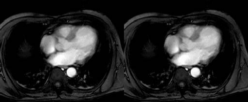

   Query result of single concatenation

The next example returns a 2x2 arrangement of images (\ :numref:`figure13`\ ): ::

    select concat (concat mr with mr along 0)
    with (concat mr with mr along 0)
    along 1
    from mr

.. _figure13:

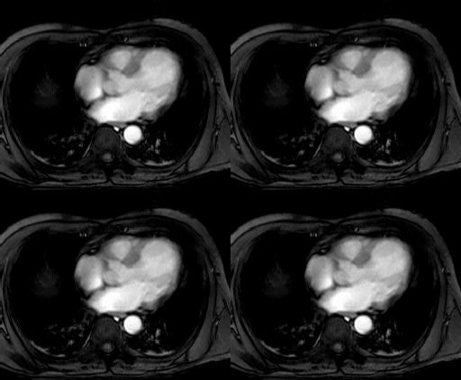

   Query result of multiple concatenation

.. _condensers:

Condensers
==========

Frequently summary information of some kind is required about some
array, such as sum or average of cell values. To accomplish this, rasql
provides the concept of condensers.

A condense operation (or short: condenser) takes an array and
summarizes its values using a summarization function, either to a
scalar value (e.g. computing the sum of all its cells), or to another
array (e.g. summarizing a 3-D cube into a 2-D image by adding all the
horizontal slices that the cube is composed of).

A number of condensers is provided as rasql built-in functions.

- For *numeric* arrays, ``add_cells()`` delivers the sum and ``avg_cells()`` the
  average of all cell values. Operators ``min_cells()`` and ``max_cells()``
  return the minimum and maximum, resp., of all cell values in the argument
  array. ``stddev_pop``, ``stddev_samp``, ``var_pop``, and ``var_samp`` allow to
  calculate the population and sample standard deviation, as well as the
  population and sample variance of the MDD cells.

- For *boolean* arrays, the condenser ``count_cells()`` counts the cells
  containing ``true``; ``some_cells()`` operation returns true if at
  least one cell of the boolean MDD is ``true``, ``all_cells()`` returns true if
  all of the MDD cells contain ``true`` as value.

Please keep in mind that, depending on their nature, operations take a
boolean, numeric, or arbitrary *mddExp* as argument.

**Syntax**

::

    count_cells( mddExp )
    add_cells( mddExp )
    avg_cells( mddExp )
    min_cells( mddExp )
    max_cells( mddExp )
    some_cells( mddExp )
    all_cells( mddExp )
    stddev_pop( mddExp )
    stddev_samp( mddExp )
    var_pop( mddExp )
    var_samp( mddExp )

**Examples**

The following example returns all images of collection ``mr`` where all
pixel values are greater than 20. Note that the induction "``>20``"
generates a boolean array which, then, can be collapsed into a single
boolean value by the condenser. ::

    select mr
    from mr
    where all_cells( mr > 20 )

The next example selects all images of collection ``mr`` with at least one
pixel value greater than 250 in region ``[ 120:160, 55:75]`` (\ :numref:`figure14`\ ). ::

    select mr
    from mr
    where some_cells( mr[120 : 160, 55 : 75] > 250 )

.. _figure14:

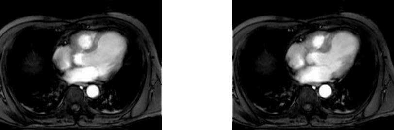

   Query result of specific selection

Finally, this query calculates the sample variance of ``mr2``:

    select var_samp( mr2 )
    from mr2

.. _sec-condenser:

General Array Condenser
=======================

All the condensers introduced above are special cases of a general
principle which is represented by the *general condenser* statement.

The general condense operation consolidates cell values of a
multidimensional array to a scalar value based on the condensing
operation indicated. It iterates over a spatial domain while combining
the result values of the *cellExp*\ s through the *condenserFunction*
indicated.

The general condense operation consolidates cell values of a
multidimensional array to a scalar value or an array, based on the
condensing operation indicated.

Condensers are heavily used in two situations:

-  To collapse boolean arrays into scalar boolean values so that they
   can be used in the **where** clause.

-  In conjunction with the **marray** constructor (see next section) to
   phrase high-level signal processing and statistical operations.

**Syntax**

::

    condense condenserOp
    over var in mintervalExp
    using cellExp

    condense condenserOp
    over var in mintervalExp
    where booleanExp
    using cellExp

The *mintervalExp* terms together span a multidimensional spatial
domain over which the condenser iterates. It visits each point in this
space exactly once, assigns the point's respective coordinates to the
*var* variables and evaluates *cellExp* for the current point. The
result values are combined using condensing function *condenserOp*.
Optionally, points used for the aggregate can be filtered through a
*booleanExp*; in this case, *cellExp* will be evaluated only for those
points where *booleanExp* is true, all others will not be regarded. Both
*booleanExp* and *cellExp* can contain occurrences of variables
*pointVar*.

**Examples**

This expression below returns a scalar representing the sum of all array
values, multiplied by 2 (effectively, this is equivalent to
add_cells(2*a)): ::

    condense +
    over x in sdom(a)
    using 2 * a[ x ]

The following expression returns a 2-D array where cell values of 3-D
array a are added up along the third axis: ::

    condense +
    over x in [0:100]
    using a[ *:*, *:*, x[0] ]

Note that the addition is induced as the result type of the value clause
is an array. This type of operation is frequent, for example, in
satellite image time series analysis where aggregation is performed
along the time axis.

**Shorthands**

Definition of the specialized condensers in terms of the general
condenser statement is as shown in :numref:`table3`.

.. _table3:

.. table:: Specialized condensers; a is a numeric, b a boolean array.

    +------------------------+-----------------------------------+
    | Aggregation definition | Meaning                           |
    +========================+===================================+
    |::                      |                                   |
    |                        |                                   |
    | add_cells(a) =         | sum over all cells in a           |
    | condense +             |                                   |
    | over x in sdom(a)      |                                   |
    | using a[x]             |                                   |
    +------------------------+-----------------------------------+
    |::                      |                                   |
    |                        |                                   |
    | avg_cells(a) =         | Average of all cells in a         |
    | sum_cells(a) /         |                                   |
    | card(sdom(a))          |                                   |
    +------------------------+-----------------------------------+
    |::                      |                                   |
    |                        |                                   |
    | min_cells(a) =         | Minimum of all cells in a         |
    | condense min           |                                   |
    | over x in sdom(a)      |                                   |
    | using a [x]            |                                   |
    +------------------------+-----------------------------------+
    |::                      |                                   |
    |                        |                                   |
    | max_cells(a) =         | Maximum of all cells in a         |
    | condense max           |                                   |
    | over x in sdom(a)      |                                   |
    | using a[x]             |                                   |
    +------------------------+-----------------------------------+
    |::                      |                                   |
    |                        |                                   |
    | count_cells(b) =       | Number of cells in b which are    |
    | condense +             | non-zero / not *false*            |
    | over x in sdom(b)      |                                   |
    | where b[x] != 0        |                                   |
    | using 1                |                                   |
    +------------------------+-----------------------------------+
    |::                      |                                   |
    |                        |                                   |
    | some_cells(b) =        | is there any cell in b            |
    | condense or            | with value *true*?                |
    | over x in sdom(b)      |                                   |
    | using b[x]             |                                   |
    +------------------------+-----------------------------------+
    |::                      |                                   |
    |                        |                                   |
    | all_cells(b) =         | do all cells of b                 |
    | condense and           | have value *true*?                |
    | over x in sdom(b)      |                                   |
    | using b[x]             |                                   |
    +------------------------+-----------------------------------+

**Restriction**

Currently condensers over complex numbers are generally not supported, with
exception of ``add_cells``, ``max_cells``, and ``min_cells``.

.. _sec-marray:

General Array Constructor
=========================

The **marray** constructor allows to create n-dimensional arrays with
their content defined by a general expression. This is useful

-  whenever the array is too large to be described as a constant (see
   :ref:`sec-arrayconstant`) or

-  when the array's cell values are derived from some other source,
   e.g., for a histogram computation (see examples below).

**Syntax**

The basic shape of the ``marray`` construct is as follows. ::

    marray var in mintervalExp [, var in mintervalExp]
    values cellExp

Iterator Variable Declaration

First, the constructor allocates an array in the server with the spatial
domain defined by the cross product of all *mintervalExp*. For example,
the following defines a 2-D 5x10 matrix: ::

    marray x in [1:5], y in [1:10]
    values ...

The base type of the array is determined by the type of *cellExp.*
Variable *var* can be of any number of dimensions.

**Iteration Expression**

In the second step, the constructor iterates over the spatial domain
defined as described, successively evaluating *cellExp* for each
variable combination; the result value is assigned to the cell with the
coordinate currently under evaluation. To this end, *cellExp* can
contain arbitrary occurrences of *var*. The *cellExp* must evaluate to a
scalar (i.e., a single or composite value, as opposed to an array). The
syntax for using a variable is:

-  for a one-dimensional variable: ::

        var

-  for a higher-dimensional variable: ::

        var [ index-expr ]

where *index-expr* is a constant expression (no sdom() etc.!) evaluating
to a non-negative integer; this number indicates the variable dimension
to be used.

.. _figure15:

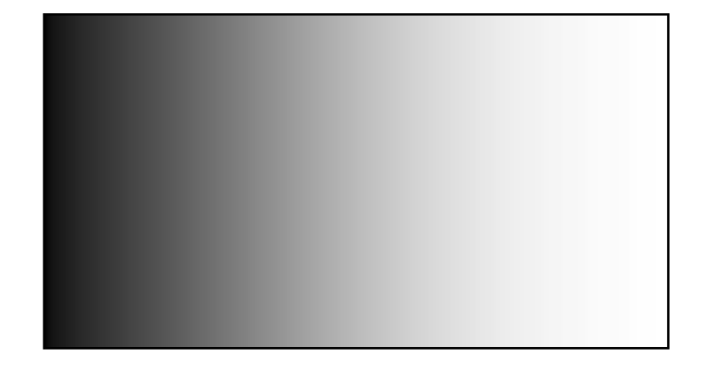

   2-D array with values derived from first coordinate

**Examples**

The following creates an array with spatial domain [1:100,-50:200] over
cell type char, each cell being initialized to 1. ::

    marray x in [ 1:100, -50:200 ]
    values 1c

In the next expression, cell values are dependent on the first
coordinate component (cf. :numref:`figure15`\ )::

    marray x in [ 0:255, 0:100 ]
    values x[0]

The final two examples comprise a typical marray/condenser combination.
The first one takes a sales table and consolidates it from days to week
per product. Table structure is as given in :numref:`figure16`\ .::

    select marray tab in [ 0:sdom(s)[0].hi/7, sdom(s)[1] ]
    over day in [ 0:6 ]
    values condense +
    using s[ day[0] + tab7 ] , tab[1] ]
    from salestable as s

The last example computes histograms for the mr images. The query
creates a 1-D array ranging from 0 to 9 where each cell contains the
number of pixels in the image having the respective intensity value. ::

    select marray v in [ 0 : 9 ]
    values condense +
    over x in sdom(mr)
    where mr[x] = v[0]
    using 1
    from mr

.. _figure16:

   Sales table consolidation

**Shorthand**

As a shorthand, variable *var* can be used without indexing; this is
equivalent to *var*\ [0]: ::

    marray x in [1:5]
    values a[ x ]       -- equivalent to a[ x[0] ]

**Many vs. One Variable**

Obviously an expression containing several 1-D variables, such as: ::

    marray x in [1:5], y in [1:10]
    values a[ x[0], y[0] ]

can always be rewritten to an equivalent expression using one
higher-dimensional variable, for example: ::

    marray xy in [1:5, 1:10]
    values a[ xy[0], xy[1] ]

*Iteration Sequence Undefined*

The sequence in which the array cells defined by an marray construct are
inspected is not defined. In fact, server optimisation will heavily make
use of reordering traversal sequence to achieve best performance.

**Restriction**

Currently there is a restriction in variable lists: for each marray
variable declaration, either there is only one variable which can be
multidimensional, or there is a list of one-dimensional variables; a
mixture of

case that a list of variables is defined. In this case, a variable
definition can only consist of constant expressions, it is not possible,
e.g., to use sdom().

**A Note on Expressiveness and Performance**

The general condenser and the array constructor together allow
expressing a very broad range of signal processing and statistical
operat­ions. In fact, all other rasql array operations can be expressed
through them, as :numref:`table4` exemplifies. Nevertheless, it is advisable to
use the specialized operations whenever possible; not only are they more
handy and easier to read, but also internally their processing has been
optimized so that they execute considerably faster than the general
phrasing.

.. _table4:

.. table:: Phrasing of Induction, Trimming, and Section via marray

    +---------------+-------------------+-----------------------------------+
    | **operation** | **shorthand**     | **phrasing with marray**          |
    +===============+===================+===================================+
    |               |::                 |::                                 |
    |               |                   |                                   |
    | Trimming      | a[ *:*, 50:100 ]  | marray x in [sdom(a)[0], 50:100]  |
    |               |                   | values a[ x ]                     |
    +---------------+-------------------+-----------------------------------+
    |               |::                 |::                                 |
    |               |                   |                                   |
    | Section       | a[ 50, *:* ]      | marray x in sdom(a)[1]            |
    |               |                   | values a[ 50, x ]                 |
    +---------------+-------------------+-----------------------------------+
    |               |::                 |::                                 |
    |               |                   |                                   |
    | Induction     | a + b             | marray x in sdom(a)               |
    |               |                   | values a[x] + b[x]                |
    +---------------+-------------------+-----------------------------------+

.. _format-conversion:

**********************
Data Format Conversion
**********************

Without further indication, arrays are accepted and delivered in the
client's main memory format, regardless of the client and server
architecture. Sometimes, however, it is desirable to use some data
exchange format - be it because some device provides a data stream to be
inserted in to the database in a particular format, or be it a Web
application where particular output formats have to be used to conform
with the respective standards.

To this end, rasql provides two families of operations:

-  ``encode()`` for encoding an MDD in a particular data format
   repre­sent­at­ion; formally, the result will be a 1D byte array.

-  ``decode()`` for decoding a byte stream (such as a query input parameter
   during ``insert`` - see examples below) into an actionable MDD.

Implementation of these functions is based on GDAL and, hence, supports
all GDAL formats. Some formats are implemented in addition, see the
description below.

Encode / Decode Operations
==========================

**Syntax**

::

    encode( mddExp , formatidentifier )
    encode( mddExp , formatidentifier , formatParams )

    decode( mddExp )
    decode( mddExp , formatidentifier, formatParams )

The ``encode()`` functions accept a format identifier in its second parameter
whose values are GDAL format identifiers. The ``decode()`` function
automatically detects the format used, so there is no format parameter. It
accepts a format when a custom internal implementation should be selected
instead of using GDAL, e.g. netCDF, GRIB, or CSV / JSON.

**Examples**

The following query loads a TIFF image into collection ``rgb``: ::

    insert into rgb
    values decode( $1 )

This query extracts PNG images (one for each tuple) from collection ``rgb``: ::

    select encode( rgb, "png" )
    from rgb

**Input/Output Types**

The result of any encoding function is a 1D MDD of type ``char`` holding the
MDD encoded in the target format.

The input to any decoding function is such a 1D MDD, conversely.

**Type Matching**

For encoding an MDD into a data format (and vice versa), the MDD type
must match the dimension and data type the image format can handle - it
is mandatory that the array to be transformed or generated conforms to
the overall structure supported by the particular data exchange format.
For example, TIFF can only handle 2-D arrays with a particular subset of
supported cell types.

The cell type of an MDD input stream may need to be provided explicitly
through a cast operator, otherwise the query could be aborted with an
error on cell type mismatch. The following query correctly inserts a
TIFF image with floating-point values into collection ``Bathymetry``: ::

    insert into Bathymetry
    values (double) decode( $1 )

The reason for this requirement is that, at the time the query is
analyzed, the input parameters are not yet decoded, this takes place at
a later stage. Hence, the server has no knowledge about the data type,
and this prevents it from understanding the query correctly.

Formats Supported
=================

The **decode()** and **encode()** functions utilize the open-source GDAL
library for transcoding. A list of the GDAL supported formats can be
obtained through gdalinfo or from
`www.gdal.org/formats_list.html <http://www.gdal.org/formats_list.html>`__:

.. code-block:: shell

    $ gdalinfo -formats
    Supported Formats:
      VRT (rw+v): Virtual Raster
      GTiff (rw+v): GeoTIFF
      NITF (rw+v): National Imagery Transmission Format
      RPFTOC (ro): Raster Product Format TOC format
      ...

Additionally, the following formats beyond GDAL are supported by
rasdaman (more details in :ref:`multidimensional-format-support`:

-  CSV (comma-separated values), format name: "csv"
-  JSON, format name: "json" (same as CSV, but uses ``[`` and ``]`` as dimension separators)
-  NetCDF4 (n-D), format name "netcdf"
-  HDF4 (n-D), format name "hdf"
-  GRIB (n-D), format name "grib" (decode only)
-  TIFF, JPEG, PNG, BMP (2-D)

Conversion Options
==================

The ``encode()`` / ``decode()`` functions can be provided with a format specific
parameter JSON string, *formatParams*, for fine-tuning the conversion. Certain
parameters are common to all formats:

1. **variable subset**: variable names, band ids;
2. **internal structure**: lat/lon, x/y/t, message domains in GRIB;
3. **x/y transpose**: indicate if x/y should be transposed or is it not relevant
   (comes up in netCDF and GRIB and has a performance penalty at both decode and encode)
4. **filepath**: absolute path to an input file, this improves ingestion performance
   if the data is on the same machine as the rasdaman server, as the network
   transport is bypassed
5. **subset domain**: only the given subset needs to be extracted from the input
   file; *note* that the subset domain must match in dimensionality with the file
   dimensionality, and must be accordingly offset to the grid origin in the file,
   which is typically 0,0,0,..

**Quote escaping**: when used in a query the format parameters are the third
argument of the ``decode``/``encode`` functions. They need to be in quotes, i.e.
``"formatParameters"``. Because of these outer quotes, all quotes inside of the
``formatParameters`` need to be escaped (``\"``). For example, 
``"{\"transpose\": [0,1] }"`` is the right way to specify transposition, while 
``"{"transpose": [0,1] }"`` will lead to failure.

**Single line**: the format parameters JSON string must be a single line when
specified on the command-line.

decode
------

.. code-block:: json

    {
      // Specify variable names, band ids (0-based), etc.
      "variables": [ "var1", "var2", ... ],

      // Absolute path to input file(s). This improves ingestion performance if the data
      // is on the same machine as the rasdaman server, as the network transport is bypassed;
      // It is possible that a format could have multiple files associated to each other,
      // so this argument is an array of filepaths.
      // Note: supported for netCDF, GRIB, and GDAL formats.
      "filePaths": [ "/path/to/file.tif", ... ],

      // Only the given subset needs to be extracted from the input file.
      "subsetDomain": "[0:100,0:100]",

      // Indicate if x/y should be transposed or is it not relevant (comes up in netCDF and
      // GRIB and has a performance penalty, so avoid if possible);
      // The argument is an array of 0-based axis ids indicating the axes that need to be
      // transposed, e.g. the first axis is 0, second is 1, etc; must be contiguous, [N,N+1]
      "transpose": [ 0, 1 ],

      // Describe the internal structure of a format if necessary, e.g. message domains in GRIB
      "internalStructure": {
        "messageDomains": [
          { "msgId": 1, "domain": "[0:0,0:0,0:719,0:360]" },
          { "msgId": 2, "domain": "[0:0,1:1,0:719,0:360]" },
          { "msgId": 3, "domain": "[0:0,2:2,0:719,0:360]" },
          ...
        ]
      },

      // Extra format parameters
      "formatParameters": {
        "key": "value",
        // CSV/JSON specific (example values)
        "basetype": "struct { float f, long l }",
        "domain": "[0:100,0:100]"
      },

      // Configuration options (string key/value pairs);
      // details for GDAL: https://trac.osgeo.org/gdal/wiki/ConfigOptions
      "configOptions": {
        "GDAL_CACHEMAX": "64",
        ...
      }
    }

encode
------

.. code-block:: json

    {
      // netCDF-specific
      "dimensions": [ "dimName1", "dimName2", ... ],

      // Specify variable names, band ids (0-based), etc; the variables can be objects listing
      // details like type, metadata and data for netCDF, or simply an array of variable names
      "variables": {
        "var1": {..},
        "var2": {..},
        ...
      },

      // single string, or multiple key/value pairs
      "metadata": {
        "standard_name": "sea_surface_temperature",
        "long_name": "Sea Surface Temperature",
        "units": "K"
      },

      // Indicate if x/y should be transposed or is it not relevant (comes up in netCDF and GRIB
      // and has a performance penalty, so avoid if possible);
      // The argument is an array of 0-based axis ids indicating the axes that need to be
      // transposed, e.g. the first axis is 0, second is 1, etc; must be contiguous, [N,N+1]
      "transpose": [0,1],

      // geo-referencing information, can be either given as a geo bounding box or an
      // array of GCPs (but not both); see 'Affine GeoTransform' and 'GCPs' sections
      // at http://www.gdal.org/gdal_datamodel.html
      "geoReference": {
        "crs": "EPSG:4326",

        // a geo bounding box
        "bbox": {
          "xmin": -15,
          "ymin": 0.5,
          "xmax": 10.2,
          "ymax": 25
        },

        // or an array of GCPs
        "GCPs": [
          {
            "id": ..,     // optional unique identifier (gets the array index by default)
            "info": ..,   // optional text associated with the GCP

            // these must have double value
            "pixel": .., "line": ..,     // GCP location on the raster
            "x": ..,  "y": ..,  "z": ..  // georeferenced location, with "z" being optional
                                         // (zero by default)
          }
          ...
        ]
      },

      // single value or an array of values if different for multiple bands
      // ( if nodata= 1 single value, it will be applied to all bands, and if nodata =
      // array of values then each value is applied to each band separately ).
      // 
      // special floating-point constants supported (case-sensitive):
      // NaN, NaNf, Infinity, -Infinity
      "nodata": 0,

      // for more details see "Color Table" at http://www.gdal.org/gdal_datamodel.html
      "colorPalette": {
        "paletteInterp": "RGB"       // optional palette interpretation, one of
                                     // "Gray", "RGB", "CMYK", "HSL" (default: "RGB")
        // An optional array of band color interpretations, one of:
        // Undefined Gray Palette Red Green Blue Alpha Hue Saturation Lightness Cyan
        // Magenta Yellow Black YCbCr_Y YCbCr_Cb YCbCr_Cr YCbCr_Cr
        "colorInterp": [ "Red", "Green", "Blue" ]
        "colorTable": [              // optional color table, an array of arrays with 1, 3 or
                                     // 4 short values (depending on the colorInterpretation)
          [255, 0, 0, 0],            // for each color entry; pixels with value 0 are colored red
          ...
        ]
      },

      // Format dependent extra parameters, e.g. gdal specific format parameters
      "formatParameters": {
        "INTERLEAVE": "BAND",
        "COMPRESSION": "LZW",
        // CSV/JSON specific
        "order": "inner_outer",
        ...
      },

      // Configuration options (string key/value pairs);
      // details for GDAL: https://trac.osgeo.org/gdal/wiki/ConfigOptions
      "configOptions": {
        "GDAL_CACHEMAX": "64",
        ...
      }
    }

GDAL Format Parameters
^^^^^^^^^^^^^^^^^^^^^^

The key/values under ``"formatParameters"`` are passed onto GDAL as given. Each
format supports specific parameters as documented on the `GDAL formats page
<https://www.gdal.org/formats_list.html>`.

Rasdaman itself does not change the default values for these parameters, with
the following *exceptions*:

- ``PNG`` - the compression level when encoding to PNG (option ``ZLEVEL``) will
  be set to ``2`` if the user does not specify it explicitly and the result
  array is not of type ``boolean``. The default compression level of ``6`` does
  not offer considerable space savings on typical image results (e.g. around
  10\% lower file size for satellite image), while significantly increasing the
  time to encode, taking up to 3-5x longer.

Examples
--------

1. Using filePaths in JSON format (``<[0:0] 1c>`` is a dummy array value which is mandatory): ::

    UPDATE test_mr SET test_mr[0:255,0:210] ASSIGN decode(<[0:0] 1c>, "GDAL",
        "{\"filePaths\":[\"/home/rasdaman/mr_1.png\"]}") WHERE oid(test_mr) = 6145

2. Transpose the last two axes of the output before encoding to PNG: ::

    select encode(c, "png", "{ \"transpose\": [0,1] }") from mr2 as c

3. Add some global attribute as metadata in netcdf: ::

    select encode(c, "netcdf", "{ \"transpose\": [1,0], \"nodata\": [100, 200, 260],
        \"metadata\": { \"new_metadata\": \"This is a new added metadata\" },
        \"formatParameters\": {\"INTERLEAVE\": \"BAND\"},
        \"configOptions\": { \"GDAL_CACHEMAX\": \"64\"} }")
    from test_mean_summer_airtemp as c

(Deprecated) Key-Value Conversion Options
-----------------------------------------

The optional string parameter allows passing format-specific options, as
well as generic parameters, like a geo-referencing bounding box and CRS.
All parameter settings are concatenated into one quoted string of the
following format:

.. code-block:: text

    "key1=value1;key2=value2;..."

Both key and value are case-sensitive.

In addition to format specific parameters, most formats recognize the
following parameters:

-  ``xmin``, ``ymin``, ``xmax``, ``ymax`` for specifying the bounding box;

-  a general ``metadata`` string to be placed into the output file (if the
   format supports this);

-  ``nodata`` allows a list of null values for each band. If only one value
   is provided it applies to all bands simultaneously; alternatively, a
   comma-separated list of null values can be provided individually per
   band. For example, the following will set blue to transparent:

    .. code-block:: text

        "nodata=0,0,255;"

-  ``crs`` for indicating the Coordinate Reference System (CRS) in which the
   above coordinates are expressed. Any of these CRS representations is
   accepted:

-  Well Known Text (as per GDAL)

-  "EPSG:n"

-  "EPSGA:n"

-  "AUTO:proj_id,unit_id,lon0,lat0" indicating OGC WMS auto projections

-  "``urn:ogc:def:crs:EPSG::n``" indicating OGC URNs (deprecated by OGC)

-  PROJ.4 definitions

-  well known names, such as NAD27, NAD83, WGS84 or WGS72.

-  WKT in ESRI format, prefixed with "ESRI::"

-  "IGNF:xxx" and "+init=IGNF:xxx", etc.

Since recently (v1.10), GDAL also supports OGC CRS URLs, OGC's preferred
way of identifying CRSs.

.. _multidimensional-format-support:

Natively Supported Formats
==========================

Here we cover the formats with native support for encoding/decoding
in rasdaman.

TIFF, PNG, JPEG, BMP
--------------------

If ``-DUSE_TIFF=ON``, ``-DUSE_JPEG=ON``, or ``-DUSE_PNG=ON``
are specified during configuration with cmake, then the following internal
convertors (not based on GDAL) are available, respectively:

- ``tiff( mddExpr )``/``tiff( mddExpr, formatParams )`` and ``inv_tiff( mddExp )``
- ``jpeg( mddExpr )``/``jpeg( mddExpr, formatParams )`` and ``inv_jpeg( mddExp )``
- ``png( mddExpr )``/``png( mddExpr, formatParams )`` and ``inv_png( mddExp )``
- ``bmp( mddExpr )``/``bmp( mddExpr, formatParams )`` and ``inv_bmp( mddExp )``

The first version corresponds to ``encode``, while the second version 
corresponds to ``decode``. Usually there is no reason to use these functions,
beyond deployment on constrained environments where GDAL presents a heavy
dependency and only a few specific convertors are sufficient. Therefore,
``encode`` and ``decode`` are recommended whenever GDAL support is compiled.

NetCDF
------

TODO

GRIB
----

decode()
^^^^^^^^

TODO

encode()
^^^^^^^^

Not supported.

CSV/JSON
--------

The CSV format is an ASCII character string where the cell values are
represented by numbers linearized in row-major order. Row and column delimiters
may be used, ``{`` and ``}`` for CSV, ``[`` and ``]`` for JSON. The delimiters
are optional when decoding data in this format.

decode()
^^^^^^^^

Numbers from the input file are read in order of appearance and stored
without any reordering in rasdaman; whitespace plus the following
characters are ignored:

.. code-block:: text

    '{', '}', ',', '"', '\'', '(', ')', '[', ']'

**Mandatory extra parameters:**

``domain``
    Domain ``d`` has to match number of cells read from input file. E.g.
    for ``\"domain\": \"[1:5, 0:10, 2:3]\"``, there should be 110 numbers in the
    input file.

``basetype``
    Atomic or struct base type; named structs like ``RGBPixel`` are not
    supported. Examples: ::

        long
        char
        struct { char red, char blue, char green }

**Examples**

Assume array ``A`` is a 2x3 array of longs given as a string as follows: ::

    1,2,3,2,1,3

Inserting ``A`` into rasdaman can be done with ::

    insert into A
    values decode($1, "csv", "{ \"formatParameters\":
                                { \"domain\": \"[0:1,0:2]\",
                                  \"basetype\": \"long\" } }")

Further, let ``B`` be an 1x2 array of RGB values given as follows: ::

    {1,2,3},{2,1,3}

Inserting ``B`` into rasdaman can be done by passing it to this query: ::

    insert into B
    values decode( $1, "csv", "{ \"formatParameters\":
                                { \"domain\": \"[0:0,0:1]\",
                                  \"basetype\": \"struct{char red,
                                                         char blue,
                                                         char green}\" } }")

``B`` could just as well be formatted like this with the same effect (note
the line break): ::

    1 2 3
    2 1 3

encode()
^^^^^^^^

Data encoded with CSV is a comma-separated list of values, such that each
row of values (for every dimension, not just the last one) is between
``{`` and ``}`` braces (``[`` and ``]`` for JSON). Composite cells are output
as space separated values in quotes.

The array serialization order can be specified with an optional format
parameter ``order``, which can be ``outer_inner`` (default, last dimension
iterates fastest), or vice-versa, ``inner_outer``.

**Examples**

Suppose we have array ``A = <[0:1,0:1] 0, 1; 2, 3>``. Encoding to CSV by default ::

    select encode(A, "csv") from A

will result in the following output: ::

    {{0, 1}, {2, 3}}

while encoding to JSON with::

    select encode(A, "json") from A

will result in the following output: ::

    [[0, 1], [2, 3]]

Specifying ``inner_outer`` order with ::

    select encode(A, "csv", "{ \"formatParameters\":
                               { \"order\": \"inner_outer\" } }") from A

will result in the following output (left-most dimensions iterate fastest): ::

    {{0, 2}, {1, 3}}

Let ``B`` be an RGB array ``<[0:0,0:1] {0c, 1c, 2c}, {3c, 4c, 5c}>``. Encoding it
to CSV with default order will result in the following output:

    {"0 1 2","3 4 5"}

.. _ql-guide-oids:

******************
Object identifiers
******************

Function ``oid()`` gives access to an array's object identifier (OID). It
returns the local OID of the database array. The input parameter must be
a variable associated with a collection, it cannot be an array
expression. The reason is that ``oid()`` can be applied to only to
persistent arrays which are stored in the database; it cannot be applied
to query result arrays - these are not stored in the database, hence do
not have an OID.

**Syntax**

::

    oid( variable )

**Example**

The following example retrieves the MDD object with local OID 10 of set
``mr``: ::

    select mr
    from mr
    where oid( mr ) = 10

The following example is incorrect as it tries to get an OID from a
non-persistent result array: ::

    select oid( mr * 2 ) -- illegal example: no expressions
    from mr

Fully specified external OIDs are inserted as strings surrounded by
brackets: ::

    select mr
    from mr
    where oid( mr ) = < localhost | RASBASE | 10 >

In that case, the specified system (system name where the database
server runs) and database must match the one used at query execution
time, otherwise query execution will result in an error.

Expressions
===========

**Parentheses**

All operators, constructors, and functions can be nested arbitrarily,
provided that each sub-expression's result type matches the required
type at the position where the sub-expression occurs. This holds without
limitation for all arithmetic, Boolean, and array-valued expressions.
Parentheses can (and should) be used freely if a particular desired
evaluation precedence is needed which does not follow the normal
left-to-right precedence.

**Example**

::

    select (rgb.red + rgb.green + rgb.blue) / 3c
    from rgb

**Operator Precedence Rules**

Sometimes the evaluation sequence of expressions is ambiguous, and the
different evaluation alternatives have differing results. To resolve
this, a set of precedence rules is defined. You will find out that
when­ever operators have their counterpart in programming languages, the
rasdaman precedence rules follow the same rules as are usual there.

Here the list of operators in descending strength of binding:

-  dot ".", trimming, section
-  unary ``-``
-  ``sqrt``, ``sin``, ``cos``, and other unary arithmetic functions
-  ``*``, ``/``
-  ``+``, ``-``
-  ``<``, ``<=``, ``>``, ``>=``, ``!=``, ``=``
-  ``and``
-  ``or``, ``xor``
-  ":" (interval constructor), ``condense``, ``marray``
-  ``overlay``, ``concat``
-  In all remaining cases evaluation is done left to right.

.. _sec-nullvalues:

***********
Null Values
***********

"Null is a special marker used in Structured Query Language (SQL) to
indicate that a data value does not exist in the database. NULL is also
an SQL reserved keyword used to identify the Null special marker."
(`Wikipedia <http://en.wikipedia.org/wiki/Null_%28SQL%29>`__) In fact,
null introduces a three-valued logic where the result of a Boolean
operation can be null itself; likewise, all other operations have to
respect null appropriately. Said Wikipedia article also discusses issues
the SQL language has with this three-valued logic.

For sensor data, a Boolean null indicator is not enough as null values
can mean many different things, such as "no value given", "value cannot
be trusted", or "value not known". Therefore, rasdaman refines the SQL
notion of null:

-  Any value of the data type range can be chosen to act as a null
   value;

-  a set of cell values can be declared to act as null (in contrast to
   SQL where only one null per attribute type is foreseen).

**Caveat**

Note that defining values as nulls reduces the value range available for
known values. Additionally, computations can yield values inadvertently
(null values themselves are not changed during operations, so there is
no danger from this side). For example, if 5 is defined to mean null
then addition of two non-null values, such as 2+3, yields a null.

Every bit pattern in the range of a numeric type can appear in the
database, so no bit pattern is left to represent "null". If such a thing
is desired, then the database designer must provide, e.g., a separate
bit map indicating the status for each cell.

To have a clear semantics, the following rule holds:

**Uninitialized value handling**

A cell value not yet addressed, but within the current domain of an MDD
has a value of zero by definition; this extends in the obvious manner to
composite cells.

*Remark*

Note the limitation to the *current* domain of an MDD. While in the case
of an MDD with fixed boundaries this does not matter because always
*definition domain = current domain*, an MDD with variable boundaries
can grow and hence will have a varying current domain. Only cells inside
the current domain can be addressed, be they uninitialized/null or not;
addressing a cell outside the current domain will result in the
corresponding exception.

**Masks as alternatives to null**

For example, during piecewise import of satellite images into a large
map, there will be areas which are not written yet. Actually, also after
completely creating the map of, say, a country there will be untouched
areas, as normally no country has a rectangular shape with axis-parallel
boundaries. The outside cells will be initialized to 0 which may or may
not be defined as null. Another option is to define a Boolean mask array
of same size as the original array where each mask value contains *true*
for "cell valid" and *false* for "cell invalid. It depends on the
concrete application which approach benefits best.

Nulls in Type Definition
========================

Null values in rasdaman are associated with set types. This entails that
all objects in one collection share the same null value set.

The rasdl grammar is extended with an optional **null values** clause: ::

    typedef set < marrayName > [ null values spatialDomain ]
    setName;

The set of null values syntactically is expressed as a *spatialDomain*
element holding any number of values or intervals.

Additionally, rasql type definition allows null value definition, see
:ref:`sec-typedefrasdl`.

**Limitation**

Currently, only atomic null values can be indicated. They apply to all
components of a composite cell simultaneously. In future it may become
possible to indicate null values individually per struct component.

**Example**

The following definition establishes a null value set holding all values between
0 and 2, equal to 100, and between 250 and 255 (intervals are inclusive): ::

    typedef set <GreyImage> null values [0:2,100,250:255]
    GreySetWithNulls;

For floating-point data it is recommended to always specify small intervals
instead of single numbers like 100.

**Example**

Set NaN values, as well as any values in the interval [-2.1e+10:-2.0e+10], as
null values in the ``DoubleSetWithNulls`` set type:

    typedef set <DoubleImage> null values [nan, -2.1e+10:-2.0e+10]
    DoubleSetWithNulls;

Nulls in MDD-Valued Expressions
===============================

**Dynamically Set/Replace the Null Set**

The null set of an MDD value resulting from a sub-expression can be dynamically
changed on-the-fly with a postfix ``null values`` operator as follows: ::

    mddExp null values nullSet

As a result *mddExp* will have the null values specified by *nullSet*; if
*mddExp* already had a null set, it will be replaced.

**Null Set Propagation**

The null value set of an MDD is part of its type definition and, as
such, is carried along over the MDD's lifetime. Likewise, MDDs which are
generated as intermediate results during query processing have a null
value set attached. Rules for constructing the output MDD null set are
as follows:

-  The null value set of an MDD generated through an ``marray`` operation is
   empty [13]_.

-  The null value set of an operation with one input MDD object is
   identical to the null set of this input MDD.

-  The null value set of an operation with two input MDD objects is the
   union of the null sets of the input MDDs.

-  The null value set of an MDD expression with a postfix ``null values``
   operator is equal to the null set specified by it.

**Null Values in Operations**

Subsetting (trim and slice operations, as well as ``struct`` selection,
etc.) perform just as without nulls and deliver the original cell
values, be they null (relative to the MDD object on hand) or not. The
null value set of the output MDD is the same as the null value set of
the input MDD.

In MDD-generating operations with only one input MDD (such as marray and
unary induced operations), if the operand of a cell operation is null
then the result of this cell operation is null.

Generally, if somewhere in the input to an individual cell value
com­put­at­ion a null value is encountered then the overall result will
be null - in other words: *if at least one of the operands of a cell
operation is null then the overall result of this cell operation is
null*.

*Exceptions:*

-  Comparison operators (that is: ``==``, ``!=``, ``>``, ``>=``, ``<``, ``<=``)
   encountering a null value will *always* return a Boolean value; for example,
   both ``n == n`` and ``n != n`` (for any null value ``n``) will evaluate to
   ``false``.

-  In a cast operation, nulls are treated like regular values.

-  In a ``scale()`` operation, null values are treated like regular
   values [14]_.

-  Format conversion of an MDD object ignores null values. Conversion
   from some data format into an MDD likewise imports the actual cell
   values; however, during any eventual further processing of the target
   MDD as part of an **update** or **insert** statement, cell values
   listed in the null value set of the pertaining MDD definition will be
   interpreted as null and will not overwrite persistent non-null values.

**Choice of Null Value**

If an operation computes a null value for some cell, then the null value
effectively assigned is determined from the MDD's type definition.

If the overall MDD whose cell is to be set has exactly one null value,
then this value is taken. If there is more than one null value available
in the object's definition, then one of those null values is picked
non-deterministically. If the null set of the MDD is empty then no value
in the MDD is considered a null value.

**Example**

Assume an MDD ``a`` holding values ``<0, 1, 2, 3, 4, 5>`` and a null value set
of ``{2, 3}``. Then, ``a*2`` might return ``<0, 2, 2, 2, 8, 10>``. However,
``<0, 2, 3, 3, 8, 10>`` and ``<0, 2, 3, 2, 8, 10>`` also are valid results, as
the null value gets picked non-deterministically.

Nulls in Aggregation Queries
============================

In a condense operation, cells containing nulls do not contribute to the
overall result (in plain words, nulls are ignored).

The scalar value resulting from an aggregation query does not any longer
carry a null value set like MDDs do; hence, during further processing it
is treated as an ordinary value, irrespective of whether it has
represented a null value in the MDD acting as input to the aggregation
operation.

Limitations
===========

All cell components of an MDD share the same same set of nulls, it is
currently not possible to assign individual nulls to cell type
components.

NaN Values
==========

NaN ("not a number") is the representation of a numeric value representing an
undefined or unrepresentable value, especially in floating-point calculations.
Systematic use of NaNs was introduced by the IEEE 754 floating-point standard
(`Wikipedia <http://en.wikipedia.org/wiki/NaN>`__).

In rasql, ``nan`` (double) and ``nanf`` (float) are symbolic floating point
constants that can be used in any place where a floating point value is allowed.
Arithmetic operations involving ``nan``\ s always result in ``nan``. Equality
and inequality involving nans work as expected, all other comparison operators
return false.

If the encoding format used supports NaN then rasdaman will encode/decode NaN
values properly.

**Example**

::

    select count_cells( c != nan ) from c

*************
Miscellaneous
*************

rasdaman version
================

Builtin function version() returns a string containing information about
the rasdaman version of the server, and the gcc version used for
compiling it. The following query ::

    select version()

will generate a 1-D array of cell type char containing contents similar
to the following:

.. code-block:: text

    rasdaman 9.6.0 on x86_64-linux-gnu, compiled by g++
    (Ubuntu 5.4.1-2ubuntu1~16.04) 5.4.1 20160904

.. warning::
    The message syntax is not standardized in any way and may
    change in any rasdaman version without notice.

Retrieving Object Metadata
==========================

Sometimes it is desirable to retrieve metadata about a particular array.
To this end, the ``dbinfo()`` function is provided. It returns a 1-D char
array containing a JSON encoding of key array metadata:

-  Object identifier;
-  Base type, in rasdl notation;
-  Total size of the array;
-  Number of tiles and further tiling information: tiling scheme, tile
   size (if specified), and tile configuration;
-  Index information: index type, and further details depending on the
   index type.

The output format is described below by way of an example.

**Syntax**

::

    dbinfo( mddExp )

**Example**

.. code-block:: shell

    $ rasql -q 'select dbinfo(c) from mr2 as c' --out string
    {
      "oid": "150529",
      "baseType": "marray <char>",
      "tileNo": "1",
      "totalSize": "54016B",
      "tiling": {
        "tilingScheme": "no_tiling",
        "tileSize": "2097152",
        "tileConfiguration": "[0:511,0:511]"
      },
      "index": {
        "type": "rpt_index",
        "indexSize": "0",
        "PCTmax": "4096B",
        "PCTmin": "2048B"
      }
    }

.. note::
    This function can only be invoked on persistent MDD objects, not on
    derived (transient) MDDs.

.. warning::
    This function is in beta. While output syntax is likely to remain
    largely unchanged, invocation syntax is expected to change to something
    like

    ::

        describe array oidExp

.. _sec-errors:

************************************************
Arithmetic Errors and Other Exception Situations
************************************************

During query execution, a number of situations can arise which prohibit
to deliver the desired query result or database update effect. If the
server detects such a situation, query execution is aborted, and an
error exception is thrown. In this Section, we classify the errors that
occur and describe each class.

However, we do not go into the details of handling such an exception -
this is the task of the application program, so we refer to the resp.
API Guides.

Overflow
========

**Candidates**

Overflow conditions can occur with ``add_cells`` and induced operations such
as +.

**System Reaction**

The overflow will be silently ignored, producing a result represented by
the bit pattern pruned to the available size. This is in coherence with
overflow handling in programming languages.

**Remedy**

Query coding should avoid potential overflow situations by applying
numerical knowledge - simply said, the same care should be applied as
always when dealing with numerics.

**Example**

Obtaining an 8-bit grey image from a 3*8-bit colour image through ::

    ( a.red + a.green + a.blue ) / 3c

most likely will result in an overflow situation after the additions,
and scaling back by the division cannot remedy that. Better is to scale
before adding up: ::

    a.red / 3c + a.green / 3c + a.blue / 3c

However, this may result in accuracy loss in the last bits. So the final
suggestion is to use a larger data type for the interim computation and
push back the result into an 8-bit integer: ::

    (char) ( (float)a.red+(float)a.green+(float)a.blue) / 3 )

Another option is to capture and replace overflow situations: ::

    case
    when a.red+a.green+a.blue > 255 then 255
    else a.red+a.green+a.blue
    end

Obviously, this will be paid with some performance penalty due to the
more expensive float arithmetics. It is up to the application developer
to weight and decide.

Illegal operands
================

**Candidates**

Division by zero, non-positive argument to logarithm, negative arguments
to the square root operator, etc. are the well-known candidates for
arithmetic exceptions.

The `IEEE
754 <http://ieeexplore.ieee.org/xpl/mostRecentIssue.jsp?punumber=4610933>`__
standard lists, for each operation, all invalid input and the
corresponding operation result (Sections :ref:`sec-select-clause-result-prep`,
:ref:`sec-from-clause-coll-spec`, :ref:`sec-mintervals`). Examples
include:

- division(0,0), division(INF,INF)
- sqrt(x) where x < 0
- log(x) where x < 0

**System Reaction**

In operations returning floating point numbers, results are produced in
conformance with IEEE 754. For example, 1/0 results in nan.

In operations returning integer numbers, results for illegal operations
are as follows:

- ``div(x, 0)`` leads to a "division by zero" exception
- ``mod(x, 0)`` leads to a "division by zero" exception

**Remedy**

To avoid an exception the following code is recommended for ``a div b``
(replace accordingly for ``mod``), replacing all illegal situations with a
result of choice, ``c``: ::

    case when b = 0 then c else div(a, b) end

Access Rights Clash
===================

If a database has been opened in read-only mode, a write operation will
be refused by the server; "write operation" meaning an insert, update,
or delete statement.

***********************************
Database Retrieval and Manipulation
***********************************

Collection Handling
===================

.. _create-collection:

Create a Collection
-------------------

The create collection statement is used to create a new, empty MDD
collection by specifying its name and type. The type must exist in the
database schema. There must not be another collection in this database
bearing the name indicated.

**Syntax**

::

    create collection collName typeName

**Example**

::

    create collection mr GreySet

.. _drop-collection:

Drop a Collection
-----------------

A database collection can be deleted using the ``drop collection`` statement.

**Syntax**

::

    drop collection collName

**Example**

::

    drop collection mr1

.. _alter-collection:

Alter Collection
----------------

The type of a collection can be changed using the ``alter collection`` statement.
The new collection type is accordingly checked for compatibility (same cell type,
dimensionality) as the existing type of the collection before setting it.

**Syntax**

::

    alter collection collName
    set type newCollType

**Example**

::

    alter collection mr2
    set type GreySetWithNullValues

Retrieve All Collection Names
-----------------------------

With the following rasql statement, a list of the names of all
collections currently existing in the database is retrieved; both
versions below are equivalent: ::

    select RAS_COLLECTIONNAMES
    from RAS_COLLECTIONNAMES

    select r
    from RAS_COLLECTIONNAMES as r

Note that the meta collection name, ``RAS_COLLECTIONNAMES``, must be written in
upper case only. No operation in the select clause is permitted. The
result is a set of one-dimensional char arrays, each one holding the
name of a database collection. Each such char array, i.e., string is
terminated by a zero value ('\0').

Select
======

The select statement allows for the retrieval from array collections.
The result is a set (collection) of items whose structure is defined in
the select clause. Result items can be arrays, atomic values, or
structs. In the where clause, a condition can be expressed which acts as
a filter for the result set. A single query can address several
collections.

**Syntax**

::

    select resultList
    from collName [ as collIterator ]
         [, collName [ as collIterator ] ] ...

    select resultList
    from collName [ as collIterator ]
         [, collName [ as collIterator ] ] ...
    where booleanExp

**Examples**

This query delivers a set of grayscale images: ::

    select mr[100:150,40:80] / 2
    from mr
    where some_cells( mr[120:160, 55:75] > 250 )

This query, on the other hand, delivers a set of integers: ::

    select count_cells( mr[120:160, 55:75] > 250 )
    from mr

Finally, this query delivers a set of **struct**\ s, each one with an
integer and a 2-D array component: ::

    select struct { max_cells( a ), a }
    from mr as a

.. _sec-insert:

Insert
======

MDD objects can be inserted into database collections using the
**insert** statement. The array to be inserted must conform with the
collection's type definition concerning both cell type and spatial
domain. One or more variable bounds in the collection's array type
definition allow degrees of freedom for the array to be inserted. Hence,
the resulting collection in this case can contain arrays with different
spatial domain.

**Syntax**

::

    insert into collName
    values mddExp

*collName* specifies the name of the target set, *mddExp* describes the
array to be inserted.

**Example**

Add a black image to collection mr1. ::

    insert into mr1
    values marray x in [ 0:255, 0:210 ]
    values 0c

See the programming interfaces described in the
*rasdaman Developer's Guides* on how to ship external array data to the
server using ``insert`` and ``update`` statements.

.. _sec-update:

Update
======

The **update** statement allows to manipulate arrays of a collection.
Which elements of the collection are affected can be determined with the
**where** clause; by indicating a particular OID, single arrays can be
updated.

An update can be *complete* in that the whole array is replaced or
*partial*, i.e., only part of the database array is changed. Only those
array cells are affected the spatial domain of the replacement
expression on the right-hand side of the ``set`` clause. Pixel locations are
matched pairwise according to the arrays' spatial domains. Therefore, to
appropriately position the replacement array, application of the ``shift()``
function (see :ref:`sec-shift`) can be necessary.

As a rule, the spatial domain of the righthand side expression must be
equal to or a subset of the database array's spatial domain.

Cell values contained in the update null set will *not* overwrite existing
cell values which are not null. The update null set is taken from the source
MDD if it is not empty, otherwise it will be taken from the target MDD.

**Syntax**

::

    update collName as collIterator
    set    updateSpec assign mddExp

    update collName as collIterator
    set    updateSpec assign mddExp
    where  booleanExp

where *updateSpec* can optionally contain a restricting minterval (see
examples further below): ::

    var
    var [ mintervalExp ]

Each element of the set named *collName* which fulfils the selection
predicate *booleanEpxr* gets assigned the result of *mddExp*. The
right-hand side mddExp overwrites the corresponding area in the
collection element; note that no automatic shifting takes place: the
spatial domain of mddExp determines the very place where to put it.

If you want to include existing data from the database in *mddExp*, then this
needs to be specified in an additional ``from`` clause, just like in normal
``select`` queries. The syntax in this case is ::

    update collName as collIterator
    set    updateSpec assign mddExp
    from   existingCollName [ as collIterator ]
           [, existingCollName [ as collIterator ] ] ...
    where  booleanExp

**Example**

An arrow marker is put into the image in collection ``mr2``. The appropriate
part of ``a`` is selected and added to the arrow image which, for
simplicity, is assumed to have the appropriate spatial domain.

.. _figure17:

.. figure:: media/ql-guide/image9.png
   :align: center
   :width: 211px

   Original image of collection ``mr2``

::

    update mr2 as a
    set a assign a[0 : 179 , 0:54] + $1/2c

The argument $1 is the arrow image (\ :numref:`figure18`\ ) which has to be shipped
to the server along with the query. It is an image showing a white arrow
on a black background. For more information on the use of $ variables
you may want to consult the language binding guides of the rasdaman
Documentation Set.

.. _figure18:

.. figure:: media/ql-guide/image26.png
   :align: center
   :width: 211px

   Arrow used for updating

Looking up the **mr2** collection after executing the update yields the
result as shown in :numref:`figure19`:

.. _figure19:

.. figure:: media/ql-guide/image27.png
   :align: center
   :width: 211px

   Updated collection mr2

.. note::

    The replacement expression and the MDD to be updated (i.e., left and
    right-hand side of the **assign** clause) in the above example must have
    the same dimensionality. Updating a (lower-dimensional) section of an
    MDDs can be achieved through a section operator indicating the "slice"
    to be modified. The following query appends one line to a fax (which is
    assumed to be extensible in the second dimension):

    ::

        update fax as f
        set f[ *:* , sdom(f)[1].hi+1 ] assign $1

The example below updates target collection ``mr2`` with data from ``rgb``
(collection that exists already in the database): ::

    update mr2 as a
    set a assign b[ 0:150, 50:200 ].red
    from rgb as b

.. _sec-delete:

Delete
======

Arrays are deleted from a database collection using the **delete**
statement. The arrays to be removed from a collection can be further
characterized in an optional **where** clause. If the condition is
omitted, all elements will be deleted so that the collection will be
empty afterwards.

**Syntax**

::

    delete from collName [ as collIterator ]
    [ where booleanExp ]

**Example**

::

    delete from mr1 as a
    where all_cells( a < 30 )

This will delete all "very dark" images of collection ``mr1`` with all pixel
values lower than 30.

**********************
Transaction Scheduling
**********************

Since rasdaman 9.0, database transactions lock arrays on fine-grain
level. This prevents clients from changing array areas currently being
modified by another client.

Locking
=======

Lock compatibility is as expected: read access involves shared ("S")
locks which are mutually compatible while write access imposes an
exclusive lock ("X") which prohibits any other access:

+---+----+----+
|   | S  | X  |
+---+----+----+
| S | \+ | \- |
+---+----+----+
| X | \- | \- |
+---+----+----+

Shared locks are set by ``SELECT`` queries, exclusive ones in ``INSERT``,
``UPDATE``, and ``DELETE`` queries.

Locks are acquired by queries dynamically as needed during a
trans­action. All locks are held until the end of the transaction, and
then released collectively [15]_.

Lock Granularity
================

The unit of locking is a tile, as tiles also form the unit of access to
persistent storage.

Conflict Behavior
=================

If a transaction attempts to acquire a lock on a tile which has an
incompatible lock it will abort with a message similar to the following:

.. code-block:: text

    Error: One or more of the target tiles are locked by another
    transaction.

Only the query will return with an exception, the rasdaman transaction
as such is not affected. It is up to the application program to catch
the exception and react properly, depending on the particular intended
behaviour.

Lock Federation
===============

Locks are maintained in the PostgreSQL database in which rasdaman stores
data. Therefore, all rasserver processes accessing the same RASBASE get
synchronized.

.. _examples-2:

Examples
========

The following two SELECT queries can be run concurrently against the
same database:

.. code-block:: shell

    rasql -q "select mr[0:10,0:10] from mr"

    rasql -q "select mr[5:10,5:10] from mr"

The following two UPDATE queries can run concurrently as well, as they
address different collections:

.. code-block:: shell

    rasql -q "update mr set mr[0:10,0:10] \
              assign marray x in [0:10,0:10] values 127c" \
          --user rasadmin --passwd rasadmin

    rasql -q "update mr2 set mr2[0:5,0:5] \
              assign marray x in [0:5,0:5] values 65c" \
          --user rasadmin --passwd rasadmin

From the following two queries, one will fail (the one which happens to
arrive later) because the address the same tile:

.. code-block:: shell

    rasql -q "update mr set mr[0:10,0:10] assign \
              marray x in [0:10,0:10] values 127c" \
          --user rasadmin --passwd rasadmin

    rasql -q "update mr set mr[0:5,0:5] assign \
              marray x in [0:5,0:5] values 65c" \
          --user rasadmin --passwd rasadmin

.. _limitations-1:

Limitations
===========

Currently, only tiles are locked, not other entities like indexes.

.. _sec-linking-mdd:

***************************
Linking MDD with Other Data
***************************

Purpose of OIDs
===============

Each array instance and each collection in a rasdaman database has a
identifier which is unique within a database. In the case of a
collection this is the collection name and an object identifier (OID),
whereas for an array this is only the OID. OIDs are generated by the
system upon creation of an array instance, they do not change over an
array's lifetime, and OIDs of deleted arrays will never be reassigned to
other arrays. This way, OIDs form the means to unambiguously identifiy a
particular array. OIDs can be used several ways:

-  In rasql, OIDs of arrays can be retrieved and displayed, and they can
   be used as selection conditions in the condition part.

-  OIDs form the means to establish references from objects or tuples
   residing in other databases systems to rasdaman arrays. Please refer
   for further information to the language-specific *rasdaman
   Developer's Guides* and the *rasdaman External Products Integration
   Guide* available for each database system to which rasdaman
   interfaces.

Due to the very different referencing mechanisms used in current
database technology, there cannot be one single mechanism. Instead,
rasdaman employs its own identification scheme which, then, is combined
with the target DBMS way of referencing. See :ref:`sec-oid-constants` of this
document as well as the *rasdaman External Products Integration Guide*
for further information.

.. _collection-names-1:

Collection Names
================

MDD collections are named. The name is indicated by the user or the
application program upon creation of the collection; it must be unique
within the given database. The most typical usage forms of collection
names are

-  as a reference in the from clause of a rasql query

-  their storage in an attribute of a base DBMS object or tuple, thereby
   establishing a reference (also called foreign key or pointer).

Array Object identifiers
========================

Each MDD array is world-wide uniquely identified by its object
identifier (OID). An OID consists of three components:

-  A string containing the system where the database resides (system
   name),

-  A string containing the database (base name), and

-  A number containing the local object id within the database.

The main purposes of OIDs are

-  to establish references from the outside world to arrays and

-  to identify a particular array by indicating one OID or an OID list
   in the search condition of a query.

.. _storage-layout:

***********************
Storage Layout Language
***********************

.. _overview-2:

Overview
========

**Tiling**

To handle arbitrarily large arrays, rasdaman introduces the concept of
*tiling* them, that is: partitioning a large array into smaller,
non-overlapping sub-arrays which act as the unit of storage access
during query eval­uat­ion. To the query client, tiling remains
invisible, hence it constitutes a tun­ing parameter which allows
database designers and administrators to adapt database storage layout
to specific query patterns and workloads.

To this end, rasdaman offers a storage layout language for arrays which
embeds into the query language and gives users comfortable, yet concise
control over important physical tuning parameters. Further, this
sub-language wraps several strategies which turn out useful in face of
massive spatio-temporal data sets.

Tiling can be categorized into aligned and non-aligned (\ :numref:`figure20`\ ).A
tiling is *aligned* if tiles are defined through axis-parallel
hyperplanes cutting all through the domain. Aligned tiling is further
classified into *regular* and *aligned irregular* depending on whether
the parallel hyperplanes are equidistant (except possibly for border
tiles) or not. The special case of equally sized tile edges in all
directions is called *cubed*.

.. _figure20:

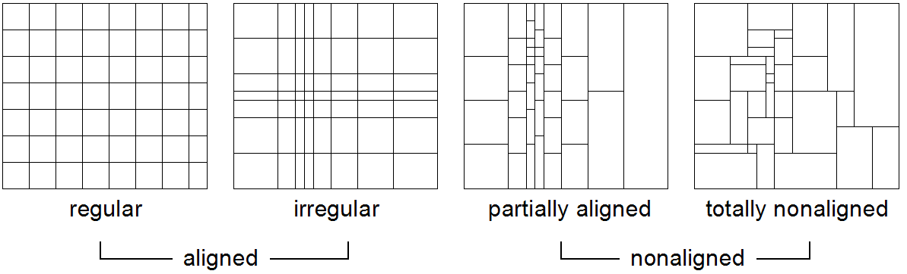

   Types of tilings

Non-aligned tiling contains tiles whose faces are not aligned with those
of their neighbors. This can be *partially aligned* with still some
hyperplanes shared or *totally non-aligned* with no such sharing at all.

**Syntax**

We use a BNF variant where optional elements are indicated as ::

    ( ... )?

to clearly distinguish them from the "[" and "]" terminals.

**Tiling Through API**

In the rasdaman C++ API (cf. C++ Guide), this functionality is available
through a specific hierarchy of classes.

**Introductory Example**

The following example illustrates the overall syntax extension which the
storage layout sublanguage adds to the **insert** statement: ::

    insert into MyCollection
    values ...
    tiling
        area of interest [0:20,0:40],[45:80,80:85]
        tile size 1000000

General Tiling Parameters
=========================

**Maximum Tile Size**

The optional **tile size** parameter allows specifying a maximum tile
size; irrespective of the algorithm employed to obtain a particular tile
shape, its size will never exceed the maximum indicated in this
parameter.

**Syntax:**

::

    tile size t

where *t* indicates the tile size in bytes.

If nothing is known about the access patterns, tile size allows
stream­lining array tiling to architectural parameters of the server,
such as DMA bandwidth and disk speed.

**Tile Configuration**

A tile configuration is a list of bounding boxes specified by their
extent. No position is indicated, as it is the shape of the box which
will be used to define the tiling, according to various strategies.

**Syntax:**

::

    [ integerLit , ... , integerLit ]

For a ``d``-dimensional MDD, the tile configuration consists of a vector
of ``d`` elements where the *i*\ :sup:`th` vector specifies the tile
extent in dimension *i*, for 0\le\ *i*\ <``d``. Each number indicates the
tile extent in cells along the corresp­ond­ing dimension.

For example, a tile configuration ``[100, 100, 1000]`` for a 3-D MDD states
that tiles should have an extent of 100 cells in dimension 0 and 1, and
an extent of 1,000 cells in dimension 2. In image timeseries analysis,
such a stretching tiles along the time axis speeds up temporal analysis.

Regular Tiling
==============

**Concept**

Regular tiling applies when there is some varying degree of knowledge
about the subsetting patterns arriving with queries. We may or may not
know the lower corner of the request box, the size of the box, or the
shape (i.e., edge size ratio) of the box. For example, map viewing
clients typically send several requests of fixed extent per mouse click
to maintain a cache of tiles in the browser for faster panning. So the
extent of the tile is known -- or at least that tiles are quadratic. The
absolute location often is not known, unless the client is kind enough
to always request areas only in one fixed tile size and with starting
points in multiples of the tile edge length.If additionally the
configuration follows a uniform probability distrib­ut­ion then a cubed
tiling is optimal.

In the storage directive, regular tiling is specified by providing a
bounding box list, *TileConf*, and an optional maximum tile size:

**Syntax**

::

    tiling regular TileConf ( tile size integerLit )?

**Example**

This line below dictates, for a 2-D MDD, tiles to be of size 1024 x
1024, except for border tiles (which can be smaller): ::

    tiling regular [ 1024 , 1024 ]

Aligned Tiling
==============

**Concept**

Generalizing from regular tiling, we may not know a good tile shape for
all dimensions, but only some of them. An axis *p*\ \in { 1, ..., d } which
never participates in any subsetting box is called a *preferred* (or
*pre­fer­ential*) *direction of access* and denoted as *tc*\ :sub:`p` =
\*. An optimal tile structure in this situation extends to the array
bounds in the preferential directions.

Practical use cases include satellite image time series stacks over some
reg­ion. Grossly simplified, during analysis there are two distinguished
acc­ess patterns (notwithstanding that others occur sometimes as well):
either a time slice is read, corresponding to *tc* = (\*, \*, t) for some
given time instance *t*, or a time series is extracted for one particular
position (*x*, *y*) on the earth surface; this corresponds to
*tc* = ( *x*, *y*, \*). The aligned tiling alg­or­ithm creates tiles as
large as possible based on the constraints that (i) tile pro­portions
adhere to tc and (ii) all tiles have the same size. The upper array
limits constitute an exception: for filling the remaining gap (which
us­ually occurs) tiles can be smaller and deviate from the
con­fig­ur­ation siz­ings. :numref:`figure21` illustrates aligned tiling with two
examples, for configuration *tc* = (1, 2) (left) and for *tc* =(1, 3, 4)
(right).

.. _figure21:

.. figure:: media/ql-guide/image29.png
   :align: center
   :scale: 80%

   Aligned tiling examples

Preferential access is illustrated in :numref:`figure22`. Left, access is
performed along preferential directions 1 and 2, corresponding to
configuration *tc* = (\*, \*, 1). The tiling tothe right supports
configuration *tc* = (4, 1, \*) with preferred axis 3.

.. _figure22:

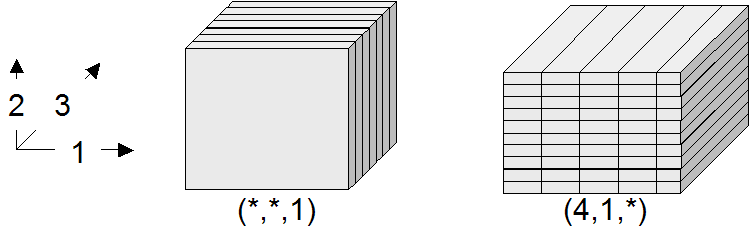

   Aligned tiling examples with preferential access directions

The aligned tiling construction consists of two steps. First, a concrete
tile shape is determined. After that, the extent of all tiles is
calculated by iterating over the array's complete domain. In presence of
more than one preferred directions - i.e., with a configuration
containing more than one "*" values - axes are prioritized in descending
order. This exploits the fact that array linearization is performed in a
way that the "outermost loop" is the first dimension and the "innermost
loop" the last. Hence, by clustering along higher coordinate axes a
better spatial clustering is achieved.

**Syntax**

::

    tiling aligned TileConf ( tile size IntLit )?

**Example**

The following clause accommodates map clients fetching quadratic images
known to be no more than 512 x 512 x 3 = 786,432 bytes: ::

    tiling aligned [1,1] tile size 786432

.. important::
    Aligned tiling is the default strategy in rasdaman.

Directional Tiling
==================

**Concept**

Sometimes the application semantics prescribes access in well-known
coordinate intervals. In OLAP, such intervals are given by the semantic
categories of the measures as defined by the dimension hierarchies, such
as product categories which are defined for the exact purpose of
accessing them group-wise in queries. Similar effects can occur with
spatio-temporal data where, for example, a time axis may suggest access
in units of days, weeks, or years. In rasdaman, if bounding boxes are
well known then spatial access may be approximated by those; if they are
overlapping then this is a case for area-of-interest tiling (see below),
if not then directional tiling can be applied.

The tiling corresponding to such a partition is given by its Cartesian
product. :numref:`figure23` shows such a structure for the 2-D and 3-D case.

To construct it, the partition vectors are used to span the Cartesian
product first. Should one of the resulting tiles exceed the size limit,
as it happens in the tiles marked with a "*" in :numref:`figure23`, then a
so-called sub-tiling takes place. Sub-tiling applies regular tiling by
introducing additional local cutting hyperplanes. As these hyperplanes
do not stretch through all tiles the resulting tiling in general is not
regular. The resulting tile set guarantees that for answering queries
using one of the subsetting patterns in part, or any union of these
patterns, only those cells are read which will be delivered in the
response. Further, if the area requested is smaller than the tile size
limit then only one tile needs to be accessed.

.. _figure23:

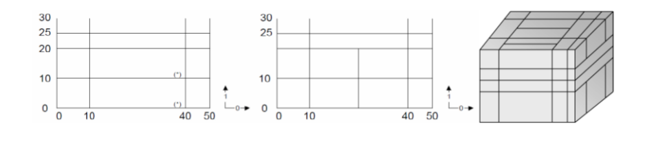

   Directional tiling

Sometimes axes do not have categories associated. One possible reason is
that subsetting is never performed along this axis, for example in an
image time series where slicing is done along the time axis while the
x/y image planes always are read in total. Similarly, for importing 4-D
climate data into a GIS a query might always slice at the lowest
atmospheric layer and at the most current time available without
additional trimming in the horizontal axes.

We call such axes *preferred access directions* in the context of a
directional tiling; they are identified by empty partitions. To
accommodate this intention expressed by the user the sub-tiling strategy
changes: no longer is regular tiling applied, which would introduce
undesirable cuts along the preferred axis, but rather are subdividing
hyperplanes constructed parallel to the preference axis. This allows
accommodating the tile size maximum while, at the same time, keeping the
number of tiles accessed in preference direction at a minimum.

In :numref:`figure24`, a 3-D cube is first split by way of directional tiling
(left). One tile is larger than the maximum allowed, hence sub-tiling
starts (center). It recognizes that axes 0 and 2 are preferred and,
hence, splits only along dimension 1. The result (right) is such that
subsetting along the preferred axes - i.e., with a trim or slice
specification only in dimension 1 - can always be accommodated with a
single tile read.

.. _figure24:

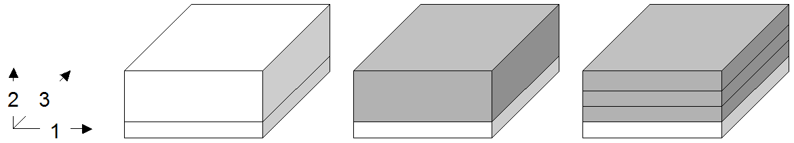

   Directional tiling of a 3-D cube with one degree of freedom

**Syntax**

::

    tiling directional splitList
    ( with subtiling ( tile size integerLit)? )?

where *splitList* is a list of split vectors (t\ :sub:`1,1`; ...;
t\ :sub:`1,n1`),...,(t\ :sub:`d,1`; ...; t\ :sub:`d,nd`). Each split vector
consists of an ascendingly ordered list of split points for the tiling
algorithm, or an asterisk "*" for a preferred axis. The split vectors
are positional, applying to the dimension axes of the array in order of
appearance.

**Example**

The following defines a directional tiling with split vectors (0; 512;
1024) and (0; 15; 200) for axes 0 and 2, respectively, with dimension 1
as a pre­ferred axis: ::

    tiling directional [0,512,1024], [], [0,15,200]

Area of Interest Tiling
=======================

**Concept**

An *area of interest* is a frequently accessed sub-array of an array
object. An area-of-interest pattern, consequently, consists of a set of
domains accessed with an access probability significantly higher than
that of all other possible patterns. Goal is to achieve a tiling which
optimizes access to these preferred patterns; performance of all other
patterns is ignored.

These areas of interest do not have to fully cover the array, and the
may overlap. The system will establish an optimal disjoint partitioning
for the given boxes in a way that the amount of data and the number of
tiles accessed for retrieval of any area of interest are minimized. More
exactly, it is guaranteed that accessing an area of interest only reads
data be­long­ing to this area.

:numref:`figure25` gives an intuition of how the algorithm works. Given some
area-of-interest set (a), the algorithm first partitions using
directional tiling based on the partition boundaries (b). By
construction, each of the resulting tiles (c) contains only cells which
all share the same areas of interest, or none at all. As this introduces
fragmentation, a merge step follows where adjacent partitions
overlapping with the same areas of interest are combined. Often there is
more than one choice to perform merging; the algorithm is inherently
nondeterministic. Rasdaman exploits this degree of freedom and cluster
tiles in sequence of dimensions, as this represents the
sequentialization pattern on disk and, hence, is the best choice for
maintaining spatial clustering on disk (d,e). In a final step,
sub-tiling is performed on the partitions as necessary, depending on the
tile size limit. In contrast to the directional tiling algorithm, an
aligned tiling strategy is pursued here making use of the tile
configuration argument, tc. As this does not change anything in our
example, the final result (f) is unchanged over (e).

.. _figure25:

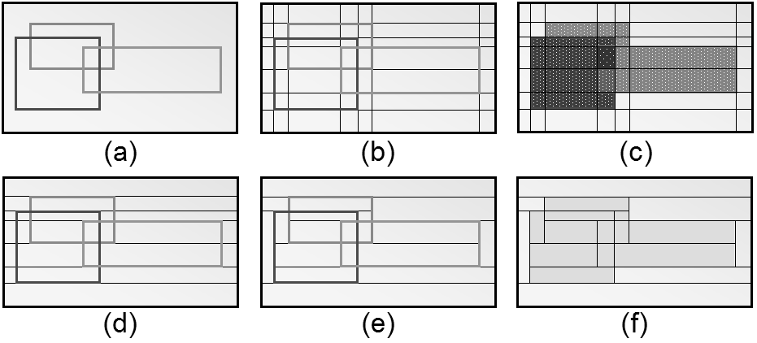

   Steps in performing area of interest tiling**

**Syntax**

::

    tiling area of interest tileConf ( tile size integerLit )?

**Example**

::

    tiling area of interest
    [0:20,0:40],[945:980,980:985],[10:1000,10:1000]

Tiling statistic
================

**Concept**

Area of interest tiling requires enumeration of a set of clearly
delineated areas. Sometimes, however, retrieval does not follow such a
focused pattern set, but rather shows some random behavior oscillating
around hot spots. This can occur, for example, when using a pointing
device in a Web GIS: while many users possibly want to see some "hot"
area, coordinates sub­mitted will differ to some extent. We call such a
pattern multiple acc­ess­es to areas of interest. Area of interest
tiling can lead to significant dis­advantages in such a situation. If
the actual request box is contained in some area of interest then the
corresponding tiles will have to be pruned from pixels outside the
request box; this requires a selective copying which is significantly
slower than a simple memcpy(). More important, how­ever, is a request
box going slightly over the boundaries of the area of int­erest - in
this case, an additional tile has to be read from which only a small
portion will be actually used. Disastrous, finally, is the output of the
area-of-interest tiling, as an immense number of tiny tiles will be
gen­er­at­ed for all the slight area variations, leading to costly
merging during requ­ests.

This motivates a tiling strategy which accounts for statistically
blurred access patterns. The statistic tiling algorithm re­ceiv­es a
list of access patterns plus border and frequency thresholds. The
algorithm condenses this list into a smallish set of patterns by
group­ing them according to sim­il­ar­ity. This process is guarded by
the two thresh­olds. The border thresh­old determines from what maximum
diff­er­ence on two areas are considered separately. It is measured in
number of cells to make it indep­end­ent from area geometry. The result
is a reduced set of areas, each ass­ociated with a frequency of
occurrence. In a second run, those areas are filtered out which fall
below the frequency threshold. Having calculated such re­pres­ent­ative
areas, the algorithm performs an area of interest tiling on these.

This method has the potential of reducing overall access costs provided
thresholds are placed wisely. Log analysis tools can provide estimates
for guidance. In the storage directive, statistical tiling receives a
list of areas plus, optionally, the two thresholds and a tile size
limit.

**Syntax**

::

    tiling statistic tileConf
    ( tile size integerLit )?
    ( border threshold integerLit)?
    ( interest threshold floatLit)?

**Example**

The following example specifies two areas, a border threshold of 50 and
an interest probability threshold of 30%: ::

    tiling statistic [0:20,0:40],[30:50,70:90]
    border threshold 50
    interest threshold 0.3

Summary: Tiling Guidelines
==========================

This section summarizes rules of thumb for a good tiling. However, a
thorough evaluation of the query access pattern, either empirically
through server log inspection or theoretically by considering
application logics, is strongly recommended, as it typically offers a
potential for substantial improvements over the standard heuristics.

-  **Nothing is known about access patterns:** choose regular tiling
   with a maximum tile size; on PC-type architectures, tile sizes of about
   4-5 MB have yielded good results.

-  **Trim intervals in direction x are n times more frequent than in
   direction y and z together:** choose directional tiling where the
   ratios are approximately x\*n=y\*z. Specify a maximum tile size.

-  **Hot spots (i.e., their bounding boxes) are known:** choose Area of
   Interest tiling on these bounding boxes.

*******************
Web Access to rasql
*******************

.. _overview-3:

Overview
========

As part of petascope, the geo service frontend to rasdaman, Web access
to rasql is provided. The request format is described in :ref:`sec-req-format`,
the response format in :ref:`sec-resp-format` below.

Service Endpoint
================

The service endpoint for rasql queries is

.. code-block:: text

    http://{service}/{path}/rasdaman/rasql

.. _sec-req-format:

Request Format
==============

A request is sent as an http GET URL with the query as key-value pair
parameter. By default, the rasdaman login is taken from the petascope
settings in ``petascope.properties``; optionally, another valid rasdaman
user name and password can be provided as additional parameters.

**Syntax**

.. code-block:: text

    http://{service}/{path}/rasdaman/rasql?params

This servlet endpoint accepts KVP requests with the following
parameters:

query=q
    where *q* is a valid rasql query, appropriately escaped as
    per http specification.

username=u
    where *u* is the user name for logging into rasdaman
    (optional, default: value of variable ``rasdaman_user``
    in ``petascope.properties``)

password=p
    where *p* is the password for logging into rasdaman
    (optional, default: value of variable ``rasdaman_pass``
    in ``petascope.properties``)

**Example**

The following URL sends a query request to a fictitious server www.acme.com:

.. code-block:: text

    http://www.acme.com/rasdaman?
        query=select%20rgb.red+rgb.green%20from%20rgb
        &username=rasguest
        &password=rasguest

.. _sec-resp-format:

Response Format
===============

The response to a rasdaman query gets wrapped into a http message. The
response format is as follows, depending on the nature of the result:

If the query returns arrays, then the MIME type of the response is
``application/octet-stream``.

-  If the result is empty, the document will be empty.

-  If the result consists of one array object, then this object will be
   delivered as is.

-  If the result consists of several array objects, then the response
   will consist of a Multipart/MIME document.

-  If the query returns scalars, all scalars will be delivered in one
   document of MIME type ``text/plain``, separated by whitespace.

Security
========

User and password are expected in cleartext, so do not use this tool in
security sensitive contexts.

The service endpoint ``rasdaman/rasql``, being part of the petascope
servlet, can be disabled in the servlet container's setup (such as
Tomcat).

.. _limitations-2:

Limitations
===========

Currently, no uploading of data to the server is supported. Hence,
functionality is restricted to queries without positional parameters ``$1``,
``$2``, etc.

Currently, array responses returned invariably have the same MIME type,
``application/octet-stream``. In future it is foreseen to adjust the MIME
type to the identifier of the specific file format as chosen in the
``encode()`` function.

*************************
Appendix A: rasdl Grammar
*************************

This appendix presents a simplified list of the main rasdl grammar rules
used in the rasdaman system. The grammar is described as a set of
production rules. Each rule consists of a non-terminal on the left-hand
side of the colon operator and a list of symbol names on the right-hand
side. The vertical bar ``|`` introduces a rule with the same left-hand
side as the previous one. It is usually read as *or*. Symbol names can
either be non-terminals or terminals (the former ones printed in bold
face as a link which can be followed to the non-terminal production).
Terminals represent keywords of the language, or identifiers, or
number literals; "``(``", "``)``", "``[``", and "``]``" are also terminals, but
they are in double quotes to distinguish them from the grammar parentheses
(used to group alternatives) or brackets (used to indicate optional parts).

.. productionlist::
    typeDef :  `structDef`
            :| `marrayDef`
            :| `setDef`
    structDef : struct `structName` "{" `attrList` "}"
    structName : `identifier`
    attrList :  `attrType` `attrName`
             :  [ ; `attrList` ]
    attrType : `identifier`
    attrName : `identifier`
    marrayDef :  typedef
              :  marray < `typeName`
              :           [ , `spatialDomain` ] >
              :  `marrayName`
    spatialDomain : "[" `spatialExpList` "]"
    spatialExpList : `spatialExp` [ , `spatialExpList` ]
    spatialExp : `integerExp` | `intervalExp`
    setDef : typedef set < `marrayName` > `setName`
           : [ `nullExp` ]
    setName : `identifier`
    marrayName : `identifier`

*************************
Appendix B: rasql Grammar
*************************

This appendix presents a simplified list of the main rasql grammar rules
used in the rasdaman system. The grammar is described as a set of
production rules. Each rule consists of a non-terminal on the left-hand
side of the colon operator and a list of symbol names on the right-hand
side. The vertical bar ``|`` introduces a rule with the same left-hand
side as the previous one. It is usually read as *or*. Symbol names can
either be non-terminals or terminals (the former ones printed in bold
face as a link which can be followed to the non-terminal production).
Terminals represent keywords of the language, or identifiers, or
number literals; "``(``", "``)``", "``[``", and "``]``" are also terminals, but
they are in double quotes to distinguish them from the grammar parentheses
(used to group alternatives) or brackets (used to indicate optional parts).

.. productionlist::
    query :  `createExp`
          :| `dropExp`
          :| `selectExp`
          :| `updateExp`
          :| `insertExp`
          :| `deleteExp`
    createExp :  `createCollExp`
              :| `createStructTypeExp`
              :| `createMarrayTypeExp`
              :| `createSetTypeExp`
    createCollExp : create collection
                  : `namedCollection` `typeName`
    createCellTypeExp : create type `typeName`
                      : a" `cellTypeExp`
    cellTypeExp : "(" `attributeName` `typeName`
                :     [ , `attributeName` `typeName` ]... ")"
    createMarrayTypeExp : create type `typeName`
                        : as "(" `cellTypeExp` | `typeName` ")"
                        : mdarray `domainSpec`
    domainSpec : "[" `extentExpList` "]"
    extentExpList :  `extentExp` [ , `extentExpList` ]
    extentExp : `axisName`
              : [ "(" `integerLit` | `intervalExp` ")" ]
    boundSpec : `integerExp`
    createSetTypeExp : create type `typeName`
                     : as set "(" `typeName` ")"
                     : "[" `nullExp` "]"
    nullExp : null values `mintervalExp`
    dropExp :  drop collection `namedCollection`
            :| drop type `typeName`

.. productionlist::
    selectExp :  select `resultList`
              :  from `collectionList`
              :  [ where `generalExp` ]
    updateExp : update `iteratedCollection`
              : set `updateSpec`
              : assign `generalExp`
              : [ where `generalExp` ]
    insertExp : insert into `namedCollection`
              : values `generalExp`
              : [ tiling [ `StorageDirectives` ] ]
    StorageDirectives:  `RegularT` | `AlignedT` | `DirT`
                     :| `AoiT` | `StatT`
    RegularT : regular `TileConf`
             : [ tile size `integerLit` ]
    AlignedT : aligned `TileConf` [ `TileSize` ]
    DirT : directional `SplitList`
         : [ with subtiling [ `TileSize` ] ]
    AoiT : area of interest `BboxList`
         : [ `TileSize` ]
    StatT : statistic `TileConf` [ `TileSize` ]
          : [ border threshold `integerLit` ]
          : [ interest threshold `floatLit` ]
    TileSize : tile size `integerLit`
    TileConf : `BboxList` [ , `BboxList` ]...
    BboxList : "[" `integerLit` : `integerLit`
             :     [ , `integerLit` : `integerLit` ]... "]"
    Index : index `IndexName`
    deleteExp : delete from `iteratedCollection`
              : [ where `generalExp` ]
    updateSpec : `variable` [ `mintervalExp` ]
    resultList : [ `resultList` , ] `generalExp`

.. productionlist::
    generalExp :  `mddExp`
               :| `trimExp`
               :| `reduceExp`
               :| `inductionExp`
               :| `caseExp`
               :| `functionExp`
               :| `integerExp`
               :| `condenseExp`
               :| `variable`
               :| `mintervalExp`
               :| `intervalExp`
               :| `generalLit`
    mintervalExp :  "[" `spatialOpList` "]"
                 :| sdom "(" `collIterator` ")"
    intervalExp : ( `integerExp` | * ) :
                : ( `integerExp` | * )
    integerExp :  `integerTerm` + `integerExp`
               :| `integerTerm` - `integerExp`
               :| `integerTerm`
    integerTerm :  `integerFactor` * `integerTerm`
                :| `integerFactor` / `integerTerm`
                :| `integerFactor`
    integerFactor :  `integerLit`
                  :| `identifier` [ `structSelection` ]
                  :| `mintervalExp` . lo
                  :| `mintervalExp` . hi
                  :| "(" `integerExp` ")"
    spatialOpList : `spatialOpList2`
    spatialOpList2 :  `spatialOpList2` , `spatialOp`
                   :| `spatialOp`
    spatialOp : `generalExp`
    condenseExp : condense `condenseOpLit`
                : over `condenseVariable` in `generalExp`
                : [ where `generalExp` ]
                : using `generalExp`
    condenseOpLit : + | * | and | or | max | min
    functionExp :  version "(" ")"
                :| `unaryFun` "(" `collIterator` ")"
                :| `binaryFun`
                :  "(" `generalExp` , `generalExp` ")"
                :| `transcodeExp`
    unaryFun : oid | dbinfo
    binaryFun : shift | scale | bit | pow | power | div | mod
    transcodeExp :  encode "(" `generalExp` , `StringLit`
                 :               [ , `StringLit` ] ")"
                 :| decode "(" $ `integerLit`
                 :              [ , `StringLit`
                 :                , `StringLit` ] ")"
                 :| decode "(" `generalExp` ")"
    structSelection : . ( `attributeName` | `integerLitExp` )
    inductionExp :  `unaryInductionOp` "(" `generalExp` ")"
                 :| `generalExp` . ( re | im )
                 :| `generalExp` `structSelection`
                 :| not `generalExp`
                 :| `generalExp` `binaryInductionOp` `generalExp`
                 :| ( + | - ) `generalExp`
                 :| "(" `castType` ")" `generalExp`
                 :| "(" `generalExp` ")"
    unaryInductionOp :  sqrt | abs | exp | log | ln
                     :| sin | cos | tan | sinh | cosh
                     :| tanh | arcsin | arccos | arctan
    binaryInductionOp :  overlay | is | = | and | or
                      :| xor | plus | minus | mult
                      :| div| equal | < | > | <=
                      :| >= | !=
    castType :  bool | char | octet | short
             :| long | ulong | float | double
             :| ushort | unsigned ( short | long )
    caseExp : case [ `generalExp` ] `whenList`
            : else `generalExp` end
    whenList : [ `whenList` ]
             : when `generalExp`
             : then `generalExp`
    collectionList : [ `collectionList` , ]
                   : `iteratedCollection`
    iteratedCollection : `namedCollection`
                       : [ [ as ] `collIterator` ]
    reduceExp : `reduceIdent` "(" `generalExp` ")"
    reduceIdent :  all_cells | some_cells | count_cells
                :| avg_cells | min_cells | max_cells
                :| add_cells
                :| stddev_samp | stddev_pop
                :| var_samp | var_pop
    trimExp : `generalExp` `mintervalExp`
    mddExp : marray `ivList` values `generalExp`
    ivList : [ `ivList` , ]
           : `marrayVariable` in `generalExp`
    generalLit : `scalarLit` | `mddLit` | `StringLit` | `oidLit`
    oidLit : < `StringLit` >
    mddLit :  < `mintervalExp` `dimensionLitList` >
           :| $ `integerLit`
    dimensionLitList : [ `dimensionLitList` ; ] `scalarLitList`
    scalarLitList : [ `scalarLitList` , ] `scalarLit`
    scalarLit : `complexLit` | `atomicLit`
    complexLit : [ struct ] { `scalarLitList` }
    atomicLit :  `booleanLit` | `integerLit` | `floatLit`
              :| complex "(" `floatLit` , `floatLit` ")"
              :| complex "(" `integerLit` , `integerLit` ")"
    typeName : `identifier`
    variable : `identifier`
    namedCollection : `identifier`
    collIterator : `identifier`
    attributeName : `identifier`
    marrayVariable : `identifier`
    condenseVariable : `identifier`
    identifier : [a-zA-Z_] [a-zA-Z0-9_]*

.. [1]
   Actually, rasdl is a subset of ODMG's Object Definition Language
   (ODL) with the only extension for spatial domain specification within
   the array template.

.. [2]
   memory usage is one byte per pixel

.. [3]
   dependent on the relational base DBMS used; please consult the
   *External Products Integration Guide* for your environment.

.. [4]
   Currently only one -f argument is supported (i.e., only $1).

.. [5]
   the dimension which is the *leftmost* in the spatial domain
   specification

.. [6]
   the dimension which is the *rightmost* in the spatial domain
   specification

.. [7]
   Null means a numerical value of 0 (zero).

.. .[8]
..   Standard C/C++ notation is used to indicate parameter types: %i for
..   integer (decimal/octal/hex notation), %f for float numbers

.. .[9]
..   Digital Elevation Model, i.e., an ASCII file containing lines with
..   whitespace-separated x/y/z values per pixel; for 2-D data only.

.. [13]
   This is going to be changed in the near future.

.. [14]
   This will be changed in future.

.. [15]
   This is referred to as *Strict 2-Phase Locking* in databases.
