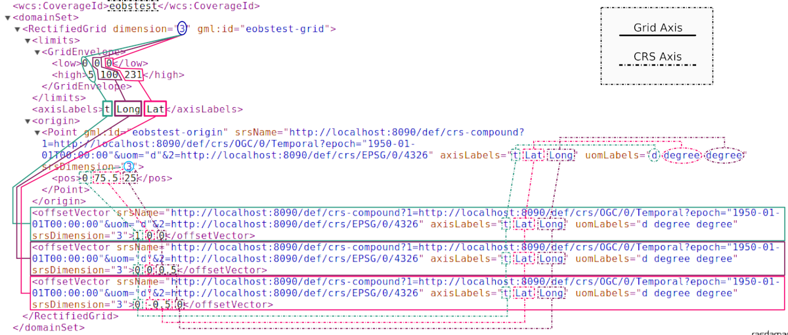
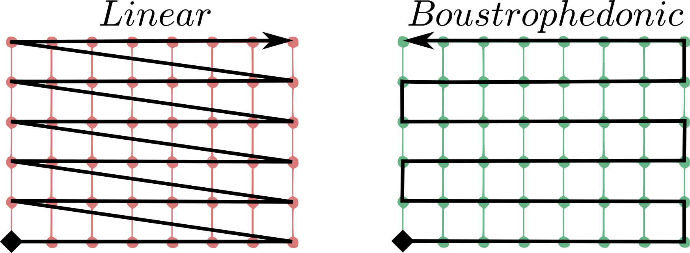
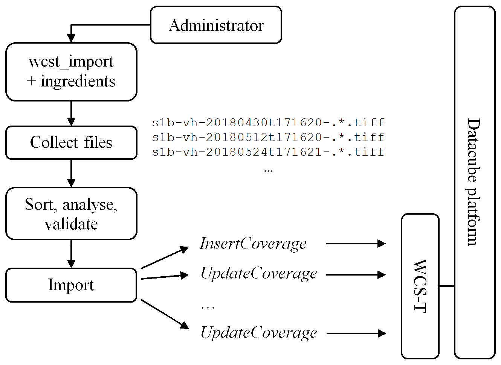

.. highlight:: text

.. _sec_geo-services-guide:

##################
Geo Services Guide
##################

This guide covers the details of Geo data management in rasdaman. This is supported
through a separate component called *petascope*. Further components are
concerned with :ref:`data ingestion <data-import>` and :ref:`CRS
definition management <crs-def-management>`.

*petascope* implements the following `OGC <http://www.opengeospatial.org>`__ interface
standards:

- `WCS 2.0.1 <https://portal.opengeospatial.org/files/09-110r4>`_
- `WCS-T 2.0 <http://docs.opengeospatial.org/is/13-057r1/13-057r1.html>`_
- `WCPS 1.0 <https://portal.opengeospatial.org/files/08-059r4>`_
- `WMS 1.3.0 <http://portal.opengeospatial.org/files/?artifact_id=4756&passcode=4hy072w9zerhjyfbqfhq>`_

For this purpose, petascope maintains its additional metadata (such as
georeferencing) which is kept in separate relational tables. Note that not all
rasdaman raster objects and collections are available through petascope by
default, mainly those that have been ingested via WCS-T.

Petascope is implemented as a war file of servlets which give access to
coverages (in the `OGC <http://www.opengeospatial.org>`__ sense) stored in
rasdaman. Internally, incoming requests requiring coverage evaluation are
translated into rasql queries by petascope. These queries are passed on to
rasdaman, which constitutes the central workhorse. Results returned from
rasdaman are forwarded to the client, finally.

Servlet endpoints
=================

Once the petascope servlet is deployed (TODO see installation guide), the following
service endpoints are available:

* ``/rasdaman``: context path

    - ``rasdaman/ows``: serving OGC Web Services (OWS) like WCS, WCPS, WMS and WCS-T:

    - ``rasdaman/rasql``: direct RasQL.

For example, assuming that the service's IP address is ``123.456.789.1`` and the
service port is ``8080``, the following request URLs would deliver the
Capabilities documents for OGC WMS and WCS, respectively:

::

    http://123.456.789.1:8080/rasdaman/ows?SERVICE=WMS&REQUEST=GetCapabilities&VERSION=1.3.0

    http://123.456.789.1:8080/rasdaman/ows?SERVICE=WCS&REQUEST=GetCapabilities&VERSION=2.0.1

The world of coverages
======================

Offset vectors and coefficients
-------------------------------

In ISO and OGC specifications, a *coverage* is defined as a function from a
spatial and/or temporal *domain* to an attribute *range*. Such domain can
represent both vector or raster datasets, including a variety of different
*topologies* like images, point clouds, polygons, triangulated irregular
networks, etc. Coverages in the Earth Observation (EO) domain usually tend to
model coverages as a geometric grid of points, a.k.a. *grid coverages*.

`Grid coverages <http://rasdaman.org/wiki/GridTopologies>`_ are a network of
points connected by lines, retaining a gridded structure. Their geometric domain
can either be expressed in an analytic form (*(geo)rectified grids*), or they
need non-affine transforms to translate the internal indexed grid to the
external (geo) Coordinate Reference System (CRS). Grid coverages inherently have
a **dimensionality**, which is determined by the number of its *axis*. These
axes are not to be confused with the axes of the CRS which defines
dimensionality of the tuples of coordinates of each grid point. Indeed the
dimensionality of a grid is not necessarily equal to the dimensionality of its
CRS (its however surely not greater for geometric constraints): an (oblique?) 2D
grid can always be put inside a 3D CRS, for instance.

Petascope currently supports grid topologies whose axes are *aligned* with the
axes of the CRS. Such kind of grids are a subset of GML *rectified* grids, with
the constraint that the *offset vectors* -- the vectors which determine the
(fixed) relative geometric distance between grid points along a grid axis --
need to be parallel to an axis of the (external) CRS. In such cases, an offset
vector can be regarded as *resolution* of the grid along an axis.

Rectified grids with *non-aligned* grid axis / offset vectors are not (yet)
supported. ::

   ======= ALIGNED GRID =======             ===== NON-ALIGNED GRID =====

          N ^    ^ 1                               N ^           / 1
            |    |                                   |          .
            |    .-----.-----.                       |         / \.
            |    |     |     |                       |        /  /\
            |    .-----.-----.                       |       .  /  .
            |    |     |     |                       |      / \.  /
            |    ^-----.-----.                       |     /  /\ /
            | v1 |     |     |                 GO(N) x- - @  /  .
      GO(N) x- - @---->.-----.---> 0                 |    |\.  /
            |  GO| v0                                |    | \./
         CO O____x________________> E             CO O____x__\__________> E
               GO(E)                                    GO(E) \
                                                               0

     @ = Grid Origin (GO)          O = CRS Origin (CO)
     . = grid point              E,N = CRS axis labels
   0,1 = grid axis labels        --> = offset vector (v0,v1)

In addition (starting from version 9.0.0) Petascope supports aligned grids with
arbitrary (irregular) spacing between points along one or more (or all) grid
axes. This kind of geometry is a subtype of *(geo)referenceable* grids and can
be defined by attaching a set of *coefficients* (or weights) to an offset
vector. The series of coefficients determines how many offset vectors is a grid
point geometrically distant from the grid origin, and their cardinality must
coincide with the cardinality of the grid points along that axis. Rectified
grids (conceivable as a subset of referenceable grids in an Euler diagram) have
an inherent series of incremental integer coefficients attached to each offset
vector, so that e.g. the third point along axis 0 is computed as ``[GO + 2\*v0]``
(indexes start from 0).

A graphical example: ::

   ======= IRREGULAR ALIGNED GRID =======              =========== WARPED GRID ===========

          N ^    ^ 1                                          N ^           1
            |    |                                              |         /
            |    .------.--.------------.                       |        .-----.----.
            |    |      |  |            |                       |       /      |     \
            |    .------.--.------------. P                     |      .------.-------.
            |    |      |  |            |                       |     /      /       /
            |    ^------.--.------------.                       |    .------.-------.
            | v1 |      |  |            |                       |    |      |      /
      GO(N) x- - @----->.--.------------.---> 0           GO(N) x- - @------.-----.-----> 0
            |  GO|  v0                                          |  GO|
         CO O____x___________________________> E             CO O____x___________________________> E
               GO(E)

     @ = Grid Origin (GO)          O = CRS Origin (CO)
     . = grid point (e.g. P)     E,N = CRS axis labels
   0,1 = grid axis labels        --> = offset vector (v0,v1)

In this example, the grid is still aligned with CRS axes E/N, but the spacing is
irregular along grid axis ``0``. We then need to explicitly define a series of 4
coefficients (one for each grid point along ``0``) that weight their distance to
the grid origin (in terms of ``v0``): in our case the weights are ``c0={0, 1,
1.5, 3.5}``. Indeed the point ``P`` in the graphical example above -- which has
internal (*rasdaman*) grid coordinates ``{3,2}`` (origin is ``{0,0}``) -- can
hence be geometrically expressed as : ``(GO + c0[3]\*v0 + 2\*v1) = (GO + 3.5\*v0
+ 2\*v1)``.

It is underlined that the irregular spacing must be *fixed* for each grid line
along a certain grid axis. If not so, the referenceable grid becomes *warped*
and the domain needs to be addressed with explicit CRS coordinates for each
single grid point (look-up tables).

.. note::
  In petascope only grids whose lines are *rectilinear* and *aligned* with a
  Cartesian CRS are supported. This means: no rotated nor warped
  (curvilinear) grids.
  

Grid axis labels and CRS axis labels
------------------------------------

Now that the difference between a *grid* axis and a *CRS* axis has been cleared,
we address the issue of determining (and customizing) the axis labels a coverage
in Petascope.

When importing a coverage, a `spatio-temporal CRS
<http://www.researchgate.net/publication/237148512_Making_Time_Just_Another_Axis_in_Geospatial_Services/file/504635264eb4a97d90.pdf>`__
needs to be assigned to it, in order to give a meaning to its domain.
Composition of CRSs is possible via the OGC `SECORE
<http://link.springer.com/chapter/10.1007%2F978-3-642-29247-7_5>`__ CRS
resolver. For instance a time-series of WGS84 images can have the following
native CRS: ::

    http://<secore-resolverX-domain>/def/crs-compound?
      1=http://<secore-resolverY-domain>/def/crs/EPSG/0/4326&
      2=http://<secore-resolverZ-domain>/def/crs/<AUTH>/<VERSION>/<CODE-OF-A-TIME-CRS>

Note: currently gml:CompoundCRS is not supported (`#679
<http://rasdaman.org/ticket/679>`_) so, for example,
``http://www.opengis.net/def/crs/EPSG/0/7415\`` would have to be represented by
composing its components using the same format as above i.e. ::

    http://../def/crs-compound?
      1=http://www.opengis.net/def/crs/EPSG/0/28992&
      2=http://www.opengis.net/def/crs/EPSG/0/5709\

In order to verify the CRS assigned to a coverage offered by Petascope, there
are several ways:

1. check the ``wcs:CoverageSummary/ows:BoundingBox@crs`` attribute in a
   WCS *GetCapabilities* response;

2. check the ``@srsName`` attribute in the ``@{gml:SRSReferenceGroup}``
   attributes group in WCS *DescribeCoverage* response (``gml:domainSet``);

3. use the WCPS function ``crsSet()``;

It is important to understand that the assigned CRS automatically
determines the CRS axis labels (and all other axis semantics like
direction and unit of measure), and these are the same labels targeted
in the *subsets* of the WCS and WCPS requests. Such labels correspond to
the ``gml:axisAbbrev`` elements in the CRS definition (mind that
ellipsoidal Coordinate Systems (CS) do not count in case of *projected*
CRSs, which build a further CS on top of it).

This excerpt from the CRS definition of the `WGS84 / UTM zone
33N <http://www.opengis.net/def/crs/EPSG/0/32633>`__ projection shows
how the first axis defined by this CRS is the easting, with label ``E``
and `metres <http://www.opengis.net/def/uom/EPSG/0/9001>`__ ``m`` as
Unit of Measure (UoM, see ``gml:CoordinateSystemAxis@uom`` link):

.. code-block:: xml

    <gml:CartesianCS>
      [...]
      <gml:axis>
      <gml:CoordinateSystemAxis gml:id="epsg-axis-1"
        uom="http://www.opengis.net/def/uom/EPSG/0/9001">
        <gml:descriptionReference
          xlink:href="http://www.opengis.net/def/axis-name/EPSG/0/9906"/>
        <gml:identifier codeSpace="OGP">
          http://www.opengis.net/def/axis/EPSG/0/1</gml:identifier>
        <gml:axisAbbrev>E</gml:axisAbbrev>
        <gml:axisDirection codeSpace="EPSG">east</gml:axisDirection>
      </gml:CoordinateSystemAxis>
      </gml:axis>
      [...]
    </gml:CartesianCS>

Since only `aligned
<http://rasdaman.org/wiki/PetascopeUserGuide#Offsetvectorsandcoefficients>`_
grids are supported, we decided to assign the same CRS axes labels to the grid
axes. Such labels are listed in the ``gml:domainSet/gml:axisLabels`` element of
a WCS coverage description, and are not to be confused with the labels of the
CRS axes, which are instead listed in the ``@{gml:SRSReferenceGroup}``
attributes group, as said.

Indeed, despite the labels of grid and CRS axes will be the same, their `order
<http://wiki.osgeo.org/wiki/Axis_Order_Confusion>`__ can actually differ. Many
geographic CRSs (like the well-known WGS84 /EPSG:4326) define latitudes first,
whereas it is `GIS practice
<http://www.remotesensing.org/geotiff/faq.html?What%20is%20the%20purpose%20of%20GeoTIFF%20format%20for%20satellite%20data#AxisOrder>`__
to always place longitudes in the first place, just like *rasdaman* does when
storing the multidimensional-arrays (*marrays*).

With regards to this long-standing issue, Petascope *strictly* keeps the CRS
axis order which is defined in its definition when it comes to GML, whereas GIS
order (longitude first) is kept for other binary encodings like !GeoTiff or
NetCDF, so to keep metadata consistency with common GIS libraries (e.g.
``GDAL``). On the other hand, the order of grid axis labels need to follow the
internal grid topology of marrays inside *rasdaman*.

To make things clearer, an excerpt of the GML domain of our 3D `systemtest
<http://rasdaman.org/wiki/RasdamanTestSuites>`_ coverage ``eobstest`` (regular
time series of EO imagery) is proposed:

The CRS of the coverage is an (ordered) composition of a temporal CRS (linear
count of days ``[d]`` from the epoch ``1950-01-01T00:00:00``) and a geospatial
CRS where latitude is defined first (the well-known EPSG:4326). This means that
*every* tuple of spatio-temporal coordinates in the coverage's domain will be a
3D tuple listing the count of days from 1^st^ of January 1950, then latitude
degrees then longitude degrees, like shown in the ``gml:origin/gml:pos``
element: the origin of the 3D grid is set on 1^st^ of January 1950, ``75.5``
degrees north and ``25`` degrees east (with respect to the origin of the
cartesian CS defined in EPSG:4326).

Grid coordinates follow instead the internal grid space, which is not aware of
any spatio-temporal attribute, and follows the order of axis as they are stored
in *rasdaman*: in the example, it is expressed that the collection is composed
of a 6x101x232 marray, having ``t`` (time) as first axis, then ``Long`` then
``Lat``. The spatio-temporal coordinates are instead expressed following the
order of the CRS definition, hence with latitude degrees before longitudes.

A final remark goes to the customization of CRS (and consequently grid) axes
labels, which can be particularly needed for temporal CRSs, especially in case
of multiple time axis in the same CRS. Concrete CRS definitions are a static XML
tree of GML elements defining axis, geographic coordinate systems, datums, and
so on. The candidate standard `OGC CRS Name-Type Specification
<http://www.ogcnetwork.net/system/files/11-135_OGC-NA_Name-Type-Specification-for-CRSs_2012-08-07.pdf>`__
offers a new kind of CRS, a `parametrized CRS
<http://rasdaman.org/wiki/SecoreUserGuide>`_, which can be bound to a concrete
definition, a CRS *template*, and which offers customization of one or more GML
elements directly via key-value pairs in the query component of HTTP URL
identifying the CRS.

As a practical example, we propose the complete XML definition of the
parametrized CRS defining ANSI dates, identified by the URI
http://rasdaman.org:8080/def/crs/OGC/0/AnsiDate:

.. code-block:: xml

    <ParameterizedCRS xmlns:gml="http://www.opengis.net/gml/3.2"
      xmlns:xlink="http://www.w3.org/1999/xlink"
      xmlns="http://www.opengis.net/CRS-NTS/1.0"
      xmlns:epsg="urn:x-ogp:spec:schema-xsd:EPSG:1.0:dataset"
      xmlns:rim="urn:oasis:names:tc:ebxml-regrep:xsd:rim:3.0"
      gml:id="param-ansi-date-crs">
      <description>Parametrized temporal CRS of days elapsed
        from 1-Jan-1601 (00h00 UTC).</description>
      <gml:identifier codeSpace="http://www.ietf.org/rfc/rfc3986">
          http://rasdaman.org:8080/def/crs/OGC/0/AnsiDate</gml:identifier>
        <parameters>
        <parameter name="axis-label">
          <value>"ansi"</value>
          <target>//gml:CoordinateSystemAxis/gml:axisAbbrev</target>
        </parameter>
        </parameters>
        <targetCRS
          xlink:href="http://rasdaman.org:8080/def/crs/OGC/0/.AnsiDate-template"/>
    </ParameterizedCRS>

This single-parameter definition allow the customization of the concrete CRS
*template* ``OGC:.AnsiDate-template`` (identified by
``http://rasdaman.org:8080/def/crs/OGC/0/.AnsiDate-template``) on its unique axis
label (``crsnts:parameter/crsnts:target``), via a parameter labeled
``axis-label``, and default value ``ansi``.

This way, when we assign this parameterized CRS to a coverage, we can either
leave the default ``ansi`` label to the time axis, or change it to some other
value by setting the parameter in the URL query:

* default ``ansi`` axis label: ``http://rasdaman.org:8080/def/crs/OGC/0/AnsiDate``
* custom ``ansi_date`` axis label: ``http://rasdaman.org:8080/def/crs/OGC/0/AnsiDate?axis-label="ansi_date"``

.. _coverage-implementation-schema-in-petascope:

Coverage Implementation Schema (CIS) in petascope
-------------------------------------------------

`CIS <http://docs.opengeospatial.org/is/09-146r6/09-146r6.html>`_ specifies the OGC
coverage model by establishing a concrete, interoperable,
conformance-testable coverage structure regardless of their data
format encoding down to the level of single "pixels" or "voxels".

Coverages can be encoded in any suitable format (such as GML, JSON, GeoTIFF,
or netCDF). Coverages are independent from service definitions and,
therefore, can be accessed through a variety of OGC services types,
such as the Web Coverage Service (WCS) Standard

Since rasdaman version 9.7+, petascope supports CIS version 1.1 with these
conformance classes:

* Class **coverage**.

* Class **grid-regular** (in *CIS 1.0*: **GridCoverage** and **RectifiedGridCoverage** 
  coverage types).

* Class **grid-irregular** (*only* supports **CIS::IrregularAxis**,
  in *CIS 1.0*: **ReferenceableGridCoverage** coverage type).

* Class **gml-coverage**: For *WCS version 2.1.0*, petascope allows
  to transform *CIS 1.0* coverage types to *CIS 1.1* in GML format:

  * For WCS requests (**DescribeCoverage/GetCoverage**) with non-standard
    parameter **outputType=GeneralGridCoverage**. Example: 
   
    ::
  
       http://localhost:8080/rasdaman/ows?service=WCS&version=2.1.0
         &request=DescribeCoverage
         &coverageId=test_mean_summer_airtemp
         &outputType=GeneralGridCoverage

       http://localhost:8080/rasdaman/ows?service=WCS&version=2.1.0
         &request=GetCoverage
         &coverageId=test_mean_summer_airtemp
         &outputType=GeneralGridCoverage

  * For WCPS requests, the same can be achieved using the extra parameter
    **outputType=GeneralGridCoverage** in **encode()**, when the GML format is used. Example: 
    
    ::

      for c in (test_irr_cube_2) return encode(c, 
              "gml",
              "{\"outputType\":\"GeneralGridCoverage\"}")

* Class **other-format-coverage**.

* Class **multipart-coverage**.

.. _subsets-in-petascope:

Subsets in Petascope
--------------------

We will describe how subsets (trims and slices) are treated by Petascope.
Before this you will have to understand how the topology of a grid coverage
is interpreted with regards to its origin, its bounding-box and the assumptions
on the sample spaces of the points. Some practical examples will be proposed.

Geometric interpretation of a coverage
^^^^^^^^^^^^^^^^^^^^^^^^^^^^^^^^^^^^^^

This section will focus on how the topology of a grid coverage is stored
and how Petascope interprets it. When it comes to the so-called *domainSet*
of a coverage (hereby also called domain, topology or geometry),
Petascope follows pretty much the GML model for rectified grids:
the grid origin and one offset vector per grid axis are enough to deduce
the full *domainSet* of such (regular) grids. When it comes to *referenceable*
grids, the *domainSet* still is kept in a compact vectorial form
by adding weighting coefficients to one or more offset vectors.

As by ​`GML standard <http://www.opengeospatial.org/standards/gml>`_ a grid
is a "network composed of two or more sets of curves in which
the members of each set intersect the members of the other sets in
an algorithmic way". The intersections of the curves are represented
by points: a point is 0D and is defined by a single coordinate tuple.

A first question arises on where to put the grid origin. The GML and ​GMLCOV
standards say that the mapping from the domain to the range
(feature space, payload, values) of a coverage is specified through a function,
formally a *gml:coverageFunction*. From the GML standard:
"If the gml:coverageFunction property is omitted for a gridded coverage
(including rectified gridded coverages) the gml:startPoint is considered
to be the value of the gml:low property in the gml:Grid geometry,
and the gml:sequenceRule is assumed to be linear and the gml:axisOrder
property is assumed to be +1 +2".

In the image, it is assumed that the first grid axis (+1) is the horizontal axis,
while the second (+2) is the vertical axis; the grid starting point
is the full diamond. Rasdaman uses its own grid function when listing
cell values, linearly spanning the outer dimensions first, then proceeding
to the innermost ones. To make it clearer, this means *column-major* order.

In order to have a coeherent GML output, a mapping coverage function
is then declared. This can look like this in a 3D hypothetical response:

::

 <gml:coverageFunction>
   <gml:GridFunction>
     <gml:sequenceRule axisOrder="+3 +2 +1">Linear</gml:sequenceRule>
     <gml:startPoint>0 0 0</gml:startPoint>
   </gml:GridFunction>
 </gml:coverageFunction>

Coming back to the origin question on where to put the origin of our
grid coverages, we have to make it coincide to what the starting value
represents in rasdaman, the marray origin. As often done in GIS applications,
the origin of an image is set to be its upper-left corner: this finally means
that the origin of our rectified and referenceable grid coverages shall be
there too in order to provide a coherent *GML/GMLCOV* coverage. Note that
placing the origin in the upper-left corner of an image means that the
offset vector along the northing axis will point South,
hence will have negative norm (in case the direction of
the CRS axis points North!).

When it comes to further dimensions (a third elevation axis, time, etc.),
the position of the origin depends on the way data has been ingested.
Taking the example of a time series, if the marray origin
(which we can denote as ``[0:0:__:0]``, though it is more
precisely described as ``[dom.lo[0]:dom.lo[1]:__:dom.lo[n])``
is the earliest moment in time, then the grid origin will be
the earliest moment in the series too, and the offset vector in time
will point to the future (positive norm); in the other case, the origin
will be the latest time in the series, and its vector
will point to the past (negative norm).

To summarize, in any case the grid origin must point to the marray origin.
This is important in order to properly implement our linear sequence rule.

A second question arises on how to treat coverage points:
are they points or are they areas? The formal ISO term for the area of a point
is sample space. We will refer to it as well as footprint or area.
The GML standard provides guidance on the way to interpret a coverage:
"When a grid point is used to represent a sample space (e.g. image pixel),
the grid point represents the center of the sample space
(see ISO 19123:2005, 8.2.2)".

In spite of this, there is no formal way to describe GML-wise the footprint
of the points of a grid. Our current policy applies distinct choices separately
for each grid axis, in the following way:

* regular axis: when a grid axis has equal spacing between each of its points,
  then it is assumed that the sample space of the points is equal to
  this spacing (resolution) and that the grid points are in the middle
  of this interval.

* irregular axis: when a grid axis has an uneven spacing between its points,
  then there is no (currently implemented) way to either express or deduce
  its sample space, hence 0D points are assumed here (no footprint).

It is important to note that sample spaces are meaningful when areas are legal
in the Coordinate Reference System (CRS): this is not the case for Index CRSs,
where the allowed values are integrals only. Even on regular axes, points
in an Index CRSs can only be points, and hence will have 0D footprint.
Such policy is translated in practice to a *point-is-pixel-center*
interpretation of regular rectified images.

The following art explains it visually:

::

    KEY
              # = grid origin             o = pixel corners
              + = grid points             @ = upper-left corner of BBOX
      {v_0,v_1} = offset vectors

      |======== GRID COVERAGE MODEL =========|    |===== GRID COVERAGE + FOOTPRINTS =====|

                                                 {UL}
               v_0                                 @-------o-------o-------o-------o--- -
           -------->                               |       |       |       |       |
         . #-------+-------+-------+--- -          |   #   |   +   |   +   |   +   |
     v_1 | |       |       |       |               |       |       |       |       |
         | |       |       |       .               o-------o-------o-------o-------o-- -
         V |       |       |       .               |       |       |       |       .
           +-------+-------+--- -                  |   +   |   +   |   +   |       .
           |       |       |                       |       |       |       |
           |       |       .                       o-------o-------o-------o-- -
           |       |       .                       |       |       |       .
           +-------+--- -                          |   +   |   +   .       .
           |       |                               |       |       .
           |       .                               o-------o--- -
           |       .                               |       .
           +--- -                                  .   +   .
           .                                       .
           .

      |======================================|    |======================================|

The left-side grid is the GML coverage model for a regular grid: it is
a network of (rectilinear) curves, whose intersections determine
the grid points '+'. The description of this model is what petascopedb
knows about the grid.

The right-hand grid is instead how Petascope inteprets the information
in petascopedb, and hence is the coverage that is seen by the enduser.
You can see that, being this a regular grid, sample spaces (pixels)
are added in the perception of the coverage, causing an extension
of the bbox (*gml:boundedBy*) of half-pixel on all sides.
The width of the pixel is assumed to be equal to the (regular) spacing
of the grid points, hence each pixel is of size *|v_0| x |v_1|*,
being \* the norm operator.

As a final example, imagine that we take this regular 2D pattern
and we build a stack of such images on irregular levels of altitude:

::

      KEY
              # = grid origin             X = ticks of the CRS height axis
              + = grid points             O = origin of the CRS height axis
      {v_0,v_2} = offset vectors

          O-------X--------X----------------------------X----------X-----X-----------> height
          |
          |       ---> v_2
          |     . #________+____________________________+__________+_____+
          | v_0 | |        |                            |          |     |
          |     V +________+____________________________+__________+_____+
          |       |        |                            |          |     |
          |       +________+____________________________+__________+_____+
          |       |        |                            |          |     |
          |       +________+____________________________+__________+_____+
          |       |        |                            |          |     |
          V       .        .                            .          .     .
       easting

In petascopedb we will need to add an other axis to the coverage topology,
assigning a vector *'v_2'* to it (we support
*gmlrgrid:ReferenceableGridByVectors* only, hence each axis of any kind
of grid will have a vector). Weighting coefficients will then determine
the height of each new z-level of the cube: such heights are encoded as
distance from the grid origin *'#'* normalized by the offset vector *v_2*.
Please note that the vector of northings *v_1* is not visible
due to the 2D perspective: the image is showing the *XZ* plane.

Regarding the sample spaces, while petascope will still assume
the points are pixels on the *XY* plane (eastings/northings),
it will instead assume 0D footprint along Z, that is along height:
this means that the extent of the cube along height will exactly fit
to the lowest and highest layers, and that input Z slices will have to
select the exact value of an existing layer.

The latter would not hold on regular axes: this is because input subsets
are targeting the sample spaces, and not just the grid points, but this is
covered more deeply in the following section.

Input and output subsettings
^^^^^^^^^^^^^^^^^^^^^^^^^^^^

This section will cover two different facets of the interpretation and usage
of subsets: how they are formalized by Petascope and how they are adjusted.
Trimming subsets *'lo,hi'* are mainly covered here: slices do not pose
many interpretative discussions.

A first point is whether an interval (a trim operation) should be (half)
open or closed. Formally speaking, this determines whether the extremes
of the subset should or shouldn't be considered part of it: (lo,hi)
is an open interval, [lo.hi) is a (right) open interval, and [lo,hi]
is a closed interval. Requirement 38 of the ​WCS Core standard (OGC 09-110r4)
specifies that a /subset/ is a closed interval.

A subsequent question is whether to apply the subsets on the coverage points
or on their footprints. While the WCS standard does not provide
recommendations, we decided to target the sample spaces, being it a much more
intuitive behavior for users who might ignore the internal representation
of an image and do not want to lose that "half-pixel" that would inevitably
get lost if footprints were to be ignored.

We also consider here "right-open sample spaces", so the borders of
the footprints are not all part of the footprint itself: this means
that two adjacent footprints will not share the border, which will
instead belong to the greater point (so typically on the right side
in the CRS space). A slice exactly on that border will then pick
the right-hand "greater" point only. Border-points instead always include
the external borders of the footprint: slices right on the native BBOX
of the whole coverage will pick the border points and will not
return an exception.

Clarified this, the last point is how coverage bounds are set before shipping,
with respect to the input subsets. That means whether our service should return
the request bounding box or the minimal bounding box.

Following the (strong) encouragement in the WCS standard itself
(requirement 38 WCS Core), Petascope will fit the input subsets to the extents
of sample spaces (e.g. to the pixel areas), thus returning the minimal
bounding box. This means that the input bbox will usually be extended
to the next footprint border. This is also a consequence of our decision
to apply subsets on footprints: a value which lies inside a pixel will always
select the associated grid point, even if the position of the grid point
is actually outside of the subset interval.

Examples
^^^^^^^^

In this section we will examine the intepretation of subsets by petascope
by taking different subsets on a single dimension of 2D coverage.
To appreciate the effect of sample spaces, we will first assume
regular spacing on the axis, and then irregular 0D-footprints.

::

    Test coverage information:

    --------------------
    mean_summer_airtemp (EPSG:4326)
    Size is 886, 711
    Pixel Size = (0.050000000000000,-0.050000000000000)
    Upper Left  ( 111.9750000,  -8.9750000)
    Lower Left  ( 111.9750000, -44.5250000)
    Upper Right ( 156.2750000,  -8.9750000)
    Lower Right ( 156.2750000, -44.5250000)

::

   From this geo-information we deduce that the grid origin,
   which has to be set in the upper-left corner of the image,
   in the centre of the pixel are, will be:

   origin(mean_summer_airtemp) = [ (111.975 + 0.025) ,  (-8.975 - 0.025) ]
                               = [  112.000          ,   -9.000          ]

::

   Regular axis: *point-is-area*

    KEY
           o = grid point
           | = footprint border

       [=s=] = subset
           [ = subset.lo
           ] = subset.hi

    _______________________________________________________________________

             112.000   112.050   112.100   112.150   112.200
    Long:  |----o----|----o----|----o----|----o----|----o----|-- -- -
              cell0     cell1     cell2     cell3     cell4
                [s1]
                     [== s2 ===]
                     [== s3 ==]
                 [==== s4 ====]
       [== s5 ==]
    _______________________________________________________________________

      s1: [112.000, 112.020]
      s2: [112.025, 112.075]
      s3: [112.025, 112.070]
      s4: [112.010, 112.070]
      s5: [111.950, 112.000]

    Applying these subsets to mean_summer_airtemp will produce the following responses:

        | GRID POINTS INCLUDED |  OUTPUT BOUNDING-BOX(Long)
    -----+----------------------+----------------------------
     s1 | cell0                |    [ 111.975, 112.025 ]
     s2 | cell1, cell2         |    [ 112.025, 112.125 ]
     s3 | cell1                |    [ 112.025, 112.075 ]
     s4 | cell0, cell1         |    [ 111.975, 112.075 ]
     s5 | cell0                |    [ 111.9

::

   Irregular axis: *point-is-point*

         KEY
           o = grid point

       [=s=] = subset
           [ = subset.lo
           ] = subset.hi

    _______________________________________________________________________

             112.000       112.075  112.110           112.230
    Long:       o-------------o--------o-----------------o--- -- -
              cell0         cell1    cell2             cell3
                [s1]
                  [== s2 ===]
                       [== s3 ==]
             [======= s4 =======]
       [== s5 ==]
    _______________________________________________________________________

      s1: [112.000, 112.020]
      s2: [112.010, 112.065]
      s3: [112.040, 112.090]
      s4: [111.970, 112.090]
      s5: [111.920, 112.000]

   Applying these subsets to mean_summer_airtemp will produce the following responses (please note tickets #681 and #682):

        | GRID POINTS INCLUDED |  OUTPUT BOUNDING-BOX(Long)
    -----+----------------------+----------------------------
     s1 | cell0                |    [ 112.000, 112.000 ]
     s2 | --- (WCSException)   |    [ --- ]
     s3 | cell1                |    [ 112.075, 112.075 ]
     s4 | cell0, cell1         |    [ 112.000, 112.075 ]
     s5 | cell0                |    [ 112.000, 112.000 ]

.. _crs-def-management:

CRS management
--------------

Petascope relies on a [SecoreUserGuide SECORE] Coordinate Reference System (CRS)
resolver that can provide proper metadata on, indeed, coverage's native CRSs.
One could either [SecoreDevGuide deploy] a local SECORE instance, or use the
official `OGC SECORE resolver
<http://external.opengeospatial.org/twiki_public/CRSdefinitionResolver>`__
(``http://www.opengis.net/def/crs/``). CRS resources are identified then by HTTP
URIs, following the related `OGC policy document
<http://portal.opengeospatial.org/files/40077>`__ of 2011, based on the White
Paper `'OGC Identifiers - the case for http URIs'
<http://portal.opengeospatial.org/files/?artifact_id=39467>`__. These HTTP URIs
must resolve to GML resources that describe the CRS, such as
http://rasdaman.org:8080/def/crs/EPSG/0/27700 that themselves contain only
resolvable HTTP URIs pointing to additional definitions within the CRS; so for
example http://www.epsg-registry.org/export.htm?gml=urn:ogc:def:crs:EPSG::27700
is not allowed because, though it is a resolvable HTTP URI pointing at a GML
resource that describes the CRS, internally it uses URNs which SECORE is unable
to resolve.

OGC Web Services
================

WCS
---

"The OpenGIS Web Coverage Service Interface Standard (WCS) defines a standard
interface and operations that enables interoperable access to geospatial
`coverages <http://www.opengeospatial.org/ogc/glossary/c>`__." (`WCS standards
<http://www.ogcnetwork.net/wcs>`__)

Metadata regarding the range (feature space) of a coverage ``"myCoverage"`` is a
fundamental part of a `GMLCOV
<https://portal.opengeospatial.org/files/?artifact_id=48553>`__ coverage model.
Responses to WCS *DescribeCoverage* and *GetCoverage* will show such information
in the ``gmlcov:rangeType`` element, encoded as fields of the OGC `SWE data
model <http://www.opengeospatial.org/standards/swecommon>`__.
For instance, the range type of a test coverage ``mr``, associated with the
primitive quantity with ``unsigned char`` values is the following:

.. code-block:: xml

    <gmlcov:rangeType>
        <swe:DataRecord>
        <swe:field name="value">
            <swe:Quantity definition="http://www.opengis.net/def/dataType/OGC/0/unsignedByte">
            <swe:label>unsigned char</swe:label>
            <swe:description>primitive</swe:description>
            <swe:uom code="10^0"/>
            <swe:constraint>
              <swe:AllowedValues>
                <swe:interval>0 255</swe:interval>
              </swe:AllowedValues>
            </swe:constraint>
            </swe:Quantity>
        </swe:field>
        </swe:DataRecord>
    </gmlcov:rangeType>

Note that a quantity can be associated with multiple allowed intervals, as by
SWE specifications.

Declarations of NIL values are also possible: one or more values representing
not available data or which have special meanings can be declared along with
related *reasons*, which are expressed via URIs (see
http://www.opengis.net/def/nil/OGC/0/ for official NIL resources provided by
OGC).

You can use ``http://yourserver/rasdaman/ows`` as service endpoints to which to
send WCS requests, e.g. ::

    http://yourserver/rasdaman/ows?service=WCS&version=2.0.1&request=GetCapabilities

See `example queries <http://rasdaman.org/browser/systemtest/testcases_services/test_wcs/queries>`_
in the WCS systemtest which send KVP (key value pairs) GET request and
XML POST request to Petascope.

WCPS
----

"The OpenGIS Web Coverage Service Interface Standard (WCS) defines a
protocol-independent language for the extraction, processing, and analysis of
multi-dimensional gridded `coverages
<http://www.opengeospatial.org/ogc/glossary/c>`__ representing sensor, image, or
statistics data. Services implementing this language provide access to original
or derived sets of geospatial coverage information, in forms that are useful for
client-side rendering, input into scientific models, and other client
applications. Further information about WPCS can be found at the `WCPS Service
<http://www.ogcnetwork.net/wcps>`__ page of the OGC Network.
(http://www.opengeospatial.org/standards/wcps)

The WCPS language is independent from any particular request and response
encoding, allowing embedding of WCPS into different target service frameworks
like WCS and WPS. The following documents are relevant for WCPS; they can be
downloaded from `www.opengeospatial.org/standards/wcps
<http://www.opengeospatial.org/standards/wcps>`__:

* **OGC 08-068r2:** The protocol-independent ("abstract") syntax definition;
  this is the core document. Document type: IS (Interface Standard.

* **OGC 08-059r3:** This document defines the embedding of WCPS into WCS by
  specifying a concrete protocol which adds an optional *ProcessCoverages*
  request type to WCS. Document type: IS (Interface Standard).

* **OGC 09-045:** This draft document defines the embedding of WCPS into
  WPS as an application profile by specifying a concrete subtype of the
  *Execute* request type.

There are a `online demo <http://earthlook.eecs.jacobs-university.de/demo/geo-service/wcps.php>`__
and `online tutorial <http://tutorial.rasdaman.org/rasdaman-and-ogc-ws-tutorial/#ogc-web-services-web-coverage-processing-service>`__;
see also the `WCPS manual and tutorial <http://earthlook.eecs.jacobs-university.de/standard/interface-wcps.php>`__.

The *petascope* implementation supports both Abstract
(`example <http://rasdaman.org/browser/systemtest/testcases_services/test_wcps/queries/233-extra_params_merge_new_metadata.test>`__)
and XML syntaxes (`example <http://rasdaman.org/browser/systemtest/testcases_services/test_wcps/queries/245-test_enqoute_cdata_greate_less_character.xml>`__).
For guidelines on how to safely build and troubleshoot WCPS query with
Petascope, see `this <https://groups.google.com/d/msg/rasdaman-users/gn1ygvju_Ps/UVGOunn0st8J>`__
topic in the mailing-list.

The standard for WCPS GET request is ::

    http://yourserver/rasdaman/ows?service=WCS&version=2.0.1
      &request=ProcessCoverage&query=YOUR\_WCPS\_QUERY

You can use ``http://your.server/rasdaman/ows/wcps`` as a shortcut
service endpoint to which to send WCPS requests. This is not an OGC
standard for WCPS but is kept for testing purpose for WCPS queries.
The following form is equivalent to the previous one: ::

    http://yourserver/rasdaman/ows/wcps?query=YOUR\_WCPS\_QUERY

WMS
---

"The OpenGIS Web Map Service Interface Standard (WMS) provides a simple HTTP
interface for requesting geo-registered map images from one or more distributed
geospatial databases. A WMS request defines the geographic layer(s) and area of
interest to be processed. The response to the request is one or more
geo-registered map images (returned as JPEG, PNG, etc) that can be displayed in
a browser application. The interface also supports the ability to specify
whether the returned images should be transparent so that layers from multiple
servers can be combined or not."

Petascope supports WMS 1.3.0. Some resources:

- `How to publish a WMS layer via WCST\_Import <http://rasdaman.org/wiki/WCSTImportGuide>`__.
- `Add WMS style queries to existing layers <http://rasdaman.org/wiki/WMSGuide#Stylecreation>`__.

Administration
^^^^^^^^^^^^^^

The WMS 1.3 is self-administered by all intents and purposes, the
database schema is created automatically and updates each time the
Petascope servlet starts if necessary. The only input needed from the
administrator is the service information which should be filled in
``$RMANHOME/etc/wms_service.properties`` before the servlet is started.

Data ingestion & removal
^^^^^^^^^^^^^^^^^^^^^^^^

Layers can be easily created from existing coverages in WCS.
This has several advantages:

* Creating the layer is extremely simple and can be done by both humans and machines.

* The possibilities of inserting data into WCS are quite advanced
  (see `wiki:WCSTImportGuide <http://rasdaman.org/wiki/WCSTImportGuide>`_).

* Data is not duplicated among the services offered by Petascope.

**Possible WMS requests**:

* The ``InsertWCSLayer`` request will create a new layer from an existing coverage
  without an associated WMS layer served by the web coverage service
  offered by petascope. Example:

::

  http://example.org/rasdaman/ows?service=WMS&version=1.3.0
         &request=InsertWCSLayer&wcsCoverageId=MyCoverage

* To update an existing WMS layer from an existing coverage with
  an associated WMS layer use ``UpdateWCSLayer`` request. Example:

::

  http://example.org/rasdaman/ows?service=WMS&version=1.3.0
          &request=UpdateWCSLayer&wcsCoverageId=MyCoverage

* To remove a layer, just delete associated coverage.  Example:

::

  http://example.org/rasdaman/ows?service=WCS&version=2.0.1
          &request=DeleteCoverage&coverageId=MyCoverage

Transparent nodata value
^^^^^^^^^^^^^^^^^^^^^^^^

By adding a parameter ``transparent=true`` to WMS requests, the returned image
will have ``NoData Value=0`` in the bands' metadata, so the WMS client will
consider all the pixels with 0 value as transparent. E.g: ::

    http://localhost:8080/rasdaman/ows?service=WMS&version=1.3.0
        &request=GetMap&layers=waxlake1
        &bbox=618887,3228196,690885,%203300195.0
        &crs=EPSG:32615&width=600&height=600&format=image/png
        &TRANSPARENT=TRUE

Style creation
^^^^^^^^^^^^^^

Styles can be created for layers using rasql and WCPS query fragments. This
allows users to define several visualization options for the same dataset in a
flexible way. Examples of such options would be color classification, NDVI
detection etc. The following HTTP request will create a style with the name,
abstract and layer provided in the KVP parameters below

.. note::
    For Tomcat version 7+ it requires the query (WCPS/rasql fragment)
    to be encoded correctly. Please use this website
    http://meyerweb.com/eric/tools/dencoder/ to encode your query first:

- WCPS query fragment example (since rasdaman 9.5): ::

    http://localhot:8080/rasdaman/ows?
        service=WMS&
        version=1.3.0&
        request=InsertStyle&
        name=wcpsQueryFragment&
        layer=test_wms_4326&
        abstract=This style marks the areas where fires are in progress with the color red&
        wcpsQueryFragment=switch case $c > 1000 return {red: 107; green:17; blue:68}
        default return {red: 150; green:103; blue:14})

   The variable $c will be replaced by a layer name when sending a GetMap request
   containing this layer's style.

-  Rasql query fragment examples: ::

    http://example.org/rasdaman/ows?service=WMS&version=1.3.0&request=InsertStyle
        &name=FireMarkup
        &layer=dessert_area
        &abstract=This style marks the areas where fires are in progress with the color red
        &rasqlTransformFragment=case $Iterator when ($Iterator + 2) > 200 then {255, 0, 0}
        else {0, 255, 0} end

   The variable ``$Iterator`` will be replaced with the actual name of the rasdaman
   collection and the whole fragment will be integrated inside the regular
   ``GetMap`` request.

**Removal**

To remove a particular style you can use a ``DeleteStyle`` request. Note
that this is a *non-standard* extension of WMS 1.3. ::

    http://example.org/rasdaman/ows?service=WMS&version=1.3.0
        &request=DeleteStyle&layer=dessert_area&style=FireMarkup

3D+ coverage as WMS layer
^^^^^^^^^^^^^^^^^^^^^^^^^

Petascope allows to import a 3D+ coverage as a WMS layer. The user can specify
``"wms_import": true`` in the ingredients file when importing data with
*wcst_import.sh* for 3D+ coverage with *regular_time_series*,
*irregular_time_series* and *general_coverage* recipes.
For `example <http://rasdaman.org/browser/systemtest/testcases_services/test_all_wcst_import/testdata/wms_3d_time_series_irregular/ingest.template.json>`_
you find an irregular_time_series 3D coverage from 2D geotiff files use case.

Once the data coverage is ingested, the user can send ``GetMap`` requests
on non-geo-referenced axes according to the OGC WMS 1.3.0 standard.
The table below shows the subset parameters for different axis types:

+------------------++-------------------------------------------------+
|Axis Type         |Subset parameter                                  |
+==================+==================================================+
|Time              |time=...                                          |
+------------------+--------------------------------------------------+
|Elevation         |elevation=...                                     |
+------------------+--------------------------------------------------+
|Other             |dim_AxisName=... (e.g dim_pressure=...)           |
+------------------+--------------------------------------------------+

According to the WMS 1.3.0 specification, the subset
for non-geo-referenced axes can have these formats:

* Specific value (*value1*): time='2012-01-01T00:01:20Z, dim_pressure=20,...

* Range values (*min/max*): time='2012-01-01T00:01:20Z'/'2013-01-01T00:01:20Z,
  dim_pressure=20/30,...

* Multiple values (*value1,value2,value3,...*): time='2012-01-01T00:01:20Z,
  '2013-01-01T00:01:20Z, dim_pressure=20,30,60,100,...

* Multiple range values (*min1/max1,min2/max2,...*):
  dim_pressure=20/30,40/60,...

.. note::

   A ``GetMap`` request is **always 2D**, so if a non-geo-referenced axis
   is omitted from the request it will be considered as a slice
   on the *upper bound* of this axis (e.g. in a time-series it will
   return the slice for the latest date).

``GetMap`` request examples:

* ​Multiple values on `time axis of 3D coverage <http://rasdaman.org/browser/systemtest/testcases_services/test_wms/queries/29-get_map_on_3d_time_series_irregular_time_specified.test>`_.

​* Multiple values on `time, dim_pressure axes of 4d coverage <http://rasdaman.org/browser/systemtest/testcases_services/test_wms/queries/31-get_map_on_4d_coverage_dim_pressure_and_time_irregular_specified.test>`_.

Testing the WMS
^^^^^^^^^^^^^^^

You can test the service using your favorite WMS client or directly through a
GetMap request like the following:

::

    http://example.org/rasdaman/ows?service=WMS&version=1.3.0&request=GetMap
        &layers=MyLayer
        &bbox=618885.0,3228195.0,690885.0,3300195.0
        &crs=EPSG:32615
        &width=600
        &height=600
        &format=image/png

Errors and Workarounds
^^^^^^^^^^^^^^^^^^^^^^

**Cannot load new WMS layer in QGIS**
    In this case, the problem is due to QGIS caching the WMS GetCapabilities from the last
    request so the new layer does not exist (see here for clear caching solution:
    http://osgeo-org.1560.x6.nabble.com/WMS-provider-Cannot-calculate-extent-td5250516.html)

WCS-T
-----

The WCS Transaction extension (WCS-T) defines a standard way of inserting,
deleting and updating coverages via a set of web requests. This guide describes
the request types that WCS-T introduces and shows the steps necessary to import
coverage data into a rasdaman server, data which is then available in the
server's WCS offerings.

**Supported coverage data format**

Currently, WCS-T supports coverages in GML format for importing. The metadata of
the coverage is thus explicitly specified, while the raw cell values can be
stored either explicitly in the GML body, or in an external file linked in the
GML body, as shown in the examples below. The format of the file storing the
cell values must be one supported by the GDAL library
(http://www.gdal.org/formats_list.html), such as TIFF / GeoTIFF, JPEG, JPEG2000,
PNG etc.

Inserting coverages
^^^^^^^^^^^^^^^^^^^

Inserting a new coverage into the server's WCS offerings is done using
the ``InsertCoverage`` request.

*Standard parameters:*

+------------------+------------------------+----------------------------------------------------------+-----------------------------+
|Request           |Value                   |Description                                               |Required                     |
|Parameter         |                        |                                                          |                             |
+==================+========================+==========================================================+=============================+
|service           |WCS                     |                                                          |Yes                          |
+------------------+------------------------+----------------------------------------------------------+-----------------------------+
|version           |2.0.1 or later          |                                                          |Yes                          |
+------------------+------------------------+----------------------------------------------------------+-----------------------------+
|request           |InsertCoverage          |                                                          |Yes                          |
+------------------+------------------------+----------------------------------------------------------+-----------------------------+
|inputCoverageRef  |a valid url.            |Url pointing to the GML coverage to be inserted.          |One of inputCoverageRef or   |
|                  |                        |                                                          |inputCoverage is required    |
+------------------+------------------------+----------------------------------------------------------+-----------------------------+
|inputCoverage     |a coverage in GML format|The coverage to be inserted, in GML format.               |One of inputCoverageRef or   |
|                  |                        |                                                          |inputCoverage is required    |
+------------------+------------------------+----------------------------------------------------------+-----------------------------+
|useId             |new or existing         |Indicates wheter to use the coverage id from the coverage |No                           |
|                  |                        |body, or tells the server to generate a new one.          |                             |
+------------------+------------------------+----------------------------------------------------------+-----------------------------+

*Vendor specific parameters:*

+-------------+-------------------------------------------------+----------------------------------------------------------+--------+
|Request      |Value                                            |Description                                               |Required|
|Parameter    |                                                 |                                                          |        |
+=============+=================================================+==========================================================+========+
|pixelDataType|any GDAL supported data type                     |In cases where cell values are given in the GML body, the |No      |
|             |                                                 |datatype can be indicated through this parameter.         |        |
|             |                                                 |If omitted, it defaults to Byte.                          |        |
+-------------+-------------------------------------------------+----------------------------------------------------------+--------+
|tiling       |same as rasdaman tiling clause                   |Indicates the tiling of the array holding the cell values.|No      |
|             |`wiki:Tiling <http://rasdaman.org/wiki/Tiling>`_ |                                                          |        |
+-------------+-------------------------------------------------+----------------------------------------------------------+--------+

The response of a successful coverage request is the coverage id of the
newly inserted coverage.

**Examples**

The following example shows how to insert the coverage available at:
http://schemas.opengis.net/gmlcov/1.0/examples/exampleRectifiedGridCoverage-1.xml.
The tuple list is given in the GML body. ::

    http://localhost:8080/rasdaman/ows?service=WCS&version=2.0.1&request=InsertCoverage
        &coverageRef=http://schemas.opengis.net/gmlcov/1.0/examples/exampleRectifiedGridCoverage-1.xml

The following example shows how to insert a coverage stored on the
server on which rasdaman runs. The cell values are stored in a TIFF file
(attachment:myCov.gml), the coverage id is generated by the server and
aligned tiling is used for the array storing the cell values. ::

    http://localhost:8080/rasdaman/ows?service=WCS&version=2.0.1&request=InsertCoverage
        &coverageRef=file:///etc/data/myCov.gml&useId=new&tiling=aligned [0:500, 0:500]

*Coming soon:* the same operation, but via a POST XML request to
http://localhost:8080/rasdaman/ows:

.. code-block:: xml

    <?xml version="1.0" encoding="UTF-8"?>
        <wcs:InsertCoverage
        xmlns:xsi="http://www.w3.org/2001/XMLSchema-instance"
        xmlns:wcs="http://www.opengis.net/wcs/2.0"
        xmlns:gml="http://www.opengis.net/gml/3.2"
        xsi:schemaLocation="http://schemas.opengis.net/wcs/2.0 ../wcsAll.xsd"
        service="WCS" version="2.0.1">
      <wcs:coverage>here goes the contents of myCov.gml</wcs:coverage>
      <wcs:useId>
        new
      </wcs:useId>
    </wcs:InsertCoverage>

Deleting coverages
^^^^^^^^^^^^^^^^^^

To delete a coverage (along with the corresponding rasdaman collection), use the
standard ``DeleteCoverage`` **WCS-T** request. For example, the coverage
'test_mr' can be deleted with a request as following: ::

    http://yourserver/rasdaman/ows?service=WCS&version=2.0.1
      &request=DeleteCoverage&coverageId=test_mr

Deleting coverages is also possible from the WS-client frontend available at
``http://yourserver/rasdaman/ows`` (``WCS`` > ``DeleteCoverage`` tab).

Non-standard requests
^^^^^^^^^^^^^^^^^^^^^

.. _wcs-t-non-standard-requests-wms:

**WMS**

The following requests are used to *create/delete* downscaled coverages which
are used for WMS pyramids feature.

* ``InsertScaleLevel``: create a downscaled collection for a specific coverage
  and given level; e.g. to create a downscaled coverage
  of *test_world_map_scale_levels* that is *4x smaller*:

::

  http://localhost:8082/rasdaman/ows?service=WCS&version=2.0.1
  &request=InsertScaleLevel
  &coverageId=test_world_map_scale_levels
  &level=4

* ``DeleteScaleLevel``: delete an existing downscaled coverage
  at a given level; e.g. to delete downscaled level 4 of coverage
  *test_world_map_scale_levels*:

::

  http://localhost:8082/rasdaman/ows?service=WCS&version=2.0.1
  &request=DeleteScaleLevel
  &coverageId=test_world_map_scale_levels
  &level=4`

Non-standard functionality
==========================

.. _petascope-clipping:

Clipping in petascope
---------------------

WCS and WCPS services in Petascope support the `WKT format
<https://en.wikipedia.org/wiki/Well-known_text>`__ for clipping with
``MultiPolygon (2D)``, ``Polygon (2D)`` and ``LineString (1D+)``. The result of
MultiPolygon and Polygon is always a 2D coverage, and LineString results in a
1D coverage.

Petascope also supports ``curtain`` and ``corridor`` clippings by Polygon
and Linestring on **3D+ coverages** by ``Polygon (2D)`` and ``Linestring (1D)``.
The result of ``curtain`` clipping has same dimensionality as the input coverage
and the result of ``corridor`` clipping is always a 3D coverage
with the first axis being the **trackline** of the corridor by convention.

Below you find the documentation for WCS and WCPS with a few simple examples; an
interactive demo is available `here
<http://earthlook.eecs.jacobs-university.de/demo/application-domain/clipping.php>`__.

WCS
^^^

Clipping can be done by adding a ``&clip=`` parameter to the request. If the
``subsettingCRS`` parameter is specified then this CRS applies to the clipping
WKT as well, otherwise it is assumed that the WKT is in the native coverage CRS.

**Examples**

-  Polygon clipping on coverage with nativeCRS ``EPSG:4326``.

    ::

        http://localhost:8080/rasdaman/ows&
        service=WCS&
        version=2.0.1&
        request=GetCoverage&
        coverageId=test_wms_4326&
        clip=POLYGON((55.8 -96.6, 15.0 -17.3))&
        format=image/png

-  Polygon clipping with coordinates in ``EPSG:3857`` (from ``subsettingCRS`` parameter) on coverage with nativeCRS ``EPSG:4326``.

    ::

        http://localhost:8080/rasdaman/ows&
        service=WCS&
        version=2.0.1&
        request=GetCoverage&
        coverageId=test_wms_4326&
        clip=POLYGON((13589894.568 -2015496.69612, 15086830.0246 -1780682.3822))&
        subsettingCrs=http://opengis.net/def/crs/EPSG/0/3857&
        format=image/png

-  Linestring clipping on a 3D coverage ``(axes: X, Y, ansidate)``.

    ::

        http://localhost:8080/rasdaman/ows&
        service=WCS&
        version=2.0.1&
        request=GetCoverage&
        coverageId=test_irr_cube_2&
        clip=LineStringZ(75042.7273594 5094865.55794 "2008-01-01T02:01:20.000Z",
        705042.727359 5454865.55794 "2008-01-08T00:02:58.000Z")&
        format=text/csv

-  Multipolygon clipping on 2D coverage

    ::

        http://localhost:8080/rasdaman/ows&
        service=WCS&
        version=2.0.1&
        request=GetCoverage&
        coverageId=test_mean_summer_airtemp&
        clip=Multipolygon( ((-23.189600 118.432617, -27.458321 117.421875,
                             -30.020354 126.562500, -24.295789 125.244141)),
                           ((-27.380304 137.768555, -30.967012 147.700195,
                             -25.491629 151.259766, -18.050561 142.075195)) )&
        format=image/png

- Curtain clipping by a Linestring on 3D coverage

    ::

        http://localhost:8080/rasdaman/ows&
        service=WCS&
        version=2.0.1&
        request=GetCoverage&
        coverageId=test_eobstest&
        clip=CURTAIN( projection(Lat, Long), linestring(25 41, 30 41, 30 45, 30 42) )&
        format=text/csv

- Curtain clipping by a Polygon on 3D coverage

    ::

        http://localhost:8080/rasdaman/ows&
        service=WCS&
        version=2.0.1&
        request=GetCoverage&
        coverageId=test_eobstest&
        clip=CURTAIN(projection(Lat, Long), Polygon((25 40, 30 40, 30 45, 30 42)))&
        format=text/csv

- Corridor clipping by a Linestring on 3D coverage

    ::

        http://localhost:8080/rasdaman/ows&
        service=WCS&
        version=2.0.1&
        request=GetCoverage&
        coverageId=test_irr_cube_2&
        clip=corridor( projection(E, N),
             LineString(75042.7273594  5094865.55794 "2008-01-01T02:01:20.000Z",
                        75042.7273594 5194865.55794 "2008-01-01T02:01:20.000Z"),
             LineString(75042.7273594 5094865.55794, 75042.7273594 5094865.55794,
                        85042.7273594 5194865.55794, 95042.7273594 5194865.55794)
            )&
        format=application/gml+xml

- Corridor clipping by a Polygon on 3D coverage

    ::

        http://localhost:8080/rasdaman/ows&
        service=WCS&
        version=2.0.1&
        request=GetCoverage&
        coverageId=test_eobstest&
        clip=corridor( projection(Lat, Long),
             LineString(26 41 "1950-01-01", 28 41 "1950-01-02"),
             Polygon((25 40, 30 40, 30 45, 25 45)), discrete )&
        format=application/gml+xml

WCPS
^^^^

A special function that works similarly as in the case of WCS is provided with
the following signature:

::

    clip( coverageExpression, wkt [, subsettingCrs ] )

where

-  ``coverageExpression`` is some coverage variable like ``cov`` or an
   expression that results in a coverage like \`cos(cov+10)\`

-  ``wkt`` is a valid WKT construct, e.g. ``POLYGON((...))``, ``LineString(...)``

-  ``subsettingCrs`` is an optional parameter to specify the CRS for the
   coordinates in ``wkt`` (e.g "http://opengis.net/def/crs/EPSG/0/4326").

**Examples**

-  Polygon clipping with coordinates in ``EPSG:4326`` on coverage with
   nativeCRS ``EPSG:3857``. ::

    for c in (test_wms_3857) return encode(
     clip(c, POLYGON((
           -17.8115 122.0801, -15.7923 135.5273,
           -24.8466 151.5234, -19.9733 137.4609,
           -33.1376 151.8750, -22.0245 135.6152,
           -37.5097 145.3711, -24.4471 133.0664,
           -34.7416 135.8789, -25.7207 130.6934,
           -31.8029 130.6934, -26.5855 128.7598,
           -32.6949 125.5078, -26.3525 126.5625,
           -35.0300 118.2129, -25.8790 124.2773,
           -30.6757 115.4004, -24.2870 122.3438,
           -27.1374 114.0820, -23.2413 120.5859,
           -22.3501 114.7852, -21.4531 118.5645 )),
          "http://opengis.net/def/crs/EPSG/0/4326" )
    , "png")

-  Linestring clipping on 3D coverage (axes: ``X, Y, datetime``). ::

    for c in (test_irr_cube_2) return encode(
      clip(c, LineStringZ(75042.7273594 5094865.55794 "2008-01-01T02:01:20.000Z",
                         705042.727359 5454865.55794 "2008-01-08T00:02:58.000Z"))
    , "csv")

-  Linestring clipping on 2D coverage ``with coordinates`` (axes: ``X, Y``). ::

    for c in (test_mean_summer_airtemp) return encode(
      clip(c, LineString(-29.3822 120.2783, -19.5184 144.4043)) with coordinates
    , "csv")

   In this case the geo coordinates of the values on the linestring will be
   included as well in the result. The first band of the result will hold the
   X coordinate, second band the Y coordinate, and the remaining bands the
   original cell values. Example output for the above query: ::

    "-28.975 119.975 90","-28.975 120.475 84","-28.475 120.975 80", ...

-  Multipolygon clipping on 2D coverage. ::

    for c in (test_mean_summer_airtemp) return encode(
     clip(c, Multipolygon(
          (( -20.4270 131.6931, -28.4204 124.1895,
             -27.9944 139.4604, -26.3919 129.0015 )),
          (( -20.4270 131.6931, -19.9527 142.4268,
             -27.9944 139.4604, -21.8819 140.5151 )) ) )
    , "png")

- Curtain clipping by a Linestring on 3D coverage ::

    for c in (test_eobstest) return encode(
       clip(c, CURTAIN(projection(Lat, Long),
            linestring(25 40, 30 40, 30 45, 30 42) ) ), "csv")

- Curtain clipping by a Polygon on 3D coverage ::

    for c in (test_eobstest) return encode(
     clip(c, CURTAIN(projection(Lat, Long),
          Polygon((25 40, 30 40, 30 45, 30 42)) ) ), "csv")

- Corridor clipping by a Linestring on 3D coverage ::

    for c in (test_irr_cube_2) return encode(
     clip( c, corridor( projection(E, N),
           LineString(75042.7273594  5094865.55794 "2008-01-01T02:01:20.000Z",
                      75042.7273594 5194865.55794 "2008-01-01T02:01:20.000Z"),
           Linestring(75042.7273594 5094865.55794, 75042.7273594 5094865.55794,
                      85042.7273594 5194865.55794, 95042.7273594 5194865.55794) ) )
    , "gml")

- Corridor clipping by a Polygon on 3D coverage (geo CRS: ``EPSG:4326``)
  with input geo coordinates in ``EPSG:3857``. ::

    for c in (test_eobstest) return encode(
     clip( c, corridor( projection(Lat, Long),
           LineString(4566099.12252 2999080.94347 "1950-01-01",
                      4566099.12252 3248973.78965 "1950-01-02"),
           Polygon((4452779.63173 2875744.62435, 4452779.63173 3503549.8435,
                    5009377.0857 3503549.8435, 5009377.0857 2875744.62435)) ),
           "http://localhost:8080/def/crs/EPSG/0/3857" )
    , "gml")

.. _data-import:

Data import
===========

Raster data (tiff, netCDF, grib, ...) can be imported in petascope through its
**WCS-T** standard implementation. For convenience rasdaman provides the
``wcst_import.sh`` tool, which hides the complexity of building WCS-T requests
for data import. Internally, **WCS-T** ingests the coverage geo-information into
petascopedb, while the raster data is ingested into rasdaman.

Building large timeseries/datacubes, mosaics, etc. and keeping them up-to-date
as new data becomes available is supported even for complex data formats and
file/directory organizations. The systemtest contains many `examples
<http://rasdaman.org/browser/systemtest/testcases_services/test_all_wcst_import/testdata>`__
for importing different types of data. Following is a detailed documentation on
how to setup an *ingredients* file for your dataset.

.. _data-import-intro:

Introduction
------------

The ``wcst_import.sh`` tool introduces two concepts:

- **Recipe** - A recipe is a class implementing the *BaseRecipe* that based on a set of 
  parameters (*ingredients*) can import a set of files into WCS forming a well 
  defined coverage (image, regular timeseries, irregular timeseries etc);

- **Ingredients** - An *ingredients* file is a JSON file containing a set of parameters 
  that define how the recipe should behave (e.g. the WCS endpoint, the coverage name, etc.)

To execute an ingredients file in order to import some data: ::

    $ wcst_import.sh path/to/my_ingredients.json

Alternatively, ``wcst_import.sh`` tool can be started as a daemon as follows: ::

    $ wcst_import.sh path/to/my_ingredients.json --daemon start

or as a daemon that is "watching" for new data at some interval (in seconds): ::

    $ wcst_import.sh path/to/my_ingredients.json --watch <interval>

For further informations regarding ``wcst_import.sh`` commands and usage: ::

    $ wcst_import.sh --help

The workflow behind is depicted approximately on :numref:`wcst_import_workflow`.

.. _wcst_import_workflow:

   Ingestion process with `wcst_import.sh`

An ingredients file with *all possible* options can be found `here
<http://rasdaman.org/browser/applications/wcst_import/ingredients/possible_ingredients.json>`_;
in the `same directory <http://rasdaman.org/browser/applications/wcst_import/ingredients>`_
you will find several examples for different recipes.

.. _data-import-recipes:

Recipes
-------

As of now, these recipes are provided:

* :ref:`Mosaic map <data-import-recipe-mosaic-map>`
* :ref:`Regular timeseries <data-import-recipe-regular-timeseries>`
* :ref:`Irregular timeseries <data-import-recipe-irregular-timeseries>`
* :ref:`General coverage <data-import-recipe-general-coverage>`
* :ref:`Import from external WCS <data-import-recipe-wcs_extract>`

For each one of these there is an ingredients example under the
`ingredients/ <http://rasdaman.org/browser/applications/wcst_import/ingredients>`_
directory, together with an example for the available parameters
Further on each recipe type is described in turn.

.. note::
    The comments syntax using "//comment explaining things" in the examples
    is not valid json so they need to be removed if you copy the parameters.

... data-import-common-options:

Common options
^^^^^^^^^^^^^^

Some options are commonly applicable to all recipes.

**config section**

* ``service_url`` - The endpoint of the WCS service with the WCS-T extension enabled

  .. code-block::json

      "service_url": "http://localhost:8080/rasdaman/ows"

* ``mock`` - Print WCS-T requests but do not execute anything if set to ``true``.
  Set to ``false`` by default.

* ``automated`` - Set to ``true`` to avoid any interaction during the ingestion
  process. Useful in production environments for automated deployment for example.
  By default it is ``false``, i.e. user confirmation is needed to execute the
  ingestion.
* ``blocking`` (since v9.8) - Set to ``false`` to analyze and import each file
  separately (**non-blocking mode**). By default blocking is set to ``true``,
  i.e. wcst_import will analyze all input files first to create corresponding
  coverage descriptions, and only then import them. The advantage of non-blocking
  mode is that the analyzing and importing happens incrementally
  (in blocking mode the analyzing step can take a long time, e.g. days,
  before the import can even begin). 

  .. note::

        When importing in **non-blocking** import mode for coverages with irregular axes,
        it will *only rely on sorted files by filenames* and it can fail if these axes' coefficients
        are collected from input files' metadata (e.g: DateTime value in TIFF's tag or GRIB metadata)
        as they might not be consecutive. wcst_import will not analyze all files
        to collect metadata to be sorted by DateTime as in default **blocking** import mode.
  

* ``default_null_values`` - This parameter adds default null values for bands that
  do *not* have a null value provided by the file itself. The value for this
  parameter should be an array containing the desired null value either as a
  closed interval ``low:high`` or single values. E.g. for a coverage with 3 bands

  .. code-block:: json

      "default_null_values": [ "9995:9999", "-9, -10, -87", 3.14 ],

  Note, if set this parameter will override the null/nodata values present in
  the input files.

* ``tmp_directory`` - Temporary directory in which gml and data files are created;
  should be readable and writable by rasdaman, petascope and current user. By
  default this is ``/tmp``.

* ``crs_resolver`` - The crs resolver to use for generating WCS-T request. By
  default it is determined from the ``petascope.properties`` setting.

* ``url_root`` - In case the files are exposed via a web-server and not locally,
  you can specify the root file url here; the default value is ``"file://"``.

* ``skip`` - Set to ``true`` to ignore files that failed to import; by default it
  is ``false``, i.e. the ingestion is terminated when a file fails to import.

* ``retry`` - Set to ``true`` to retry a failed request. The number of retries is
  either 5, or the value of setting ``retries`` if specified. This is set to
  ``false`` by default.

* ``retries`` - Control how many times to retry a failed WCS-T request; set to 5
  by default.

* ``retry_sleep`` - Set number of seconds to wait before retrying after an error;
  a floating-point number can also be specified for sub-second precision.
  Default values is 1.

* ``track_files`` - Set to ``true`` to allow files to be tracked in order to avoid
  reimporting already imported files. This setting is enabled by default.

* ``resumer_dir_path`` - The directory in which to store the track file. By
  default it will be stored next to the ingredients file.

* ``slice_restriction`` - Limit the slices that are imported to the ones that fit
  in a specified bounding box. Each subset in the bounding box should be of form
  ``{ "low": 0, "high": <max> }``, where low/high are given in the axis format.
  Example:

  .. code-block:: json

      "slice_restriction": [
        { "low": 0, "high": 36000 },
        { "low": 0, "high": 18000 },
        { "low": "2012-02-09", "high": "2012-12-09", "type": "date" }
      ]

* ``description_max_no_slices`` - maximum number of slices (files) to show for
  preview before starting the actual ingestion.

* ``subset_correction`` (*deprecated* since rasdaman v9.6) - In some cases the
  resolution is small enough to affect the precision of the transformation from
  domain coordinates to grid coordinates. To allow for corrections that will
  make the import possible, set this parameter to ``true``.

* ``insitu`` - Set to ``true`` to *register* files in-situ, rather than ingest
  them in rasdaman. Note: only applicable to rasdaman enterprise.

**recipes/options section**

* ``import_order`` - Allow to sort the input files (``ascending`` (default)
  or ``descending``).Currently, it sorts by *datetime* which allows
  to import coverage from the first date or the recent date. Example:

  .. code-block:: json

      "import_order": "descending"

* ``tiling`` - Specifies the tile structure to be created for the coverage
  in rasdaman. You can set arbitrary tile sizes for the tiling option only
  if the tile name is ``ALIGNED``. Example:

  .. code-block:: json

      "tiling": "ALIGNED [0:0, 0:1023, 0:1023] TILE SIZE 5000000"

  For more information on tiling please check the :ref:`storage-layout`

* ``wms_import`` - If set to ``true``, after importing data to coverage,
  it will also create a WMS layer from the imported coverage and populate
  metadata for this layer. After that, this layer will be available from
  *WMS GetCapabilties request*. Example:

  .. code-block:: json

      "wms_import": true

* ``scale_levels`` - Enable the :ref:`WMS pyramids <wms-image-pyramids>` feature.
  Syntax:

  .. code-block:: json

      "scale_levels": [ level1, level2, ... ]

**hooks section**

Since v9.8, wcst_import allows to run bash commands *before/after ingestion*
by adding optional ``hooks`` configuration in an ingredient file. 
There are 2 types of ingestion hooks: 

* ``before_ingestion``: run bash commands before analyzing input file(s)
  (e.g: using **gdalwarp** to reproject input file(s) from EPSG:3857 CRS to 
  EPSG:4326 CRS and import *projected EPSG:4326* input file(s)) to a coverage.

* ``after_ingestion``: run bash commands after importing input file(s)
  to coverage (e.g: clean all projected file(s) from **gdalwarp** command above).

When importing mode is set to non-blocking (``"blocking": false``),
wcst_import will run before/after hook(s) for the file which
is being used to update coverage, while the default blocking importing mode
will run before/after hook(s) for *all input files* before/after 
they are updated to a coverage. Parameters are explained below.

.. code-block:: json

  "hooks": [
      {
        // Describe what this ingestion hook does
        "description": "reproject input files.",

        // Run bash command before importing file(s) to coverage
        "when": "before_ingestion",

        // Bash command which should be run for each input file
        "cmd": "gdalwarp -t_srs EPSG:4326 -tr 0.02 0.02 -overwrite \"${file:path}\" \"${file:path}.projected\"",

        // If set to *true*, when a bash command line returns any error, wcst_import terminates immediately.
        // **NOTE:** only valid for ``before`` hook.
        "abort_on_error": true,

        // wcst_import will consider the specified path(s) as the actual file(s)
        // to be ingested after running the hook, rather than the original file.
        // This is an array of paths where globbing is allowed (same as the "input":"paths" option).
        // **NOTE:** only valid for ``before`` hook.
        "replace_path": ["${file:path}.projected"]
      },

      {
        // Describe what this ingestion hook does
        "description": "Remove projected files.",

        // Run bash command after importing file(s) to coverage
        "when": "after_ingestion",

        // Bash command which should be run for each imported file(s)
        "cmd": "rm -rf \"${file:path}.projected\""
      },

      // more ``before`` and ``after`` hooks if needed
      ...
  ]

.. _data-import-recipe-mosaic-map:

Mosaic map
^^^^^^^^^^

Well suited for importing a tiled map, not necessarily continuous; it
will place all input files given under a single coverage and deal with
their position in space. Parameters are explained below.

.. code-block:: json

    {
      "config": {
        // The endpoint of the WCS service with the WCS-T extension enabled
        "service_url": "http://localhost:8080/rasdaman/ows",
        // If set to true, it will print the WCS-T requests and will not
        // execute them. To actually execute them set it to false.
        "mock": true,
        // If set to true, the process will not require any user confirmation.
        // This is useful for production environments when deployment is automated.
        "automated": false
      },
      "input": {
        // The name of the coverage; if the coverage already exists,
        // it will be updated with the new files
        "coverage_id": "MyCoverage",
        // Absolute or relative (to the ingredients file) path or regex that
        // would work with the ls command. Multiple paths separated by commas
        // can be specified.
        "paths": [ "/var/data/*" ]
      },
      "recipe": {
        // The name of the recipe
        "name": "map_mosaic",
        "options": {
          // The tiling to be applied in rasdaman
          "tiling": "ALIGNED [0:511, 0:511]"
        }
      }
    }

.. _data-import-recipe-regular-timeseries:

Regular timeseries
^^^^^^^^^^^^^^^^^^

Well suited for importing multiple 2-D slices created at regular
intervals of time (e.g sensor data, satelite imagery etc) as 3-D cube
with the third axis being a temporal one. Parameters are explained below

.. code-block:: json

    {
      "config": {
        // The endpoint of the WCS service with the WCS-T extension enabled
        "service_url": "http://localhost:8080/rasdaman/ows",
        // If set to true, it will print the WCS-T requests and will not
        // execute them. To actually execute them set it to false.
        "mock": true,
        // If set to true, the process will not require any user confirmation.
        // This is useful for production environments when deployment is automated.
        "automated": false
      },
      "input": {
        // The name of the coverage; if the coverage already exists,
        // it will be updated with the new files
        "coverage_id": "MyCoverage",
        // Absolute or relative (to the ingredients file) path or regex that
        // would work with the ls command. Multiple paths separated by commas
        // can be specified.
        "paths": [ "/var/data/*" ]
      },
      "recipe": {
        // The name of the recipe
        "name": "time_series_regular",
        "options": {
          // Starting date for the first spatial slice
          "time_start": "2012-12-02T20:12:02",
          // Format of the time provided above: `auto` to try to guess it,
          // otherwise use any combination of YYYY:MM:DD HH:mm:ss
          "time_format": "auto",
          // Distance between each slice in time, granularity seconds to days
          "time_step": "2 days 10 minutes 3 seconds",

          // CRS to be used for the time axis
          "time_crs": "http://localhost:8080/def/crs/OGC/0/AnsiDate",
          // The tiling to be applied in rasdaman
          "tiling": "ALIGNED [0:1000, 0:1000, 0:2]"
        }
      }
    }

.. _data-import-recipe-irregular-timeseries:

Irregular timeseries
^^^^^^^^^^^^^^^^^^^^

Well suited for importing multiple 2-D slices created at irregular intervals of
time into a 3-D cube with the third axis being a temporal one. There are two
types of time parameters in "options", one needs to be choosed according to the
particular use case:

- ``tag_name`` with ``TIFFTAG_DATETIME`` inside image's
  metadata (can be checked with gdalinfo filename, not every image has this
  parameters). `Here is an example with the "tag_name" option
  <http://www.rasdaman.org/attachment/wiki/WCSTImportGuide/ingredient_irregulartime_tag_name.txt>`_

- ``filename`` allows an arbitrary pattern to extract the time information
  from the data file paths. `Here is an example with the "filename" option
  <http://www.rasdaman.org/attachment/wiki/WCSTImportGuide/ingredient_irregulartime_filename.txt>`_

.. code-block:: json

    {
      "config": {
        // The endpoint of the WCS service with the WCS-T extension enabled
        "service_url": "http://localhost:8080/rasdaman/ows",
        // If set to true, it will print the WCS-T requests and will not
        // execute them. To actually execute them set it to false.
        "mock": true,
        // If set to true, the process will not require any user confirmation.
        // This is useful for production environments when deployment is automated.
        "automated": false
      },
      "input": {
        // The name of the coverage; if the coverage already exists,
        // it will be updated with the new files
        "coverage_id": "MyCoverage",
        // Absolute or relative (to the ingredients file) path or regex that
        // would work with the ls command. Multiple paths separated by commas
        // can be specified.
        "paths": [ "/var/data/*" ]
      },
      "recipe": {
        // The name of the recipe
        "name": "time_series_irregular",
        "options": {
          // Information about the time parameter, two options (pick one!)

          // 1. Get the date for the slice from a tag that can be read by GDAL
          "time_parameter": {
            "metadata_tag": {
              // The name of such a tag
              "tag_name": "TIFFTAG_DATETIME"
            },
            // The format of the datetime value in the tag
            "datetime_format": "YYYY:MM:DD HH:mm:ss"
          },

          // 2. Extract the date/time from the file name
          "time_parameter" :{
            "filename": {
              // The regex has to contain groups of tokens, separated by parentheses.
              "regex": "(.*)_(.*)_(.+?)_(.*)",
              // Which regex group to use for retrieving the time value
              "group": "2"
            },
          }

          // CRS to be used for the time axis
          "time_crs": "http://localhost:8080/def/crs/OGC/0/AnsiDate",
          // The tiling to be applied in rasdaman
          "tiling": "ALIGNED [0:1000, 0:1000, 0:2]"
        }
      }
    }

.. _data-import-recipe-general-coverage:

General coverage
^^^^^^^^^^^^^^^^

The general recipe aims to be a highly flexible recipe that can handle any kind
of data files (be it 2D, 3D or n-D) and model them in coverages of any
dimensionality. It does that by allowing users to define their own coverage
models with any number of bands and axes and fill the necesary coverage
information through the so called ingredient sentences inside the ingredients.

Ingredient Sentences
~~~~~~~~~~~~~~~~~~~~

An ingredient *expression* can be of multiple types:

- *Numeric* - e.g. ``2``, ``4.5``

- *Strings* - e.g. ``'Some information'``

- *Functions* - e.g. ``datetime('2012-01-01', 'YYYY-mm-dd')``

- *Expressions* - allows a user to collect information from inside the ingested
  file using a specific driver. An expression is of form
  ``${driverName:driverOperation}`` - e.g. ``${gdal:minX}``,
  ``${netcdf:variable:time:min``. You can find all the possible expressions
  :ref:`here <data-import-possible-expressions>`.

- *Any valid python expression* - You can combine the types below into a python
  expression; this allows you to do mathematical operations, some string parsing
  etc. - e.g. ``${gdal:minX} + 1/2 * ${gdal:resolutionX}`` or
  ``datetime(${netcdf:variable:time:min} * 24 * 3600)``

Parameters
~~~~~~~~~~

Using the ingredient sentences we can define any coverage model directly in the
options of the ingredients file. Each coverage model contains a

* ``CRS`` - the crs of the coverage to be constructed. Either a CRS url e.g.
  http://opengis.net/def/crs/EPSG/0/4326 or
  http://ows.rasdaman.org/def/crs-compound?1=http://ows.rasdaman.org/def/crs/EPSG/0/4326&2=http://ows.rasdaman.org/def/crs/OGC/0/AnsiDate
  or the shorthand notations ``CRS1@CRS2@CRS3``, e.g.
  ``EPSG/0/4326@OGC/0/AnsiDate``

* ``metadata`` - specifies in which format you want the metadata (json or xml).
  It can only contain characters and in petascope the datatype for this field
  is CLOB (Character Large Object). For postgresql (the default DBMS for petascopedb)
  this field is generated by Hibernate as LOB, for which the maximum size is 2GB
  (`source <https://giswiki.hsr.ch/PostgreSQL_-_Binary_Large_Objects>`__).

 * *global* - specifies fields which should be saved (e.g. the licence, the creator
   etc) once for the whole coverage. Example:

    .. code-block:: json

        "global": {
          "Title": "'Drought code'"
        },

 * *local* - specifies fields which are fetched from each input file
   to be stored in coverage's metadata. Then, when subsetting output coverage,
   only associated *local* metadata will be added to the result. Example:

   .. code-block:: json

        "local": {
		      "LocalMetadataKey": "${netcdf:metadata:LOCAL_METADATA}"
        }

 * *colorPaletteTable* - specifies the path to a Color Palette Table (.cpt)
   file which can be used internally when encoding coverage to PNG to
   colorize result. Example:

   .. code-block:: json

        "colorPaletteTable": "PATH/TO/color_palette_table.cpt"

* ``slicer`` - specifies the driver (**netcdf**, **gdal** or **grib**) to use to
  read from the data files and for each axis from the CRS how to obtain the
  bounds and resolution corresponding to each file.

    .. note::
        `"type": "gdal"` is used for TIFF, PNG, and other 2D formats.

An example for the **netCDF format** can be found `here
<http://rasdaman.org/browser/systemtest/testcases_services/test_all_wcst_import/testdata/wcps_irregular_time_nc/ingest.template.json>`__
and for **PNG** `here
<http://rasdaman.org/browser/systemtest/testcases_services/test_all_wcst_import/testdata/wcps_mr/ingest.template.json>`__.
Here's an example ingredient file for *grib* data:

.. code-block:: json

    "recipe": {
      "name": "general_coverage",
      "options": {
        // Provide the coverage description and the method of building it
        "coverage": {
          // The coverage has 4 axes by combining 3 CRSes (Lat, Long, ansi, ensemble)
          "crs": "EPSG/0/4326@OGC/0/AnsiDate@OGC/0/Index1D?axis-label=\"ensemble\"",

          // specify metadata in json format
          "metadata": {
            "type": "json",

            "global": {
              // We will save the following fields from the input file
              // for the whole coverage
              "MarsType": "'${grib:marsType}'",
              "Experiment": "'${grib:experimentVersionNumber}'"
            },

            // or automatically import metadata, netcdf only (!)
            "global": "auto"

            "local": {
              // and the following field for each file that will compose the final coverage
              "level": "${grib:level}"
            }
          },

          // specify the "driver" for reading each file
          "slicer": {
            // Use the grib driver, which gives access to grib and file expressions.
            "type": "grib",
            // The pixels in grib are considered to be 0D in the middle of the cell,
            // as opposed to e.g. GeoTiff, which considers pixels to be intervals
            "pixelIsPoint": true,
            // Define the bands to create from the files (1 band in this case)
            "bands": [
              {
                "name": "temp2m",
                "definition": "The temperature at 2 meters.",
                "description": "We measure temperature at 2 meters using sensors and
                                then we process the values using a sophisticated algorithm.",
                "nilReason": "The nil value represents an error in the sensor."
                "uomCode": "${grib:unitsOfFirstFixedSurface}",
                "nilValue": "-99999"
              }
            ],
            "axes": {
              // For each axis specify how to extract the spatio-temporal position
              // of each file that we ingest
              "Latitude": {
                // E.g. to determine at which Latitude the nth file will be positioned,
                // we will evaluate the given expression on the file
                "min": "${grib:latitudeOfLastGridPointInDegrees} +
                        (${grib:jDirectionIncrementInDegrees}
                         if bool(${grib:jScansPositively})
                         else -${grib:jDirectionIncrementInDegrees})",
                "max": "${grib:latitudeOfFirstGridPointInDegrees}",
                "resolution": "${grib:jDirectionIncrementInDegrees}
                               if bool(${grib:jScansPositively})
                               else -${grib:jDirectionIncrementInDegrees}",

                // This optional configuration is added since version 9.8.
                // The crs order specifies the order of the CRS axis in coverage
                // that will be created and allows to change standard abbreviation for axis label
                // from EPSG database to a different name (e.g: "Lat" -> "Latitude").
                "crsOrder": 0
                // The grid order specifies the order of the axis in the raster
                // that will be created
                "gridOrder": 3
              },
              "Long": {
                "min": "${grib:longitudeOfFirstGridPointInDegrees}",
                "max": "${grib:longitudeOfLastGridPointInDegrees} +
                         (-${grib:iDirectionIncrementInDegrees}
                          if bool(${grib:iScansNegatively})
                          else ${grib:iDirectionIncrementInDegrees})",
                "resolution": "-${grib:iDirectionIncrementInDegrees}
                               if bool(${grib:iScansNegatively})
                               else ${grib:iDirectionIncrementInDegrees}",
                "crsOrder": 1
                "gridOrder": 2
              },
              "ansi": {
                "min": "grib_datetime(${grib:dataDate}, ${grib:dataTime})",
                "resolution": "1.0 / 4.0",
                "type": "ansidate",
                "crsOrder": 2,
                "gridOrder": 1,
                // In case and axis does not natively belong to a file (e.g. as time),
                // then this property must set to false; by default it is true otherwise.
                "dataBound": false
              },
              "ensemble": {
                "min": "${grib:localDefinitionNumber}",
                "resolution": 1,
                "crsOrder": 3,
                "gridOrder": 0
              }
            }
          },

          "tiling": "REGULAR [0:0, 0:20, 0:1023, 0:1023]"
      }
    }

.. _data-import-possible-expressions:

Possible Expressions
~~~~~~~~~~~~~~~~~~~~

Each driver allows various expressions to extract information from input
files. We will mark with capital letters, things that vary in the expression.
E.g. ``${gdal:metadata:YOUR_FIELD}`` means that you can replace
``YOUR_FIELD`` with any valid gdal metadata tag (e.g. a ``TIFFTAG_DATETIME``)

**Netcdf**

Take a look at `this NetCDF example
<http://rasdaman.org/browser/applications/wcst_import/ingredients/general_coverage_netcdf.json>`_
for a general recipe ingredient file that uses many netcdf expressions.

+-----------+-----------------------------------------------------+-------------------------------+
|  **Type** |                **Description**                      |        **Examples**           |
+===========+=====================================================+===============================+
|Metadata   |                                                     |                               |
|information|``${netcdf:metadata:YOUR_METADATA_FIELD}``           |``${netcdf:metadata:title}``   |
+-----------+-----------------------------------------------------+-------------------------------+
|Variable   |``${netcdf:variable:VARIABLE_NAME:MODIFIER}``        |``${netcdf:variable:time:min}``|
|information|where ``VARIABLE_NAME`` can be any variable in the   |``${netcdf:variable:t:units}`` |
|           |file and ``MODIFIER`` can be one of:                 |                               |
|           |first|last|max|min; Any extra modifiers will return  |                               |
|           |the corresponding metadata field on the given        |                               |
|           |variable                                             |                               |
+-----------+-----------------------------------------------------+-------------------------------+
|Dimension  |``${netcdf:dimension:DIMENSION_NAME}``               |``${netcdf:dimension:time}``   |
|information|where ``DIMENSION_NAME`` can be any dimension in the |                               |
|           |file. This will return the value on the selected     |                               |
|           |dimension.                                           |                               |
+-----------+-----------------------------------------------------+-------------------------------+

**GDAL**

For TIFF, PNG, JPEG, and other 2D data formats we use GDAL. Take a look at `this GDAL example
<http://rasdaman.org/browser/applications/wcst_import/ingredients/general_coverage_gdal_3d.json>`_
for a general recipe ingredient file that uses many GDAL expressions.

+-----------+-----------------------------------------------------+-----------------------------+
|  **Type** |                **Description**                      |        **Examples**         |
+===========+=====================================================+=============================+
|Metadata   |                                                     |                             |
|information|``${gdal:metadata:METADATA_FIELD}``                  |${gdal:metadata:TIFFTAG_NAME}|
+-----------+-----------------------------------------------------+-----------------------------+
|Geo Bounds |``${gdal:BOUND_NAME}`` where ``BOUND_NAME`` can be   |``${gdal:minX}``             |
|           |one of the minX|maxX|minY|maxY                       |                             |
+-----------+-----------------------------------------------------+-----------------------------+
|Geo        |``${gdal:RESOLUTION_NAME}`` where ``RESOLUTION_NAME``|``${gdal:resolutionX}``      |
|Resolution |can be one of the resolutionX|resolutionY            |                             |
+-----------+-----------------------------------------------------+-----------------------------+
|Origin     |``${gdal:ORIGIN_NAME}`` where ``ORIGIN_NAME`` can be |``${gdal:originY}``          |
|           |one of the originX|originY                           |                             |
+-----------+-----------------------------------------------------+-----------------------------+

**GRIB**

Take a look at `this GRIB example
<http://rasdaman.org/browser/applications/wcst_import/ingredients/general_coverage_grib.json>`_
for a general recipe ingredient file that uses many grib expressions.

+-----------+------------------------------------------------+------------------------------------------+
|  **Type** |                **Description**                 |               **Examples**               |
+===========+================================================+==========================================+
|GRIB Key   |``${grib:KEY}`` where ``KEY`` can be any of the |``${grib:experimentVersionNumber}``       |
|           |keys contained in the GRIB file                 |                                          |
+-----------+------------------------------------------------+------------------------------------------+

**File**

+-----------------+------------------------------------------------------------+----------------+
|  **Type**       |                **Description**                             |  **Examples**  |
+=================+============================================================+================+
|File Information |``${file:PROPERTY}`` where property can be one of path|name |``${file:path}``|
+-----------------+------------------------------------------------------------+----------------+

**Special Functions**

A couple of special functions are available to deal with some more
complicated cases:

+----------------------------------+-------------------------------------------------+--------------------------------------------+
| **Function Name**                |             **Description**                     |             **Examples**                   |
+==================================+=================================================+============================================+
|``grib_datetime(date,time)``      |This function helps to deal with the usual grib  |``grib_datetime(${grib:dataDate},           |
|                                  |date and time format. It returns back a datetime |${grib:dataTime})``                         |
|                                  |string in ISO format.                            |                                            |
+----------------------------------+-------------------------------------------------+--------------------------------------------+
|``datetime(date, format)``        |This function helps to deal with strange date    |``datetime("20120101:1200",                 |
|                                  |time formats. It returns back a datetime string  |"YYYYMMDD:HHmm")``                          |
|                                  |in ISO format.                                   |                                            |
+----------------------------------+-------------------------------------------------+--------------------------------------------+
|``regex_extract(input, regex,     |This function extracts information from a string |``datetime(regex_extract('${file:name}',    |
|group)``                          |using regex; input is the string you parse, regex|'(.*)_(.*)_(.*)_(\\d\\d\\d\\d-\\d\\d)       |
|                                  |is the regular expression, group is the regex    |(.*)', 4), 'YYYY-MM')``                     |
|                                  |group you want to select                         |                                            |
+----------------------------------+-------------------------------------------------+--------------------------------------------+

**Band's unit of measurement (uom) code for netCDF and GRIB recipes**

* In netCDF recipes you can add *uom* for each band by referencing the metadata
  key of the specific variable. For example, for variable ``LAI``:

.. code-block:: json

   "uomCode": "${netcdf:variable:LAI:units}"

* In GRIB recipes adding uom for bands is same as for netCDF, except that
  a *GRIB expression* is used to fetch this information from metadata in the
  GRIB file. Example:

.. code-block:: json

    "bands": [
      {
        "name": "Temperature_isobaric",
        "identifier": "Temperature_isobaric",
        "description": "Bands description",
        "nilReason": "Nil value represents missing values.",
        "nilValue": 9999,
        "uomCode": "${grib:unitsOfFirstFixedSurface}"
      }
    ]

.. _local-metadata:

**Local metadata from input files**

Beside the *global metadata* of a coverage, you can add *local metadata*
for each file which is a part of the whole coverage (e.g a 3D time-series 
coverage mosaiced from 2D GeoTiff files).

In ingredient file of *general recipe*, under the metadata section add a "local"
object with keys and values extracted by using format type expression. Example 
of extracting an attribute from a netCDF input file:

.. code-block:: json

    "metadata": {
      "type": "xml",
      "global": {
        ...
      },
      "local": {
        "LocalMetadataKey": "${netcdf:metadata:LOCAL_METADATA}"
      }
    }

Afterwards, each file's envelope (geo domain) and its local metadata
will be added to the coverage metadata under ``<slice>...</slice>`` element
if coverage metadata is imported in XML format. Example of a coverage
containing local metadata in XML from 2 netCDF files:

.. code-block:: xml

    <slices>

      <!--- Begin Local Metadata from netCDF file 1 -->
      <slice>
        <boundedBy>
          <Envelope>
            <axisLabels>Lat Long ansi forecast</axisLabels>
            <srsDimension>4</srsDimension>
            <lowerCorner>34.4396675 29.6015625 
                         "2017-01-10T00:00:00+00:00" 0</lowerCorner>
            <upperCorner>34.7208095 29.8828125 
                         "2017-01-10T00:00:00+00:00" 0</upperCorner>
          </Envelope>
        </boundedBy>
        <LocalMetadataKey>FROM FILE 1</LocalMetadataKey>
        <fileReferenceHistory>
        /tmp/wcs_local_metadata_netcdf_in_xml/20170110_0_ecfire_fwi_dc.nc
        </fileReferenceHistory>
      </slice>
      <!--- End Local Metadata from netCDF file 1 -->

      <!--- Begin Local Metadata from netCDF file 2 -->
      <slice>
        <boundedBy>
          <Envelope>
            <axisLabels>Lat Long ansi forecast</axisLabels>
            <srsDimension>4</srsDimension>
            <lowerCorner>34.4396675 29.6015625 
                         "2017-02-10T00:00:00+00:00" 3</lowerCorner>
            <upperCorner>34.7208095 29.8828125 
                         "2017-02-10T00:00:00+00:00" 3</upperCorner>
          </Envelope>
        </boundedBy>
        <LocalMetadataKey>FROM FILE 2</LocalMetadataKey>
        <fileReferenceHistory>
        /tmp/wcs_local_metadata_netcdf_in_xml/20170210_3_ecfire_fwi_dc.nc
        </fileReferenceHistory>
      </slice>
      <!--- End Local Metadata from netCDF file 2 -->

    </slices>

When subsetting a coverage which contains local metadata section
from input files (via WC(P)S requests), if the geo domains of subsetted
coverage intersect with some input files' envelopes, only local metadata of
these files will be added to the output coverage metadata. 

For example: a ``GetCoverage`` request with a trim such that 
crs axis subsets are within netCDF file 1: ::

   http://localhost:8080/rasdaman/ows?service=WCS&version=2.0.1
          &request=GetCoverage
          &subset=ansi("2017-01-10T00:00:00+00:00")
          &subset=Lat(34.4396675,34.4396675)
          &subset=Long(29.6015625,29.6015625)
          &subset=forecast(0)

The coverage's metadata result will contain *only* local metadata from
netCDF file 1:

.. code-block:: xml

   <slices>

      <!--- Begin Local Metadata from netCDF file 1 -->
      <slice>
        <boundedBy>
          <Envelope>
            <axisLabels>Lat Long ansi forecast</axisLabels>
            <srsDimension>4</srsDimension>
            <lowerCorner>34.4396675 29.6015625 
                         "2017-01-10T00:00:00+00:00" 0</lowerCorner>
            <upperCorner>34.7208095 29.8828125 
                         "2017-01-10T00:00:00+00:00" 0</upperCorner>
          </Envelope>
        </boundedBy>
        <LocalMetadataKey>FROM FILE 1</LocalMetadataKey>
        <fileReferenceHistory>
        /tmp/wcs_local_metadata_netcdf_in_xml/20170110_0_ecfire_fwi_dc.nc
        </fileReferenceHistory>
      </slice>
      <!--- End Local Metadata from netCDF file 1 -->

   <slices>

.. _customized-axis-labels:

**Customized axis labels in coverage**

This feature is available since rasdaman version 9.8 for general recipe.
Before, axis labels for a coverage must match axis abbreviations in CRS's GML
definition when they are configured in the ingredient file under section ``"slicer"/"axes"``.
With this new feature, one can set **an arbitrary name** for each axis label by 
adding optional configuration ``"crsOrder"`` for each axis accordingly the 
position index which **starts from 0** of axis in coverage's CRS.

For example with below configuration, coverage will be created with
3 customized axes ``MyDateTimeAxis, MyLatAxis and MyLongAxis`` based on 
coverage's CRS (*AnsiDate* (1 DateTime axis) and *EPSG:4326* (Lat and Long axes)):

.. code-block:: json

     "axes": {
          "MyDateTimeAxis": {
              // Match DateTime axis in AnsiDate CRS
              "crsOrder": 0,
               ...
            },
          "MyLongAxis": {
              // Match Long axis in EPSG:4326
              "crsOder": 2,
               ...
           },
           "MyLatAxis": {
              // Match Lat axis in EPSG:4326
              "crsOder": 1,
              ...
           }
      }

.. _band-and-dim-metadata:

**Band and dimension metadata in netCDF**

Metadata can be individually specified for each *band* and *axis* in the 
ingredient file. This metadata is automatically added to the result output when
encoding to netCDF. Example:

.. code-block:: json

    "metadata": {
      "type": "xml",
      "global": {
        "description": "'3-band data.'",
        "resolution": "'1'"
      },
      "bands": {
        "red": {
          "metadata1": "metadata_red1",
          "metadata2": "metadata_red2"
        },
        "green": {
          "metadata3": "metadata_green3",
          "metadata4": "metadata_green4"
        },
        "blue": {
          "metadata5": "metadata_blue5"
        }
      },
      "axes": {
        "i": {
          "metadata_i_1": "metadata_1",
          "metadata_i_2": "metadata_2"
        },
        "j": {
          "metadata_j_1": "metadata_3"
        }
      }
    }

Since v9.7, for this metadata can be automatically derived from the input 
netCDF files.

* **band** metadata:

  * If ``"bands"`` is set to ``"auto"`` or does not exist under ``"metadata"``
    in the ingredient file, all user-specified bands will have metadata which is 
    fetched directly from the netCDF file.

  * Otherwise, the user could specify metadata explicitly by a dictionary of keys/values.
    Metadata for 1 band is **collected automatically** if: 1) band is not added.
    2) band is set to ``"auto"``.

* **axis** metadata:

  * If ``"axes"`` is set to ``"auto"`` or does not exist under ``"metadata"``
    in the ingredient file, all user-specified axes will have metadata which is 
    fetched directly from the netCDF file. The axis label for variable is detected
    from the ``min`` or ``max`` value of CRS axis configuration under
    ``"slicer/axes"`` section. For example:

    .. code-block:: json

        "slicer": {
           ...
           "axes": {
              "Long": {
                 # 'lon' is variable name in netCDF file for CRS axis 'Long'.
                 "min": "${netcdf:variable:lon:min}"
                  ...
               }
            }
         }

  * Otherwise, the user could specify metadata explicitly by a dictionary of keys/values.
    Metadata for 1 axis is **collected automatically** if: 1) axis is not added. 2) axis
    is set to ``"auto"``. 3) axis is set with ``${netcdf:variable:DimensionName:metadata}``.

.. _data-import-recipe-wcs_extract:

Import from external WCS
^^^^^^^^^^^^^^^^^^^^^^^^

Allows to import a coverage from a remote petascope endpoint into the local
petascope. Parameters are explained below.

.. code-block:: json

    {
      "config": {
        "service_url": "http://localhost:8080/rasdaman/ows",
        "tmp_directory": "/tmp/",
        "default_crs": "http://localhost:8080/def/crs/EPSG/0/4326",
        "mock": false,
        "automated": true,
        "track_files": false
      },
      "input": {
        "coverage_id": "test_wcs_extract"
      },
      "recipe": {
        // name of recipe
        "name": "wcs_extract",
        "options": {
          // remote coverage id in remote petascope
          "coverage_id": "test_time3d",
          // remote petascope endpoint
          "wcs_endpoint" : "http://localhost:8080/rasdaman/ows",
          // the partitioning scheme as a list of the maximum number of pixels on each
          // axis dimension e.g. [500, 500, 1] will split the 3-D coverage in 2-D slices
          // of 500 by 500.
          "partitioning_scheme" : [0, 0, 500],
          // The tiling to be applied in rasdaman
          "tiling": "ALIGNED [0:2000, 0:2000]"
        }
      }
    }

.. _wms-image-pyramids:

Image pyramids
^^^^^^^^^^^^^^

This feature (v9.7+) allows to create downscaled versions of a given coverage,
eventually achieving something like an image pyramid, in order to enable
faster WMS requests when zooming in/out.

By using the ``scale_levels`` option of wcst_import when importing a coverage
with WMS enabled, petascope will create downscaled collections in rasdaman
following this pattern: ``coverageId_<level>``.
If level is a float, then *the dot* is replaced with an *underscore*,
as dots are not permitted in a collection name. Some examples:

- MyCoverage, level 2 -> MyCoverage_2
- MyCoverage, level 2.45 -> MyCoverage_2_45

Example ingredients specification to create two downscaled levels which are 
*8x* and *32x* smaller than the original coverage:

.. code-block: json

    "options": {
      "scale_levels": [8, 32],
      ...
    }

Two new WCS-T non-standard requests are utilized by wcst_import for this feature, 
see :ref:`here for more information <wcs-t-non-standard-requests-wms>`.

.. _data-import-recipe-create-own:

Creating your own recipe
^^^^^^^^^^^^^^^^^^^^^^^^

The recipes above cover a frequent but limited subset of what is possible to
model using a coverage. WCSTImport allows to define your own recipes in
order to fill these gaps. In this tutorial we will create a recipe that can
construct a 3D coverage from 2D georeferenced files. The 2D files that we want
to target have all the same CRS and cover the same geographic area. The time
information that we want to retrieve is stored in each file in a GDAL readable
tag. The tag name and time format differ from dataset to dataset so we want to
take this information as an option to the recipe. We would also want to be
flexible with the time crs that we require so we will add this option as well.

Based on this usecase, the following ingredient file seems to fulfill our need:

.. code-block:: json

    {
      "config": {
        "service_url": "http://localhost:8080/rasdaman/ows",
        "mock": false,
        "automated": false
      },
      "input": {
        "coverage_id": "MyCoverage",
        "paths": [ "/var/data/*" ]
      },
      "recipe": {
        "name": "my_custom_recipe",
        "options": {
          "time_format": "auto",
          "time_crs": "http://localhost:8080/def/crs/OGC/0/AnsiDate",
          "time_tag": "MY_SPECIAL_TIME_TAG",
        }
      }
    }

To create a new recipe start by creating a new folder in the recipes folder.
Let's call our recipe ``my_custom_recipe``: ::

    $ cd $RMANHOME/share/rasdaman/wcst_import/recipes_custom/
    $ mkdir my_custom_recipe
    $ touch __init__.py

The last command is needed to tell python that this folder is containing python
sources, if you forget to add it, your recipe will not be automatically
detected. Let's first create an example of our ingredients file so we get a
feeling for what we will be dealing with in the recipe. Our recipe will just
request from the user two parameters Let's now create our recipe, by creating a
file called ``recipe.py`` ::

    $ touch recipe.py
    $ editor recipe.py

Use your favorite editor or IDE to work on the recipe (there are type
annotations for most WCSTImport classes so an IDE like PyCharm would give out of
the box completion support). First, let's add the skeleton of the recipe (please
note that in this tutorial, we will omit the import section of the files (your
IDE will help you auto import them)):

.. code-block:: python

    class Recipe(BaseRecipe):
        def __init__(self, session):
            """
            The recipe class for my_custom_recipe.
            :param Session session: the session for the import tun
            """
            super(Recipe, self).__init__(session)
            self.options = session.get_recipe()['options']

        def validate(self):
            super(Recipe, self).validate()
            pass

        def describe(self):
            """
            Implementation of the base recipe describe method
            """
            pass

        def ingest(self):
            """
            Ingests the input files
            """
            pass

        def status(self):
            """
            Implementation of the status method
            :rtype (int, int)
            """
            pass

        @staticmethod
        def get_name():
            return "my_custom_recipe"

The first thing you need to do is to make sure the ``get_name()`` method returns
the name of your recipe. This name will be used to determine if an ingredient file
should be processed by your recipe. Next, you will need to focus on the
constructor. Let's examine it. We get a single parameter called ``session`` which
contains all the information collected from the user plus a couple more useful
things. You can check all the available methods of the class in the session.py
file, for now we will just save the options provided by the user that are
available in ``session.get_recipe()`` in a class attribute.

In the ``validate()`` method, you will validate the options for the recipe
provided by the user. It's generally a good idea to call the super method to
validate some of the general things like the WCST Service availability and so on
although it is not mandatory. We also want to validate our custom recipe options
here. This is how the recipe looks like now:

.. code-block:: python

    class Recipe(BaseRecipe):
        def __init__(self, session):
            """
            The recipe class for my_custom_recipe.
            :param Session session: the session for the import tun
            """
            super(Recipe, self).__init__(session)
            self.options = session.get_recipe()['options']

        def validate(self):
            super(Recipe, self).validate()
            if "time_crs" not in self.options:
                raise RecipeValidationException(
                    "No valid time crs provided")

            if 'time_tag' not in self.options:
                raise RecipeValidationException(
                    "No valid time tag parameter provided")

            if 'time_format' not in self.options:
                raise RecipeValidationException(
                    "You have to provide a valid time format")

        def describe(self):
            """
            Implementation of the base recipe describe method
            """
            pass

        def ingest(self):
            """
            Ingests the input files
            """
            pass

        def status(self):
            """
            Implementation of the status method
            :rtype (int, int)
            """
            pass

        @staticmethod
        def get_name():
            return "my_custom_recipe"

Now that our recipe can validate the recipe options, let's move to the ``describe()``
method. This method allows you to let your users know any relevant information
about the ingestion before it actually starts. The irregular_timeseries recipe
prints the timestamp for the first couple of slices for the user to check if
they are correct. Similar behaviour should be done based on what your recipe has
to do.

Next, we should define the ingest behaviour. The framework does not make any
assumptions about how the correct method of ingesting is, however it offers a
lot of utility functionality that help you do it in a more standardized way. We
will continue this tutorial by describing how to take advantage of this
functionality, however, note that this is not required for the recipe to work.
The first thing that you need to do is to define an *importer* object. This
importer object, takes a *coverage* object and ingests it using WCST requests. The
object has two public methods, ``ingest()``, which ingests the coverage into the 
WCS-T service (note: ingest can be an insert operation when the coverage was not
defined, or update if the coverage exists. The importer will handle both cases
for you, so you don't have to worry if the coverage already exists.) and
``get_progress()`` which returns a tuple containing the number of imported slices and
the total number of slices. After adding the importer, the code should look like
this:

.. code-block:: python

    class Recipe(BaseRecipe):
        def __init__(self, session):
            """
            The recipe class for my_custom_recipe.
            :param Session session: the session for the import tun
            """
            super(Recipe, self).__init__(session)
            self.options = session.get_recipe()['options']
            self.importer = None

        def validate(self):
            super(Recipe, self).validate()
            if "time_crs" not in self.options:
                raise RecipeValidationException(
                    "No valid time crs provided")

            if 'time_tag' not in self.options:
                raise RecipeValidationException(
                    "No valid time tag parameter provided")

            if 'time_format' not in self.options:
                raise RecipeValidationException(
                    "You have to provide a valid time format")

        def describe(self):
            """
            Implementation of the base recipe describe method
            """
            pass

        def ingest(self):
            """
            Ingests the input files
            """
            self._get_importer().ingest()

        def status(self):
            """
            Implementation of the status method
            :rtype (int, int)
            """
            pass

        def _get_importer():
          if self.importer is None:
            self.importer = Importer(self._get_coverage())
          return self.importer

        def _get_coverage():
          pass

        @staticmethod
        def get_name():
            return "my_custom_recipe"

In order to build the importer, we need to create a coverage object. Let's see
how we can do that. The coverage constructor requires a

* ``coverage_id``: the id of the coverage

* ``slices``: a list of slices that compose the coverage. Each slice defines
  the position in the coverage and the data that should be defined at the specified
  position

* ``range_fields``: the range fields for the coverage

* ``crs``: the crs of the coverage

* ``pixel_data_type``: the type of the pixel in gdal format, e.g. Byte, Float32 etc

You can construct the coverage object in many ways, we will present further a
specific method of doing it. Let's start from the crs of the coverage. For our
recipe, we want a 3D crs, composed of the CRS of the 2D images and a time crs
as indicated. The two lines of code would give us exactly this:

.. code-block:: python

    # Get the crs of one of the images using a GDAL helper class.
    # We are assuming all images have the same CRS.
    gdal_dataset = GDALGmlUtil(self.session.get_files()[0].get_filepath())
    # Get the crs of the coverage by compounding the two crses
    crs = CRSUtil.get_compound_crs([gdal_dataset.get_crs(), self.options['time_crs']])

Let's also get the range fields for this coverage. We can extract them again
from the 2D image using a helper class that can use GDAL to get the relevant
information:

.. code-block:: python

  fields = GdalRangeFieldsGenerator(gdal_dataset).get_range_fields()

Let's also get the pixel base type, again using the gdal helper:

.. code-block:: python

  pixel_type = gdal_dataset.get_band_gdal_type()

Let's see what we have so far:

.. code-block:: python

    class Recipe(BaseRecipe):
        def __init__(self, session):
            """
            The recipe class for my_custom_recipe.
            :param Session session: the session for the import tun
            """
            super(Recipe, self).__init__(session)
            self.options = session.get_recipe()['options']
            self.importer = None

        def validate(self):
            super(Recipe, self).validate()
            if "time_crs" not in self.options:
                raise RecipeValidationException(
                    "No valid time crs provided")

            if 'time_tag' not in self.options:
                raise RecipeValidationException(
                    "No valid time tag parameter provided")

            if 'time_format' not in self.options:
                raise RecipeValidationException(
                    "You have to provide a valid time format")

        def describe(self):
            """
            Implementation of the base recipe describe method
            """
            pass

        def ingest(self):
            """
            Ingests the input files
            """
            self._get_importer().ingest()

        def status(self):
            """
            Implementation of the status method
            :rtype (int, int)
            """
            pass

        def _get_importer(self):
          if self.importer is None:
            self.importer = Importer(self._get_coverage())
          return self.importer

        def _get_coverage(self):
          # Get the crs of one of the images using a GDAL helper class.
          # We are assuming all images have the same CRS.
          gdal_dataset = GDALGmlUtil(self.session.get_files()[0].get_filepath())
          # Get the crs of the coverage by compounding the two crses
          crs = CRSUtil.get_compound_crs(
            [gdal_dataset.get_crs(), self.options['time_crs']])
          fields = GdalRangeFieldsGenerator(gdal_dataset).get_range_fields()
          pixel_type = gdal_dataset.get_band_gdal_type()
          coverage_id = self.session.get_coverage_id()
          slices = self._get_slices(crs)
          return Coverage(coverage_id, slices, fields, crs, pixel_type)

        def _get_slices(self, crs):
          pass

        @staticmethod
        def get_name():
            return "my_custom_recipe"

As you can notice, the only thing left to do is to implement the _get_slices()
method. To do so we need to iterate over all the input files and create a slice
for each. Here's an example on how we could do that

.. code-block:: python

    def _get_slices(self, crs):
      # Let's first extract all the axes from our crs
      crs_axes = CRSUtil(crs).get_axes()
        # Prepare a list container for our slices
        slices = []
        # Iterate over the files and create a slice for each one
        for infile in self.session.get_files():
          # We need to create the exact position in time and space in which to
          # place this slice # For the space coordinates we can use the GDAL
          # helper to extract it for us, which will return a list of subsets
          # based on the crs axes that we extracted # and will fill the
          # coordinates for the ones that it can (the easting and northing axes)
          subsets = GdalAxisFiller(
            crs_axes, GDALGmlUtil(infile.get_filepath())).fill()
          # fill the time axis as well and indicate the position in time
          for subset in subsets:
            # Find the time axis
            if subset.coverage_axis.axis.crs_axis.is_future():
              # Set the time position for it. Our recipe extracts it from
              # a GDAL tag provided by the user
              subset.interval.low = GDALGmlUtil(infile).get_datetime(
                self.options["time_tag"])
          slices.append(Slice(subsets, FileDataProvider(tpair.file)))
      return slices

And we are done we now have a valid coverage object. The last thing needed is to
define the status method. This method need to provide a status update to the
framework in order to display it to the user. We need to return the number of
finished work items and the number of total work items. In our case we can
measure this in terms of slices and the importer can already provide this for
us. So all we need to do is the following:

.. code-block:: python

    def status(self):
        return self._get_importer().get_progress()

We now have a functional recipe. You can try the ingredients file against it and
see how it works.

.. code-block:: python

    class Recipe(BaseRecipe):
        def __init__(self, session):
            """
            The recipe class for my_custom_recipe.
            :param Session session: the session for the import tun
            """
            super(Recipe, self).__init__(session)
            self.options = session.get_recipe()['options']
            self.importer = None

        def validate(self):
            super(Recipe, self).validate()
            if "time_crs" not in self.options:
                raise RecipeValidationException(
                    "No valid time crs provided")

            if 'time_tag' not in self.options:
                raise RecipeValidationException(
                    "No valid time tag parameter provided")

            if 'time_format' not in self.options:
                raise RecipeValidationException(
                    "You have to provide a valid time format")

        def describe(self):
            """
            Implementation of the base recipe describe method
            """
            pass

        def ingest(self):
            """
            Ingests the input files
            """
            self._get_importer().ingest()

        def status(self):
            """
            Implementation of the status method
            :rtype (int, int)
            """
            pass

        def _get_importer(self):
          if self.importer is None:
            self.importer = Importer(self._get_coverage())
          return self.importer

        def _get_coverage(self):
          # Get the crs of one of the images using a GDAL helper class.
          # We are assuming all images have the same CRS.
          gdal_dataset = GDALGmlUtil(self.session.get_files()[0].get_filepath())
          # Get the crs of the coverage by compounding the two crses
          crs = CRSUtil.get_compound_crs(
            [gdal_dataset.get_crs(), self.options['time_crs']])
          fields = GdalRangeFieldsGenerator(gdal_dataset).get_range_fields()
          pixel_type = gdal_dataset.get_band_gdal_type()
          coverage_id = self.session.get_coverage_id()
          slices = self._get_slices(crs)
          return Coverage(coverage_id, slices, fields, crs, pixel_type)

        def _get_slices(self, crs):
          # Let's first extract all the axes from our crs
          crs_axes = CRSUtil(crs).get_axes()
          # Prepare a list container for our slices
          slices = []
          # Iterate over the files and create a slice for each one
          for infile in self.session.get_files():
            # We need to create the exact position in time and space in which to
            # place this slice # For the space coordinates we can use the GDAL
            # helper to extract it for us, which will return a list of subsets
            # based on the crs axes that we extracted # and will fill the
            # coordinates for the ones that it can (the easting and northing axes)
            subsets = GdalAxisFiller(
                crs_axes, GDALGmlUtil(infile.get_filepath())).fill()
            # fill the time axis as well and indicate the position in time
            for subset in subsets:
                # Find the time axis
                if subset.coverage_axis.axis.crs_axis.is_future():
                # Set the time position for it. Our recipe extracts it from
                # a GDAL tag provided by the user
                subset.interval.low = GDALGmlUtil(infile).get_datetime(
                    self.options["time_tag"])
            slices.append(Slice(subsets, FileDataProvider(tpair.file)))
          return slices

        @staticmethod
        def get_name():
            return "my_custom_recipe"

Data export
===========

**WCS** formats are requested via the **format** KVP key (``<gml:format>``
elements for XML POST requests), and take a valid **MIME type** as value. Output
encoding is passed on to the the GDAL library, so the limitations on output
formats are devised accordingly by the `supported raster formats
<http://www.gdal.org/formats_list.html>`__ of GDAL. The valid MIME types which
Petascope may support can be checked from the WCS 2.0.1 GetCapabilities
response:

.. code-block:: xml

    <wcs:formatSupported>application/gml+xml</wcs:formatSupported>
    <wcs:formatSupported>image/jpeg</wcs:formatSupported>
    <wcs:formatSupported>image/png</wcs:formatSupported>
    <wcs:formatSupported>image/tiff</wcs:formatSupported>
    <wcs:formatSupported>image/bmp</wcs:formatSupported>
    <wcs:formatSupported>image/jp2</wcs:formatSupported>
    <wcs:formatSupported>application/netcdf</wcs:formatSupported>
    <wcs:formatSupported>text/csv</wcs:formatSupported>
    <wcs:formatSupported>application/json</wcs:formatSupported>
    <wcs:formatSupported>application/dem</wcs:formatSupported>
    ...

In case of *encode* processing expressions, besides MIME types **WCPS** (and
*rasql*) can also accept GDAL format identifiers or other commonly-used format
abbreviations like "CSV" for Comma-Separated-Values for instance.

Configuration
=============

The petascope configuration can be found in
``$RMANHOME/etc/petascope.properties``; editing this file requires restarting
Tomcat.

Database connection
-------------------

Below is a list of settings for different databases that have been tested
successfully with rasdaman for holding the array geo-metadata (not the array
data!); replace *db-username* and *db-password* with your individual values (it
is a major security risk to use the default values coming during installation).
Note that only a single datasource can be specified in petascope.properties at
any given time, more than one is not supported for simultaneous use. Note also
that changing to another database system requires more than just changing these
entries, some migration process is involved instead.

.. code-block:: ini

    # Postgresql (default)
    spring.datasource.url=jdbc:postgresql://localhost:5432/petascopedb
    spring.datasource.username=*db-username*
    spring.datasource.password=*db-password*
    spring.jpa.database-platform=org.hibernate.dialect.PostgreSQLDialect

    # HSQLDB
    spring.datasource.url=jdbc:hsqldb:file://home/rasdaman/petascopedb.db
    spring.datasource.username=*db-username*
    spring.datasource.password=*db-password*

    # H2
    spring.datasource.url=jdbc:h2:file://home/rasdaman/petascopedb.db;DB_CLOSE_ON_EXIT=FALSE
    spring.datasource.username=*db-username*
    spring.datasource.password=*db-password*
    spring.h2.console.enabled=true

For non-postgresql DBMS like H2, HSQLDB, check the petascope.properties to add
path to its JDBC jar driver on your system.

.. code-block:: ini

    # Path to JDBC jar file for Spring datasource
    # purpose:       If left empty, the default PostgreSQL JDBC driver will be used.
    #                To use a different DBMS (e.g. H2, HSQLDB, etc), please download
    #                the corresponding JDBC driver, and set the path to it.
    # need to adapt: no
    spring.datasource.jdbc_jar_path=

    # Path to JDBC jar file for source datasource
    # purpose:       If left empty, the default PostgreSQL JDBC driver will be used.
    #                To use a different DBMS (e.g. H2, HSQLDB, etc), please download
    #                the corresponding JDBC driver, and set the path to it.
    # need to adapt: no
    metadata_jdbc_jar_path=

When migrating to a different database system (e.g. PostgreSQL to HSQLDB), you need
to specify connection details for the existing database like this:

.. code-block:: ini

    metadata_url=jdbc:postgresql://localhost:5432/petascopedb
    metadata_user=petauser
    metadata_pass=petapasswd

Standalone deployment
---------------------

**petascope**

petascope can run as a standalone web application with embedded tomcat by running: ::

    $ java -jar rasdaman.war

In this case, the port for embedded tomcat will be fetched from ``server.port``
configuration in ``petascope.properties`` (e.g: 9009). Then petascope
can be accessed via URL: ::

    http://localhost:9009/rasdaman/ows

One can also run embedded petascope with *its own dedicated 
petascope.propeties* by adding an option which points to a folder
containing this property file, e.g: ::

    $ java -jar rasdaman.war --petascope.confDir=/opt/rasdaman/new_etc/

**secore**

Same as petascope, one can run secore as a standalone web application with 
embedded tomcat by running: ::

    $ java -jar def.war

.. note::
   Configuration ``secoredb.path`` must be set in ``secore.properties`` file first
   to a folder which system user can create XML database files inside it,
   e.g: secoredb.path=/tmp/

The port for embedded tomcat will be fetched from ``server.port`` configuration
in ``secore.properties`` file (e.g: 9010). Then secore can be accessed via URL: ::

    http://localhost:9010/def

Logging
-------

At the end of ``petascope.properties`` you will find the logging configuration. It
is recommended to adjust this, and make sure that Tomcat has permissions to write
the petascope.log file.

Database migration
==================

Upgrade
-------

Below we outline the steps for migrating ``petascopedb`` (from vX.X to vY.Y,
or from one DBMS to another, like PostgreSQL to HSQLDB):

1. If using an embedded database like HSQLDB, which does not support multiple
   connections from different applications, make sure that the (new) petascope 
   9.5 is stopped.

2. Execute the migration script: ``./migrate_petascopedb.sh``

3. All coverages in pre 9.5 ``petascopedb`` will be read by the old 
   ``CoverageMetadata`` model which is imported in the new petascope as a legacy 
   package.

4. If coverage id doesn't exist in the new ``petascopedb``, a process to translate 
   from old ``CoverageMetadata`` model to CIS coverage data model is done and
   then persisted in ``petascopedb``.

5. While running the migration, all services of the new petascope web application, 
   such as: WCS, WCPS, WMS, and WCS-T, will not be available to make sure the data 
   is migrated safely.

.. note::
    Migrating from v9.4 to v9.5 will create a new database ``petascopedb``, and will
    not modify the existing ``petascopedb``, just rename it to
    ``petascopedb_94_backup``.

Rollback
--------

The following parts of petascope are saved to allow for rollback in the unlikely
case of an unsuccessful migration.

-  The old ``petascopedb`` is preserved (renamed to ``petascopedb_94_backup``)
   to allow the user to test the new petascope version first. It is their decision,
   ultimately, whether to drop the previous database or not.

-  The old petascope web application will be moved from ``rasdaman.war`` to
   ``rasdaman.war.old`` in the Tomcat webapps directory

-  The ``petascope.properties`` is backed up to ``petascope.properties.DATE.bak``
   by the ``update_properties.sh`` script.

To rollback:

1. rename the new petascope (rasdaman.war and petascope.properties to
   rasdaman.war.new and petascope.properties.new)

2. rename the old petascope back to the original (rasdaman.war.bak and
   petascope.properties.DATE.bak to rasdaman.war and petascope.properties).

3. rename the backuped database from ``petascopedb_94_backup`` to ``petascopedb``.

4. restart Tomcat

3rd party libraries
===================

Petascope uses various 3rd party libraries, documented on the
overall rasdaman `code provenance page <http://rasdaman.org/wiki/CodeProvenance#petascope9.5>`_.

Related resources
=================

* `Developer introduction to petascope and its metadata database <http://rasdaman.org/wiki/PetascopeDevGuide>`_.
* `Interpretation and usage of subsets in petascope <http://rasdaman.org/wiki/PetascopeSubsets>`_.
* `Handling of time series <http://rasdaman.org/wiki/PetascopeTimeHandling>`_.
* `Insights on dimensionless index coordinate reference systems <http://rasdaman.org/wiki/IndexCrss>`_.
