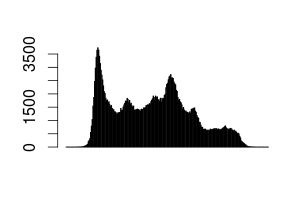
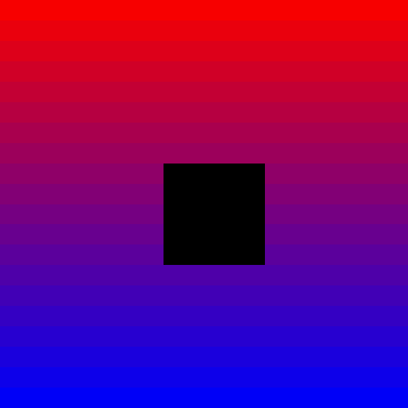

.. highlight:: r

.. _sec-rrasdaman:

###############
RRasdaman Guide
###############

*RRasdaman* is an ``R`` package providing database interface for rasdaman.

Prerequisites
-------------

- Installed and running rasdaman (see :ref:`inst-guide`).
- Installed RRasdaman package 
- Familiarity with ``R``. This tutorial is an introduction into the RRasdaman package, not 
  ``R`` itself. To learn more about the ``R`` language, start from the official 
  `Introduction to R <http://cran.r-project.org/doc/manuals/R-intro.html>`_.
- Familiarity with rasql, the rasdaman query language. Please refer to the 
  :ref:`ql-guide`.

Connect to rasdaman
-------------------

The first thing to do is to establish a connection to the rasdaman
database from R: ::

    library(RRasdaman)
    conn <- dbConnect(Rasdaman())

Connection is the object which allows to send queries to database and to manage
transactions. One can also specify host, port, username and password which
should be used for the connection. Additionally, connections could be read-only
and writable. The full signature of the ``dbConnect`` method and its default
arguments are the following: ::

    dbConnect(drv, host = "localhost", port = 7001,
            dbName = "RASBASE", user = "rasguest",
            password = "rasguest", mode = CONN_READ_ONLY)

Do not forget to close your connection with ``dbDisconnect(conn)`` after the
work is done! You always can list all open connections with . Here is an example
on how to create several connections and close them in one command: ::

    > conn1 <- dbConnect(Rasdaman())
    > conn2 <- dbConnect(Rasdaman())
    > dbListConnections(Rasdaman())
    [[1]]
    An object of class "RasdamanConnection"
    Slot "jObj":
    [1] "Java-Object{RasConnection{ host=localhost, port=7001, db=RASBASE, user=rasguest, mode=READ_ONLY, alive=true }}"

    [[2]]
    An object of class "RasdamanConnection"
    Slot "jObj":
    [1] "Java-Object{RasConnection{ host=localhost, port=7001, db=RASBASE, user=rasguest, mode=READ_ONLY, alive=true }}"

    > lapply(dbListConnections(Rasdaman()), dbDisconnect)
    > dbListConnections(Rasdaman())
    list()

Handles
-------

After the connection is established, we can send our first query and
read some data from rasdaman. Let's compute the average temperature over
the whole observation period from the "climate\_temperature" dataset: ::

    handles <- dbGetQuery(conn, "select avg_cells(x) from climate_temperature as x")
    length(handles)
    # [1] 1
    simplify(handles[[1]])
    # [1] 272.1054

First, we send a query to rasdaman with ``dbGetQuery`` in rasql language. The
result is a list of *handles* for each result of query execution over arrays in
the collection. A handle represents the query execution result which is not yet
converted into R data representation. In our case there is only one array in the
collection "climate\_temperature", so we have only one result, so we have only
one handle.

Then we convert the returned handle into an R object with the ``simplify``
method and can see the scalar result.

Arrays representation
---------------------

Now let's look what happens if we retrieve some array, not the single scalar
value. ::

    > handles <- dbGetQuery(conn, "select (RGBPixel) x[0:1,0:1] from rgb as x")
    > obj <- simplify(handles[[1]])
    > obj
    An object of class "RasdamanArray"
    Slot "array":
    $red
      [,1] [,2]
    [1,]  169  168
    [2,]  169  168
    $green
      [,1] [,2]
    [1,]  210  209
    [2,]  210  209
    $blue
      [,1] [,2]
    [1,]  212  211
    [2,]  216  213

    Slot "origin":
    [1] 0 0

As we can see, the result is an object of S4 class ``RasdamanArray``. It has two
slots: array and origin, which could be accessed as ``obj@array`` and
``obj@origin``. The origin of an array is the coordinates of its lowermost
leftmost cell. The ``obj@array`` slot is a list of N-D matrices, each matrix
represents one of N attribute. For example, one can use both ``obj@array$green``
and ``obj@array[[2]]`` to access the green channel values, as green is the
second component of the RGB structure.

Displaying data
---------------

Rasdaman has a flexible query language, so in many cases it is possible to
compute sophisticated expressions on the server side rather than doing them in
R. For example, one can fetch the full dataset into R session and build the
histogram over its values, but it is also possible compute histogram with rasql.
The second approach requires less data to be transmitted between the rasdaman
server and the client application, and the client needs less memory to store it.
In the following example we build the histogram of pixel intensities: ::

    handles <- dbGetQuery(conn, "select marray n in [0:255] values count_cells(c = n[0]) from lena as c")
    data <- simplify(handles[[1]])
    values <- data@array[[1]]
    barplot(values)

Writing data
------------

If one wants to write some data to rasdaman, a connections with write
permissions needs to be created: ::

      conn <- dbConnect(Rasdaman(), user="rasadmin", password="rasadmin", mode=CONN_READ_WRITE)

We can create a collection with regular rasql syntax. Let's create a collection
``images`` of 2-D RGB data: ::

      dbGetQuery(conn, "create collection images RGBSet")

Now we need data to be inserted into the newly created collection. Let's
generate some image of size 20x20 with smooth gradient from red to blue. The
origin point (i.e. leftmost lowermost coordinate of the array) will be
``[0,0]``. ::

    n <- 20
    m <- 20
    red <- array(seq(247,0, length.out=n), c(n, m))
    green <- array(0, c(n, m))
    blue <- array(seq(0, 247, length.out=n), c(n, m))
    origin <- as.integer(c(0,0))
    arr <- RasdamanArray(list(red=red, green=green, blue=blue), origin)

This generated array can be inserted into the collection with method
``dbInsertCollection``: ::

    dbInsertCollection(conn, name="images", value=arr, typename="RGBImage")
    # [1] 420865

We need to specify collection name, array to be inserted and the type of the
array. The method returns one number -- the object identifier of the newly
inserted array.

Now let's update the inserted data. We will set to zero all values in the middle
of the newly inserted array. For this we need to create an array with new
values. ::

    zeroes <- array(0, c(5,5))
    origin = as.integer(c(8,8))
    updArray <- RasdamanArray(list(red=zeroes, green=zeroes, blue=zeroes), origin)
    dbUpdateCollection(conn, name="images", value=updArray, typename="RGBImage")

After the collection is updated, we can read the values, display the result and
close the connection: ::

    handles <- dbReadCollection(conn, "images")
    result <- simplify(handles[[1]])

    library(grid)
    picture <- rgb(result@array[[1]], result@array[[2]], result@array[[3]], max=255)
    dim(picture) <- dim(result)
    grid.raster(picture, interpolate=F)
    dbDisconnect(conn)

The list of allowed type names could be obtained with a rasql query, 
see :ref:`sec-rasql-typedef`.

Transaction management
----------------------

The methods ``dbCommit`` and ``dbRollback`` could be used for transaction
management. There is no need to explicitly specify beginning of the transaction.
The method ``dbDisconnect`` commits the transaction before closing the
connection.

Further reading
---------------

You can type ``?RRasdaman::RRasdaman`` and ``help.search("RRasdaman")`` at any
time from R prompt to see more package documentation.
