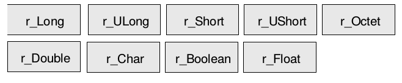
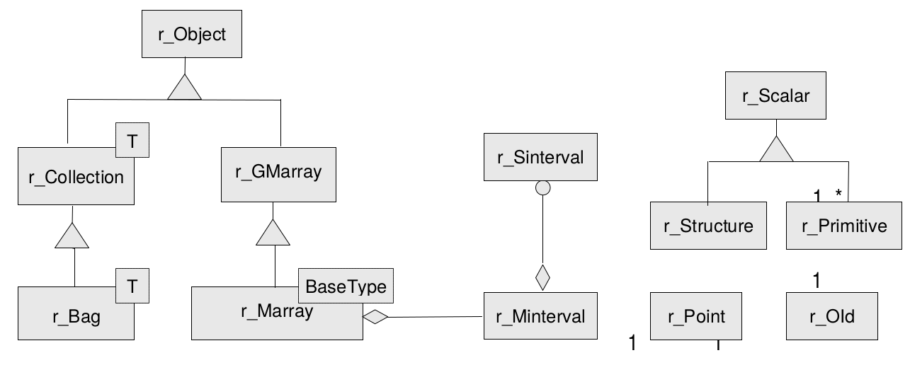
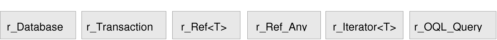
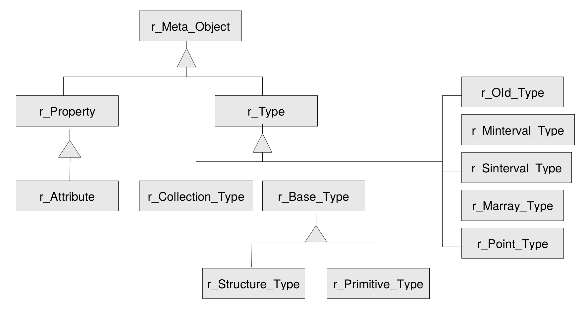
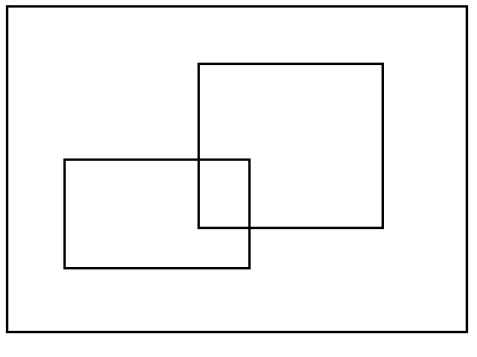
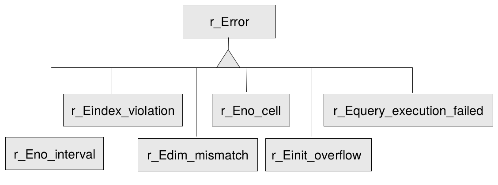

.. highlight:: c++

.. _cpp-dev-guide:

####################
C++ Developers Guide
####################

*******
Preface
*******

Overview
========

This guide provides information about how to use the rasdaman database
system (in short: rasdaman). The booklet explains usage of raslib, the
rasdaman API, through its C++ binding.

Follow the instructions in this guide as you develop your application
which makes use of rasdaman services. Explanations detail how, from
within a C++ program, to create databases, collections, and instances;
how to retrieve from databases; how to manipulate and delete instances
within databases; how to influence physical storage parameters; how to
do transaction handling and other administrative tasks.

The rasdaman interfaces are available on different operating system
platforms. Although there are some differences in the way rasdaman
appears in these different versions, the functionality is the same.

Audience
========

The information in this manual is intended primarily for application
developers and for database administrators.

Rasdaman Documentation Set
==========================

This manual should be read in conjunction with the complete rasdaman
documentation set which this guide is part of. The documentation set in
its completeness covers all important infor­mat­ion needed to work with
the rasdaman system, such as programming and query access to databases,
guidance to utilities such as *raswct*, release notes, and additional
information on the rasdaman wiki.

The rasdaman Documentation Set consists of the following docu­ments:

-  Installation and Administration Guide
-  Query Language Guide
-  C++ Developer's Guide
-  Java Developer's Guide
-  raswct Developer's Guide
-  the rasdaman wiki, accessible at `www.rasdaman.org <http://www.rasdaman.org>`_

************
Introduction
************

See the corresponding :ref:`introduction` Section in the *rasdaman Query Language
Guide*.

***********
Terminology
***********

See the corresponding :ref:`terminology` Section in the *rasdaman Query Language
Guide*.

********************
Application Examples
********************

The following sections contain three examples of using the rasdaman API.
Every example contains a code fragment including variable decla­rations
and definitions, database open/close and transaction be­gin/commit
statements. The numbers at the beginning of the code lines are used as
references in the explaining text. Code segments which are in more than
one example are explained where they occur first. For more clarity,
error handling was omitted.

As raslib heavily makes use of templates, some platform specifics have
to be considered when compiling and linking application programs. These
are collected in :ref:`sec-compilation-linkage`.

For details on the operational semantics of the rasdaman data model the
reader is strongly encouraged to study the *rasdaman Query Language
Guide*.

Basic Application Program Structure
===================================

**Operation sequence**

In order to access data in a database, variables have to be first
defined and initialized, the database has to be opened and a transaction
started. In the end, the transaction has to be committed and the
data­base closed. Hence, an application basically consists of the
following com­ponents (sample C++ code interspersed as far as rasdaman
access is concerned):

-  Declaration and definition of database and transaction variables and
   other data like images or image sets ::

       r_Database database;
       r_Transaction transaction{&database};

-  Set the server name using the default port 7001. ::

       database.set_servername( "ServerName" );

-  Set user identification. ::

        database.set_useridentification( "me", "myPassword" );

-  Open the database. ::

        database.open( "DatabaseName" );

-  Begin the transaction. ::

        transaction.begin();

-  Work with the database.

-  Commit the transaction. ::

        transaction.commit();

-  Close the database. ::

        database.close();

**Synchronous query execution**

When a query is sent to the rasdaman server it will be executed in
completeness - a running query cannot be aborted [1]_. Care should be
taken therefore not to start queries requir­ing resources beyond the
capability of the server hardware and soft­ware environment, as the
rasdaman service may be blocked for an indefinite time period.

Insertion of MDD
================

The following example creates a new MDD set with the name ULongSet and
inserts two images into this set. The first image is initialized with
zero, and the second one by way of some assumed initialization function.

(1)  The variable declaration part includes one instance of type
     ``r_Database`` to represent the database and one instance of type
     ``r_Transaction`` to serve for the transaction handling. The
     do­main of type ``r_Minterval`` is used for specifying the spatial
     do­main of the images. In order to hold a persistent image,
     image has to be declared as an ``r_Ref`` pointer on the ``r_Marray``
     struc­ture. The same applies for ``image_set`` which is an ``r_Ref``
     to the set of images.

     ::

         r_Database database;
         r_Transaction transaction{&database};
         r_Minterval domain;
         r_Ref< r_Marray<r_ULong> > image;
         r_Ref< r_Set< r_Ref< r_Marray<r_ULong> > > > image_set;

(2)  Server name and password are set (see :ref:`sec-class-database`).

     ::

         database.set_servername( "MyServer" );
         database.set_useridentification( "me", "myPassword" );

(3)  An open message with the database name is sent to the data­base
     object. ::

         database.open( "MyDatabase" );

(4)  The transaction is opened using the transaction object.

     ::

         transaction.begin();

(5)  Memory for the image set is allocated using the new operator of
     class ``r_Object``. As additional arguments, the new operator gets
     the database object in which it is to be inserted and the type
     name which was created in the database (see :ref:`sec-rasql-typedef`).

     ::

         image_set = new( &database, "ULongSet" )
                     r_Set< r_Ref< r_Marray<r_ULong> > >(&transaction);

(6)  To give a name to the set for later retrieval, a ``set_object_name``
     message is sent to the database object. ::

         database.set_object_name(*image_set, "MyCollection");

(7)  The spatial domain ``domain`` of the first is initial­ized with
     ``[1:91,1:91]``. For doing so, a temporary two-dimensional object
     of type ``r_Minterval`` is filled with ``r_Sintervals`` specifying
     lower and upper bounds per dimension and then gets as­signed to
     ``domain``.

     ::

         domain = r_Minterval(2) << r_Sinterval( 0l, 9l )
                                 << r_Sinterval( 0l, 9l );

(8)  Memory for a persistent object of type ``r_Marray`` is allocated
     us­ing the new operator of ``r_Ref``. Again, the new operator gets
     the current database and the type name of the MDD object
     (creation of types is described in :ref:`sec-rasql-typedef`).
     The constructor of ``r_Marray`` gets the value
     zero which is used for initializing the whole MDD.

     ::

         image = new( &database, "ULongImage" )
                 r_Marray<r_ULong>( domain, 0ul, &transaction );

(9)  The image created in (7) is now inserted into the set. From now on,
     the persistent object is accessible via the collection. ::

         image_set->insert_element( image );

(10) The second image is created with a function pointer as second
     ar­gument for the ``r_Marray`` constructor. The function must be
     of type ``r_ULong (*initFunction)(const r_Point& pt)``. The
     function is invoked for each cell of the MDD with the current
     coordinates of the cell passed as the pt argument. The result
     value of type ``r_ULong`` is taken for the initial value of the
     cell.

     ::

         image = new( &database, "ULongImage" )
                 r_Marray<r_ULong>( domain, &initWithCoordinates, &transaction );

(11) The image created in (9) is inserted into the set.

     ::

         image_set->insert_element( image );

(12) The transaction is committed. At this time, the image set is
     cre­ated in the database and the images are inserted. The data
     is made persistent and becomes visible to other transactions.
     The transient memory used to store the image on client side is
     freed and pointers to these objects (``image_set`` and ``image``)
     become invalid.

     ::

         transaction.commit();

(13) The last statement closes and disconnects the database.

     ::

         database.close();

For completeness, the following code segment describes the function used
for initializing each cell of an MDD with the coordinates ``x+256*y``: ::

    r_ULong initWithCoordinates( const r_Point& pt )
    {
        r_ULong value = pt[0] + pt[1] * 0x100;
        return value;
    }

Lookup of an MDD set by its name
================================

This example demonstrates retrieval of a set containing MDD objects as
elements and iteration through the retrieved result set using raslib.

(1) An iteration variable named ``iterator`` is defined. It needs the
    ele­ment type of the collection being iterated as template
    argu­ment.

    ::

        r_Database database;
        r_Transaction transaction{&database};
        r_Ref< r_Set< r_Ref< r_GMarray > > > image_set;
        r_Ref< r_GMarray > image;
        r_Iterator< r_Ref< r_GMarray > > iter;

(2) A read-only transaction is started for the retrieval query.
    Read-only transactions should be used whenever possible, i.e.,
    when no update operations occur within this transaction, in
    order to have maximal performance.

    ::

        database.set_servername( "ServerName" );
        database.set_useridentification( "me", "myPassword" );
        database.open( "DatabaseName" );
        transaction.begin( r_Transaction::read_only );

(3) The set is retrieved by sending a ``lookup_object`` message with the
    set name to the database object. At this moment, just a set of
    object identifiers is sent back to the client.

    ::

        image_set = database.lookup_object("CollectionName");

(4) The statement creates an iteration variable pointing to the first
    element of the set. ::

        iter = image_set->create_iterator();

(5) A simple ``for`` loop is used for iterating through the collection.
    An element of the collection, which is an r_Ref pointer to the MDD
    object, can be accessed by dereferencing the iteration variable
    ``iter``. The image itself is retrieved from the server when the r_Ref
    pointer is dereferenced for the first time.

     ::

        for (iter.reset(); iter.not_done(); iter++)
        {
            image = (*iter);
            // work with the image
            // for example print its spatial domain
            cout << image->spatial_domain() << endl;
        }

(6) The query result is valid only until transaction end.

     ::

        transaction.commit();
        database.close();

.. _sec-invocation-of-rasml:

Invocation of RasML statements
==============================

This example shows the creation and invocation of RasML queries us­ing
the raslib classes:

(1) Two domains, a collection name, and a threshold value are de­fined
    to use them at creation stage of the RasML query.

    ::

        r_Minterval select_domain = r_Minterval("[0:4,0:4]");
        r_Minterval where_domain = r_Minterval("[8:9,8:9]");
        char collection_name[] = "CollectionName";
        r_ULong threshold_value = 10;

        r_Database database;
        r_Transaction transaction{&database};
        r_Set< r_Ref< r_GMarray > > image_set;
        r_Ref< r_GMarray > image;
        r_Iterator< r_Ref< r_GMarray > > iter;

        database.set_servername( "ServerName" );
        database.set_useridentification( "me", "myPassword" );
        database.open( "DatabaseName" );

(2) A read-only transaction is started for the retrieval query.
    Read-only transactions should be used whenever possible, i.e.,
    when no update operations occur within this transaction, in
    order to have maximal performance.

    ::

        transaction.begin( r_Transaction::read_only );

(3) The query object of type ``r_OQL_Query`` is created and initialized
    with the parameterized query string.

    ::

        r_OQL_Query query( "select a$1 from $2 as a where some_cells( a$3 > $4 )" );

(4) The query parameters are filled using stream operators on the query
    object. First, the domain of type ``r_Minterval`` for the select
    part is applied, then the collection name, the domain for the
    where clause, and the threshold value are inserted.

    ::

        query << select_domain << collection_name << where_domain << threshold_value;

    The resulting query string looks like follows:

    .. code-block:: rasql

        select a[0:4,0:4]
        from CollectionName as a
        where some_cells( a[8:9,8:9] > 10 )

(5) Finally, the query is executed using the global function
    ``r_oql_execute``. The query result is returned in the
    call-by-refer­ence parameter ``image_set``. As query results are
    transient, the data of the whole result is sent to the client at
    this point.

    ::

        r_oql_execute( query, image_set, &transaction );
        iter = image_set.create_iterator();
        for( iter.reset(); iter.not_done(); iter++ )
        {
            image = (*iter);
            // work with the image
        }
        transaction.commit();
        database.close();

**************
Raslib Classes
**************

Overview
========

The raslib classes represent the rasdaman programming interface. It
relies on the ODMG standard with some extensions sup­porting a smooth
integration of the rasdaman-specific array struc­tures into the
conventional C++ programming model.

raslib classes are categorized in

-  *Type Classes* providing type information for MDD objects,

-  *Object Classes* for handling persistent MDD objects,

-  *System Classes* for general tasks such as session maintenance and
   database querying,

-  *Schema Access Classes* to get runtime type information,

-  *Stor­age Layout Classes* for handling the storage structure, and

-  *Error Classes* for error handling.

Type Classes
============

.. _fig-primitive-types:

   Primitive Types

The types ``r_Long``, ``r_ULong``, ``r_Short``, ``r_UShort``, ``r_Octet``, ``r_Char``,
``r_Boolean``, ``r_Float``, and ``r_Double`` are atomic, serving as base types
for MDD objects (:numref:`fig-primitive-types`). Com­posite types built from
atomic (primitive) or other complex (struc­tured) types are built using the
record (struct) constructor.

Complex numbers, while by nature equivalent to a record structure
``{float re,im;}``, are provided as a built-in type. Type complex implements
complex numbers on single-precision float components while ``complexd``
implements double-precision.

Null values, i.e., values of cells which have not been assigned a value
yet, always are the numerical zero value of the corresponding type. This
extends in the obvious way to composite cells.

.. table:: Correspondence between rasql and C++ types

    +--------------------+-----------------+------------+---------------------------------+
    | rasql              | C++ binding     | Length     | Description                     |
    +====================+=================+============+=================================+
    | ``octet``          | ``r_Octet``     | 8 bit      | signed integer                  |
    +--------------------+-----------------+------------+---------------------------------+
    | ``char``           | ``r_Char``      | 8 bit      | unsigned integer                |
    +--------------------+-----------------+------------+---------------------------------+
    | ``short``          | ``r_Short``     | 16 bit     | signed integer                  |
    +--------------------+-----------------+------------+---------------------------------+
    | ``unsigned short`` | ``r_Ushort``    | 16 bit     | unsigned integer                |
    +--------------------+-----------------+------------+---------------------------------+
    | ``long``           | ``r_Long``      | 32 bit     | signed integer                  |
    +--------------------+-----------------+------------+---------------------------------+
    | ``unsigned long``  | ``r_Ulong``     | 32 bit     | unsigned integer                |
    +--------------------+-----------------+------------+---------------------------------+
    | ``float``          | ``r_Float``     | 32 bit     | single precision floating point |
    +--------------------+-----------------+------------+---------------------------------+
    | ``double``         | ``r_Double``    | 64 bit     | double precision floating point |
    +--------------------+-----------------+------------+---------------------------------+
    | ``boolean``        | ``r_Boolean``   | 1 bit [2]_ | true (nonzero value)            |
    |                    |                 |            | false (zero value)              |
    +--------------------+-----------------+------------+---------------------------------+
    | ``complex``        | ``r_Complex``   | 64 bit     | Single precision complex number |
    +--------------------+-----------------+------------+---------------------------------+
    | ``complexd``       | ``r_Complex``   | 128 bit    | Double precision complex number |
    +--------------------+-----------------+------------+---------------------------------+

Object Classes
==============

Object Classes are used for the data exchange with the database. They
consist of classes able to generate and handle persistent arrays, i.e.,
arrays stored in a database, intervals, multidimensional intervals,
multidimensional points, and scalar data which can either be atomic
(primitive) or complex (structured). :numref:`fig-object-classes` shows the
object classes provided by rasdaman.

.. _fig-object-classes:

   Object Classes

Class ``r_Point``
-----------------

Class ``r_Point`` handles multidimensional points.

**Example**

::

    r_Point pointname( 5, 4 );

Class ``r_Sinterval``
---------------------

Class ``r_Sinterval`` represents a one-dimensional interval with lower and
upper bound. Both bounds can either be fixed or variable (indi­cated by
an asterisk '\*'). Operations on intervals are defined following
conventional interval arithmetics.

**Example**

::

    r_Sinterval(100L, 200L)

specifies the interval [100:200].

Class ``r_Minterval``
---------------------

The spatial domain of an MDD is represented by an object of class
``r_Minterval`` ("multidimensional interval"). It specifies lower and upper
bound of the point set for each dimension of an MDD. Internally, the
class is implemented through an array of intervals of type ``r_Sinterval``.

**Example**

``r_Minterval intervalname("[0:100, 0:300]");``

The object generated by the above expression yields the following
output:

::

    intervalname.dimension() = 2
    intervalname[0].low()    = 0
    intervalname[0].high()   = 100

Class ``r_OId``
---------------

This handles object identifiers. Every array has a unique object
identi­fier it can be addressed with.

Class ``r_Object``
------------------

``r_Object`` is an abstract class. Instances can only be generated from the
non abstract classes inheriting from this class, that is ``r_Set``,
``r_GMarray`` and ``r_Marray<T>``. All these subclasses are capable of hav­ing
persistent as well as transient instances and therefore are called
persistent capable classes.

Objects of these classes can be generated using the overloaded new
operator:

::

    void* operator new( size_t size )                          // (1)
    void* operator new( size_t size, r_Database* database,
                        const char* type_name = 0 )            // (2)
    void* operator new( size_t size, const char* type_name )   // (3)

(1) is used to create transient objects. The only argument is the size
    of the new object.

(2) To generate persistent instances one also has to specify the
    data­base the object is to be inserted in.

(3) is the new operator for transient objects carrying type information.

**Calling the delete operator**

::

    void operator delete( void* obj_ptr )

removes the object from memory and, in case it is a persistent object,
from the database.

Classes ``r_Marray<T>`` and ``r_GMarray``
-----------------------------------------

The template class ``r_Marray<T>`` represents an MDD object over cell type
``T``. Class ``r_GMarray`` is more generic in that it is able to represent MDD
objects of any base type. This is necessary, firstly, for having a
generic class for query results where the base type is not known at
compile time and, secondly, for composite (multi-band) types.

The template class ``r_Marray<T>`` for specific base types inherits from
``r_GMarray``; the constructor ``r_Marray<T>( r_GMarray& )`` is provided for
easy transformation to cell type safe m-arrays where the base type is
known at compile time. Operations for accessing single cells are only
available for ``r_Marray<T>``.

Class ``r_Collection``
----------------------

``r_Collection`` is an abstract class. It is the basic class of a
collection. Possible subclasses are ``r_Set`` , ``r_Bag`` and ``r_List``. The
protected members ``isOrdered`` and ``allowsDuplicates`` are not initialized
here, they have to be initialized in the respective subclasses. The
method

::

    virtual void insert_element ( const T& element, int no_modification = 0 )

inserts an element into the collection. If ``no_modification`` is set, the
``mark_modified()`` method of ``r_Object`` is not invoked and, therefore, a
modification will not be recognized at the transaction commit point.

Class ``r_Set``
---------------

The class implements a set container. It inherits most of the
function­ality from ``r_Collection``. The set can not have any duplicates
and it is not ordered. The method

::

    virtual void insert_element ( const T& element, int no_modification = 0 )

inserts an element into the collection. If ``no_modification`` is set, the
``mark_modified()`` method of ``r_Object`` is not invoked and, therefore, a
modification will not be recognized at the commit point.

Classes ``r_Scalar``, ``r_Primitive`` and ``r_Structure``
---------------------------------------------------------

The subclasses of ``r_Scalar`` are used to represent query results of the
primitive types ``r_Boolean``, ``r_Char``, ``r_Octet``, ``r_Short``, ``r_UShort``,
``r_Long``, ``r_ULong``, ``r_Float``, ``r_Double`` and types composed of the
primitive ones.

Class ``r_Primitive`` supports type-safe value access methods. ``r_Structure``
allows to access its elements by the subscript operator [].

**Examples**

The following line shows access to an unsigned short value:

::

    r_Primitive primitive;
    // ...
    r_UShort value = primitive.get_ushort();

A structured value consisting of three long values can be accessed as
follows:

::

    r_Structure structuredValue;
    // ...
    for( int i=0; i<structuredValue.count_elements(); i++ )
    {
        value = ((r_Primitive&)structuredValue[i]).get_long();
        //...
    }

System Classes
==============

   System Classes

.. _sec-class-database:

Class ``r_Database``
--------------------

Class ``r_Database`` allows to open and close connections to a specific
database. The database name and the address of a running server manager
must be indicated. Further optional parameters are

-  port number (default: 7001),

-  access mode (read/write or read-only; by default: read-only),

-  login (default: ``"rasguest"``)

-  password (default: ``"rasguest"``).

A database object must be instantiated and opened before starting any
transaction on the database, and closed after end­ing these transactions
(with a commit or abort).

**Which Server to Contact?**

Note that the server/port to be indicated must address the rasdaman
server *manager* (not a particular rasdaman server); if in doubt,
consult your system administrator.

**Example**

::

    r_Database database;
    database.set_servername( "Server Name" );
    database.set_useridentification( "login name", "passwd" );
    database.open( "Database Name" );
    // ...
    database.close( );

**Storage Format**

The ``r_Database`` class also allows to set the storage format, both for
storage in MDD objects in the server and for their transfer between
client and server. See :ref:`sec-class-convertor` for details.

Class ``r_Transaction``
-----------------------

To use a transaction, an object of type ``r_Transaction`` has to be
in­stantiated with an optional ``r_Database`` object as an argument (*not*
thread-safe if the database parameter is not specified).
Transactions can be started either in read/write or
read-only mode, committed, aborted, and checkpointed. It is important to
note that all access, creation, modification, and deletion of persistent
objects must be done within a transaction. In order to achieve maximal
performance, read-only transactions should be used when­ever possible,
i.e., when no update operations occur within this trans­action. Right
now checkpointing is not supported.

::

    r_Transaction transaction{&database};
    transaction.begin( );
    // ...
    transaction.commit( );

Classes ``r_Ref<T>`` and ``r_Ref_Any``
--------------------------------------

An instance of template class ``r_Ref<T>`` is a reference to an instance of
type ``T`` and is used to reference persistent sets ``(r_Set<T>)`` and MDD
objects ``(r_GMarray and r_Marray<T>)``. It behaves like a normal C++
pointer but is capable of managing persistent data of type T within a
transaction. In case the ``r_Ref<T>`` pointer is dereferenced (using the
operator ->) and the object it is pointing to is not in the client
memory yet, it is retrieved from the server.

The class ``r_Ref_Any`` is defined to support a reference to any type. Its
primary purpose is to handle generic references and allow conversions of
``r_Ref<T>`` in the type hierarchy. A ``r_Ref_Any`` object can be used as an
intermediary between any two types ``r_Ref<X>`` and ``r_Ref<Y>`` where ``X``
and ``Y`` are different types. A ``r_Ref<T>`` can always be converted to a
``r_Ref_Any``; there is a function to perform the conversion in the
``r_Ref<T>`` template. Each ``r_Ref<T>`` class has a constructor and
assignment operator that takes a reference to a ``r_Ref_Any``.

Class ``r_Iterator<T>``
-----------------------

The template class ``r_Iterator<T>`` defines the generic behavior for
iteration. An object of this class can be used within a ``for`` loop for
iterating through a collection of MDD objects. All iterators use a
consistent protocol for sequentially returning each element from the
collection over which the iteration is defined. When an iterator is
constructed, it is either initialized with another iterator or is set to
null. When an iterator is constructed via the method
``r_Collection<T>::create_iterator()``, the iterator is initialized to
point to the first element, if there is one.

Class ``r_OQL_Query`` and the freestanding function ``r_oql_execute()``
-----------------------------------------------------------------------

A query statement is represented through an object of class
``r_OQL_Query`` (see :ref:`sec-invocation-of-rasml`). The ``r_OQL_Query`` constructor gets a
query string which optionally can be parametrized. In this case, ``$i``
indicates the i-th parameter. The ``$i`` do not have to appear in a strict
order - for example, ``$3`` may appear before ``$2`` in the statement.

The overloaded stream operator inserts the corresponding parameter
values into the query, at the same time preserving their respective
types. The query object expects parameters in the sequence of ``$1``, ``$2``,
and so on. If any of the ``$i`` is not followed by a parameter at the point
``r_oql_execute()`` is called, an ``r_Error exception`` object of kind
``r_Error_QueryParameterCountInvalid`` will be thrown.

A query is executed against an open database through invocation of the
freestanding function ``r_oql_execute()``. This overloaded function exists
in four variants:

::

    void r_oql_execute( r_OQL_Query & query,
                        r_Transaction* transaction = nullptr )

    void r_oql_execute( r_OQL_Query & query, r_Set<r_Ref_Any>& result, int dummy,
                        r_Transaction* transaction = nullptr );

    void r_oql_execute( r_OQL_Query & query, r_Set<r_Ref<r_GMarray>> & result_set,
                        r_Transaction* transaction = nullptr )

    void r_oql_execute( r_OQL_Query & query, r_Set<r_Ref<r_Any>> & result_set,
                        r_Transaction* transaction = nullptr )

The first version is used for ``insert`` (until v9.1), ``update``, and ``delete``
statements where no result is passed back. The second version is used for
``insert`` queries, where the result contains the unique OID of the inserted
object; the third parameter has no function and is there to distinguish this
from the next two versions. The third version is for executing ``select``
statements where an MDD is returned; in this case, the second parameter
receives the query result. The final case is for general query results
which may also contain non-MDD return values, e.g., resulting from
``select oid(...)`` or ``select sdom(...)`` statements. This version will also be
used when the result type of a query is not known in advance (i.e., at
compile time). In this case, an ``r_Ref_Any`` object is returned, and the
application is responsible for decoding the proper type. In support of
this, ``r_Ref_Any`` objects contain their type information (see
:ref:`sec-dynamic-type-info`).

In all cases, the ``result_set`` parameter does not have to be initialised,
and any previous contents is discarded by ``r_oql_execute()``.

.. note::

    The ``transaction`` parameter is optional. If not specified, there is no
    guarantee on thread-safety (in fact queries will likely fail). The same
    holds for all other public API: if there is an ``r_Database`` or
    ``r_Transaction`` parameter, it is best to specify it to ensure correct
    usage in concurrent code.

Once a query has been executed via ``r_oql_execute()``, the arguments
associated with the $i parameters are cleared and new arguments must be
supplied.

**Example**

The following code fragment creates a query string with two parameters
``$1`` and ``$2``.

::

    r_OQL_Query query1( "select a$1 from $2 as a" );

Now two query parameters are generated:

::

    r_Minterval select_domain = r_Minterval( 2 )
                             << r_Sinterval( 100L, 199L )
                             << r_Sinterval( 0L, 149L );
    char collection_name[] = "mr";

Next, the parameters are attached to the query using the stream
operator:

::

    query1 << select_domain << collection_name;

The resulting query string is

.. code-block:: rasql

    select a[ 100:199, 0:149 ] from mr as a

**Example**

The following code shows how to attach an MDD object to an insert query:

::

    r_Marray<r_Char> mddObject(...);                 // (1)
    r_OQL_Query query("insert into mr1 values $1");  // (2)
    query << mddObject;                              // (3)

Explanation:

(1) A transient MDD named mdd is created.

(2) The query object of type ``r_OQL_Query`` is initialized with an insert
    query statement including a placeholder ``$1``.

(3) The MDD object is attached to the parameter ``$1`` of the query.

Schema Access Classes
=====================

The rasdaman Schema Access Classes (cf. :numref:`fig-schema-access-classes`)
enable the user to determine the type of a query result at runtime.

.. _fig-schema-access-classes:

   Schema Access Classes

Class ``r_Meta_Object``
-----------------------

Instances of class ``r_Meta_Object`` are used to describe elements of type
information. The class holds a name standing for the type name of its
instances.

Class ``r_Type``
----------------

``r_Type`` is an abstract base class for all type descriptions. It provides
runtime type information through the method ``type_id()`` which returns a
value of type ``r_Type_Id``. It is an identifier of the following list:

::

    BOOL, OCTET, CHAR, SHORT, USHORT, LONG, ULONG, FLOAT, DOUBLE,
    STRUCTURETYPE, MARRAYTYPE, COLLECTIONTYPE, SINTERVALTYPE, MINTERVALTYPE,
    POINTTYPE, OIDTYPE, COMPLEXTYPE1, COMPLEXTYPE2

Class ``r_Collection_Type``
---------------------------

The class represents the type of a collection object. The type of the
collection elements can be determined using method ``element_type()``.

Class ``r_Base_Type``
---------------------

``r_Base_Type`` is an abstract base class for all type descriptions
allowed as MDD base types which can either be primitive or structured
types. The method ``size()`` delivers the size of a type instance in bytes.

Class ``r_Primitive_Type``
--------------------------

This class represents all primitive types in the ODMG-conformant
representation of the rasdaman type system.

Class ``r_Structure_Type``
--------------------------

This class represents all user defined structured types in the
ODMG-conformant representation of the rasdaman type system. They are
returned using the method ``print_status()``. Members are described by
``r_Attribute`` instances and represent the state or the structure. They
can be accessed using an iterator of type ``attribute_iterator``.
Structures do not have object identity.

Class ``r_Property``
--------------------

This class is an abstract base class for all elements describing the
state of an application-defined type. Right now, the only subclass is
``r_Attribute``.

Class ``r_Attribute``
---------------------

An instance of ``r_Attribute`` describes an object or a literal. An
attribute has a name and a type. The name is returned by the inherited
method ``r_Meta_Object::name()``. The type description of an attribute can
be obtained using the inherited method ``r_Property::type_of()``. The
method offset() gives back the byte offset of the corresponding data
area within a structure. If the attribute is not defined within a
structure, the offset is zero.

**Example**

The structure ::

    struct
    {
        char red;
        char green;
        char blue;
    };

has three attributes. The name of the third one, for example, is ``blue``,
its type is ``char`` and its offset ``2``.

Class ``r_Minterval_Type``
--------------------------

The class represents the type of an ``r_Minterval`` object.

Class ``r_Sinterval_Type``
--------------------------

The class represents the type of an ``r_Sinterval`` object.

Class ``r_Point_Type``
----------------------

The class represents the type of an ``r_Point`` object.

Class ``r_Marray_Type``
-----------------------

The class represents the type of an r_Marray object. The base type of
the MDD object can be determined using the method ``base_type()``.

Class ``r_Oid_Type``
--------------------

The class represents the type of an r_Oid object. The only meaningful
comparison operations are equality and inequality of two OIDs.

Entry Points of the Type Schema
-------------------------------

The type information can be accessed using one of the following methods: ::

    const r_Type* r_Object::get_type_schema()

    const r_Base_Type* r_GMarray::get_base_type_schema()

    const r_Type* r_Collection::get_element_type_schema()

.. _sec-dynamic-type-info:

Example: Dynamic Type Information of a Query Result
---------------------------------------------------

In a query, new structures can be created which are not already defined
in the database schema. For example, the following query forces the
server to introduce an array type based on a 2-component cell structure:

.. code-block:: rasql

    select { img.red, img.green }
    from rgb as img

Regardless of a result object's type being a database type or created on
the fly, the type information can be accessed using the previously
introduced type functions. The following - incomplete - code piece
prints out the type information associated with the MDD objects of a
query result.

::

    r_Bag< r_Ref_Any > result_set;
    // ...query preparation...
    r_oql_execute( query_object, result_set );
    r_Iterator< r_Ref_Any > iter = result_set.create_iterator();
    for( iter.reset(); iter.not_done(); iter++, i++ )
    {
        switch( result_set.get_element_type_schema()->type_id() )
        {
        case r_Type::MARRAYTYPE:
            r_Ref<r_GMarray>(*iter)->print_status( cout );
            break;
        case r_Type::POINTTYPE:
            r_Ref<r_Point>(*iter)->print_status( cout );
            break;
        // etc.
        }
    }

.. note::
    A result set may contain structures other than MDD, e.g., when
    a spatial domain or some aggregate scalar is specified in the select
    clause. E.g. the query

    .. code-block:: rasql

        select sdom( a ) [0].lo
        from mr as a

    returns a set of integer values.

Storage Layout Classes
======================

A specialized storage structure for MDD objects is used in secondary
storage, which is designed to provide fast access to persistent MDD
objects for the most typical operations on such objects. This storage
structure is configurable so that it is possible to set the different
parameters (*storage options*) that define it. The storage options for
an MDD object should be set depending on the access characteristics
expected for that object. The current version allows to configure
*tiling* (i.e., the subdivision algorithm used for the MDD objects) and
*storage format* (i.e., the way how MDD tiles are encoded and compressed
in the database and how MDD objects are compressed for client/server
transfer).

*Tiling* is the subdivision of the MDD object into multidimensional
blocks (*tiles*) of the same dimensionality as the MDD object. A *tile*
is a multidimensional subarray of an MDD object. Tiling enables fast
access to parts of an MDD, since only the tiles intersected by an access
are retrieved by rasdaman. Tiling may be done in different ways,
resulting in tiles with different formats and sizes. For example, tiles
in a two dimensional image may be squares or rectangles with different
sizes (:numref:`fig-tiling-2d`).

.. _fig-tiling-2d:

   Tiling of a 2-D image.

In rasdaman, tiling is done according to a *tiling scheme*. Different
tiling schemes allow the user to specify the subdivision of the domain
in different ways. The choice of the tiling scheme and tiling parameters
for an MDD object should be based on the most common type of access to
the MDD object. The following tiling schemes are provided: *aligned*,
*default*, *directional*, *areas of interest* and *statistical* tiling.
All tiling schemes take into account the tile size parameter, which
defines the maximum size in characters for individual tiles of the MDD
object.

Aligned tiling divides the object into blocks which are aligned and have
the same specified format. Default tiling is the tiling scheme used in
case no specific tiling scheme is specified for an MDD object. It is a
multidimensional block with sizes of equal lengths along all the
directions of the domain. In directional tiling, the MDD object is
divided into blocks defined by a partition of the domain of the MDD
along different directions of the domain. This subdivision is
appropriate for objects which are accessed through selection of linear
ranges along only part of the directions of the domain.

The storage format indicates how tiles of an object are stored in the
database. This addresses both encoding and compression. Some en­coding
always has to be chosen; for compression, various alter­nat­ives are
available, ranging from uncompressed storage over losslessly compressed
to lossy compressed data.

An overview of the storage layout classes is given on
:numref:`fig-storage-layout-classes`.

.. _fig-storage-layout-classes:

.. figure:: media/dev-guide-c++/image8.png
   :align: center
   :scale: 80%

   Storage Layout Classes

Class ``r_Storage_Layout``
--------------------------

The classes of the ``r_Storage_Layout`` hierarchy are used to express the
storage options for ``r_Marray`` objects. If an ``r_Storage_Layout`` object
is passed to the ``r_Marray`` constructor, the options specified in it
determine the structure of the object in persistent storage, otherwise,
the default storage layout is used. It is important to note, however,
that the notiling option of the client, activated by an environment
variable, overrides the storage layout tiling options specified through
``r_Storage_Layout``. If the rasdaman client is running with the option
notiling, no tiling is done, independently of the storage layout chosen.

Class ``r_Tiling``
------------------

Storage layout classes allow setting of the tiling option through
instances of ``r_Tiling`` classes. When an ``r_Marray`` object is made
persistent, in the rasdaman client the object is divided into blocks
according to the tiling chosen for the object. These tiles are sent to
the server and stored to constitute the MDD object. An index is built to
access the tiles belonging to the MDD object.

Each derived class of ``r_Tiling`` implements a different decomposition
method or tiling scheme. The following tiling classes are provided:

::

    r_Aligned_Tiling

    r_Dir_Tiling

    r_Interest_Tiling

    r_Stat_Tiling.

All these tiling schemes evaluate the tile size parameter ``tile_size``
which is the size of a tile in bytes. The default tile size is that
specified for the rasdaman client.

Next, these tiling subclasses will be explained.

Class ``r_Aligned_Tiling``
--------------------------

Aligned tiling is the regular tiling of an MDD object. Parameters
provided are the tile format and tile size. The tile format specifies
the sizes of a block along the different directions of the domain. These
are interpreted as relative sizes. For example, if a ``[0:0,0:1]`` tile
format is specified and a tile with exactly that format would have a
size much smaller than the given tile size, that tile is stretched
proportionally along all directions, so that the final tiles are twice
as long in the second direction as in the first and have a size as close
as possible to the tile size. An open interval (indicated by an asterisk
"\*", see documentation for ``r_Sinterval`` and ``r_Minterval``) along one of
the directions specifies a direction of preferential access. Tiles will
be made as long as possible in that direction.

Class ``r_Dir_Tiling``
----------------------

``r_Dir_Tiling`` implements non-regular decomposition along specific
directions of an MDD object. This tiling scheme allows a non-regular
subdivision of the space. The user has to give the number of dimensions
of the space and the decomposition wanted for each dimension.

Class ``r_Dir_Decompose``
-------------------------

The ``r_Dir_Decompose`` class is used to specify a decomposition along one
direction, i.e., dimension. The resulting tiling structure consists of a
non-uniform grid where each grid line goes completely through the MDD
and the distance between parallel gridlines is arbitrary.

An array of ``r_Dir_Decompose`` objects, with one element for each
direction, must be provided.

**Example**

To specify tiling restrictions on the first two dimensions of a
three-dimensional MDD object, the following code would apply:

::

    r_Dir_Decompose decomp[3];
    decomp[0] << 0 << 20 << 40 << 50;
    decomp[1] << 0 << 15 << 20 << 50 << 60;
    r_Dir_Tiling Tiling3DMDD( 3, decomp, ts );

ts in the last line specifies the tile size. The first and last elements
put into the ``r_Dir_Decompose`` object must be the origin and limit of
that dimension or a cross-section of the domain will occur (as if the
elements outside the specification wouldn't mind). In this code example
the first dimension is going from 0 to 50 and the second one from 0 to
60.

Class ``r_Interest_Tiling``
---------------------------

The class ``r_Interest_Tiling`` implements the *areas of interest tiling*
algorithm. The user specifies which areas are of interest (areas which
are accessed very often) and tiling is performed accordingly, in order
to optimize access to those areas.

   2-D MDD object with two areas of interest

**Example:**

If the areas ``[, 50:60]`` and ``[, 65:70]`` are of interest in the
``[0:1000,0:1000]`` domain, the following code does specification: ::

    {
        // ...
        r_Minterval domain( "[0:1000,0:1000] ");
        r_Minterval interest1( "10:20,50:60] ");
        r_Minterval interest2( "[18:50,65:70] ");
        std::vector< r_Minterval > interest_areas;
        interest_areas.insert_element( interest1 );
        interest_areas.insert_element( interest2 );
        r_Interest_Tiling( interest_areas );
        // ...
    }

In addition to the list of areas of interest, two further parameters can
be passed to the constructor, which are default arguments of the
constructor :

::

    r_Interest_Tiling( r_Dimension dim,
                       const std::vector<r_Minterval>& interest_areas,
                       r_Bytes ts = RMInit::clientTileSize,
                       Tilesize_Limit strat = SUB_TILING )

``ts`` specifies the tile size to be used, whereas strat is the tile size
limitation strategy. The *areas of interest* algorithm splits the
multi­dimensional array into tiles aligned with the areas of interest so
that future accesses to those areas result in no cells outside the area
being loaded from disk. In order to perform this, the algorithm first
calculates a maximum partition of the space using the *directional
tiling* algorithm. Since this is suboptimal and the resulting tiles
might have sizes greater than ``clientTileSize`` it then performs further merges
or subtiling, depending on the tile size limitation strategy. The
supported options for it are the following:

-  ``NO_LIMIT``: The blocks generated can have any size.

-  ``REGROUP``: Only when performing grouping/merging of tiles, the size of
   the resulting tile of two merges is checked against ``clientTileSize``. If it
   is larger, they are not merged. Tiles larger than ``clientTileSize`` may exist
   (for instance, if the user specifies an interest area with a size
   larger than ``clientTileSize``).

-  ``SUB_TILING``: In this strategy, regrouping is done regardless of the
   size of the generated tiles. After all the blocks are created,
   sub-tiling is performed on those whose size is larger than the tile
   size.

-  ``REGROUP_AND_SUBTILING``: This combines the last two strategies. When
   merging blocks, tiles larger than ``clientTileSize`` are never created and,
   when the final tiles are all created, sub-tiling is performed on
   those whose size is larger then ``clientTileSize``.

Class ``r_Stat_Tiling`` and ``r_Access``
----------------------------------------

These classes support *statistic tiling* and specification of access
patterns, respectively\ *. Statistic tiling* splits MDD objects based on
the access patterns passed to it as a parameter. It actually detects
areas of interest out of a set of accesses and then performs tiling by
using the *areas of interest* tiling algorithm. In order to determine
the areas of interest, the algorithm performs a check of overlapping
accesses to reduce accesses which correspond to the same area of
interest to one single area of interest. In this step, the criteria used
to reduce a set of accesses to a single area of interest is that if a
group of accesses are near up to a given threshold, then they correspond
to a single area of interest which is the minimum interval covering the
accesses.

The *statistic tiling* algorithm then eliminates some of the areas of
interest. It performs a check of the number of times each of the
detected areas was accessed. Those which were accessed less than a given
threshold are eliminated (they are accessed too few times to be
considered areas of interest).

Five parameters are passed in the constructor of the ``r_Stat_Tiling``
class:

::

    r_Stat_Tiling( r_Dimension dim,
                   const std::vector<r_Access>& stat_info,
                   r_Bytes ts = RMInit::clientTileSize,
                   r_Area border_threshold = DEF_BORDER_THR,
                   r_Double interesting_threshold = DEF_INTERESTING_THR )

``border_th`` is the border threshold for considering two access patterns
to be the same, ``interesting_th`` is the interesting threshold, i.e., the
percentage of accesses that must take place so that an area is
considered being of interest when performing tiling and also ``ts``, the
tile size.

A call to ``merge()`` should be made prior to performing
tiling, so that the statistic information about the accesses to the
object can be updated and the tiling operation prepared. ::

    r_Access merge(const std::vector<r_Access>& patterns)

This method inputs the statistic information into the class and
calculates the new interest areas that will be used to perform tiling on
the object. ``r_Stat_Tiling`` contains a list with the statistical
information. This list is updated by the method. At the end, the list
will contain the filtered and updated accesses count. This information
can be used again as input to the method, or it can be stored for later
usage.

The class r_Access represents an access pattern to a certain object.
r_Stat_Tiling receives a list of these objects so that an appropriate
tiling can be defined. The r_Access constructor ::

    r_Access( const r_Minterval& region,
              unsigned long accesses = 1 )

takes as parameter the interval and the number of times the MDD subarray
with domain region was accessed.

.. _sec-class-convertor:

Class ``r_Convertor`` and Subclasses
------------------------------------

The storage format indicator specifies the compression method used to
compress / decompress tiles written to / retrieved from the data­base.

The transfer format indicator specifies the compression method used to
compress / decompress tiles when transferred between client and server.

By default storage and transfer format is ``r_Array`` which means encoding
in the server's main memory format, without any comp­ress­ion. The
``r_Database`` function ``set_transfer_format()`` allows to change transfer
format and compression, for both directions uni­formly: ::

    void set_transfer_format( r_Data_Format format,
                              const char *formatParams=NULL )

The storage format in the server for MDD objects newly created by the
client and its currently open transaction is set through
``set_storage_format()``: ::

    void set_storage_format( r_Data_Format format,
                             const char *formatParams=NULL)

Both functions understand these parameters, defined in the enumeration
type enum ``r_Data_Format`` in module raslib, see :numref:`table-storage-fmts`.

.. _table-storage-fmts:

.. table:: Storage and transfer formats and their parameters

    +-------------------------+--------------+--------------------------------------------------------------------+
    | **Compression type**    | **Constant** | **Description**                                                    |
    +=========================+==============+====================================================================+
    | "direct" storage        | r_Array      | no compression,                                                    |
    |                         |              | row-major memory representation                                    |
    +-------------------------+--------------+--------------------------------------------------------------------+
    | Data                    | r_TIFF       | TIFF format (2-D images, non-compressing)                          |
    | exchange format         +--------------+--------------------------------------------------------------------+
    |                         | r_JPEG       | JPEG format (2-D, lossy compression; *not recommended*!)           |
    |                         +--------------+--------------------------------------------------------------------+
    |                         | r_HDF        | HDF format (n-D, non-compressing)                                  |
    |                         +--------------+--------------------------------------------------------------------+
    |                         | r_PNG        | PNG format (2-D images, lossless compression)                      |
    |                         +--------------+--------------------------------------------------------------------+
    |                         | r_BMP        | BMP format (2-D images, non-compressing)                           |
    |                         +--------------+--------------------------------------------------------------------+
    |                         | r_VFF        | VFF format (3-D data, non-compressing)                             |
    |                         +--------------+--------------------------------------------------------------------+
    |                         | r_PPM        | PPM format (2-D binary/gray/colour images, lossless)               |
    |                         +--------------+--------------------------------------------------------------------+
    |                         | R_TOR        | TOR format (used for 2-D geo laser scan images, non-compressing)   |
    |                         +--------------+--------------------------------------------------------------------+
    |                         | R_DEM        | ASCII format for 2-D digital elevation data (non-compressing)      |
    +-------------------------+--------------+--------------------------------------------------------------------+
    | Dedicated compressions  | R_Auto       | automatic compression (lossless)                                   |
    | (lossy if not indicated +--------------+--------------------------------------------------------------------+
    | otherwise)              | R_Zlib       | ZLIB compression (lossless)                                        |
    |                         +--------------+--------------------------------------------------------------------+
    |                         | R_RLE        | RLE compression (lossless)                                         |
    |                         +--------------+--------------------------------------------------------------------+
    |                         | R_Wavelet    | Haar Wavelet compression                                           |
    |                         | _Haar        |                                                                    |
    |                         +--------------+--------------------------------------------------------------------+
    |                         | r_Wavelet    | Daubechies 4-tap Wavelet compression                               |
    |                         | _Daubechies  |                                                                    |
    |                         +--------------+--------------------------------------------------------------------+
    |                         | r_Sep_Zlib   | ZLIB compression, compress base types separately (lossless)        |
    |                         +--------------+--------------------------------------------------------------------+
    |                         | r_Sep_RLE    | RLE compression, compress base types separately (lossless)         |
    |                         +--------------+--------------------------------------------------------------------+
    |                         | r_Wavelet    | Daubechies n-tap Wavelet compression, n=6, 8, ..., 18, 20          |
    |                         | _Daub        |                                                                    |
    |                         +--------------+--------------------------------------------------------------------+
    |                         | r_Wavelet    | Least asymmetric n-tap Wavelet comp., n=8, 10, ..., 18, 20         |
    |                         | _Least       |                                                                    |
    |                         +--------------+--------------------------------------------------------------------+
    |                         | r_Wavelet    | Coiflet n-tap Wavelet compression, n=6, 12, 18, 24, 30             |
    |                         | _Coiflet     |                                                                    |
    |                         +--------------+--------------------------------------------------------------------+
    |                         | r_Wavelet    | Lossy Haar Wavelet compression                                     |
    |                         | _Qhaar       |                                                                    |
    +-------------------------+--------------+--------------------------------------------------------------------+

**Recommendations**

-  If space is not an issue, use ``r_Array`` storage for optimal
   performance.

-  If compression is desired, use r_RLE for relatively homogeneous
   data, r_Zlib in general. R_Sep_Zlib and r_sep_RLE give an
   advantage in the compression rate whenever the cell type has a larger
   number (say, 3 and above) of cell components. All these compress
   lossless, i.e. a compressed object inserted into the database will
   look the same after extraction.

-  Use lossy compression only if you are sure that database users can
   live with information being filtered out of the original data.

-  Almost all of the above formats have further parameters which allow
   fine tuning. They are passed in a string as comma-separated
   ``"name=value"`` pairs. See the ``r_Convertor`` class HTML documentat­ion
   for the admissible names and values.

-  Moreover, a white paper is available from rasdaman GmbH if you really
   want to go into the gory details.

**Warning**

From the "dedicated compression formats" listed above, only the RLE,
SepRLE, Zlib, and SepZlib algorithms are fully released. The wavelet
algorithms are provided as beta versions only, using them for
non-experimental purposes is *not recommended* in the current version.

Error Classes
=============

:numref:`fig-error-classes` gives an overview on the rasdaman classes used to report on
error situations:

.. _fig-error-classes:

   rasdaman Error Classes

Class ``r_Error``
-----------------

This class implements the relevant part of the ODMG C++ binding's
``r_Error`` class. It extends exception handling through deriving special
classes for MDD specific errors. An error object consists of

-  an error number which serves to uniquely identify the error,

-  an error kind,

-  an error text which verbally describes the error.

The error number, hence, serves as an index to a generic textual
description of the error.

Error texts are loaded from the text file errtxts located in
``$RMANHOME/bin`` using the initialisation function ``initTextTable()``. This
mechanism allows the system administrator to translate error messages
into target languages other than English.

If no error number is specified, the error kind will be used as error
text.

The error description is received calling the member function ``what()``.

Further information on error messages can be found in *Error Messages*.

**Example**

The following code fragment shows a typical try-catch block printing any
potential error reported by rasdaman. ::

    try
    {
        // rasdaman access
    }
    catch( r_Error& errorObj )
    {
        cerr << errorObj.what() << endl;
    }

Class ``r_Eno_interval``
------------------------

This class represents an error object saying that the result is not an
interval.

Class ``r_Eindex_violation``
----------------------------

``r_Eindex_violation`` represents an error object saying that the
specified index is not within the bounds of the MDD object. In case the
spatial domain of object a is [0:199] and the user asks for a[300] an
error message of this class is raised.

Class ``r_Edim_mismatch``
-------------------------

This class represents an error object saying that the dimensionalities
of two objects do not match.

Class ``r_Eno_cell``
--------------------

``r_Eno_cell`` represents an error object saying that the result is no
cell. This happens f.e. if the cast operator for casting to the base
type of class r_Marray is invoked on an object which is not
'zero-dimensional'.

Class ``r_Einit_overflow``
--------------------------

This class represents an error object saying that an initialization
overflow occured. This happens, e.g., if the stream operator is invoked
more often than the object has dimensions.

Class ``r_Equery_execution_failed``
-----------------------------------

The class is used for errors occuring through query execution. In most
cases, the position which caused the error can be fixed. This position
is specified by line number, column number, and the token which is
involved. Additionally, the class is generic concerning the error type.
Different error types can be specified by stating the error number.

**Example**

The following code segment shows possible error handling after query
execution: ::

    try
    {
        // execute a rasdaman query
    }
    catch( r_Equery_execution_failed& errorObj )
    {
        cerr << errorObj.what() << endl;
        cerr << "Line No " << errorObj.get_lineno();
        cerr << "Column No " << errorObj.get_columnno();
        cerr << "Token " << errorObj.get_token();
    }

***************************
Linking MDD with Other Data
***************************

Sessions
========

Applications always maintain raster data and descriptive alphanumeric
data. The latter often are called metadata - a term we adopt for the
purpose of this discussion. Actually, all over the world a lot of effort
already has been put into metadata modelling, and many database
structures and metadata applications have been developed success­fully.
rasdaman does not reinvent the wheel: metadata remain un­changed in
their (relational or object-oriented) database; they are not touched by
rasdaman, but remain under the sole control of the underlying
conventional DBMS (in the rasdaman documentation also referred to as
"base DBMS").

Therefore, to work simultaneously with rasdaman and metadata, an
application has to open both a rasdaman database and the database
containing the metadata, and it must begin separate transactions in both
databases.

Opening of database in rasdaman and the metadata DBMS are completely
independent from each other, likewise are transactions in both systems.
They can be nested or interleaved in any way.

In order to embed MDD objects and MDD collections in underlying
databases, object identifiers and collection names may be used. These
constitute references to rasdaman objects (which are stored in the base
DBMS).

Collection Names
================

MDD collections in rasdaman must be named. This name can then be used by
an application as a reference to the MDD collection. The most typical
usage of these collection names is their storage in a base DBMS object
or tuple in order to reference an MDD collection which is related to the
object or tuple.

This is illustrated in the following example: ::

    class Patient
    {
        // ...
        private:
        d_String name;
        d_Date birthday;
        Address residence;
        SocialSecurityNumber ssn;
        //reference to rasdaman MDD collection:
        d_String XrayCollectionName;
        // ...
    };

Object Identifiers
==================

Each MDD object is uniquely identified in rasdaman by an object
identifier. Object identifiers are implemented by the ``r_OId`` class. A
globally unique object identifier has three components describing

-  the system where it was created (system name),

-  the database (base name) and

-  the local object ID within the database.

The object identifier of a rasdaman object is returned by: ::

    r_OId& r_Object::get_oid()

The object identifier may be used as a reference in an underlying
data­base.

To be used as a reference in the underlying database the object
identifier of a rasdaman object is stored as a member in an object of
the underlying database. This is illustrated by the following example: ::

    class SatelliteImage
    {
        private:
        Date acquisitionDate;
        Location acquisitionLoc;
        // local reference to rasdaman MDD object:
        double imageRasOid;
        // ...
    }

The member variable ``imageRasOid`` has to be translated into a rasdaman
object identifier. This translation is done by the r_OId constructor: ::

    r_OId::r_OId( const char* )

The string representation for a specific object identifier is returned
by: ::

    const char* r_OId::get_string_representation( )

Of course, alternatively the object identifier could be stored in its
string representation.

.. _sec-compilation-linkage:

******************************************
Compilation and Linkage of Client Programs
******************************************

Compilation
===========

C++ applications using rasdaman have to include the header file
``rasdaman.hh`` which resides in ``$RMANHOME/include``. Technically, ``rasdaman.hh``
includes further header files taken from the sub­direct­ories of
``$RMANHOME/include``.

The class library makes intensive use of templates. As templates are
handled differently by the various compilers, individual measures have
to be taken. To this end, the header files are instrumented to recognise
the variable ``OSTYPE`` indicating the system platform. For example, setting
OSTYPE to ``linux-gnu`` (case-sensitive!) indicates a Linux/Gnu
environ­ment, whereas the value ``solaris`` indicates a SUN/ Solaris
platform. You should contact your dealer to find out which plat­forms
are supported.

While in the deliverable sources (including the Makefiles provided)
platform issues are dealt with, it nevertheless is important to
under­stand the particularities. Therefore, some considerations follow
next. If in doubt, you may want to contact the hotline.

**Gnu**

With the Gnu C++ compiler, the good way to handle templates is by
early template instantiation using the compile flag
``-DEARLY_TEMPLATE``. A template instantiation source file,
``template_inst.hh``, is provided in the ``$RMANHOME/include/raslib``
directory; if the ``OSTYPE`` variable is set to ``linux-gnu``, then this
instantiation file will be included automatically.

**Microsoft**

With the Microsoft Visual C++ compiler, situation is similar as with Gnu
above: it also needs early template instantiation.

**Solaris**

With the SUN-provided C++ compiler under Solaris, template instantiation
at compile time is done by looking at the ``.cc`` files in the
``$RMANHOME/include subdirectories``.

Linkage
=======

For the linkage of an executable several libraries are needed. Those
delivered with rasdaman are located in the ``$RMANHOME/lib directory``.

One common problem are the dynamic libraries needed, such as ``libXmu.so``.
Usually there are different versions around. The version needed by a
rasdaman application can be found out with the Unix ``ldd`` command which,
for example, states:

.. code-block:: text

    libtiff.so.3 => /usr/lib/libtiff.so.3 (0x4001b000)
    libstdc++-libc6.1-2.so.3 => not found
    libXmu.so.6 => /usr/X11R6/lib/libXmu.so.6 (0x4005e000)
    libXt.so.6 => /usr/X11R6/lib/libXt.so.6 (0x40071000)
    libX11.so.6 => /usr/X11R6/lib/libX11.so.6 (0x400bc000)
    libz.so.1 => /usr/lib/libz.so.1 (0x40160000)
    libm.so.6 => /lib/libm.so.6 (0x4016f000)
    libc.so.6 => /lib/libc.so.6 (0x4018c000)
    libjpeg.so.62 => /usr/lib/libjpeg.so.62 (0x40281000)
    libSM.so.6 => /usr/X11R6/lib/libSM.so.6 (0x402a0000)
    libICE.so.6 => /usr/X11R6/lib/libICE.so.6 (0x402ab000)
    libXext.so.6 => /usr/X11R6/lib/libXext.so.6 (0x402c2000)
    /lib/ld-linux.so.2 => /lib/ld-linux.so.2 (0x40000000)

As can be seen in the second line, ``libstdc++-libc6.1-2.so.3`` cannot be
found where­as all other references to dynamic libraries can be
resolved. Sometimes a straightforward link to an older version helps,
such as

.. code-block:: shell

    ln -s libstdc++-libc6.1-2.so.2 $RMANHOME/lib/libstdc++-libc6.1-2.so.3

Obviously very much care should be taken when fooling the system like
this, and it is certainly not the recommended way.

Another common problem is to put the libraries into the right order in
the link command, and which of them have to be linked twice to resolve
all referenced symbols.

Some working examples can be found in the Makefiles of the delivered
examples.

Client Environment Parameters
=============================

To allow for easier application steering, raslib evaluates the
environ­ment parameter ``RMANCLIENTOPT`` at program start-up. This variable
can contain options similar to command line option syntax.

If contradicting options are set (e.g., ``-tiling`` and ``-notiling``), then the
last occurrence wins.

**Options Known**

**Note: deprecated with the default rasnet server/client protocol.**

-timeout        set server communication timeout seconds
                (default: 3600)

-notimeout      disable timeout, wait forever if necessary

-tilesize       set tile size bytes (default: 100000)

-notiling       disable client-side tiling

-l logfile      set log stream to *logfile* (default: ./client.log)

**Example**

The following shell dialog shows how an environment is set before
invoking a rasdaman client. Settings done are: use timeout of 5 seconds,
write log output to ``/dev/null``.

.. code-block:: shell

    $ export RMANCLIENTOPT="-timeout 5 -l /dev/null"

The Example Programs
====================

An example program is delivered in ``$RMANHOME/examples/c++``. This query
program sends a rasql query to the rasdaman server and prints the result
retrieved.

The code is documented and produces ample screen output, so it should be
self explanatory. The programs are built by invoking ``make`` in the
corresponding subdirectory.

.. note::
    Before the test programs can be used, the rasdaman database has to be 
    initialized.

Copyright Note
==============

raslib contains code for password encoding based on MD5, located in the
C++ library ``$RMANHOME/lib/libcrypto.a``. This library must be linked to
rasdaman applications in order to make them work.

Provision of this code is done in accordance with the GNU *Library
General Public License* (see www.gnu.org).

Legal Note
==========

Note that under some legislations usage and/or distribution of
crypto­graphy code may be prohibited by law. If you have obtained the
above­mentioned library in or from a region under such a legislation,
whatever you do with it is fully under your own responsibility. Please
inform rasdaman GmbH about the source where you have it obtained from so
that we can take action against the violator.

******************
HTML Documentation
******************

All classes are described extensively in a set of HTML files shipped
with the software. Starting point into the whole documentation is
``$RMANHOME/doc/index.html``. Follow the "raslib" link to enter the
description of the C++ interface.

The documentation can be viewed with any Web browser. Only graphical
traversal between classes requires Java enabled; however, all links are
available in textual form, too.

Top-level entry to the documentation shows the alphabetical listing of
definitions, classes and functions; alternatively the class hierarchy
display can be selected. Every class name is linked to the related class
documentation. The subclass / superclass relations are indicated as
indentation levels in the class list. Clicking a class name expands into
the full class documentation consisting of three components.

First, there is the class inheritance hierarchy, including links to the
direct subclasses and superclasses. The second part gives a short
description of all class components, some of which have additional links
to a more detailed documentation in the third part of the page. In this
third part there is a detailed description of what the class does. Every
time a class is used inside method declarations as either a para­meter
or return value, a link to the documentation of this class is provided.

.. [1]
   This has nothing to do with transactions - after each completion of a
   query, the embracing transaction can be aborted indeed.

.. [2]
   memory usage is one byte per pixel

