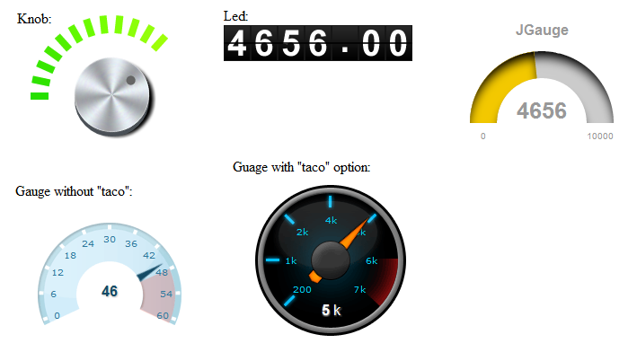
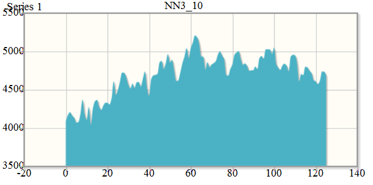
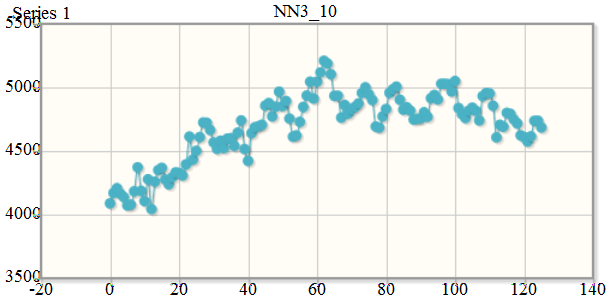
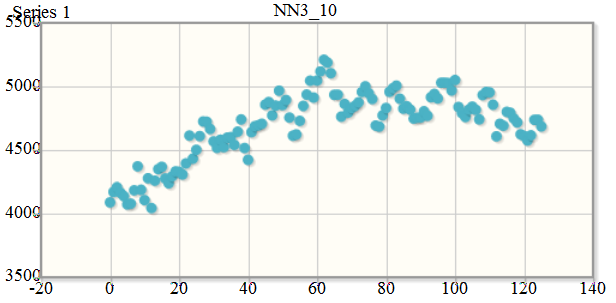

.. highlight:: javascript

#########################################
raswct Web Client Toolkit Developer Guide
#########################################

*******
Preface
*******

Overview
========

Purpose of the raswct ("rasdaman Web Client Toolkit") toolkit is to
allow developers creating Web user interfaces for displaying data from a
raster database.

Implementation
==============

The toolkit is developed in Javascript and uses popular libraries like
jQuery. Its structure follows the principle of separating data
trans­mission and processing from the presentation, the two main
namespaces reflecting this philosophy:

- **Query namespace** - containing all the classes that can be used to
  retrieve data from a server, be it a simple HTTP server or a
  rasdaman server.

- **Widget namespace** - containing all the classes that can be used to
  display the data in meaningful ways

This document describes how to create widgets and modify them to suit
particular purposes. At the end of each widget description an example of
use is given. More examples can be found in the ``applications/raswct/demo`` folder.

Audience
========

Information in this manual is intended primarily for Web application
developers.

Rasdaman Documentation Set
==========================

This manual should be read in conjunction with the complete rasdaman
documentation set which this guide is part of. The documentation set in
its completeness covers all important infor­mat­ion needed to work with
the rasdaman system, such as programming and query access to databases,
guidance to utilities such as *raswct*, release notes, and additional
information on the rasdaman wiki.

The rasdaman Documentation Set consists of the following docu­ments:

-  Installation and Administration Guide

-  Query Language Guide

-  C++ Developer's Guide

-  Java Developer's Guide

-  raswct Developer's Guide

-  the rasdaman wiki, accessible at `www.rasdaman.org <http://www.rasdaman.org>`_

************
Introduction
************

Purpose and Use
===============

This toolkit allows developers to easily create individualized Web
inter­faces for displaying multi-dimensional raster data. For example,
diagrams serve to present 1-D query results, images and a geo Web Map
interface serve to display 2-D query results. 3-D displays are under
development. All such data can stem from multi-dimensional database
contents, such as 1-D extracts from a 4-D climate data set.

Database queries can be hidden behind interactive parameter setting
through sliders, gauges, etc., thereby hiding the complexity of the
query language to casual users.

Crafting such Web interfaces often is as easy as writing HTML, without
resorting to JavaScript, which is the raswct implementation language.
That said, all JavaScript is available to advanced developers for
designing high-end interactive data interfaces.

Implementation
==============

The raswct toolkit is developed in Javascript and uses popular
libraries, like jQuery. Its structure follows the principle of
separating data transmission and processing from the presentation:

-  The **Query namespace**, Rj.query, contains all the classes for data
   retrieval from a server, be it a simple HTTP server or a rasdaman
   server.

-  The **Widget namespace**, Rj.widget, contains all the classes for
   displaying data in various ways.

-  The **Utility namespace**, Rj.util, contains various utility functions
   that help creating interaction widgets.

References
==========

The raswct toolkit is heavily used in the
`EarthLook <http://www.earthlook.org>`__ geo service standards showcase.

******************
Utility Namespace
******************

Bindable
==========

Rj.util.Bindable is a trait and it is used as an interface for binding objects.

Binder Manager
===============

Rj.util._BinderManager class manages the binders between Rj objects.

Cache Engine
============

Rj.util._CacheEngine singleton class acts as a key value store for caching 
misc data directly in the browser.

Config Manager
===============

Rj.util._ConfigManager class acts as a singleton to store 
the configuration data used across raswct modules.

Constants
=========

Rj.util.Constants class contains all the constants needed across the toolkit.

CSV Parser
==========

Rj.util.CSVParser class is designed to help with the parsing of CSV data
produced by rasdaman server or petascope wcps services to
native javascript objects.

Data Series
===========

Rj.util.DataSeries class is an discrete indexed array object, similar to 
how a 2D diagram is represented e.g. [[1, 2], [3, 6]] where 
the domain is {1,3} and the codomain is {2,6}.

Error Manager
=============

Rj.util._ErrorManager singleton class manages the error messages, displaying 
them to the user or just reporting them in the dev console.

Global State
============

Rj.util.GlobalState class provides a common area for defining shared static
information across modules.

Map layer
=========

Rj.util.MapLayer class defines a layer used as an abstraction for map layers
that can be added to any Rj.widget.Map

Multidimensional Array
======================

Rj.util.MultiDimArray class is a representation of a multidimensional array
that has easy to use accessor methods.

Notification Manager
====================

Rj.util._NotificationManager class defines a notification diaglogue to show success/failure to users.

Observable
==========

Rj.util.Observable is a trait and it is used as an interface for event communication.

Util
====

This file extends the functionality of the underscore library to utilities that are needed
across the project.

XMLDoc
======

Rj.util.XMLDoc class provides a series of utility functions for easier parsing of XML docs using XPath.

***************
Query Namespace
***************

Executable
==========

**Description**

Rj.query.Executable is a trait and it should be used in the composition 
of any query classes that can be evaluated by a services.

**Atrributes**

+-----------------+--------------+---------------------------------------------------------------------------------------------------------------------------------+
| **Name**        | **Type**     | **Description**                                                                                                                 |
+-----------------+--------------+---------------------------------------------------------------------------------------------------------------------------------+
|\- cached        | Object       | Configuration for the cached property, default it contains { value: false }                                                     |
+-----------------+--------------+---------------------------------------------------------------------------------------------------------------------------------+

**Methods**

+------------------------+--------------------------------------------------------+-------------------+------------------------------------------------------------------------------------------------------------+
| **Name**               | **Parameters**                                         | **Return Type**   | **Description**                                                                                            |
+------------------------+--------------------------------------------------------+-------------------+------------------------------------------------------------------------------------------------------------+
|\+ evaluate()           | callback: Function, persistent: Bool                   |                   | Evaluates the query and calls a corresponding callback function                                            |
+------------------------+--------------------------------------------------------+-------------------+------------------------------------------------------------------------------------------------------------+
|\- fireCallbacks()      | response: Object, httpStatus: Int                      |                   | Iterate array of callback functions and trigger these functions by input response and httpStatus values    |
+------------------------+--------------------------------------------------------+-------------------+------------------------------------------------------------------------------------------------------------+
|\- evaluateCached()     | transport: Rj.query.Transport, callback: Function      |                   | Check if Rj.util.CacheEngine contains a response before applying a callback                                |
+------------------------+--------------------------------------------------------+-------------------+------------------------------------------------------------------------------------------------------------+
|\- evaluateRaw()        | transport: Rj.query.Transport, callback: Function      |                   | Send request from transport to server to get response before applying a call back                          |
+------------------------+--------------------------------------------------------+-------------------+------------------------------------------------------------------------------------------------------------+

Transport
=========

**Description**

Rj.query.Transport is a trait and it is used by the Executable trait
to send the queries to the server to be evaluated.

**Atrributes**

+--------------------------+--------------+---------------------------------------------------------------------------------------------------------------------------------+
| **Name**                 | **Type**     | **Description**                                                                                                                 |
+--------------------------+--------------+---------------------------------------------------------------------------------------------------------------------------------+
|\- serviceUrl             | String       | Petascope endpoint to send request                                                                                              |
+--------------------------+--------------+---------------------------------------------------------------------------------------------------------------------------------+
|\- serviceHttpMethod      | String       | HTTP method to send request (default: POST)                                                                                     |
+--------------------------+--------------+---------------------------------------------------------------------------------------------------------------------------------+
|\- params                 | Object       | An object to contain param (keys, values) for the request                                                                       |
+--------------------------+--------------+---------------------------------------------------------------------------------------------------------------------------------+
|\- parseResponse          | Object       | Parse the response from the request                                                                                             |
+--------------------------+--------------+---------------------------------------------------------------------------------------------------------------------------------+
|\- binary                 | Bool         | If reponse is not in text format (default: true)                                                                                |
+--------------------------+--------------+---------------------------------------------------------------------------------------------------------------------------------+

**Methods**

+------------------------+--------------------------------------------------------+-------------------+------------------------------------------------------------------------------------------------------------+
| **Name**               | **Parameters**                                         | **Return Type**   | **Description**                                                                                            |
+------------------------+--------------------------------------------------------+-------------------+------------------------------------------------------------------------------------------------------------+
|\+ toHashCode()         |                                                        |                   | Create a String request from all properties and calculate a hashcode from it                               |
+------------------------+--------------------------------------------------------+-------------------+------------------------------------------------------------------------------------------------------------+

LiteralQuery
============

**Description**

Rj.query.LiteralQuery is class to create a literal query trait provides 
functionality for defining string queries containing parameters 
that can be changed. This is an interface class for subclasses to implements.
A literal query example: e.g "SELECT @col FROM @col WHERE @cond"

**Atrributes**

+-----------------+--------------+---------------------------------------------------------------------------------------------------------------------------------+
| **Name**        | **Type**     | **Description**                                                                                                                 |
+-----------------+--------------+---------------------------------------------------------------------------------------------------------------------------------+
|\- query         | String       | The litteral query, e.g. "SELECT @col FROM @col"                                                                                |
+-----------------+--------------+---------------------------------------------------------------------------------------------------------------------------------+
|\- variables     | Object       | An object of form {variable: value}, {"@col" : "mr"}                                                                            |
+-----------------+--------------+---------------------------------------------------------------------------------------------------------------------------------+

**Methods**

+------------------------+---------------------------------+-------------------+-----------------------------------------------------------------------------------------------+
| **Name**               | **Parameters**                  | **Return Type**   | **Description**                                                                               |
+------------------------+---------------------------------+-------------------+-----------------------------------------------------------------------------------------------+
|\+ setVariable()        | varName: String, value: String  |                   | Set a variable to a certain value.                                                            |
+------------------------+---------------------------------+-------------------+-----------------------------------------------------------------------------------------------+
|\+ getVariable()        | varName: String                 | String            | Get a value for a a certain variable.                                                         |
+------------------------+---------------------------------+-------------------+-----------------------------------------------------------------------------------------------+
|\+ toString()           |                                 | String            | Returns the string representation after the query is expanded by replacing the vars.          |
+------------------------+---------------------------------+-------------------+-----------------------------------------------------------------------------------------------+
|\+ isReady()            |                                 | Bool              | Indicates if all the variables in the query are set.                                          |
+------------------------+---------------------------------+-------------------+-----------------------------------------------------------------------------------------------+
|\- expand()             |                                 | String            | Iterate the variables array and replace the place holders with values from the array          |
+------------------------+---------------------------------+-------------------+-----------------------------------------------------------------------------------------------+

WCPS Query
==========

**Description**

Rj.query.WCPSQuery is class to create a WCPSQuery object which can send
WCPS queries to a service that can process them and parse the result 
to obtain meaningul data for Widgets.

**Atrributes**

+-----------------+--------------+---------------------------------------------------------------------------------------------------------------------------------+
| **Name**        | **Type**     | **Description**                                                                                                                 |
+-----------------+--------------+---------------------------------------------------------------------------------------------------------------------------------+
|\- binaryFormat  | bool         | Should be set to true if the query returns a binary format (e.g. image) instead of text format.                                 |
+-----------------+--------------+---------------------------------------------------------------------------------------------------------------------------------+
|\- WCPSService   | String       | Petascope endpoint for WCPS query.                                                                                              |
+-----------------+--------------+---------------------------------------------------------------------------------------------------------------------------------+

**Methods**

+------------------------+--------------------------+-------------------+-----------------------------------------------------------------------------------------------+
| **Name**               | **Parameters**           | **Return Type**   | **Description**                                                                               |
+------------------------+--------------------------+-------------------+-----------------------------------------------------------------------------------------------+
|\+ transport()          |                          |                   | Returns a Rj.query.Transport object that can be used internally by Executable trait           |
+------------------------+--------------------------+-------------------+-----------------------------------------------------------------------------------------------+

Rasql Query
============

**Description**

Rj.query.RasQuery is class to create a RasQuery object which is a Rasql query. 
All queries defined in rasql can be used with this class.

**Methods**

+------------------------+--------------------------+-------------------+-----------------------------------------------------------------------------------------------+
| **Name**               | **Parameters**           | **Return Type**   | **Description**                                                                               |
+------------------------+--------------------------+-------------------+-----------------------------------------------------------------------------------------------+
|\+ transport()          |                          |                   | Returns a Rj.query.Transport object that can be used internally by Executable trait           |
+------------------------+--------------------------+-------------------+-----------------------------------------------------------------------------------------------+
|\- parseResponse()      |                          |                   | Parse the text result from rasdaman as JSON object                                            |
+------------------------+--------------------------+-------------------+-----------------------------------------------------------------------------------------------+

****************
Widget Namespace
****************

Base Widget
===========

**Description**

Rj.widget._BaseWidget is base class for widgets, exposing methods for 
easy communication between the current widget and other widgets on the page.
All widgets also contain a descendant of Rj.query.LiteralQuery
which it can use to receive information from ther server.

**Atrributes**

+-------------+--------------+---------------------------------------------------------------------------------------------------------------------------------+
| **Name**    | **Type**     | **Description**                                                                                                                 |
+-------------+--------------+---------------------------------------------------------------------------------------------------------------------------------+
|\- selector  | CSS3 / XPath | A CSS3/XPath selector used as indentifier for the position of the widget.                                                       |
+-------------+--------------+---------------------------------------------------------------------------------------------------------------------------------+

**Methods**

+------------------------+--------------------------+-------------------+--------------------------------------------------------------------------------------+
| **Name**               | **Parameters**           | **Return Type**   | **Description**                                                                      |
+------------------------+--------------------------+-------------------+--------------------------------------------------------------------------------------+
|\+ show()               |                          |                   | Make the widget visible. By default widgets are rendered invisible                   |
+------------------------+--------------------------+-------------------+--------------------------------------------------------------------------------------+
|\+ hide()               |                          |                   | Make the widget invisible                                                            |
+------------------------+--------------------------+-------------------+--------------------------------------------------------------------------------------+
|\+ destroy()            |                          |                   | Destroy the widget                                                                   |
+------------------------+--------------------------+-------------------+--------------------------------------------------------------------------------------+
|\- render()             |                          |                   | laceholder function that should be extended by any showing widget                    |
+------------------------+--------------------------+-------------------+--------------------------------------------------------------------------------------+
|\- clear()              |                          |                   | Registers a new handler for a specific event                                         |
+------------------------+--------------------------+-------------------+--------------------------------------------------------------------------------------+
|\- refresh()            |                          |                   | Removes the widget from the container and re-renders it                              |
+------------------------+--------------------------+-------------------+--------------------------------------------------------------------------------------+

.. warning::
    This is a base class for graphs so it shouldn't be initialized or used
    except for extending the current graph system.

Input Widget
============

**Description**

Rj.widget._InputWidget is a simple grouper class that helps better define the
relationships between widgets.

**Attributes**

+------------+------------+----------------------------------+
| **Name**   | **Type**   | **Description**                  |
+------------+------------+----------------------------------+
|\- value    | string     | The value displayed in widget.   |
+------------+------------+----------------------------------+

.. warning::
    This is a base class for graphs so it shouldn't be initialized or used
    except for extending the current graph system.

Knob Widget
===========

**Description**

Rj.Widget.Knob class defines a knob widget.

**Attributes**

+----------------+----------+----------------------------------------------------------------------------------+
| **Name**       | **Type** | **Description**                                                                  |
+----------------+----------+----------------------------------------------------------------------------------+
| \- min         | Int      | The lower bound of the knob.                                                     |
+----------------+----------+----------------------------------------------------------------------------------+
| \- max         | Int      | The higher bound of the knob.                                                    |
+----------------+----------+----------------------------------------------------------------------------------+
| \- value       | Int      | The initial value of the knob.                                                   |
+----------------+----------+----------------------------------------------------------------------------------+
| \- reverse     | Bool     | If true, the values are distributed backwards (from 360 degrees to 0 degrees).   |
+----------------+----------+----------------------------------------------------------------------------------+
| \- snap        | Int      | The number of degrees from which the knob is snapped to 0.                       |
+----------------+----------+----------------------------------------------------------------------------------+

**Methods**

+----------------+-------------------+-------------------+------------------------------------------------+
| **Name**       | **Parameters**    | **Return Type**   | **Description**                                |
+----------------+-------------------+-------------------+------------------------------------------------+
| \- setValue()  | value: Int        |                   | Set value for knob's value.                    |
+----------------+-------------------+-------------------+------------------------------------------------+
| \- render()    |                   |                   | Render this knob widget                        |
+----------------+-------------------+-------------------+------------------------------------------------+

**Examples**

The following code creates a Knob object within a
``

`` element:

::

    var knob = new Rj.Widget.Knob(0, 10, 5, false, 20);
    knob.renderTo("knob");

Slider Widget
=============

**Description**

Rj.widget._Slider class defines a slider widget. This class is private 
and should be instatiated on its own. See Rj.widget.HorizontalSlider and 
Rj.widget.VerticalSlider if you need to create a slider.

**Attributes**

+-------------------+----------+----------------------------------------------------------------------------------------------------------------------------+
| **Name**          | **Type** | **Description**                                                                                                            |
+-------------------+----------+----------------------------------------------------------------------------------------------------------------------------+
|\- min             | Int      | The min value the slider can take                                                                                          |
+-------------------+----------+----------------------------------------------------------------------------------------------------------------------------+
|\- max             | Int      | The max value the slider can take                                                                                          |
+-------------------+----------+----------------------------------------------------------------------------------------------------------------------------+
|\- orientation     | String   | The orientation of the slider, either vertical or horizontal                                                               |
+-------------------+----------+----------------------------------------------------------------------------------------------------------------------------+
|\- step            | Float    | The step size to which the slider should be increased on slide action                                                      |
+-------------------+----------+----------------------------------------------------------------------------------------------------------------------------+
|\- tooltip         | Bool     | True if the slider should have a tooltip, false otherwise                                                                  |
+-------------------+----------+----------------------------------------------------------------------------------------------------------------------------+
|\- label           | String   | The label shown in the tooltip                                                                                             |
+-------------------+----------+----------------------------------------------------------------------------------------------------------------------------+
|\- height          | Int      | The height of the slider                                                                                                   |
+-------------------+----------+----------------------------------------------------------------------------------------------------------------------------+
|\- width           | Int      | The width of the slider                                                                                                    |
+-------------------+----------+----------------------------------------------------------------------------------------------------------------------------+
|\- instantChange   | Int      | If true the slider will change the value to the slide movement of the incrementor, otherwise only to the mouse up movement |
+-------------------+----------+----------------------------------------------------------------------------------------------------------------------------+

**Methods**

+----------------------------+-------------------+-------------------+--------------------------------------------------------------------------------------+
| **Name**                   | **Parameters**    | **Return Type**   | **Description**                                                                      |
+----------------------------+-------------------+-------------------+--------------------------------------------------------------------------------------+
|\- createTooltip()          |                   |                   | Creates a tooltip attached to the slider                                             |
+----------------------------+-------------------+-------------------+--------------------------------------------------------------------------------------+
|\- prepareRendering()       |                   |                   | Prepares the rendering process for the dojoRenderer                                  |
+----------------------------+-------------------+-------------------+--------------------------------------------------------------------------------------+
|\- finishRendering()        |                   |                   | Finishing touches to the slider                                                      |
+----------------------------+-------------------+-------------------+--------------------------------------------------------------------------------------+
|\- renderDojoSlider()       |                   |                   | Renders the slider using the dojo library widget                                     |
+----------------------------+-------------------+-------------------+--------------------------------------------------------------------------------------+
|\- render()                 |                   |                   | Renders the slider with all its components                                           |
+----------------------------+-------------------+-------------------+--------------------------------------------------------------------------------------+
|\- getDojoClass()           |                   |                   | Return Rj.widget._Slider.DojoSliderClasses                                           |
+----------------------------+-------------------+-------------------+--------------------------------------------------------------------------------------+
|\- clear()                  |                   |                   | Destroy the slider widget recursively                                                |
+----------------------------+-------------------+-------------------+--------------------------------------------------------------------------------------+
|\- refresh()                |                   |                   | Refresh the widget by using softRefresh() with timeout                               |
+----------------------------+-------------------+-------------------+--------------------------------------------------------------------------------------+
|\- softRefresh()            |                   |                   | Refresh the widget by using clear() and render()                                     |
+----------------------------+-------------------+-------------------+--------------------------------------------------------------------------------------+

Horizontal Slider Widget
========================

**Description**

Rj.widget.HorizontalSlider class defines a horizontal slider 
that can be used to slide through an interval of numerical values.
It extends Rj.widget._Slider class.

Vertical Slider Widget
========================

**Description**

Rj.widget.VerticalSlider class defines a vertical slider 
that can be used to slide through an interval of numerical values.
It extends Rj.widget._Slider class.

Output Widget
=============

**Description**

Rj.widget._OutputWidget is a simple grouper class that helps better define the
relationships between widgets.

.. warning::
    This is a base class for graphs so it shouldn't be initialized or used
    except for extending the current graph system.

Binary Image Widget
===================

**Description**

Rj.widget.BinaryImage class defines a binary image widget that can consume 
uint8 data and transform it into a image that can be displayed in the browser.

**Attributes**

+---------------+----------+----------------------------------------------------------------------------+
| **Name**      | **Type** | **Description**                                                            |
+---------------+----------+----------------------------------------------------------------------------+
|\- width       | Int      | The width of the image                                                     |
+---------------+----------+----------------------------------------------------------------------------+
|\- height      | Int      | The height of the image                                                    |
+---------------+----------+----------------------------------------------------------------------------+
|\- binaryData  | String   | Image in base64 String                                                     |
+---------------+----------+----------------------------------------------------------------------------+

**Methods**

+----------------------------+-------------------+-------------------+----------------------------------------------------+
| **Name**                   | **Parameters**    | **Return Type**   | **Description**                                    |
+----------------------------+-------------------+-------------------+----------------------------------------------------+
|\- generateBase64Data()     |                   |                   | Convert an array of buffer data to base64 String   |
+----------------------------+-------------------+-------------------+----------------------------------------------------+
|\- render()                 |                   |                   | Render the base64 String to an image and display   |
+----------------------------+-------------------+-------------------+----------------------------------------------------+

Map Widget
==========

**Description**

Rj.widget.Map class defines a widget used for displaying maps composed
of several layers.

**Attributes**

+---------------+-------------------+----------------------------------------------------------------------------+
| **Name**      | **Type**          | **Description**                                                            |
+---------------+-------------------+----------------------------------------------------------------------------+
|\- map         | OpenLayers.Map    | OpenLayers map object                                                      |
+---------------+-------------------+----------------------------------------------------------------------------+
|\- width       | Int               | The width of the map                                                       |
+---------------+-------------------+----------------------------------------------------------------------------+
|\- height      | Int               | The height of the map                                                      |
+---------------+-------------------+----------------------------------------------------------------------------+

**Methods**

+----------------------------+-------------------+-------------------+------------------------------------------------------------------------+
| **Name**                   | **Parameters**    | **Return Type**   | **Description**                                                        |
+----------------------------+-------------------+-------------------+------------------------------------------------------------------------+
|\- clear()                  |                   |                   | Destroy the OpenLayers map object and clear the div container of it    |
+----------------------------+-------------------+-------------------+------------------------------------------------------------------------+
|\- render()                 |                   |                   | Render the base64 String to an image and display                       |
+----------------------------+-------------------+-------------------+------------------------------------------------------------------------+

Gauge Widget
============

**Description**

Rj.Widget.Gauge class defines a circular gauge widget.

**Attributes**

+---------------+----------+----------------------------------------------------------------------------+
| **Name**      | **Type** | **Description**                                                            |
+---------------+----------+----------------------------------------------------------------------------+
|\- value       | Int      | The initial value displayed.                                               |
+---------------+----------+----------------------------------------------------------------------------+
|\- min         | Int      | The lower bound of the displayed values.                                   |
+---------------+----------+----------------------------------------------------------------------------+
|\- max         | Int      | The upper bound of the displayed value.                                    |
+---------------+----------+----------------------------------------------------------------------------+
|\- title       | String   | The title of the widget.                                                   |
+---------------+----------+----------------------------------------------------------------------------+
|\- label       | String   | The label of the widget.                                                   |
+---------------+----------+----------------------------------------------------------------------------+
|\- widthScale  | Float    | The scale at which the widget is displayed. 1 is the reference point.      |
+---------------+----------+----------------------------------------------------------------------------+
|\- showMinMax  | Bool     | Shows or hides the bounding values.                                        |
+---------------+----------+----------------------------------------------------------------------------+

**Methods**

+-----------------------+-------------------+-------------------+------------------------------------------------------------------------+
| **Name**              | **Parameters**    | **Return Type**   | **Description**                                                        |
+-----------------------+-------------------+-------------------+------------------------------------------------------------------------+
|\- render()            |                   |                   | Display the Gauge widtget                                              |
+-----------------------+-------------------+-------------------+------------------------------------------------------------------------+

**Examples**

The following example will display a gauge within a
``

`` element.

::

    var gauge = new Rj.Widget.Gauge(null, 24);
    gauge.renderTo("gauge");

Gauge overview

Below the gauges are listed which are available currently; they are
described in the subsequence subsections.

Led Widget
==========

**Description**

Rj.Widget.Led class defines a led counter widget.

**Attributes**

+-----------------------+----------+-----------------------------------------------+
| **Name**              | **Type** | **Description**                               |
+-----------------------+----------+-----------------------------------------------+
|\- value               | Float    | The initial value displayed.                  |
+-----------------------+----------+-----------------------------------------------+
|\- intDigits           | int      | The number of digits of the display.          |
+-----------------------+----------+-----------------------------------------------+
|\- fracDigits          | Bool     | The number of fractional digits to display.   |
+-----------------------+----------+-----------------------------------------------+

**Methods**

+-----------------------+-------------------+-------------------+------------------------------------------------------------------------+
| **Name**              | **Parameters**    | **Return Type**   | **Description**                                                        |
+-----------------------+-------------------+-------------------+------------------------------------------------------------------------+
|\- render()            |                   |                   | Display the Led widtget                                                |
+-----------------------+-------------------+-------------------+------------------------------------------------------------------------+

**Examples**

The following example will display a LED within a 

element.

::

    var led = new Rj.Widget.Led(100.54, 3, 2);
    led.renderTo("led");

SpeedoMeter Widget
==================

**Description**

Rj.widget.SpeedoMeter class defines a speedo meter widget.

**Attributes**

+-----------------------+----------+----------------------------------------------+
| **Name**              | **Type** | **Description**                              |
+-----------------------+----------+----------------------------------------------+
|\- value               | Float    | The initial value displayed                  |
+-----------------------+----------+----------------------------------------------+
|\- labelSuffix         | String   | The suffix of the label                      |
+-----------------------+----------+----------------------------------------------+

**Methods**

+-----------------------+-------------------+-------------------+------------------------------------------------------------------------+
| **Name**              | **Parameters**    | **Return Type**   | **Description**                                                        |
+-----------------------+-------------------+-------------------+------------------------------------------------------------------------+
|\- render()            |                   |                   | Display the SpeedoMeter widtget                                        |
+-----------------------+-------------------+-------------------+------------------------------------------------------------------------+    

Tooltip Widget
==============

**Description**

Rj.widget.ToolTip class defines a  a tooltip widget.

**Attributes**

+-----------------------+----------+-----------------------------------------------+
| **Name**              | **Type** | **Description**                               |
+-----------------------+----------+-----------------------------------------------+
|\- value               | String   | Text to be shown                              |
+-----------------------+----------+-----------------------------------------------+
|\- pretext             | String   | Pre text to be shown                          |
+-----------------------+----------+-----------------------------------------------+
|\- postext             | String   | Post text to be shown                         |
+-----------------------+----------+-----------------------------------------------+
|\- adjust              | Object   | Some keys, values to adjust tooltip           |
+-----------------------+----------+-----------------------------------------------+
|\- place               | String   | The place to shown tooltip (default: bottom)  |
+-----------------------+----------+-----------------------------------------------+
|\- mouse               | Bool     | Mouse event on tooltip (default: false)       |
+-----------------------+----------+-----------------------------------------------+
|\- delay               | Int      | Time to show tooltip (default: 1000)          |
+-----------------------+----------+-----------------------------------------------+

**Methods**

+-----------------------+-------------------+-------------------+------------------------------------------------------------------------+
| **Name**              | **Parameters**    | **Return Type**   | **Description**                                                        |
+-----------------------+-------------------+-------------------+------------------------------------------------------------------------+
|\- render()            |                   |                   | Display the Tooltip widtget                                            |
+-----------------------+-------------------+-------------------+------------------------------------------------------------------------+

Diagram Widget
==============

**Description**

Rj.widget._Diagram class defines a widget used as a base for all diagrams.

**Attributes**

+----------------+-----------------------+----------------------------------------------------------------------------------------+
| **Name**       | **Type**              | **Description**                                                                        |
+----------------+-----------------------+----------------------------------------------------------------------------------------+
|\- title        | String                | The title of this diagram.                                                             |
+----------------+-----------------------+----------------------------------------------------------------------------------------+
|\- xLabel       | String                | The title of the X axis.                                                               |
+----------------+-----------------------+----------------------------------------------------------------------------------------+
|\- yLabel       | String                | The title of the Y axis.                                                               |
+----------------+-----------------------+----------------------------------------------------------------------------------------+
|\- tooltip      | String                | Indicates whether a Tooltip with tips about how the diagram works should be shown.     |
+----------------+-----------------------+----------------------------------------------------------------------------------------+
|\- dataSeries   | Rj.util.DataSeries    | The series to be plotted.                                                              |
+----------------+-----------------------+----------------------------------------------------------------------------------------+
|\- width        | Int                   | The width of the diagram.                                                              |
+----------------+-----------------------+----------------------------------------------------------------------------------------+
|\- height       | Int                   | The height of the diagram.                                                             |
+----------------+-----------------------+----------------------------------------------------------------------------------------+

**Methods**

+-----------------------+---------------------------------+-------------------+-------------------------------------------------------------------------------------------------------------------------------------------+
| **Name**              | **Parameters**                  | **Return Type**   | **Description**                                                                                                                           |
+-----------------------+---------------------------------+-------------------+-------------------------------------------------------------------------------------------------------------------------------------------+
|\+ getData             |                                 | Array             | Returns the data series in the format that is sent to the plot.                                                                           |
+-----------------------+---------------------------------+-------------------+-------------------------------------------------------------------------------------------------------------------------------------------+
|\+ addDataSeries       | series: Rj.util.DataSeries      |                   | Adds a data series to the diagram as an array of form [ [x,y] , [x1, y1] ].                                                               |
+-----------------------+---------------------------------+-------------------+-------------------------------------------------------------------------------------------------------------------------------------------+
|\+ removeDataSeries    | seriesName: String              |                   | Removes a series from the diagram.                                                                                                        |
+-----------------------+---------------------------------+-------------------+-------------------------------------------------------------------------------------------------------------------------------------------+
|\- configure           | cfg: Object                     | Object            | Configures the chart object before rendering. All subclasses should override this method in order to add their specific configurations.   |
+-----------------------+---------------------------------+-------------------+-------------------------------------------------------------------------------------------------------------------------------------------+
|\- getSeriesColors     |                                 | Array             | Returns an array of series' colors.                                                                                                       |
+-----------------------+---------------------------------+-------------------+-------------------------------------------------------------------------------------------------------------------------------------------+
|\- getSeriesNames      |                                 | Array             | Returns an array of series' names.                                                                                                        |
+-----------------------+---------------------------------+-------------------+-------------------------------------------------------------------------------------------------------------------------------------------+
|\- render              |                                 |                   | Renders the widget by its id DOM element.                                                                                                 | 
+-----------------------+---------------------------------+-------------------+-------------------------------------------------------------------------------------------------------------------------------------------+
|\- bindSeries          |  series: Rj.util.DataSeries     |                   | Add event listeners for series and then call self._refresh() method.                                                                      |
+-----------------------+---------------------------------+-------------------+-------------------------------------------------------------------------------------------------------------------------------------------+

.. warning::
    This is a base class for graphs so it shouldn't be initialized or used
    except for extending the current graph system.

Area Diagram
============

**Description**

Rj.Widget.AreaDiagram class defines a widget used for displaying area graphs.

**Methods**

+---------------+-------------------+-------------------+--------------------------------------------------+
| **Name**      | **Parameters**    | **Return Type**   | **Description**                                  |
+---------------+-------------------+-------------------+--------------------------------------------------+
|\- configure   | cfg: Object       | Object            | Configures the chart object before rendering .   |
+---------------+-------------------+-------------------+--------------------------------------------------+

**Examples**

JS Code:

::

    var source = "NN3\_10"
    //Initialize query
    var query = new Rj.query.WCPSQuery('for t1 in (mean_summer_airtemp) return encode (t1[ x(126), y(-10) ], "csv")');
    //Create widget
    var diagram = new Rj.Widget.AreaDiagram( query, "#chartPlace", source);
    // Get diagram axis and labels before data is rendered
    diagram.addListener( 'wcps','datapreload',
        function(response){
            var values = [];
            for(var i = 0; i < response.data.length; i++){
                values.push( [i, parseInt(response.data[i], 10)]);
            }
            //Configure the widget labels
            this.configure({
                axes: {
                    xaxis: { title: response.domainInfo.axisLabel },
                    yaxis: { title : "Values" }
                }
            });
            return { data : values };
        }
    );
    //Load the data and render the widget
    diagram.loadData(true);

HTML Code:

.. code-block:: html

    

    <!-- The chart will go here -->
    

Visual appearance:

Bar Diagram
============

**Description**

Rj.Widget.BarDiagram class defines a widget used for displaying bar graphs.

**Methods**

+---------------+-------------------+-------------------+--------------------------------------------------+
| **Name**      | **Parameters**    | **Return Type**   | **Description**                                  |
+---------------+-------------------+-------------------+--------------------------------------------------+
|\- configure   | cfg: Object       | Object            | Configures the chart object before rendering .   |
+---------------+-------------------+-------------------+--------------------------------------------------+

Linear Diagram
==============

**Description**

Rj.Widget.LinearDiagram class defines a widget used for displaying linear graphs.

**Methods**

+---------------+-------------------+-------------------+--------------------------------------------------+
| **Name**      | **Parameters**    | **Return Type**   | **Description**                                  |
+---------------+-------------------+-------------------+--------------------------------------------------+
|\- configure   | cfg: Object       | Object            | Configures the chart object before rendering..   |
+---------------+-------------------+-------------------+--------------------------------------------------+

**Examples**

JS Code:

::

    //Initialize query
    var query = new Rj.query.WCPSQuery('for t1 in (mean_summer_airtemp) return encode (t1[ x(126), y(-10) ], "csv")');
    //Create widget
    var diagram = new Rj.Widget.LinearDiagram( query, "#chartPlace", source );
    // Get diagram axis and labels before data is rendered
    // by listening to the datapreload event
    diagram.addListener( 'wcps','datapreload',
        function(response){
            // Check if any errors occurred,
            // and if so display a nice error message
            if(response.error){
                $("body").append( "
" + response.error + '
');
                $( "#dialog" ).dialog({
                    modal : true,
                    title : 'Parse Error'
                }).show();
                throw "Error while processing the data";
            }
            var values = [];
            for(var i = 0; i < response.data.length; i++){
                values.push( [i, parseInt(response.data[i], 10)]);
            }
            //Configure the widget axes
            this.configure({
                axes : {
                    xaxis:{ title : response.domainInfo.axisLabel },
                    yaxis: { title : "Values" }
                }
            });
            return { data : [values] };
        }
    );
    // load data and render widget
    diagram.loadData(true);

HTML Code:

.. code-block:: html

    

    <!-- The chart will go here -->
    

Visual appearance:

Scatter Diagram
===============

**Description**

Rj.widget.ScatterDiagram class defines a widget used for displaying scattered graphs.

**Methods**

+---------------+-------------------+-------------------+--------------------------------------------------+
| **Name**      | **Parameters**    | **Return Type**   | **Description**                                  |
+---------------+-------------------+-------------------+--------------------------------------------------+
|\- configure   | cfg: Object       | Object            | Configures the chart object before rendering.    |
+---------------+-------------------+-------------------+--------------------------------------------------+

**Examples**

JS Code:

::

    // Initialize query
    var query = new Rj.query.WCPSQuery('for t1 in (mean_summer_airtemp) return encode (t1[ x(126), y(-10) ], "csv")');
    // Create widget
    var diagram = new Rj.Widget.ScatterDiagram(query, "#chartPlace", source);
    // Get diagram axis and labels after data is loaded
    // by listening to datapreload event
    diagram.addListener( 'wcps','datapreload',
        function(response){
            var values = [];
            for(var i = 0; i < response.data.length; i++){
                values.push( [i, parseInt(response.data[i], 10)]);
            }
            // Configure widget labels
            this.configure({
                axes : {
                    xaxis: { title : response.domainInfo.axisLabel },
                    yaxis : { title : "Values" }
                }
            });
            return { data : values };
        }
    );
    diagram.loadData(true);

HTML Code:

.. code-block:: html

    

    <!-- The chart will go here -->
    
'

Visual appearance:

