.. highlight:: text

.. _sec_cheatsheets:

###########
Cheatsheets
###########

.. _cheatsheet-wcs:

WCS
===

The `OGC Web Coverage Service (WCS) standard 
<https://www.opengeospatial.org/standards/wcs>`__ defines support for modeling
and retrieval of geospatial data as *coverages* (e.g. sensor, image, or
statistics data).

WCS consists of a *Core* specification for basic operation support with regards
to coverage discovery and retreival, and various *Extension* specifications for
optional capabilities that a service could provide on offered coverage objects.

Core
----

The Core specification is agnostic of implementation details, hence, access 
syntax and mechanics are defined by *protocol extensions*:
`KVP/GET <https://portal.opengeospatial.org/files/09-147r3>`__,
`XML/POST <https://portal.opengeospatial.org/files/09-148r1>`__, and 
`XML/SOAP <https://portal.opengeospatial.org/files/09-149r1>`__.  Rasdaman 
supports all three, but further on the examples are in *KVP/GET* exclusively, as it
is the most straightforward way for constructing requests by appending a standard
`query string <https://en.wikipedia.org/wiki/Query_string>`__ to the
service endpoint URL. Commonly, for all operations the KVP/GET request will look
as follows: ::

  http(s)://<endpoint url>?service=WCS
                          &version=2.0.1
                          &request=<operation>
                          &...

Three fundamental operations are defined by the Core:

- **GetCapabilities** - returns overal service information and a list of available
  coverages; the request looks generally as above, with the `<operation>` being
  GetCapabilities:

  ::

    http(s)://<endpoint url>?service=WCS&version=2.0.1&request=GetCapabilities

  Example:

    http://ows.rasdaman.org/rasdaman/ows?service=WCS&version=2.0.1&request=GetCapabilities

- **DescribeCoverage** - detailed description of a specific coverage:

  ::

    http(s)://<endpoint url>?service=WCS&version=2.0.1&request=DescribeCoverage
                            &coverageId=<coverage id>

  Example:

    http://ows.rasdaman.org/rasdaman/ows?service=WCS&version=2.0.1&request=DescribeCoverage&coverageId=AvgLandTemp

- **GetCoverage** - retreive a whole coverage, or arbitrarily restricted on any of
  its axes whether by new lower/upper bounds (*trimming*) or at a single index
  (*slicing*):

  ::

    http(s)://<endpoint url>?service=WCS&version=2.0.1&request=GetCoverage
                            &coverageId=<coverage id>
            [optional]      &subset=<axis>(<lower>,<upper>)
            [optional]      &subset=<axis>(<index>)
            [optional]      &format=<mime type>

  Example:

    `http://ows.rasdaman.org/rasdaman/ows?service=WCS&version=2.0.1&request=GetCoverage&coverageId=AvgLandTemp&subset=Lon(-90.0,85.3)&subset=ansi("2014-10-01")&format=image/jpeg <http://ows.rasdaman.org/rasdaman/ows?service=WCS&version=2.0.1&request=GetCoverage&coverageId=AvgLandTemp&subset=Lon(-90.0,85.3)&subset=ansi("2014-10-01")&format=image/jpeg>`__

Updating
--------

The `Transaction extension (WCS-T) 
<http://docs.opengeospatial.org/is/13-057r1/13-057r1.html>`__ specifies the
following operations for constructing, maintenance, and removal of coverages on
a server: *InsertCoverage*, *UpdateCoverage*, and *DeleteCoverage*.

Rasdaman provides the `wcst_import tool
<http://doc.rasdaman.org/05_geo-services-guide.html#data-import>`__ to simplify
the import of data into analysis-ready coverages (aka datacubes) by 
generating WCS-T requests as instructed by a simple configuration file.

Processing
----------

The `Processing extension <https://portal.opengeospatial.org/files/08-059r4>`__
enables advanced analytics on coverages through `WCPS <cheatsheet-wcps>`__
queries. The request format is as follows: ::

  http(s)://<endpoint url>?service=WCS&version=2.0.1&request=ProcessCoverages
                          &query=<wcps query>

E.g, calculate the average on the subset from the previous GetCoverage example:

  `http://ows.rasdaman.org/rasdaman/ows?service=WCS&version=2.0.1&request=ProcessCoverages&query=for $c in (AvgLandTemp) return avg($c[Lon(-90.0:85.3), ansi("2014-10-01")]) <http://ows.rasdaman.org/rasdaman/ows?service=WCS&version=2.0.1&request=ProcessCoverages&query=for $c in (AvgLandTemp) return avg($c[Lon(-90.0:85.3), ansi("2014-10-01")])>`__

Range subsetting
----------------

The cell values of some coverages consist of multiple components (also known as
ranges, bands, channels, fields, attributes). The `Range subsetting extension
<https://portal.opengeospatial.org/files/12-040>`__ specifies the extraction
and/or recombination in possibly different order of one or more bands. This is
done by listing the wanted bands or band intervals; e.g
`AverageChlorophyllScaled` has Blue, Green, and Red bands and the following
recombines them into a Red, Green, Blue order:

  `http://ows.rasdaman.org/rasdaman/ows?service=WCS&version=2.0.1&request=GetCoverage&coverageId=AverageChlorophyllScaled&format=image/png&subset=unix("2015-01-01")&rangesubset=Red,Green,Blue <http://ows.rasdaman.org/rasdaman/ows?service=WCS&version=2.0.1&request=GetCoverage&coverageId=AverageChlorophyllScaled&format=image/png&subset=unix("2015-01-01")&rangesubset=Red,Green,Blue>`__

Scaling
-------

Scaling up or down is a common operation supported by the `Scaling extension
<https://portal.opengeospatial.org/files/12-039>`__. An additional GetCoverage
parameter indicates the scale factor in several possible ways: as a single 
number applying to all axes, multiple numbers applying to individual axes,
full target scale domain, or per-axis target scale domains. E.g. a single factor
to downscale all axes by 4x:

  `http://ows.rasdaman.org/rasdaman/ows?service=WCS&version=2.0.1&request=GetCoverage&coverageId=AvgLandTemp&subset=ansi("2014-10-01")&format=image/jpeg&scaleFactor=0.25 <http://ows.rasdaman.org/rasdaman/ows?service=WCS&version=2.0.1&request=GetCoverage&coverageId=AvgLandTemp&subset=ansi("2014-10-01")&format=image/jpeg&scaleFactor=0.25>`__

Currently only nearest neighbour interpolation is supported for scaling.

Reprojection
------------

The `CRS extension <https://portal.opengeospatial.org/files/54209>`__ allows to
reproject a coverage before retreiving it. For example ``AverageChlorophyllScaled``
has native CRS EPSG:4326, and the following request will return the result in
EPSG:3857:

  `http://ows.rasdaman.org/rasdaman/ows?service=WCS&version=2.0.1&request=GetCoverage&coverageId=AverageChlorophyllScaled&format=image/png&subset=unix("2015-01-01")&outputCrs=http://ows.rasdaman.org/def/crs/EPSG/0/3857 <http://ows.rasdaman.org/rasdaman/ows?service=WCS&version=2.0.1&request=GetCoverage&coverageId=AverageChlorophyllScaled&format=image/png&subset=unix("2015-01-01")&outputCrs=http://ows.rasdaman.org/def/crs/EPSG/0/3857>`__

or change the CRS in which subset or scale coordinates are specified:

  `http://ows.rasdaman.org/rasdaman/ows?service=WCS&version=2.0.1&request=GetCoverage&coverageId=AverageChlorophyllScaled&format=image/png&subset=Lon(0,10000000)&subset=Lat(0,20000000)&subset=unix(%222015-01-01%22)&subsettingCrs=http://ows.rasdaman.org/def/crs/EPSG/0/3857 <http://ows.rasdaman.org/rasdaman/ows?service=WCS&version=2.0.1&request=GetCoverage&coverageId=AverageChlorophyllScaled&format=image/png&subset=Lon(0,10000000)&subset=Lat(0,20000000)&subset=unix(%222015-01-01%22)&subsettingCrs=http://ows.rasdaman.org/def/crs/EPSG/0/3857>`__

Interpolation
-------------

Reprojection (optionally with subsequent scaling) can be performed with various interpolation methods as
enabled by the `Interpolation extension
<https://portal.opengeospatial.org/files/12-049>`__:

  http://ows.rasdaman.org/rasdaman/ows?service=WCS&version=2.0.1&request=GetCoverage&coverageId=mean_summer_airtemp&outputCrs=http://ows.rasdaman.org/def/crs/EPSG/0/3857&interpolation=http://www.opengis.net/def/interpolation/OGC/1/cubic

Rasdaman supports several interpolation methods as documented 
:ref:`here <sec-geo-projection-interpolation>`.

.. _cheatsheet-wcps:

WCPS
====

The `OGC Web Coverage Processing Service (WCPS) standard 
<https://www.opengeospatial.org/standards/wcps>`__ defines a
protocol-independent declarative query language for the extraction, processing,
and analysis of multi-dimensional coverages representing sensor, image, or
statistics data.

The overall execution model of WCPS queries is similar to XQuery FLOWR:

.. code-block:: rasql

    for $covIter1 in (covName, ...),
        $covIter2 in (covName, ...),
        ...
    let $aliasVar1 := covExpr,
        $aliasVar2 := covExpr,
        ...
    where booleanExpr
    return processingExpr

Any coverage listed in the WCS *GetCapabilities* response can be used in place
of ``covName``. Multiple ``$covIter`` essentially translate to nested loops.
For each iteration, the ``return`` clause is evaluated if the result of the
``where`` clause is ``true``. Coverage iterators and alias variables can be
freely used in where / return expressions.

Conforming WCPS queries can be submitted to rasdaman as `WCS ProcessCoverages
requests <https://portal.opengeospatial.org/files/08-059r4>`__, e.g: ::

    http://localhost:8080/rasdaman/ows?service=WCS&version=2.0.1
        &request=ProcessCoverages
        &query=for $covIter in (covName) ...

The *WSClient* deployed with every rasdaman installation provides a convenient
console for interactively writing and executing WCPS queries: open
http://localhost:8080/rasdaman/ows in your Web browser and proceed to the
*ProcessCoverages* tab.

Operations can be categorized by the type of data they result in: scalar,
coverage, or metadata.

Scalar operations
-----------------

- **Standard operations** applied on scalar operands return scalar results:

  +------------------------------+-----------------------------------------+
  | Operation category           | Operations                              |
  +==============================+=========================================+
  | Arithmetic                   | ``+  -  *  /  abs  round``              |
  +------------------------------+-----------------------------------------+
  | Exponential                  | ``exp  log  ln  pow  sqrt``             |
  +------------------------------+-----------------------------------------+
  | Trigonometric                | | ``sin  cos  tan  sinh  cosh  tanh``   |
  |                              | | ``arcsin  arccos  arctan``            |
  +------------------------------+-----------------------------------------+
  | Comparison                   | ``>  <  >=  <=  =  !=``                 |
  +------------------------------+-----------------------------------------+
  | Logical                      | ``and  or  xor  not  bit  overlay``     |
  +------------------------------+-----------------------------------------+
  | Select field from multiband  | ``.``                                   |
  | value                        |                                         |
  +------------------------------+-----------------------------------------+
  | Create multiband value       | ``{ bandName: value; ..., bandName:     |
  |                              | value }``                               |
  +------------------------------+-----------------------------------------+
  | Type casting                 | ``(baseType) value``                    |
  |                              |                                         |
  |                              | | where baseType is one of: boolean,    |
  |                              | | [unsigned] char / short / int / long, |
  |                              | | float, double, complex, complex2      |
  +------------------------------+-----------------------------------------+

- **Aggregation operations** summarize coverages into a scalar value. 

  +-----------------------+------------------------------------------------------+
  | Aggregation type      | Function / Expression                                |
  +=======================+======================================================+
  | Of numeric coverages  | ``avg``, ``add`` (or alias ``sum``), ``min``, ``max``|
  +-----------------------+------------------------------------------------------+
  | Of boolean coverages  | | ``count`` number of true values;                   |
  |                       | | ``some``/``all`` = true if some/all values are true|
  +-----------------------+------------------------------------------------------+
  | General condenser     | | ``condense`` *op*                                  |
  |                       | | ``over`` $iterVar axis(lo:hi), ...                 |
  |                       | | [ ``where`` boolScalarExpr ]                       |
  |                       | | ``using`` scalarExpr                               |
  +-----------------------+------------------------------------------------------+

  The *general condenser* aggregates values across an iteration domain with a condenser 
  operation *op* (one of ``+``, ``*``, ``max``, ``min``, ``and``, or ``or``).
  For each coordinate in the iteration domain defined by the ``over`` clause, the
  scalar expression in the ``using`` clause is evaluated and added to the final
  aggregated result; the optional ``where`` clause allows to filter values from
  the aggregation.

Coverage operations
-------------------

- **Standard operations** applied on coverage (or mixed coverage and scalar)
  operands return coverage results. The operation is applied pair-wise on each
  cell from the coverage operands, or on the scalars and each cell from the
  coverage in case some of the operands are scalars. All coverage operands must
  have matching domains and CRS.

- **Subsetting** allows to select a part of a coverage (or crop it to a smaller
  domain): ::

    covExpr[ axis1(lo:hi), axis2(slice), axis3:crs(...), ... ]
  
  1. ``axis1`` in the result is reduced to span from coordinate ``lo`` to ``hi``.
     Either or both ``lo`` and ``hi`` can be indicated as ``*``, corresponding to
     the minimum or maximum bound of that axis.

  2. ``axis2`` is restricted to the exact slice coordinate and removed from the
     result.

  3. ``axis3`` is subsetted in coordinates specified in the given ``crs``. By
     default coordinates must be given in the native CRS of ``C``.

- **Extend** is similar to subsetting but can be used to enlarge a coverage with 
  null values as well, i.e. lo and hi can extend beyond the min/max bounds of a
  particular axis; only trimming is possible: ::

    extend( covExpr, { axis1(lo:hi), axis2:crs(lo:hi), ... } )

  .. _wcps-scale:

- **Scale** is like extend but it resamples the current coverage values to:

  - Fit the new domain: ::

      scale( covExpr, { axis1(lo:hi), axis2:crs(lo:hi), ... } )
   
  - Scale all axes by a factor (positive number; factor > 1 means scaling up; factor < 1 means scaling down): ::

      scale( covExpr, number)

  - Scale different factors for different axes: ::

      scale( covExprs, { axi1(factor1), axis2(factor2), ... })

  

  Currently only nearest neighbour interpolation is supported for scaling.

    .. code-block:: rasql

        crsTransform( covExpr, { axisX:outputCRS, axisY:outputCRS }
                               [ , { interpolation } ]
                               [ , {axisLabelX:geoXResolution, axisLabelY:geoYResolution}   ]
                               [ , {axisLabelX(lo:hi), axisLabelY(lo:hi)} or {domain(2D coverage)} ] 
                    )

  For example, the query below reprojects a 2D coverage to ``EPSG:4326`` CRS with 
  ``bilinear`` interpolation and target geo resolutions for ``Lat``
  and ``Lon`` axes ``0.5`` and ``1 + the resolution of Lat axis in coverage $d`` respectively, and crops the result to 
  the target geo domain ``[Lat(30.5:60.5), Lon(50.5:70.5)]``:

    .. code-block:: rasql

        crsTransform($c, 
                        {Lat:"http://localhost:8080/rasdaman/def/crs/EPSG/0/4326", 
                         Lon:"http://localhost:8080/rasdaman/def/crs/EPSG/0/4326" }, 
                        {bilinear},
                        {Lat:0.5, Lon:1 + domain($d, Lat).resolution},
                        {Lat(30.5:60.5), Lon(50.5:70.5)}
                    )
    

.. _wcps-crstransform-shorthand:
 
  Alternatively, a shorthand version can be used where the target CRS is
  applies to both axes (instead of specifying it individually for each axis).

    .. code-block:: rasql

        crsTransform( covExpr, "outputCRS", 
                         [ , { interpolation } ]
                         [ , {axisLabelX:geoXResolution, axisLabelY:geoYResolution}   ]
                         [ , {axisLabelX(lo:hi), axisLabelY(lo:hi)} or {domain(2D coverage)} ] 
                    )

  A similar example as above with shorthand CRS notation, and target geo domain that
  matches the domain of coverage `$d`:

    .. code-block:: rasql

        crsTransform($c, 
                        "EPSG:4326", 
                        {bilinear},
                        {Lat:0.5,
                         Lon:1 + domain($d, Lat).resolution},
                        {domain($d)}
                    )

  Note that the shorthand notation is not compliant with the WCPS 1.0 standard, and is
  an extension that rasdaman provides for convenience. Furthermore, the optional
  parameters for specifying resolution and target domain are also non-standard.

  For supported interpolation methods see the options for 
  :ref:`resampleAlg parameter <sec-geo-projection-interpolation>`.

- **Conditional evaluation** is possible with the ``switch`` statement:

  .. code-block:: rasql

    switch
      case boolCovExpr return covExpr
      case boolCovExpr return covExpr
      ...
      default return covExpr

- **General coverage constructor** allows to create a coverage given a domain,
  where for each coordinate in the domain the value is dynamically calculated
  from a value expression which potentially references the iterator variables:

  .. code-block:: rasql

    coverage covName
    over $iterVar axis(lo:hi), ...
    values scalarExpr

  Typically the iterator variable is iterated through a grid domain, e.g. by using the
  ``imageCrsdomain(coverageExpr, axisLabel)`` operator. However, iteration over
  a geo domain is also supported with ``domain(coverageExpr, axisLabel)``.
  Note that this feature is a non-standard extension that rasdaman provides
  for convenience. For example, to create a 2D geo-referenced coverage with
  ``Lat`` and ``Lon`` axes, based on an existing geo-referenced coverage:

  .. code-block:: rasql

    for $c in (test_mean_summer_airtemp)
    return 
        encode(
          coverage targetCoverage
          over  $pLat Lat(domain($c[Lat(-30:-28.5)], Lat)),
                $pLon Lon(domain($c[Lon(111.975:113.475)], Lon))

          values $c[Lat($pLat), Lon($pLon)]
          , "tiff")

- **General condenser on coverages** is same as the scalar general condenser,
  except that in the ``using`` clause we have a coverage expression. The coverage 
  values produced in each iteration are cell-wise aggregated into a single
  result coverage.

  .. code-block:: rasql

    condense op
    over $iterVar axis(lo:hi), ...
    [ where boolScalarExpr ]
    values covExpr

- **Encode** allows to export coverages in a specified data format, e.g: ::

    encode(covExpr, "image/jpeg")

   WCPS supports ``application/gml+xml`` format corresponding to OGC WCS ``GetCoverage`` request.
   Many further formats are supported, see :ref:`here <rasql-encode-function-data-format>` for details.

Atomic types
------------

The set of atomic types for Coverage range field data types according to
OGC WCPS standard. See :ref:`rasdaman atomic types <table-atomic-types>` for
comparison.

.. _table-atomic-coverage-range-field-types:

.. table:: Coverage atomic range field data types

    +--------------------+------------+------------------------------------------+
    | **type name**      | **size**   | **description**                          |
    +====================+============+==========================================+
    | ``boolean``        | 1 bit      | true (nonzero value), false (zero value) |
    +--------------------+------------+------------------------------------------+
    | ``char``           | 8 bit      | signed integer                           |
    +--------------------+------------+------------------------------------------+
    | ``unsigned char``  | 8 bit      | unsigned integer                         |
    +--------------------+------------+------------------------------------------+
    | ``short``          | 16 bit     | signed integer                           |
    +--------------------+------------+------------------------------------------+
    | ``unsigned short`` | 16 bit     | unsigned integer                         |
    +--------------------+------------+------------------------------------------+
    | ``int``            | 32 bit     | signed integer                           |
    +--------------------+------------+------------------------------------------+
    | ``unsigned int``   | 32 bit     | unsigned integer                         |
    +--------------------+------------+------------------------------------------+
    | ``float``          | 32 bit     | single precision floating point          |
    +--------------------+------------+------------------------------------------+
    | ``double``         | 64 bit     | double precision floating point          |
    +--------------------+------------+------------------------------------------+
    | ``cint16``         | 32 bit     | complex of 16 bit signed integers        |
    +--------------------+------------+------------------------------------------+
    | ``cint32``         | 64 bit     | complex of 32 bit signed integers        |
    +--------------------+------------+------------------------------------------+
    | ``complex``        | 64 bit     | single precision floating point complex  |
    +--------------------+------------+------------------------------------------+
    | ``complex2``       | 128 bit    | double precision floating point complex  |
    +--------------------+------------+------------------------------------------+

.. _wcps-metadata-operations:

Metadata operations
-------------------

Several functions allow to extract metadata information about a coverage ``C``:

+---------------------------+----------------------------------------------------+
| Metadata function         | Result                                             |
+===========================+====================================================+
| imageCrsDomain(C, a)      | Grid (lo, hi) bounds for axis a                    |
+---------------------------+----------------------------------------------------+
| imageCrsDomain(C, a).x    | Where x is one of ``lo`` or ``hi``                 |      
|                           | returning the lower or upper bounds respectively   |
+---------------------------+----------------------------------------------------+
| domain(C, a, c)           | Geo (lo, hi) bounds for axis a in CRS c            |
|                           | returning the lower and upper bounds respectively  |
+---------------------------+----------------------------------------------------+
| domain(C, a, c).x         | Where x is one of ``lo`` or ``hi``                 | 
|                           | (returning the lower or upper bounds respectively) |
|                           | or ``resolution`` (returning the geo resolution of |
|                           | axis a)                                            |
+---------------------------+----------------------------------------------------+
| domain(C, a)              | Geo (lo, hi) bounds for axis a                     |
|                           | returning the lower and upper bounds respectively  |
+---------------------------+----------------------------------------------------+
| domain(C, a).x            | Where x is one of ``lo`` or ``hi``                 | 
|                           | returning the lower or upper bounds respectively   |
+---------------------------+----------------------------------------------------+
| domain(C)                 | List of comma-separated axes and their bounds      |
|                           | according to coverage's CRS orders respectively.   |
|                           | Each list element contains an axis a               |
|                           | with the lower and upper bounds in the axis CRS    |
+---------------------------+----------------------------------------------------+
| crsSet(C)                 | Set of CRS identifiers                             |
+---------------------------+----------------------------------------------------+
| imageCrs(C)               | Return the grid CRS (CRS:1)                        |
+---------------------------+----------------------------------------------------+
| nullSet(C)                | Set of null values                                 |
+---------------------------+----------------------------------------------------+
| cellCount(C)              | Total number of grid pixels                        |
+---------------------------+----------------------------------------------------+

.. _wcps-comment-lines:

Comments
--------

WCPS supports SQL-like commenting styles:

- Single line comments start with ``--``. Any text following ``--``
  to the end of the line will be ignored. Example:

  .. code-block:: rasql

    return encode($c, "image/png") -- Output encoded as 2D image

- Multi-line comments start with ``/*`` and end with ``*/``.
  Any text between ``/*`` and ``*/`` are ignored. Example:

  .. code-block:: rasql

    /*
        Output encoded as 2D image; result can be viewed in
        Web browsers or image viewer tools.
    */
    return encode($c, "image/png")
 

.. _cheatsheet-wms:

WMS
===

The `OGC Web Map Service (WMS) standard 
<https://www.opengeospatial.org/standards/wms>`__ defines map portrayal on
geo-spatial data. In rasdaman, a WMS service can be enabled on any coverage,
including 3-D or higher dimensional; the latest 1.3.0 version is supported.

rasdaman supports two operations: *GetCapabilities*, *GetMap* from the standard.
We will not go into the details, as users do not normally hand-write WMS 
requests, but let a client tool or library generate them instead. Check
the :ref:`cheatsheet-clients` section for some examples.

.. _cheatsheet-clients:

Clients
=======

.. _cheatsheet-wsclient:

Rasdaman WSClient
-----------------

WSClient is a web-client application to interact with WCS (version 2.0.1)
and WMS (version 1.3.0) compliant servers. Once rasdaman is installed it is
usually accessible at ``http://localhost:8080/rasdaman/ows``; a publicly
accessible example is available at http://ows.rasdaman.org/rasdaman/ows. The
client has three main tabs: ``OGC Web Coverage Service (WCS)``, ``OGC Web Map
Service (WMS)`` and ``Admin``. Further on, the functionality in each tab is
described in details.

WCS
^^^

There are sub-tabs for each of OGC WCS standard requests: GetCapabilities,
DescribeCoverage, GetCoverage, ProcessCoverages.

**GetCapabilities**

This is the default tab when accessing the WSClient. It lists all coverages
available at the specified WCS endpoint. Clicking on the ``Get Capabilities``
button will reload the coverages list. One can also search a coverage by typing
the first characters of its name in the text box. Clicking on a coverage name
will move to  ``DescribeCoverage`` tab to view its metadata.

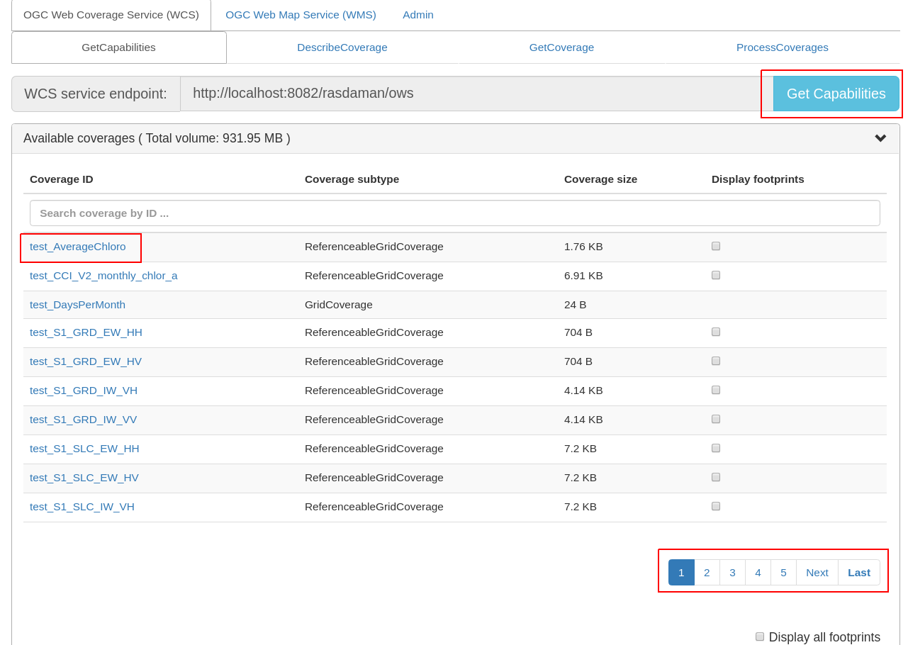

   List of coverages shown on the GetCapabilities tab.

If a coverage is geo-referenced, a checkbox will be visible in the ``Display
footprints`` column, allowing to view the coverage's geo bounding box (in 
EPSG:4326) on the globe below.

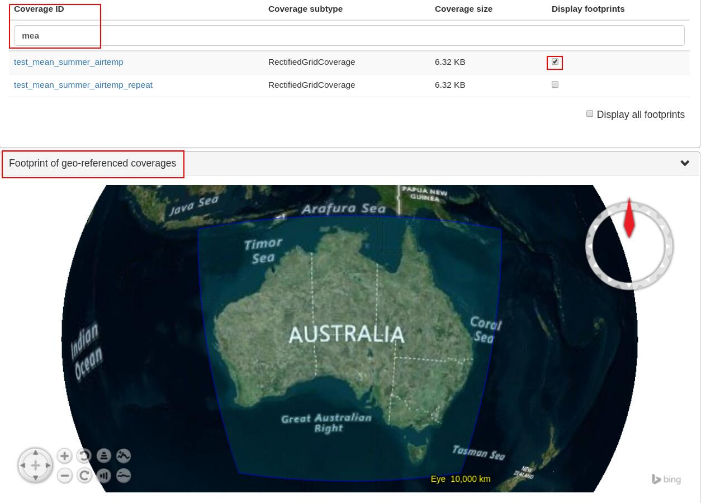

   Selected coverage footprints shown on a globe.

At the bottom the metadata of the OGC WCS service endpoint are shown. These
metadata can be changed in the ``Admin -> OWS Metadata Management`` tab. Once
updated in the admin tab, click on ``Get Capabilities`` button to see the new
metadata.

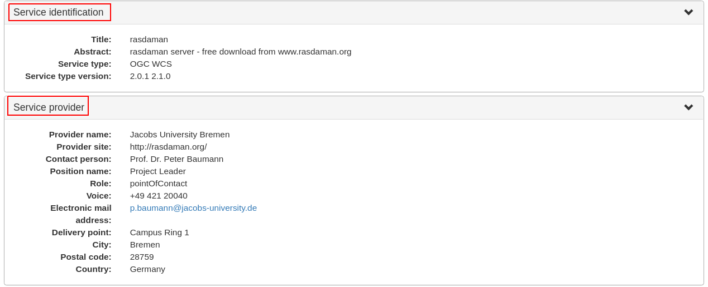

   WCS service metadata.

**DescribeCoverage**

Here the full description of a selected coverage can be seen. One can type the
first few characters to search for a coverage id and click on ``Describe
Coverage`` button to view its OGC WCS metadata.

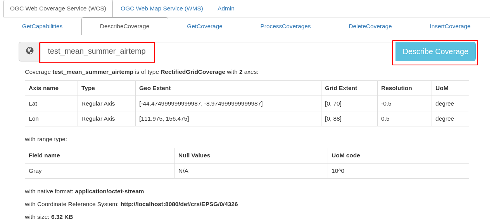

   Showing full description of a coverage.

Once logged in as admin, it's possible to replace the metadata with one from a
valid XML or JSON file.

.. figure:: media/cheatsheets/wsclient_wcs-describecoverage-tab-2.png
   :align: center

   Updating the metadata of a coverage.

**GetCoverage**

Downloading coverage *data* can be done on this tab (or the next one,
ProcessCoverages). It's similiarly possible search for a coverage id in the text
box and click on ``Select Coverage`` button to view its boundaries. Depending on
the coverage dimension, one can do trim or slice subsets on the corresponding
axes to select an area of interest. The output format can be selected (provided
it supports the output dimension). Finally, clicking on ``Get Coverage`` button
will download the coverage.

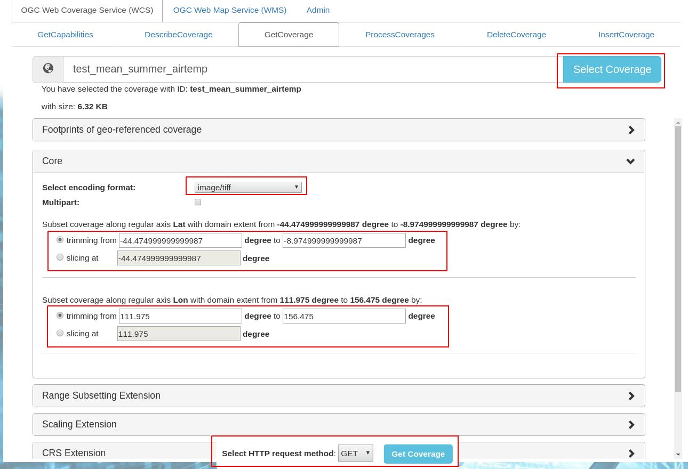

   Downloading a subset of a coverage, encoded in image/tiff.

In addition, further parameters can be specified as supported by the WCS 
extensions, e.g. scaling factor, output CRS, subset of ranges (bands), etc.

**ProcessCoverages**

WCPS queries can be typed in a text box. Once ``Excute`` is clicked, the result
will be

- displayed on the output console if it's a scalar or the query was prefixed
  with ``image>>`` (for 2D png/jpeg) or ``diagram>>`` for (1D csv/json);

- otherwise it will be downloaded.

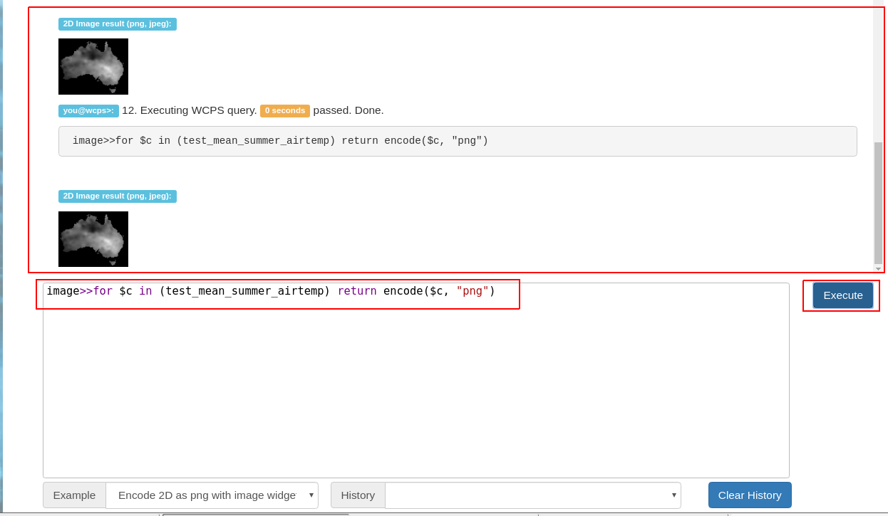

   Query and output areas on the ProcessCoverages tab.

**DeleteCoverage**

This tab allows to *delete* a specific coverage from the server. It is only
visible when logged in the ``Admin`` tab.

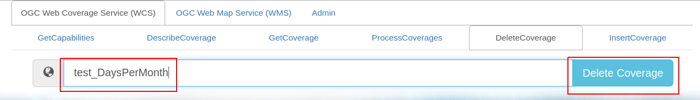

   Deleting coverage test_DaysPerMonth.

**InsertCoverage**

Similarly, this tab is only visible when logged in the ``Admin`` tab. To insert
a coverage, a URL pointing to a valid coverage definition according to the WCS-T
standard needs to be provided. Clicking on ``Insert Coverage`` button will
invoke the correct WCS-T request on the server. 

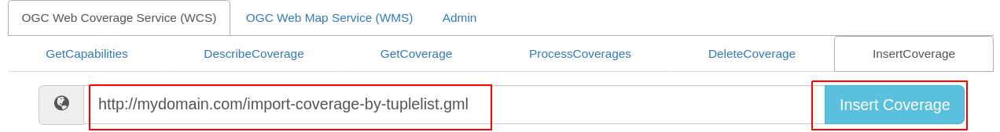

   Inserting a coverage given a URL pointing to a valid GML document.

WMS
^^^

This tab contain sub-tabs which are related to the supported OGC WMS requests.

**GetCapabilities**

This tab lists the available layers on the specified server. To reload the list,
click on the ``Get Capabilities`` button. Clicking on a layer name will move to
``DescribeLayer`` tab to view its description.

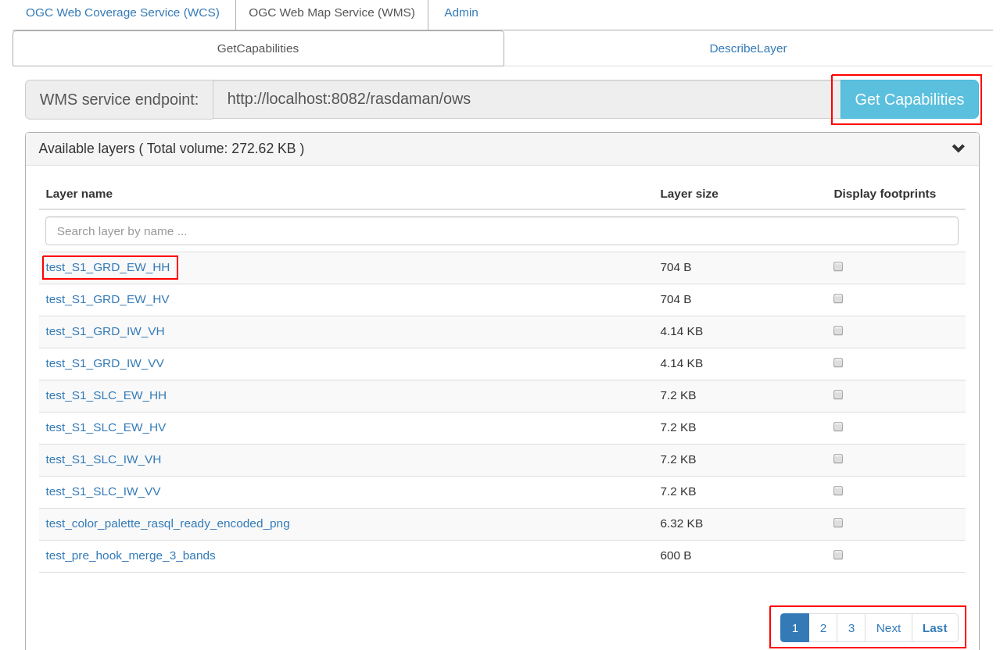

   List of layers shown on the GetCapabilities tab.

Similar to the WCS GetCapabilities tab, it's possible to search for layer names,
or show their footprints.

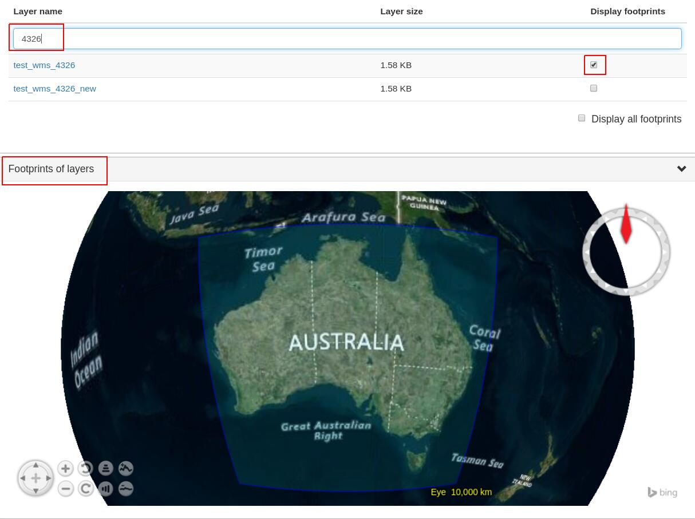

   Selected layer footprints shown on a globe.

**DescribeLayer**

Here the full description of a selected layer is shown. One can type the first
few characters to search for a layer name and click on ``Describe Layer`` button
to view its OGC WMS metadata.

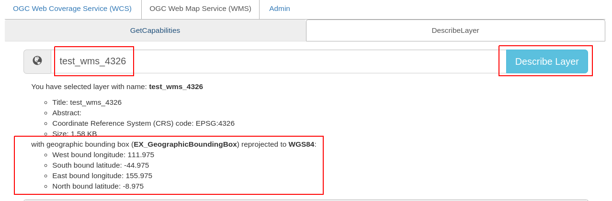

   Showing full description of a layer.

Depending on layer's dimension, one can click on ``show layer`` button and
interact with axes' sliders to view a layer's slice on the globe below. Click on
the ``hide layer`` button to hide the displayed layer on the globe.

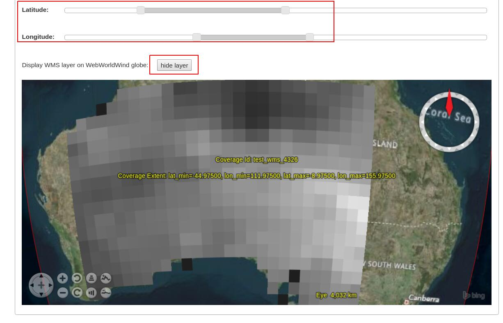

   Showing/hiding a layer on the map.

Once logged in as admin, managing WMS styles is possible on this tab. 
To create a style, it is required to input various parameters along with
a rasql or WCPS query fragment, which are applied on every GetMap request
if the style is active. Afterwards, click on ``Insert Style`` to insert
a new style or ``Update Style`` to update an existing style of the current
selected layer. One can also delete an existing style by clicking on
the ``Delete`` button corresponding to a style name.

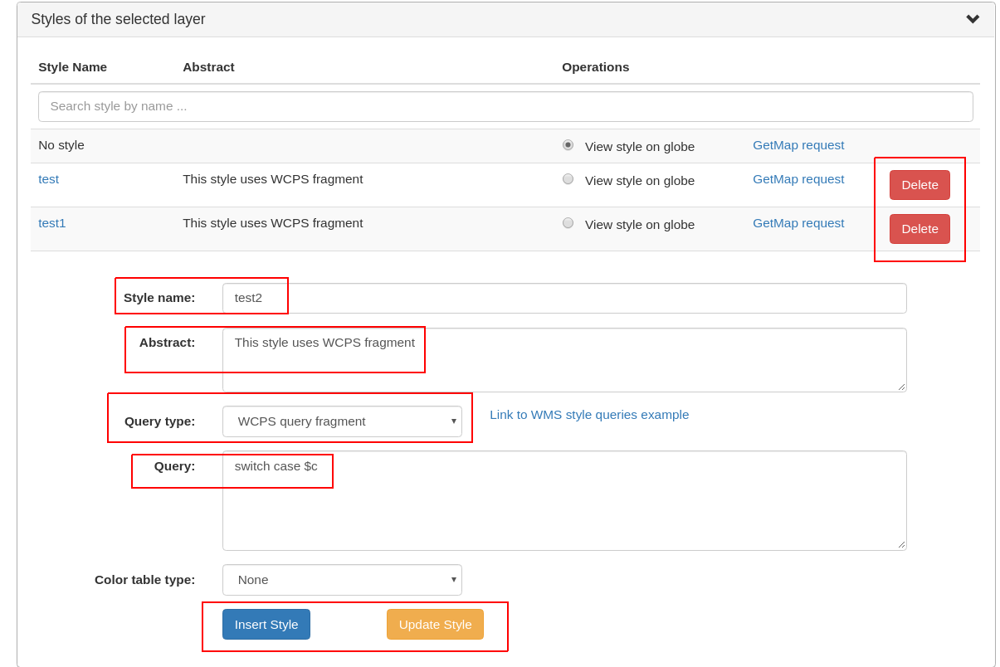

   Style management on the DescribeLayer tab.

Finally, once logged in as admin, managing downscaled collection levels
of a WMS layer is also possible on this tab. To create a new level, 
it is required to input level parameter (positive number). Afterwards,
click on ``Insert Level`` to insert a new downscaled collection level
of the current selected layer. One can also delete an existing level
by clicking on the ``Delete`` button corresponding to a downscaled
collection level.

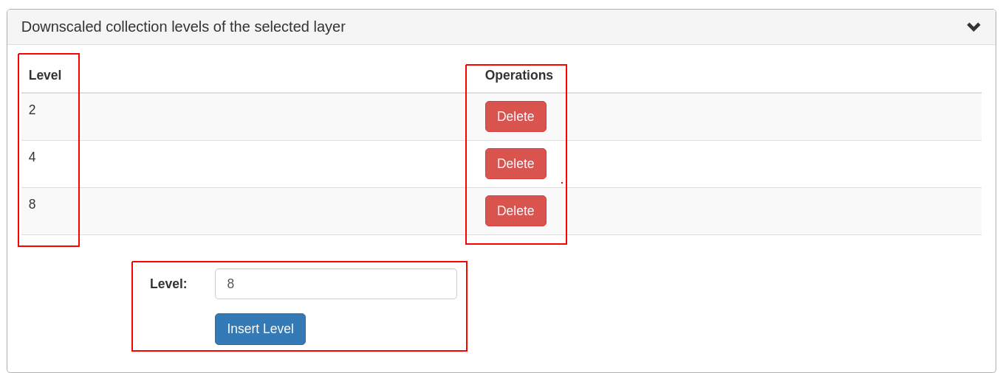

   Downscaled collection level management on the DescribeLayer tab.

`NASA WebWorldWind <https://worldwind.arc.nasa.gov/web/>`__
-----------------------------------------------------------

- Simple example to setup a web page with a map from a WMS server using WebWorldWind:

  .. code-block:: html

    <html>
      <head>
        
        
      </head>
      <body>
          <canvas id="canvasOne" style="width: 100%; height: 100%;"> </canvas>
      </body>
    </html> 

- Simple example to setup a web page with a map from a WMTS server using WebWorldWind:

  .. code-block:: html

    <html>

      <head>
        
        
      </head>

      <body>
        <canvas id="canvasOne" style="width: 100%; height: 100%;"> </canvas>

        
      </body>

    </html>

Python / Jupter Notebook
------------------------

OWSLib
^^^^^^

`OWSLib <https://geopython.github.io/OWSLib/>`__ is a Python package that helps
with programming clients for OGC services such as WCS, WCPS, or WMS. To install
it follow the official `installation instructions
<https://geopython.github.io/OWSLib/#installation>`__. Example usage for WCS
follows below.

.. code-block:: python

  >>> # Import OWSLib in Python once installed
  ... from owslib.wcs import WebCoverageService

  >>> # Create coverage object
  ... my_wcs = WebCoverageService('http://ows.rasdaman.org/rasdaman/ows',
  ...                             version='2.0.1')

  >>> # Get list of coverages
  ... print my_wcs.contents.keys()
  ['RadianceColor', 'test_irr_cube_2', 'test_mean_summer_airtemp', 
   'test_double_1d', 'INSPIRE_EL', 'AverageChlorophyllScaled', 'INSPIRE_OI_RGB', 
   'Temperature4D', 'INSPIRE_OI_IR', 'visible_human', 'INSPIRE_WS_LC', 
   'meris_lai', 'climate_earth', 'mean_summer_airtemp', 'multiband', 
   'ls8_coastal_aerosol', 'NN3_3', 'NN3_2', 'NN3_1', 'NN3_4', 
   'AvgTemperatureColorScaled', 'AverageChloroColorScaled', 'lena', 
   'Germany_DTM', 'climate_cloud', 'FiLCCoverageBit', 'AverageChloroColor', 
   'LandsatMultiBand', 'RadianceColorScaled', 'AvgLandTemp', 'NIR', 'BlueMarbleCov']

  >>> # Get geo-bounding boxes and native CRS
  ... my_wcs.contents['AverageChlorophyllScaled'].boundingboxes
  [{'nativeSrs': 'http://ows.rasdaman.org/def/crs-compound?
    1=http://ows.rasdaman.org/def/crs/EPSG/0/4326&
    2=http://ows.rasdaman.org/def/crs/OGC/0/UnixTime', 
    'bbox': (-90.0, -180.0, 90.0, 180.0)}]

  >>> # Get axis labels
  ... my_wcs.contents['AverageChlorophyllScaled'].grid.axislabels
  ['Lat', 'Long', 'unix']

  >>> # Get dimension
  ... my_wcs.contents['AverageChlorophyllScaled'].grid.dimension
  3

  >>> # Get grid lower and upper bounds
  ... my_wcs.contents['AverageChlorophyllScaled'].grid.lowlimits
  ['0', '0', '0']

  >>> my_wcs.contents['AverageChlorophyllScaled'].grid.highlimits
  ['119', '239', '5']

  >>> # Get offset vectors for geo axes
  ... my_wcs.contents['AverageChlorophyllScaled'].grid.offsetvectors
  [['-1.5', '0', '0'], ['0', '1.5', '0'], ['0', '0', '1']]
  
  >>> # For coverage with time axis get the date time values
  ... my_wcs.contents['AverageChlorophyllScaled'].timepositions
  [datetime.datetime(2015, 1, 1, 0, 0), datetime.datetime(2015, 2, 1, 0, 0), 
   datetime.datetime(2015, 3, 1, 0, 0), datetime.datetime(2015, 4, 1, 0, 0), 
   datetime.datetime(2015, 5, 1, 0, 0), datetime.datetime(2015, 7, 1, 0, 0)]

rasdapy3
^^^^^^^^

`rasdapy3 <https://pypi.org/project/rasdapy3/>`__ is a client API for rasdaman 
that enables building and executing rasql queries within python. 
Best practice code snippets are also provided.

wcps_rasdaman.py
^^^^^^^^^^^^^^^^

`wcps_rasdaman.py <https://gitlab.inf.unibz.it/SInCohMap/RoundRobinTutorials/blob/master/wcps_rasdaman.py>`__
is a python client which sends a WCPS query to a rasdaman server and wraps the response for further use 
depending on the response format chosen in the query.

Access from R
-------------

Accessing rasdaman from R is possible in three ways right now:

- :ref:`RRasdaman <sec-rrasdaman-install>` enables connecting to rasdaman,
  executing rasql queries, and retreiving results. 
  Note that it is *only* for rasql queries, so it is not suitable for querying geo-referenced coverages.

- `CubeR <​https://mattia6690.github.io/CubeR/>`__ allows convenient executiong
  of WCPS queries directly from R. Check also this accompanying `presentation
  <​https://sao.eurac.edu/wp-content/uploads/2018/07/RossiEtAl_EGU2018_PICO_DataCubes.compressed.pdf>`__.

- `ows4R <​https://cran.r-project.org/web/packages/ows4R/>`__ provides an interface to OGC Web services,
  including Web Coverage Service (WCS) which is supported by rasdaman.
  Steps to install ``ows4R`` package and its dependencies on Ubuntu 20.04:

   .. code-block:: shell

      sudo apt-get install libsodium-dev libudunits2-dev

      sudo R

      install.packages("sodium")
      install.packages("keyring")
      install.packages("geometa")
      install.packages("units")
      install.packages("sf")
      install.packages("ows4R")

  For more details check the `ows4R WCS tutorial <https://eblondel.github.io/ows4R/articles/wcs.html>`__.

`OpenLayers <https://openlayers.org/>`__
----------------------------------------

Simple example to setup a web page with a map from a WMS server using OpenLayers:

  .. code-block:: html

    <html>
      <head>
         <link rel="stylesheet" href="https://cdnjs.cloudflare.com/ajax/libs/openlayers/3.8.2/ol.css"></link> 
         
         
      </head>
      <body>
        
 

      </body>
    </html>

`Leaflet <https://leafletjs.com/examples/wms/wms.html>`__
---------------------------------------------------------

Simple example to setup a web page with a map from a WMS server using Leaflet:

  .. code-block:: html

    <html>
      <head>
        <link rel="stylesheet" href="https://unpkg.com/leaflet@1.6.0/dist/leaflet.css"/>
        
        
      </head>
      <body>
        
 

      </body>
    </html>

`QGIS <https://docs.qgis.org/3.4/en/docs/user_manual/working_with_ogc/ogc_client_support.html#wms-wmts-client>`__
-----------------------------------------------------------------------------------------------------------------

Command-line tools
------------------

It's straightforward to make individual OGC WCS / WCPS / WMS requests from the
terminal. Examples with ``curl`` follow.

- Make a GetCapabilities request:

  .. code-block:: shell

    curl "http://ows.rasdaman.org/rasdaman/ows\
    ?service=WCS&version=2.0.1&request=GetCapabilities"

- Execute a WCPS query with a ProcessCoverages request:

  .. code-block:: shell

    curl "http://ows.rasdaman.org/rasdaman/ows" --out test.png --data-urlencode \
    'service=WCS&version=2.0.1&request=ProcessCoverages&query=\
    for c in (mean_summer_airtemp) return encode(c, "png")'

- Upload files to be processed with ``decode()`` operator, see :ref:`here <positional_parameters_in_wcps>`.

When the server requires basic authentication for a request, the rasdaman
user credentials can be specified with the ``--user`` option, e.g.

  .. code-block:: shell

    curl --user "rasadmin:rasadmin" \
         "http://localhost:8080/rasdaman/ows?
          service=WCS&version=2.0.1&request=DeleteCoverage&coverageId=test_coverage"

Rasql Web Console
-----------------

The rasql web console is installed by rasdaman in ``$RMANHOME/share/rasdaman/www/rasql-web-console``. 
It requires petascope to be running in the background in order to execute queries.

Various widgets are available, with the most commonly-used being:

- ``image`` to visualize a 2D image result, e.g. ``image>>select encode(..., "jpeg") from ...``
- ``diagram`` on csv encoded data, e.g. ``diagram(type=area,width=300)>>select encode(..., "csv") from ...``
- ``text`` to visualize a text result, e.g. ``text>>select dbinfo(...) from ...``

Without using a widget the result is downloaded.

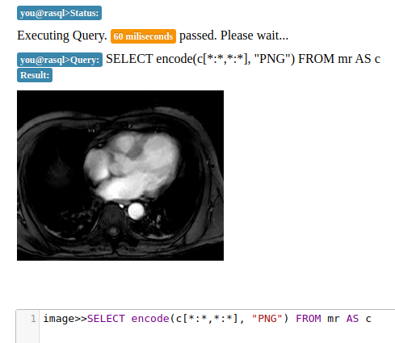

   Example of a 2D image result.
